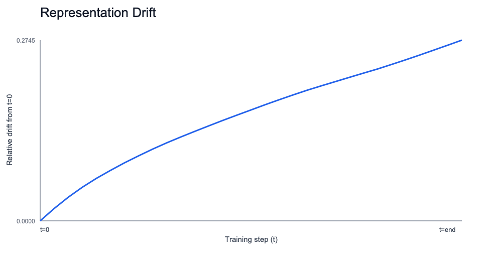

## Hypothesis (today)

If we preserve a fixed metric contract while increasing experiment complexity, we can detect meaningful optimization-regime transitions early and reproducibly.

## Setup

Progression executed today:

1. Toy real run (`tiny_mlp_purepy`)
2. Width/LR sweep (toy)
3. Architecture-like residual run (`residual_mlp_2block_purepy`)
4. Architecture-like sequence-mixer run (`seq_mixer_2block_purepy`)

Core metric contract was preserved in all runs:
- representation drift
- NTK drift
- layer update norms
- transfer regret

## Metrics snapshot

| Run | rep_drift_final | ntk_drift_final | layer_update_norm_mean | transfer_regret |
|---|---:|---:|---:|---:|
| Toy real run | 1.2599 | 0.1307 | 0.0186 | -0.0321 |
| Residual architecture run | 0.2745 | 0.6203 | 0.0147 | -0.4817 |
| Seq-mixer architecture run | 0.0644 | 0.2914 | 0.0036 | +0.0279 |

## Result

**Mixed (productive).**

- Positive: instrumentation stayed consistent while model complexity increased.
- Positive: non-frozen dynamics are detectable across settings.
- Caution: transfer quality is not uniformly positive once architecture changes.

## What this means (plain English)

We now have a reliable way to test optimization behavior day by day:
- where representations are moving,
- where dynamics freeze or don’t,
- and when small-to-large transfer assumptions break.

That’s exactly the kind of compounding understanding loop we want.

## Visuals

## Next experiment (tomorrow target)

Run a framework-backed experiment (non-purepy) with the same metric schema and compare against today’s architecture-like purepy baseline.

Success criterion:
- metric contract intact,
- at least one regime classification changes in an interpretable way,
- failure modes documented explicitly.
