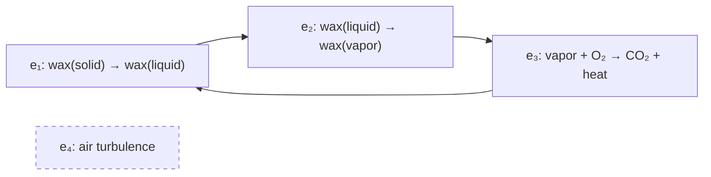
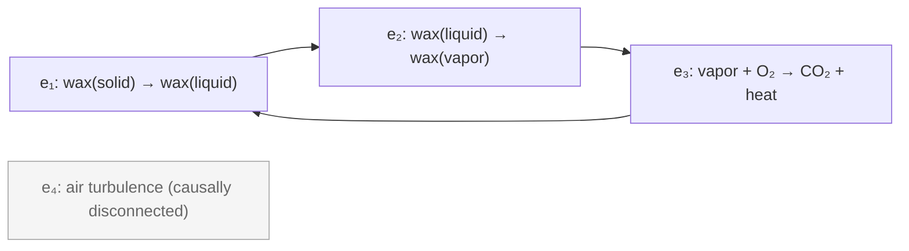

# Convergence Review — 2026-03-29

**Documents reviewed:**
- `docs/theory/00_prelude.md` — Part 0: Foundations
- `docs/theory/00b_event_layer.md` — Part 0b: Event Layer
- `docs/theory/01_5_causors.md` — Part 1.5: Causors

**Context:** Four prior reviews completed (3 polish + 1 adversarial). This is a convergence check.

---

## Remaining Fixable Issues

### Issue 1 — `00b_event_layer.md`: Open Problems section labels conflict with property names (P1/P2/P3)

**Problem:** The document uses P1, P2, P3 to name the three cause-plex properties, and then reuses the same labels P1–P5 for the Open Problems section. A reader will encounter "P1: Does P2 follow from P1?" and be confused about which P1 means what.

**Exact fix:** Rename the Open Problems labels to OP1–OP5:

Replace:
```
**P1: Does P2 follow from P1?** Causal invariance (P2) is physically motivated but not yet derived from the causal partial order (P1) alone. If P2 requires independent postulation, the "three properties" may not be minimal.

**P2: The continuum limit.** Taking a discrete cause-plex to continuous spacetime requires a measure, topology, and assumptions about event distribution. The derivation of Lorentz invariance in this limit is technically non-trivial and an active research area in causal set theory.

**P3: Quantum mechanics from multiway structure.** The claim that complex amplitudes, the Born rule, and the Schrödinger equation emerge from multiway graph structure is a research program, not a completed derivation. The specific mechanism mapping path interference to probability amplitudes requires further development.

**P4: Selection of the physical cause-plex.** What determines which events are "real" causal events? Without a selection criterion, "the cause-plex realized by the physical world" is circular. This is the analogue of Wolfram's ruliad selection problem.

**P5: Noether in the discrete.** Applying Noether's theorem (which requires continuous symmetry and a differentiable action) to a discrete cause-plex requires technical work on the continuum limit that is not completed here.
```

With:
```
**OP1: Does P2 follow from P1?** Causal invariance (P2) is physically motivated but not yet derived from the causal partial order (P1) alone. If P2 requires independent postulation, the "three properties" may not be minimal.

**OP2: The continuum limit.** Taking a discrete cause-plex to continuous spacetime requires a measure, topology, and assumptions about event distribution. The derivation of Lorentz invariance in this limit is technically non-trivial and an active research area in causal set theory.

**OP3: Quantum mechanics from multiway structure.** The claim that complex amplitudes, the Born rule, and the Schrödinger equation emerge from multiway graph structure is a research program, not a completed derivation. The specific mechanism mapping path interference to probability amplitudes requires further development.

**OP4: Selection of the physical cause-plex.** What determines which events are "real" causal events? Without a selection criterion, "the cause-plex realized by the physical world" is circular. This is the analogue of Wolfram's ruliad selection problem.

**OP5: Noether in the discrete.** Applying Noether's theorem (which requires continuous symmetry and a differentiable action) to a discrete cause-plex requires technical work on the continuum limit that is not completed here.
```

---

### Issue 2 — `00b_event_layer.md`: P3 latency derivation has a loose causal step

**Problem:** The P3 section says "if causal influence requires at least τ_min per event, and spatial distance emerges from the causal structure... then the maximum rate at which causal influence can propagate through space is c = ℓ_min/τ_min." This presupposes that "spatial distance" is already defined at the point where P3 is being stated — but spacetime hasn't been derived yet. The sentence is slightly question-begging: it uses ℓ_min without establishing what it is.

**Exact fix:** Replace the P3 derivation paragraph:

Replace:
```
This defines a maximum propagation rate. The mechanism: if causal influence requires at least $\tau_{\min}$ per event, and spatial distance emerges from the causal structure (see Spacetime below), then the maximum rate at which causal influence can propagate through space is $c = \ell_{\min}/\tau_{\min}$, where $\ell_{\min}$ is the minimum spatial interval corresponding to one causal event. In the continuum limit where the discrete structure becomes smooth spacetime, this ratio becomes the speed of light.
```

With:
```
This defines a maximum propagation rate. The mechanism: if every causal event takes at least $\tau_{\min}$, then any causal influence must traverse at least one event per $\tau_{\min}$. When spacetime is derived from this causal structure (see Spacetime below), distance is measured in units of causal events — the minimum spatial interval $\ell_{\min}$ is the interval associated with one event step. The maximum propagation rate is then $c = \ell_{\min}/\tau_{\min}$. In the continuum limit where the discrete cause-plex structure becomes smooth spacetime, this ratio becomes the speed of light. Note that $\ell_{\min}$ is not assumed here — it is defined by the same causal structure that defines distance.
```

---

### Issue 3 — `01_5_causors.md`: Generalized mass definition as sum of bond strengths is inconsistently positioned

**Problem:** In Section 6 (Derived Quantities), the document says "Generalized mass $\mathcal{M}$" is defined as "$\sum_{\text{bonds}} \sigma_b$" in the table, but directly below the table, the Definitional Note says "These aggregation rules ($\mathcal{M} = \sum \sigma_b$, etc.) are proposed correspondences, not derived results." This is good epistemic practice, but the table presents the definition without the caveat — readers who skim the table will miss the qualification. The table should visually signal its tentative status.

**Exact fix:** Add a footnote marker to the table header and a brief qualifier to the table rows:

Replace the table header and first row:
```
| Quantity | Definition | Meaning |
|----------|------------|---------|
| **Generalized mass** $\mathcal{M}$ | $\sum_{\text{bonds}} \sigma_b$ | Total causal content |
| **Auto-causal density** $\rho_{\text{ac}}$ | Loop closure fraction | Self-sustaining fraction |
```

With:
```
| Quantity | Proposed definition† | Meaning |
|----------|---------------------|---------|
| **Generalized mass** $\mathcal{M}$ | $\sum_{\text{bonds}} \sigma_b$ | Total causal content |
| **Auto-causal density** $\rho_{\text{ac}}$ | Loop closure fraction | Self-sustaining fraction |
```

And add after the table (before the existing Definitional Note):
```
†Proposed correspondences — see Definitional Note below.
```

---

### Issue 4 — `00_prelude.md`: "Grammar vs vocabulary" commitment text has minor internal inconsistency

**Problem:** Commitment 4 in Section "The framework's commitments" says: "Grammar vs vocabulary — Epimechanics provides structure (state, force, energy); domain sciences provide content." But the preceding section on "Derived pair" already notes that information "is not primitive." A reader might reasonably ask: if information is derived (not grammar) and state/force/energy are grammar — why is energy listed in the grammar? This isn't wrong, but the framing could be tightened. Energy is grammar because it's a structural relationship (from Noether), not because it's the specific value in any domain.

**Exact fix:** Clarify the commitment:

Replace:
```
4. **Grammar vs vocabulary** — Epimechanics provides structure (state, force, energy); domain sciences provide content
```

With:
```
4. **Grammar vs vocabulary** — Epimechanics provides structural relationships (the form of state evolution, what force and energy mean structurally, how coupling tensors connect entities); domain sciences provide the specific variables, units, and operationalizations
```

---

### Issue 5 — `00b_event_layer.md`: Mermaid diagram in Section 1 (The Primitive) will not render in standard Mermaid

**Problem:** The mermaid diagram uses `stroke-dasharray` as an inline style on a node, and that CSS property is not supported in most Mermaid renderers (it's a Graphviz/SVG attribute, not a Mermaid style property). The `style e4 stroke-dasharray: 5 5` line will silently fail or cause parse errors, and `e4` won't appear dashed. This undermines the intended visual distinction between the causally-disconnected event and the flame loop.

**Exact fix:** Replace the unsupported style with Mermaid-supported node class syntax:

Replace:


With:


---

## Acknowledged Open Problems (No Action Needed)

These are correctly identified and scoped within the documents — no fixes required:

1. **Whether P2 follows from P1** — explicitly flagged in `00b_event_layer.md` Open Problems
2. **The continuum approximation** for discrete → continuous spacetime derivation
3. **QM from multiway structure** — correctly labeled as a research program, not a completed derivation
4. **Selection of the physical cause-plex** (the ruliad selection problem)
5. **Noether in the discrete** (requires continuum limit work)
6. **Whether Q1–Q5 are complete** — explicitly flagged in `01_5_causors.md` Open Questions
7. **CI and stability correlation** — open question in causors
8. **Derivation of the Lagrangian** from cause-plex structure
9. **The central conjecture** connecting information-theoretic optimality to Lagrangian symmetry — correctly flagged in `00_prelude.md` with a ⚠️ callout
10. **Kolmogorov complexity non-computability** — mentioned but not used as a foundation; appropriate
11. **Bond reliability (r_b) as candidate Q6** — flagged as open in causors §10

---

## Convergence Assessment

**The documents are substantially ready.** The foundational concepts are well-defined, the open problems are honestly acknowledged, the four-layer architecture is coherent across all three documents, and the worked examples (candle flame appearing in all three layers) provide appropriate continuity.

### What the five issues above would accomplish if fixed:

- **Issue 1** (P-label collision) is the highest priority: it creates genuine reader confusion in the middle of a technical section. Quick fix, meaningful improvement.
- **Issue 2** (P3 latency circularity) is moderate: it's not wrong, but adding one clarifying sentence removes a legitimate "wait, how do you know ℓ_min yet?" objection.
- **Issue 3** (table caveat) is cosmetic but epistemically important: the table currently implies a definition that the text immediately qualifies. Aligning them is a one-line fix.
- **Issue 4** (grammar commitment) is minor polish — removes a potential confusion about why energy is listed as grammar alongside state.
- **Issue 5** (Mermaid style) is a rendering bug: silent failure in most rendering environments. Easy fix.

### What one more iteration would NOT accomplish:

The deeper questions — whether the framework is correct, whether the derivations complete, whether Noether generalizes cleanly to the discrete case — are not fixable by editing. They are the research program itself, and the documents are appropriately honest about this.

**Recommendation:** Apply the five fixes above (estimated 15 minutes), then treat these three documents as convergence-complete for the foundational layer. The next iteration should focus on the application documents and the formal derivation papers, not these foundations.
