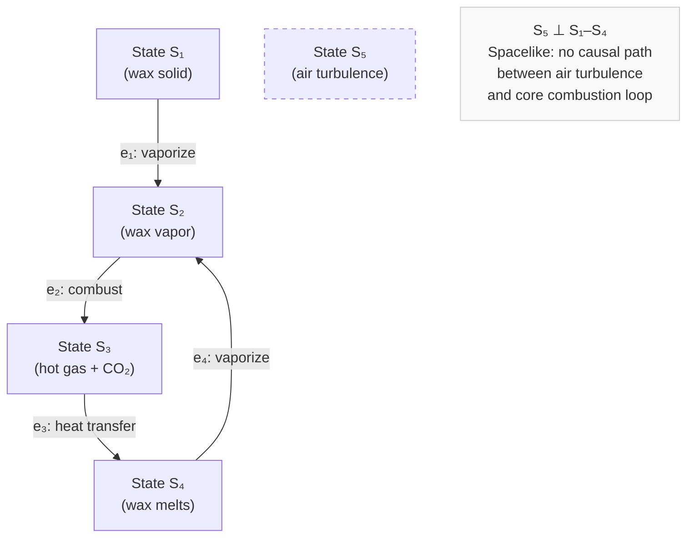
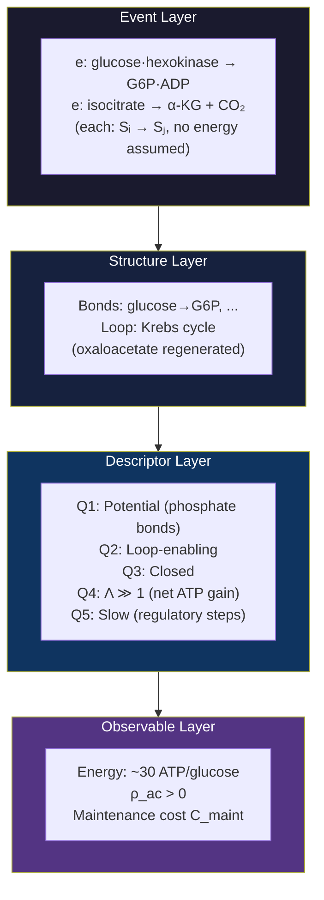
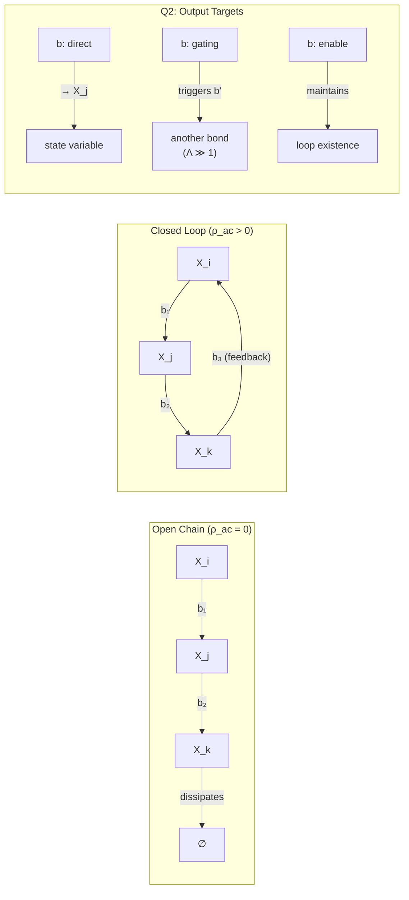
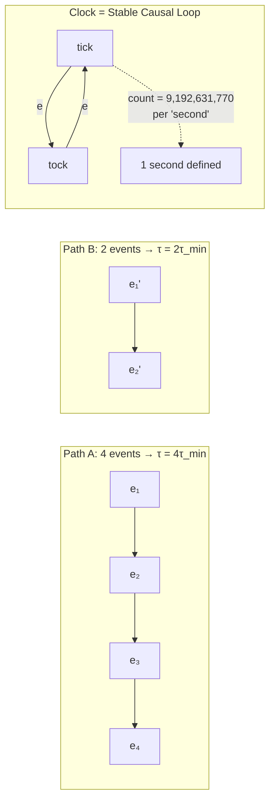
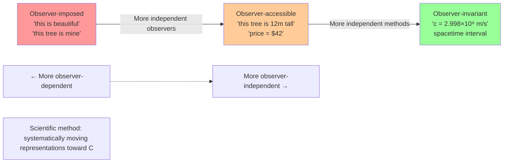

# Foundational Review 1 — Epimechanics Parts 0, 0b, 1.5

**Date:** 2026-03-29  
**Reviewer:** VERIFY (eval-agent)  
**Files reviewed:**
- `docs/theory/00_prelude.md` — Part 0: Foundations
- `docs/theory/00b_event_layer.md` — Part 0b: Event Layer (NEW)
- `docs/theory/01_5_causors.md` — Part 1.5: Causors (REFACTORED)

---

## Readability Issues

### 00_prelude.md

1. **00_prelude.md §1 (~line 70):** The "co-primitive pairs" framing is intellectually interesting but front-loading heavy vocabulary before the reader has any grounding. A first-time reader hits "ontological co-primitives" and "epistemological co-primitives" with no entry ramp. Consider a one-sentence plain-English summary first (like the pullout boxes in 00b and 01_5) before the formal vocabulary table.

2. **00_prelude.md §1 "Bridge concept" (~line 79):** "State" is described as "the referent that representations approximate. States exist; direct access is limited." This is philosophically careful but slightly opaque — *why* is direct access limited? First-time readers may not have the Hoffman interface theory framing yet (it comes a few paragraphs later). A brief forward-reference here would smooth the bump.

3. **00_prelude.md §1 "Information" (~line 88):** The claim that "Shannon entropy describes probability distributions over causal states; it is an Observable Layer quantity, not a foundation" presupposes familiarity with the four-layer architecture, which isn't introduced until §4 (and visually until the diagram there). This feels like a forward reference that lands before the reader has context. Either move the four-layer intro earlier, or soften this to avoid relying on it.

4. **00_prelude.md §3 (~line 135):** The transition from causal density $\rho_{\text{causal}}$ to auto-causal density $\rho_{\text{ac}}$ uses the rock/cloud contrast well, but the sentence "Whether $\rho_{\text{ac}}$ is continuous, what measure $d\mu$ is appropriate..." suddenly shifts into open-question mode without warning. Reader may expect a definition but gets epistemic hedges. A brief signal ("This is an open empirical question, domain by domain:") would ease the shift.

5. **00_prelude.md §3 (~line 140):** The closing sentence "What makes some entities more persistent and more dynamically self-sustaining than others is the density and structure of their self-sustaining causal loops — and that difference is what the rest of the framework formalizes." is a good pivot. But it references "causal loops" without yet defining them (bonds/loops come in 01_5). Consider adding "see Part 1.5" or a one-line preview here.

6. **00_prelude.md §6 (~line 195):** The Representational Efficiency section is the most technically dense in the document. The paragraph beginning "What IS a conjecture..." comes after three paragraphs of confident citations and proven theorems. The shift from "these are all proven theorems" to "but the central claim is not yet proven" is important but arrives with little fanfare. Consider a visual break or explicit callout box to flag "THIS IS THE OPEN PROBLEM."

7. **00_prelude.md §9 "What Comes Next" (~last section):** Lists `00b_event_layer.md` as the next step but the text says "→ Part 0b: The Event Layer" with no series_order anchor. Fine for now, but may confuse readers who expect a linear numerical sequence (Part 0 → 0b is non-obvious as "next" rather than "sub-part").

### 00b_event_layer.md

8. **00b_event_layer.md — The candle flame example (~line 37):** This is a great concrete anchor. However, the analogy is introduced and then dropped immediately — the reader never sees the cause-plex formalism applied back to the flame. The section says "each step is a state transition" but doesn't show what E or ≺ looks like for the flame, even schematically. The example is doing less work than it could.

9. **00b_event_layer.md — P2 definition (~line 58):** "Events with no causal path between them — **spacelike-separated events** — commute." This uses the word "spacelike" before spacetime has been derived. Spacetime is supposed to *emerge* from the cause-plex — but the term "spacelike" is defined by spacetime geometry. This is a circular reference. Either introduce alternative terminology ("causally disconnected events") or add a footnote noting this is anticipating terminology that will be derived.

10. **00b_event_layer.md — P3 and speed of light (~line 73):** "In the continuum limit, this becomes the speed of light $c$." This is stated very tersely — the leap from "minimum event latency" to "$c$" is significant and deserves a sentence or two of intuition. Why does minimum latency translate to a maximum propagation rate? Why does that rate equal $c$? Non-physicists will need more scaffolding here.

11. **00b_event_layer.md — "What Emerges: Time" section (~line 91):** The definition of time as path-count is clean and interesting. But the connection to the Cs-133 second definition is abrupt — it jumps from abstract path-counting to "by definition, 9,192,631,770 transitions." A sentence bridging "counting stable causal loops" to "and this is exactly what atomic clocks exploit" would help.

12. **00b_event_layer.md — Quantum Mechanics section (~line 108):** This section is significantly shorter and more hand-wavy than the spacetime and time sections. "When multiple causal paths coexist — when the cause-plex has a **multiway structure** — quantum mechanics emerges. The superposition of histories, the Born rule, and the Schrödinger equation all follow..." This is a very large claim made in three sentences. Even a brief sketch of the mechanism (e.g., "interference between paths produces amplitude-weighted outcomes") would help readers calibrate how seriously to take this claim vs. the more established spacetime derivation.

13. **00b_event_layer.md — Four-Layer Architecture table (~line 118):** The table appears here but also appears in 01_5_causors.md (as the ASCII architecture box). The descriptions are slightly inconsistent: here "Structure Layer" is "Bonds, loops"; in 01_5 the architecture diagram labels it the same but the surrounding prose is richer. Minor, but worth harmonizing across documents.

14. **00b_event_layer.md — Navigation footer:** The footer reads `[← Part 0: Foundations] | [→ Part 1: Generalized Mechanics]`. It skips Part 1.5 entirely. Since the reader just learned about the four-layer architecture and the Structure/Descriptor layers, a reference to Part 1.5 would be natural here. Alternatively, if the intended reading order is 00 → 00b → 01 → 01_5, the footer is correct but should match the "What Comes Next" section in 00_prelude.md.

### 01_5_causors.md

15. **01_5_causors.md — Opening (~line 1, the pullout box):** The pullout ("what are entities made of — not just atoms, but any persistent thing?") is excellent — probably the best entry point in all three docs. However, the phrase "The labels come last; the structure comes first" implies a methodological order that isn't fully delivered. The document actually gives bonds/loops first (structure), then Q1–Q5 (descriptors), then entity types (labels). The doc *does* deliver on this, but a signpost at the top saying "we'll build from structure to label, not the reverse" would reinforce this.

16. **01_5_causors.md §2.1 (~line 80):** "Bond properties" table introduces `r_b ∈ [0,1]` (reliability) but this property is never used in the subsequent Q1–Q5 descriptors or the entity type table. It appears and disappears. Either integrate it into Q1–Q5 or drop it from the bond properties table to avoid reader confusion about why it's listed.

17. **01_5_causors.md §2.2 (~line 100):** "Auto-causal does not mean self-contained" is an important clarification and placed correctly right after the loop definition. However, the Krebs cycle example assumes some biochemistry familiarity. For readers without biology backgrounds, "the loop regenerates a key intermediate molecule while requiring continuous fuel input" would be more universally accessible.

18. **01_5_causors.md §3 — Q2: Output Target (~line 125):** The term "transducer" is introduced without definition ("a bond whose output maintains a loop's existence — keeps a transducer entity alive"). What is a transducer entity? This is the first appearance of "transducer" in the series; readers need a definition or at least a parenthetical like "(an entity whose function is converting one form of input into another)."

19. **01_5_causors.md §4 "From Structure to Entity Types" (~line 160):** The entity type table has Q5 (Timescale) absent from all rows. The table columns are Q1, Q2, Q3, Q4, but Q5 doesn't appear. Since Q5 was defined as a full descriptor in §3, its absence from the classification table is conspicuous. Either add a Q5 column or explain why timescale doesn't differentiate entity types at this level.

20. **01_5_causors.md §6 "Derived Quantities" (~line 195):** `C_maint = Ṡ_int − Ṙ_repair` is introduced here but maintenance cost hasn't been defined in any prior section of this document. It appears in the entity type discussion implicitly (cells require maintenance) but the formula lands without preparation. A brief sentence preceding the table — "maintenance cost measures the gap between entropy production and repair capacity" — would anchor it.

21. **01_5_causors.md §7 "Causal Attack Surface" (~line 210):** This section feels structurally displaced. It introduces a derived quantity (`ρ_attack`) that builds on `ρ_ac`, but follows the Derived Quantities section somewhat abruptly without a transitional sentence. The tumor suppressor gene example is compelling, but readers may wonder "why is this here?" A one-sentence framing — "High auto-causal density is not uniformly beneficial; it also amplifies vulnerabilities" — would motivate the section.

22. **01_5_causors.md §10 "Open Questions" (~last section):** Q3 asks whether the quadratic kinetic term in the Lagrangian can be derived from cause-plex structure. This is a significant open problem but lands without any context about why the quadratic form was postulated in Part 1. Readers who haven't read Part 1 won't appreciate the depth of this question. Consider adding a brief parenthetical: "(Part 1 postulates $L = \frac{1}{2}\mathcal{M}|\dot{X}|^2 - V(X)$ on physical grounds — this asks whether that choice can be derived rather than assumed)."

---

## Missing Content

### Across all three documents

1. **Worked example tracing through all four layers.** The four-layer architecture (Event → Structure → Descriptor → Observable) is described in all three documents, but no document shows a single system described at all four levels. A worked example — e.g., a metabolic cycle described as: (Event Layer) specific molecular state transitions → (Structure Layer) the bonds and loops → (Descriptor Layer) Q1–Q5 values for each → (Observable Layer) energy, mass, $\rho_\text{ac}$ — would dramatically clarify the architecture and serve as a reference readers could return to throughout the series.

2. **Failure modes of the framework.** 00_prelude.md addresses the triviality objection (§8) admirably, but none of the three documents discusses failure modes — cases where the four-layer architecture breaks down or doesn't cleanly apply. What happens at the Planck scale where spacetime itself breaks? What happens in strongly non-equilibrium systems where time-translation symmetry fails? 00b mentions this briefly but doesn't develop it.

3. **Reading path for different audiences.** The series spans from pure physics derivation (cause-plex → spacetime) to social science (institutions as meta-entities). There is no guidance for readers with different backgrounds. A physicist will care about §P1–P3 in 00b; a social scientist will jump to bonds/loops in 01_5. A "roadmap" sidebar in 00_prelude.md would help.

### 00_prelude.md

4. **The efficiency principle needs a concrete example.** §6 establishes the Representational Efficiency principle with multiple information-theoretic theorems, but no concrete domain example shows what a "badly chosen $X$" vs. a "well-chosen $X$" looks like. The name/car coordinate error analogy in §1 is close, but doesn't illustrate computational complexity differences. An example like "tracking every protein molecule in a cell vs. tracking metabolic cycle states" would make the principle tangible.

5. **Connection between Sections 2 and 3 is implicit.** The Section 2 treatment of representations leads smoothly into the spectrum of observer-dependence, but the connection to Section 3 ("Causation Is the Working Primitive") is not explained. The reader may wonder: how does the epistemological apparatus (representations, observer-dependence) connect to the ontological claim (causation as primitive)? A bridging paragraph would help.

### 00b_event_layer.md

6. **No definition of "multiway structure."** The quantum mechanics emergence claim rests entirely on "multiway structure," which is not defined in this document. The Wolfram reference is given but readers without Wolfram physics background have no way to evaluate the claim. Even a one-paragraph definition of multiway structure (multiple causal branches from a single event, coexisting in superposition until resolution) is needed.

7. **The "open problem" in P2 is buried.** The callout box about whether P2 follows from P1 is significant — it's not clear the three properties are independent. This deserves more prominence, perhaps a dedicated "Open Problems" section parallel to the one in 01_5_causors.md.

8. **No discussion of the cause-plex at macroscopic scales.** The document derives spacetime, time, energy, and QM from the cause-plex — all at fundamental physics scales. But the series eventually applies to biology and institutions. There's no bridge explaining how the cause-plex concept is used (or whether it's used directly) at those scales, vs. using only the coarse-grained Observable Layer quantities.

### 01_5_causors.md

9. **The relationship between Q1–Q5 and the Lagrangian is not made explicit.** §3 defines the five descriptors, and §6 says "generalized mass $\mathcal{M}$ = Σ bond strengths." But how do Q1–Q5 values map to Lagrangian terms? For example, does Q1 (kinetic vs. potential) directly correspond to the kinetic vs. potential energy terms in $L$? Making this mapping explicit would connect the Structure/Descriptor layers to the Observable Layer more concretely.

10. **No examples of composite loops (loops-of-loops).** The entity type table includes "meta-entity" (organism, institution) with topology "loop-of-loops." But there's no concrete illustration of how simple loops combine to form higher-order loops. A brief example — e.g., how cellular metabolism (a loop) and cell division (another loop) combine into an organism-level loop-of-loops — would ground the concept.

11. **The stability table (§5) has a gap between "small molecules" and "cells."** The self-containment spectrum jumps from complex molecules (σ_b/k_BT ~ 10²–10³) to cells ("variable"). There's no treatment of organelles, viruses, or minimal living systems. Given the series' ambition to cover the full range from protons to institutions, this gap in the stability table stands out.

---

## Recommended Diagrams

### D1: The Cause-Plex as a Hypergraph (for 00b_event_layer.md)

A visual showing the cause-plex structure would anchor the abstract formalism. Should show:
- Individual causal events as directed edges (or hyperedges)
- The partial ordering ≺ as the direction of edges
- Causally-connected chains (timelike paths)
- Causally-disconnected events (spacelike pairs) side by side
- The flame example from §1 mapped onto this structure (2-3 events)



**Caption note:** Show how e₁–e₄ form a loop (auto-causal), while S₅ is spacelike-separated from the core loop (no arrow connects to the loop's interior).

### D2: The Four-Layer Architecture with Examples (for 00b or 01_5)

A layered diagram showing a single system (cell metabolism) described at each layer, with examples in each layer. Should show:
- Event Layer: specific molecular state transitions (e.g., glucose → glucose-6-phosphate)
- Structure Layer: the glycolytic bonds and loop topology
- Descriptor Layer: Q1–Q5 values for the key bonds
- Observable Layer: ATP yield, metabolic rate, $\rho_\text{ac}$



### D3: Bond and Loop Operator Diagram (for 01_5_causors.md)

A visual distinguishing open chains from closed loops, showing the three Q2 output targets. Should show:
- An open bond chain (X_i → X_j → X_k) with arrows dissipating
- A closed loop (X_i → X_j → X_i) with the feedback arrow emphasized
- Side-by-side: bond targeting state (direct), bond gating another bond, bond enabling a loop



### D4: Q1–Q5 Parameter Space Visualization (for 01_5_causors.md)

A radar/spider chart or 2D scatter showing where major entity types cluster in the descriptor space. Since mermaid doesn't support radar charts natively, a simplified version:

```mermaid
quadrantChart
    title Entity Types in Q3–Q4 Space (Topology vs Leverage)
    x-axis Open Chain --> Closed Loop
    y-axis Low Leverage (Λ≈1) --> High Leverage (Λ≫1)
    quadrant-1 Adaptive entity (nervous system)
    quadrant-2 Dissipative auto-causal (flame)
    quadrant-3 Structural config (crystal)
    quadrant-4 Hypothetical (high-leverage, open)
    Crystal: [0.1, 0.15]
    Heat flow: [0.05, 0.1]
    Flame: [0.65, 0.3]
    Cell: [0.75, 0.55]
    Nervous system: [0.85, 0.85]
    Institution: [0.80, 0.90]
```

**Note:** A 5-dimensional visualization is the real need; this 2D version uses Q3 and Q4 as the most differentiating axes. For the full doc, a small-multiples approach (five 2D projections) would be more informative than one 5D plot.

### D5: Causal Partial Ordering vs. Time (for 00b_event_layer.md)

A diagram showing the cause-plex ordering is not the same as coordinate time — illustrating how $\tau(\gamma) = |\{e \in \gamma\}| \cdot \tau_{\min}$ works. Should show:
- Two paths through the cause-plex with different event counts (different "elapsed time")
- A clock as "a stable causal loop" — show the loop with its events being counted
- The key insight: "time" is a derived count, not a background coordinate



### D6: Observer-Dependence Spectrum (for 00_prelude.md)

A horizontal spectrum diagram showing the progression from "single observer assigns label" to "multi-method, multi-observer convergence." Should show:
- The spectrum as a bar
- Key landmarks: observer-imposed, observer-accessible, observer-invariant
- Examples at each landmark
- The arrow of scientific method: "moving representations rightward"



---

## Summary

### Overall Assessment

The three documents form a coherent and ambitious architecture. The reorganization (extracting the Event Layer into 00b, refocusing 01_5 on Structure/Descriptor layers) is directionally correct — the separation of concerns is much cleaner now, and each document has a more focused job.

**Strengths:**
- The four-layer architecture (Event → Structure → Descriptor → Observable) is a genuine conceptual advance and provides a clear organizing principle
- The "pullout box" summary style in 00b and 01_5 works extremely well — Part 0 could benefit from the same treatment
- The connection to established work (causal set theory, Wolfram, Noether, Assembly Theory) is appropriately caveated and consistently distinguished from novel claims
- 01_5's entity type table is concise and useful; the "structure comes first, labels come last" methodology is clearly executed
- The open questions sections are honest and well-targeted

**Main concerns:**

1. **The four-layer architecture needs a worked, cross-cutting example.** All three documents describe the layers, but none shows a single system traversing all four. This is the single highest-value addition.

2. **00b's quantum mechanics section is dramatically underdeveloped** relative to the spacetime/time sections. Given that QM is one of the most significant "emergent from cause-plex" claims, this asymmetry will concern physics-literate readers.

3. **The circular terminology problem in 00b (P2: "spacelike-separated")** is a technical issue that undermines the "no physics assumed" premise. Should be fixed.

4. **Q5 (timescale) is missing from the entity type table in 01_5.** Small omission, but signals that the descriptor system isn't fully closed yet.

5. **Navigation footers are inconsistent** across documents (00b skips 01_5 in its footer; 00_prelude.md's "What Comes Next" lists a slightly different order than what the footers implement). Should be harmonized.

**Priority fixes (in order):**
1. Add worked cross-cutting example (D2 diagram + prose)
2. Expand quantum mechanics section in 00b
3. Fix "spacelike-separated" circularity in 00b P2
4. Add Q5 column to entity type table in 01_5
5. Add plain-English pullout box to 00_prelude.md §1
6. Harmonize navigation footers

The framework is genuinely interesting and the reorganization has improved it. The foundational layer is solid enough to build on.
