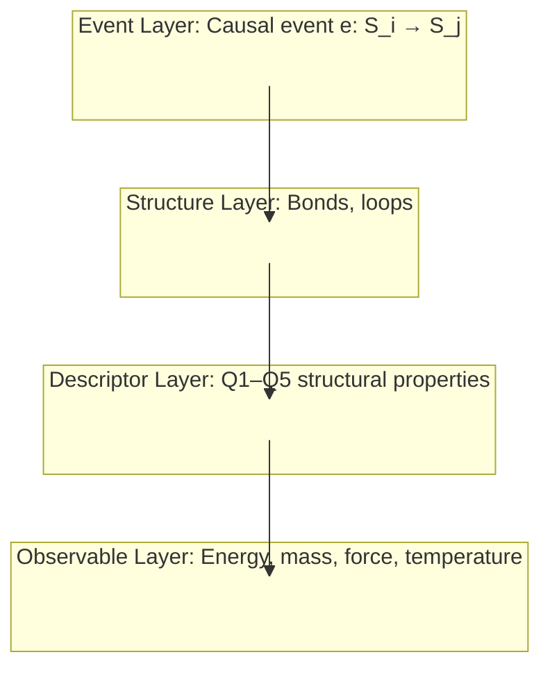
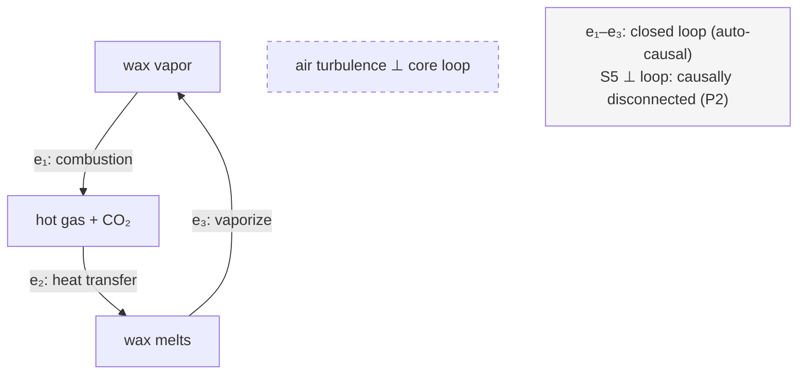

# Foundational Review 2 — Epimechanics Parts 0, 0b, 1.5

**Date:** 2026-03-29  
**Reviewer:** VERIFY (eval-agent)  
**Files reviewed:**
- `docs/theory/00_prelude.md` — Part 0: Foundations
- `docs/theory/00b_event_layer.md` — Part 0b: Event Layer
- `docs/theory/01_5_causors.md` — Part 1.5: Causors

**Review 1 status:** Most priority items from Review 1 were implemented. This review verifies those fixes and identifies remaining/new issues.

---

## Review 1 Fix Verification

Before the new findings, confirming what was done:

| Review 1 Issue | Status |
|---|---|
| "Spacelike-separated" circularity in P2 (00b) | ✅ Fixed — now "causally disconnected" with terminology note |
| Q5 column absent from entity type table (01_5) | ✅ Fixed — Q5 column now present with values |
| Plain-English pullout box missing from 00_prelude §1 | ✅ Added — "The framework rests on two ideas that define each other..." |
| 00b footer missing link to Part 1.5 | ✅ Fixed — footer now includes `[→ Part 1.5: Causors]` |
| "Multiway structure" undefined (00b QM section) | ✅ Fixed — definition added with branching paths explanation |
| QM section underdeveloped (00b) | ✅ Partially improved — Born rule and Schrödinger equation now mentioned; Feynman path integral connection added |
| Transducer undefined on first use (01_5 Q2) | ✅ Fixed — definition added |
| Loop diagram missing (01_5) | ✅ Added — mermaid `graph LR` with open chain vs. closed loop |
| Four-layer architecture mermaid missing (00b) | ✅ Added — `graph TB` with subgraph architecture |

---

## Conceptual Gaps

### 00_prelude.md

**GAP-1 — line 82: Forward reference to four-layer architecture**  
`00_prelude.md:82` — "Shannon entropy describes probability distributions over causal states; it is an Observable Layer quantity, not a foundation." The four-layer architecture isn't introduced until §4 (~line 189). A reader encountering "Observable Layer" at line 82 has no framework to interpret it. The term is used correctly but requires context that hasn't been provided yet. Either move this parenthetical after §4, or add a single-sentence forward reference: "(this term is defined in §4)".

**GAP-2 — line 189 (image alt text): Factual mislabeling of layers**  
`00_prelude.md:189` — The alt text for the four-layer architecture image reads: "Descriptor Layer (mass, coupling, energy)". This is **wrong**. Mass, coupling, and energy are **Observable Layer** quantities, not Descriptor Layer. The Descriptor Layer contains Q1–Q5 structural properties (energy mode, output target, topology, leverage, timescale). This error may confuse screen-reader users and anyone who reads alt text. Fix: "Descriptor Layer (Q1–Q5 structural properties: energy mode, output target, topology, leverage, timescale)".

**GAP-3 — §6 (~line 247): Open problem lacks visual distinction**  
`00_prelude.md:247` — The bold text "**What IS a conjecture**" signals the shift from proven theorems to unproven central claim, but it can still be missed in a dense paragraph. Review 1 recommended a callout box or visual break. Not yet implemented. A blockquote callout would help:  
```
> ⚠️ **Central open problem:** The connection between information-theoretic optimality and Lagrangian structure is not yet proven. The rest of §6 is established mathematics. This sentence is the conjecture.
```

**GAP-4 — 00b line ~73: P3 → speed of light derivation still untethered**  
`00b_event_layer.md:73` — "In the continuum limit, this becomes the speed of light $c$." The mechanism is still unstated. Minimum event latency τ_min → maximum propagation rate → c requires at least one intermediate sentence: why does a minimum time between events imply a maximum *spatial* propagation speed? The step requires invoking the derived spacetime structure (which doesn't exist yet in the derivation). Either acknowledge this circularity explicitly ("we derive below that spatial distance emerges from causal structure, after which the finite latency maps to a propagation speed limit"), or forward-reference the spacetime derivation more explicitly.

**GAP-5 — 01_5 line 127: Bond property `r_b` is defined but never used**  
`01_5_causors.md:127` — The bond properties table introduces `r_b ∈ [0,1]` (reliability: probability the pattern fires when activated). This property appears nowhere in the Q1–Q5 descriptors, the entity type table, the derived quantities, or the open questions. It was flagged in Review 1 and remains unaddressed. Either: (a) integrate it — stochasticity / reliability is a candidate for a Q6 descriptor mentioned in §10 Open Questions; (b) remove it from the bond properties table; or (c) add a note: "r_b is not captured by Q1–Q5; it is a candidate for the Q6 stochasticity dimension (see §10)."

**GAP-6 — 01_5 §10 Open Question Q3: Missing context for non-Part-1 readers**  
`01_5_causors.md:~line 322` — "Can the quadratic kinetic term be derived from cause-plex structure?" This lands without context for readers who haven't read Part 1. Review 1 recommended a parenthetical explaining what's being questioned. Still absent. Suggested addition: "(Part 1 postulates $L = \frac{1}{2}\mathcal{M}|\dot{X}|^2 - V(X)$ as the Lagrangian on physical grounds — this question asks whether that quadratic form can be derived from cause-plex structure rather than assumed)."

**GAP-7 — 01_5 §5 stability table: Gap between molecules and cells**  
`01_5_causors.md:~line 242` — The self-containment spectrum jumps from complex molecules (σ_b/k_BT ~ 10²–10³) directly to "Cells (Variable)". Flagged in Review 1; unchanged. Viruses (σ_b/k_BT ~10¹–10²), minimal cells (e.g., *Mycoplasma genitalium*, ~500 genes), and organelles occupy the gap between "protein" and "full cell." Given the series' ambition to cover the full range from protons to institutions, this gap in the spectrum is notable.

**GAP-8 — 00b: Open problem on P2 independence still buried**  
`00b_event_layer.md:~line 100` — The open problem callout about whether P2 follows from P1 is an inline blockquote `> **Open problem:**...` in the body of the P2 section. Review 1 recommended a dedicated Open Problems section parallel to 01_5's §10. Still not added. 00b now has three substantive open questions: (1) P2 from P1 derivation, (2) why 3+1 dimensions, (3) full QM emergence rigor. A dedicated section would parallel the structure of 01_5 and signal their importance more clearly.

---

## Cross-Reference Issues

**XREF-1 — 01_5_causors.md footer: Missing backward link to Part 0b**  
`01_5_causors.md:last line` — Footer is: `[← Part 1: Generalized Mechanics] | [→ Part 1b] | [→ Part 2: Meta-Entities]`. Part 0b is not in the footer. Yet 01_5 explicitly builds on the Event Layer (§1 opens: "The Event Layer ([Part 0b]...) defines the primitive") and the architecture box lists `→ Part 0b: The Event Layer` as the foundation. The forward navigation is correct; the backward navigation should include `[← Part 0b: The Event Layer]` for readers who come to 01_5 directly and want to understand the foundation.

**XREF-2 — 00_prelude.md footer: Still asymmetric navigation**  
`00_prelude.md:last line` — Footer is: `[→ Part 0b] | [→ Part 1: Generalized Mechanics]`. The "What Comes Next" section (§9) lists six documents in reading order. The footer only links to two. This is intentional compression, but it's inconsistent: 00b's footer has three links, 01_5's footer has three links. 00_prelude's footer having only two (and skipping Part 1.5 even though §9 lists it) may signal to readers that Part 1.5 is optional when the series depends on it.

**XREF-3 — 01_5: No link to causeplex_quantum.md**  
`01_5_causors.md:§1` — The section "Foundation: Events and the Cause-Plex" states that "quantum mechanics [emerges] from the cause-plex's structure" and links to Part 0b. But there is no link to `causeplex_quantum.md` from 01_5, even though 01_5 discusses loops that depend on quantum-scale causal events (e.g., bond formation, electron transfer). 00b's "What This Document Does Not Cover" section correctly references causeplex_quantum.md; 01_5 could add a parenthetical or footnote pointing there for readers who want the quantum foundations of bond structure.

**XREF-4 — 00_prelude.md §3 → §2 connection still implicit**  
`00_prelude.md:§2→§3 transition (~line 165)` — The bridge between §2 (representations, observer-dependence) and §3 (causation as primitive) is a single sentence: "With causation established, a key observation follows..." This was flagged in Review 1 as needing a bridging paragraph explaining how the epistemological apparatus (representations) connects to the ontological claim (causation as primitive). Review 1 recommended: "A bridging paragraph would help." Still absent. The two sections feel like adjacent arguments rather than mutually-supporting co-definitions.

---

## Example Quality

**EX-1 — Cross-cutting four-layer worked example: Still missing (highest priority)**  
None of the three documents shows a single concrete system traversing all four layers: Event Layer → Structure Layer → Descriptor Layer → Observable Layer. This was the #1 recommendation from Review 1. Suggested location: a dedicated "§0: A Worked Example" near the start of 01_5, since that document covers Structure and Descriptor Layers and can reference back to 00b (Event Layer) and forward to Part 1 (Observable Layer). A metabolic example (glucose → ATP) or a simpler mechanical example (a pendulum) would serve. Without this, the four-layer architecture remains abstract even after three documents.

**EX-2 — Candle flame example dropped immediately (00b)**  
`00b_event_layer.md:~line 47` — The candle flame example is still introduced ("Consider a candle flame...") and then dropped. The cause-plex formalism is never applied back to it. After introducing the formal notation E and ≺, a schematic showing three causal events from the flame cycle (wax vaporization → combustion → heat transfer → vaporization...) would take four lines and would make the abstract definition concrete. The example is doing far less work than it could.

**EX-3 — Representational Efficiency: No concrete domain example (00_prelude)**  
`00_prelude.md:§6` — The Representational Efficiency principle is supported by four information-theoretic theorems but has no domain example illustrating what "badly-chosen X" vs. "well-chosen X" means computationally. Flagged in Review 1; unchanged. A simple contrast: "Tracking every protein position in a cell (badly-chosen X — enormous complexity to predict next state) vs. tracking metabolic cycle intermediates (well-chosen X — dynamics predictable with few variables)" would ground the abstract principle.

**EX-4 — Loops-of-loops: No concrete illustration (01_5)**  
`01_5_causors.md:§4 entity table` — The entity type table lists "loop-of-loops" as the topology for meta-entities (organism, institution) but still provides no worked example of how two loops compose into a higher-order loop. Review 1 recommended: cellular metabolism (loop 1) + cell division (loop 2) = organism-level loop-of-loops. Unchanged. Even one sentence of prose illustration would be valuable: "Cell metabolism regenerates ATP (loop 1). Cell division replicates the metabolic machinery (loop 2). The organism is the loop that contains both: metabolism sustains division, division propagates metabolism."

**EX-5 — Q1–Q5 callout box at end of §3: could include a mini worked example**  
`01_5_causors.md:§3 end (~line 234)` — The callout box "What Q1–Q5 tell you together" describes what the descriptors mean, but the two examples given (metabolic regulation step, heat flow) are not traced through from a concrete bond to Q1–Q5 values. A two-row table showing a specific bond (e.g., "ATP synthase catalytic step" or "glucose combustion") with all five Q values would turn the callout from abstract description to practical demonstration.

---

## Diagram Assessment

### Current Diagrams

**DIAG-A — 00b_event_layer.md: Four-layer architecture (mermaid `graph TB`)**  
`00b_event_layer.md:173–185` — **Potential rendering issue.** The diagram connects subgraph IDs directly: `EL --> SL --> DL --> OL`. In Mermaid, connecting subgraphs via their IDs (rather than nodes within them) is supported in Mermaid v10+ but unreliable in older versions and some documentation renderers (notably older Docusaurus/VuePress setups). The subgraphs are also empty (no nodes declared inside them), which compounds the issue — the label text is in the subgraph header but the graph has no node targets for the arrows.

**Recommended fix:** Add a single invisible dummy node inside each subgraph:


**DIAG-B — 01_5_causors.md: Open chain vs. closed loop (mermaid `graph LR`)**  
`01_5_causors.md:139–148` — **Renders correctly.** The `"∅"` label is quoted so it should work in all renderers. The loop shows feedback clearly (b₃ goes back to X_i). One improvement: the Q2 output targets (state, bond gating, loop enable) that were proposed in Review 1 (D3) are still not in this diagram. The current diagram shows Q3 (topology) only. Consider extending this diagram to show the three Q2 variants, or adding a companion diagram.

**DIAG-C — 00_prelude.md: No mermaid diagrams**  
`00_prelude.md` — Two static images (state/representation, four-layer architecture) but no mermaid diagrams. The observer-dependence spectrum (Review 1's D6) and the efficiency principle's "badly vs. well-chosen X" contrast would benefit from diagrammatic treatment. Current reliance on prose + static images is functional but misses the opportunity for interactive/renderable diagrams.

### Recommended New Diagrams

**REC-D1 — Cause-plex flame example diagram (00b, high value)**  
Show the candle flame causal loop as a cause-plex graph: `wax melts → vapor rises → combustion → heat → wax melts...` as a cycle, with a separate unconnected node representing "air current" to illustrate causally-disconnected events (P2). Four nodes, four directed edges, one disconnected node. Would turn the abstract formalism concrete.



**REC-D2 — Q2 output targets diagram (01_5, medium value)**  
A companion to the existing loop diagram, showing the three Q2 target types side by side. Currently Q2 is only described in prose and a table. A diagram would make the gating vs. enable distinction visually clear — these are often the hardest Q-values for readers to differentiate.

**REC-D3 — Four-layer worked example (01_5, highest value)**  
A layered diagram showing one system (recommend: flame, since it already appears in 00b) described at all four layers. This would directly address EX-1 (missing worked example) and would anchor the abstract architecture in something the reader already has a mental model for.

**REC-D4 — Observer-dependence spectrum (00_prelude, medium value)**  
A horizontal bar diagram showing the spectrum from observer-imposed → observer-accessible → observer-invariant, with examples at each landmark. This was D6 in Review 1; still recommended. A mermaid `graph LR` can approximate this, though a table format may actually render more clearly.

---

## Summary

### What Review 1 Fixed

The nine priority items from Review 1 were addressed with varying completeness:
- **Full fixes:** Spacelike terminology, Q5 column, plain-English §1 box, 00b footer, transducer definition, loop mermaid, four-layer architecture mermaid.
- **Partial fixes:** QM section expanded but still asymmetric vs. spacetime section; navigation footers improved but still inconsistent.

### Remaining Issues by Priority

**P1 — Must fix before publication:**
- **EX-1**: Worked four-layer example still absent (highest single-value addition)
- **DIAG-A**: Four-layer mermaid in 00b may not render in older Mermaid versions
- **GAP-2**: Image alt text mislabels Descriptor Layer as containing mass/coupling/energy

**P2 — Should fix:**
- **GAP-1**: "Observable Layer" term used on line 82, before it's defined in §4
- **GAP-5**: Bond property `r_b` defined but never used anywhere — resolve the ambiguity
- **GAP-3**: Open problem in §6 still lacks visual distinction from proven theorems
- **XREF-1**: 01_5 footer missing backward link to Part 0b
- **EX-2**: Candle flame example in 00b applied to the formalism but then abandoned

**P3 — Would improve:**
- **GAP-4**: P3 → c derivation still needs one bridging sentence
- **GAP-6**: Open Question Q3 in 01_5 needs context for Part-1-naive readers
- **GAP-7**: Stability table gap between molecules and cells
- **GAP-8**: 00b needs a dedicated Open Problems section
- **XREF-2**: Footer navigation asymmetry
- **XREF-3**: 01_5 missing link to causeplex_quantum.md
- **XREF-4**: §2→§3 bridging paragraph still absent in 00_prelude
- **EX-3**: No concrete domain example for Representational Efficiency
- **EX-4**: No worked loops-of-loops example
- **REC-D1/D2/D3/D4**: Remaining recommended diagrams not yet added

### Overall Assessment

The three documents are in substantially better shape after Review 1 fixes. The foundational architecture is coherent: the four-layer structure is clear, the derivation hierarchy (Event → Structure → Descriptor → Observable) is consistently maintained, and the documents now correctly distinguish between proven theorems and open conjectures. Navigation has improved. The key remaining gap — a worked cross-cutting example showing a single system at all four layers — would do more to clarify the framework than any other single addition. The mermaid rendering issue in 00b is a technical defect that should be verified against the target renderer before publication.
