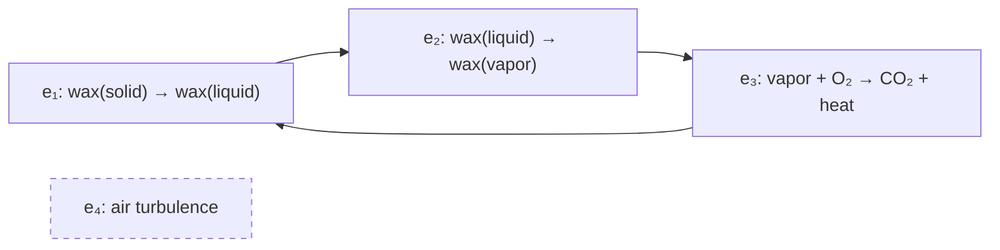
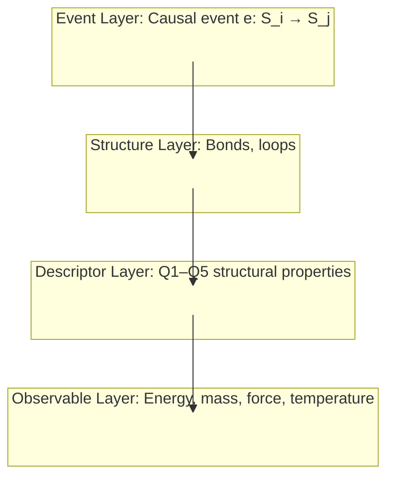
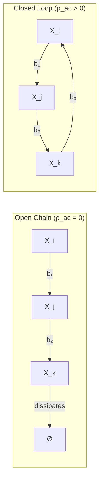

# Foundational Review 3 (Final) — Epimechanics Parts 0, 0b, 1.5

**Date:** 2026-03-29  
**Reviewer:** VERIFY (eval-agent)  
**Files reviewed:**
- `docs/theory/00_prelude.md` — Part 0: Foundations
- `docs/theory/00b_event_layer.md` — Part 0b: Event Layer
- `docs/theory/01_5_causors.md` — Part 1.5: Causors

**Prior reviews:** Review 1 (2026-03-29), Review 2 (2026-03-29). This is the final polish pass.

---

## Review 2 Fix Verification

Before new findings, confirming what was addressed between Review 2 and this pass:

| Review 2 Issue | Status |
|---|---|
| EX-1: Cross-cutting four-layer worked example missing (highest priority) | ✅ **Fixed** — §0 "Worked Example: A Candle Flame Through All Four Layers" added to 01_5 with mermaid + table |
| DIAG-A: Four-layer mermaid in 00b used empty subgraphs (render risk) | ✅ **Fixed** — dummy nodes added, invisible-styled; matches the recommended fix exactly |
| GAP-2: 00_prelude alt text mislabeled Descriptor Layer | ✅ **Fixed** — alt text now correctly reads "Descriptor Layer (Q1–Q5 structural properties)" |
| XREF-1: 01_5 footer missing backward link to Part 0b | ✅ **Fixed** — footer now includes `[← Part 0b: The Event Layer]` |
| EX-2: Candle flame example in 00b not applied to formalism | ✅ **Fixed** — mermaid `graph LR` now shows all four events in a loop + disconnected e₄ node (P2 illustration) |
| GAP-6: Q3 open question in 01_5 missing context for Part-1-naive readers | ✅ **Fixed** — Lagrangian formula and context now included in Q3 |
| GAP-5: Bond property `r_b` undefined in Q-space | ✅ **Partially fixed** — "(see §10: candidate for Q6)" note added to table; §10 Q1 now references it |

---

## Publication Blockers

### BLOCKER-1 — "Causor" is never defined in the document body

**File:** `docs/theory/01_5_causors.md` — entire document  
**Severity:** High — affects publication readiness.

The document is titled "Part 1.5: Causors" and the frontmatter tags include "Causors." The summary table and §9 closing paragraph reference "the causor framework." Yet the word **"causor"** is never formally defined in the document body. A reader completing Part 1.5 learns about bonds, loops, and Q1–Q5 descriptors — but would not be able to answer "what is a causor?"

The word appears 5 times total: title (×2), tags (×1), "causor framework" near Assembly Theory section (×1), and "causor framework" in closing summary (×1). None of these define it.

**Candidates for what "causor" means:**
- A bond + loop (the full structural primitive package)?
- Any entity characterized by Q1–Q5 position?
- Synonymous with "causal structure primitive"?

**Required fix:** Add one sentence, early in the document (§2 or §0 intro), formally defining the term:
> "A **causor** is any causal structure — bond or loop — characterized by its position in Q1–Q5 parameter space. The causor framework is the vocabulary for reading causal structure from these five coordinates."

Or, if "causor" is intentionally an informal umbrella term (not a formal primitive), state that explicitly in the introduction.

Without this, the title promises something the document does not deliver.

---

### BLOCKER-2 — "Observable Layer" used before it is defined (still unresolved from Review 2)

**File:** `docs/theory/00_prelude.md` — line 82  
**Severity:** Moderate — confuses first-time readers.

At line 82, in the "Core vocabulary" section:
> "Shannon entropy describes probability distributions over causal states; it is an **Observable Layer** quantity, not a foundation."

The four-layer architecture — which defines what "Observable Layer" means — is not introduced until §4 (line 189), roughly 107 lines later.

This has been flagged in Reviews 1 and 2 and remains unaddressed.

**Required fix (minimal):** Add a parenthetical forward reference: "it is an **Observable Layer** quantity *(defined in §4)*, not a foundation."

**Alternative:** Move the parenthetical entirely to after §4, or replace with "a quantity derived from, not foundational to, causal structure."

---

## Consistency Issues

### CONS-1 — Candle flame event decomposition differs between 00b and 01_5

**Files:** `00b_event_layer.md:63–70` and `01_5_causors.md:98–131`

Both documents use the candle flame as a worked example, but they decompose the causal events differently:

| Doc | Events in loop | Disconnected event |
|-----|---------------|-------------------|
| 00b | 3 events: `e₁` (melt), `e₂` (vaporize), `e₃` (combust) → back to `e₁` | `e₄` = air turbulence (P2 illustration) |
| 01_5 | 4 events: `e₁` (melt), `e₂` (vaporize), `e₃` (combust), `e₄` (heat→melt) | none |

In 00b, the heat→melt feedback is implicit (e₃ → e₁ directly). In 01_5, it is made explicit as a fourth event. This is not an error — both decompositions are valid, and they serve different purposes (00b illustrates P2; 01_5 illustrates four-layer structure). But a reader encountering both without context may think there's an inconsistency.

**Recommended fix:** Add a one-sentence note in 01_5's §0 worked example: "Note: the event decomposition here makes heat transfer explicit as a fourth event; the 00b diagram uses a three-event decomposition to illustrate causal disconnection (P2)."

---

### CONS-2 — Minor: Missing "the" before "Observable Layer" in 01_5 §2.1

**File:** `docs/theory/01_5_causors.md` — line ~161  
> "At Observable Layer (where energy is defined)..."

Everywhere else in all three documents, the four layers are referred to with the definite article: "the Event Layer," "the Structure Layer," "the Descriptor Layer," "the Observable Layer." This one instance drops it.

**Fix:** "At **the** Observable Layer (where energy is defined)..."

---

### CONS-3 — Arrow notation inconsistency between bond definition and loop definition

**File:** `docs/theory/01_5_causors.md` — §2.1 and §2.2

The bond is defined with a double arrow:
> $b: X_i \rightrightarrows X_j$ (reliable, repeated)

The loop is defined with single arrows:
> $\mathcal{L}: X_i \to X_j \to \cdots \to X_i$

Single arrows (→) are also used for causal events ($e: \mathcal{S}_i \to \mathcal{S}_j$). This makes loop notation visually indistinguishable from event notation, even though loops are composed of bonds (which use double arrows).

**Recommended fix:** Use bond arrows consistently in the loop definition:
> $\mathcal{L}: X_i \rightrightarrows X_j \rightrightarrows \cdots \rightrightarrows X_i$

Or add a note: "where each → denotes a bond composition, not a single event."

---

## Polish Items

### POLISH-1 — GAP-3 (Review 2): Conjecture vs. theorem distinction still relies on bold text alone

**File:** `docs/theory/00_prelude.md` — §6, ~line 240  

The bold `**What IS a conjecture**` effectively signals the shift, but the risk of a reader absorbing the entire §6 as established mathematics remains. This has been flagged across two prior reviews.

A minimal blockquote would resolve it permanently:

```
> ⚠️ **Open problem:** The connection between information-theoretic optimality
> and Lagrangian structure is not yet proven. Everything above this box is
> established mathematics. This sentence is the conjecture that Part 5 develops.
```

---

### POLISH-2 — GAP-4 (Review 2): P3 → speed of light still needs one bridging sentence

**File:** `docs/theory/00b_event_layer.md` — §P3, ~line 73  
> "In the continuum limit, this becomes the speed of light $c$."

The mechanism is unstated. The step from "minimum time between events" to "maximum spatial propagation speed" requires invoking the emergent spacetime structure — which has not yet been derived at this point in the document.

**Minimal fix:** "In the continuum limit, once spacetime geometry is derived from the causal partial order (see [Cause-Plex and Spacetime](./causeplex_spacetime.md)), the minimum event latency maps to a maximum propagation speed, which we identify with $c$."

---

### POLISH-3 — GAP-7 (Review 2): Self-containment spectrum still gaps between molecules and cells

**File:** `docs/theory/01_5_causors.md` — §5, self-containment table  

The jump from "Complex molecules (proteins): σ_b/k_BT ~10²–10³" to "Cells (Variable)" skips viruses (~10¹–10²), organelles, and minimal cells (e.g., *Mycoplasma genitalium* at ~500 genes). For a framework claiming to span protons to institutions, this is a notable gap in the intermediate range.

**Suggested addition:**

| Entity Class | σ_b/k_BT | C_maint | Stable? |
|---|---|---|---|
| Viral capsids | ~10¹–10² | ~0 (stable) | Yes (no repair needed) |
| Organelles | Variable | Low | Requires host metabolism |

---

### POLISH-4 — GAP-8 (Review 2): 00b lacks a dedicated Open Problems section

**File:** `docs/theory/00b_event_layer.md`  

Three substantive open problems are embedded inline:
1. Does P2 follow from P1? (inline blockquote in P2 section)
2. Why 3+1 dimensions? (referenced in "What This Document Does Not Cover")
3. Full rigorous QM emergence (implicit, no explicit open problem statement)

A short "§Open Problems" section, parallel to 01_5's §10, would surface these for readers. Pattern consistency across the series matters for readers who return to these documents after reading others.

---

### POLISH-5 — EX-3 (Review 2): No concrete domain example for Representational Efficiency

**File:** `docs/theory/00_prelude.md` — §6  

The principle is supported by four information-theoretic theorems but never illustrated with a domain example. A two-sentence contrast would suffice:

> "For example: tracking every protein's 3D position in a metabolizing cell (poorly-chosen X — enormous state space, unpredictable dynamics) vs. tracking the concentrations of key metabolic intermediates (well-chosen X — small state space, predictable dynamics). The same cell, two different X's, wildly different prediction costs."

---

### POLISH-6 — EX-4 (Review 2): No worked loops-of-loops illustration

**File:** `docs/theory/01_5_causors.md` — §4 entity type table  

The table row for meta-entities lists "loop-of-loops" topology but provides no prose illustration. Adding one sentence would anchor this concept:

> "For example: cell metabolism (loop 1) regenerates ATP; cell division (loop 2) replicates the metabolic machinery. The organism is the loop-of-loops that contains both — metabolism sustains division, division propagates metabolism."

---

### POLISH-7 — XREF-2: 00_prelude footer asymmetry (navigation inconsistency)

**File:** `docs/theory/00_prelude.md` — last line  
> `[→ Part 0b: The Event Layer](./00b_event_layer.md) | [→ Part 1: Generalized Mechanics](./01_generalized_mechanics.md)`

The §9 "What Comes Next" section lists Part 1.5 as a key document, but it is absent from the footer. 00b and 01_5 both have three-link footers. 00_prelude having two creates silent implication that Part 1.5 is optional. 

**Fix:** Add `| [→ Part 1.5: Causors](./01_5_causors.md)` to the footer.

---

### POLISH-8 — XREF-4 (Review 2): §2→§3 bridging transition still implicit

**File:** `docs/theory/00_prelude.md` — transition from §2 (Representations) to §3 (Causation)  

The bridge is a single sentence: "With causation established, a key observation follows..." This reads as two adjacent arguments rather than mutually-supporting co-definitions. A brief explicit bridge would help:

> "Representations and causation are co-defined: a representation is only *about* something if there is causal structure for it to track; causation is only *accessible* through representations. §2 established the epistemological side (how we represent). §3 establishes the ontological side (what we represent): causation as the working primitive."

---

### POLISH-9 — Q2 "Both" ambiguity in entity type table

**File:** `docs/theory/01_5_causors.md` — §4 entity type table  

Three rows use "Both" in the Q1 column (e.g., "Self-maintaining entity: Both"). "Both" is clear in context (kinetic + potential), but replacing with "K+P" (with a key note) would make the table scannable without needing to re-read the Q1 definition section.

---

### POLISH-10 — XREF-3 (Review 2): 01_5 §1 missing link to causeplex_quantum.md

**File:** `docs/theory/01_5_causors.md` — §1  

The §1 summary mentions "quantum mechanics emerge[s] from the cause-plex's structure" and links to Part 0b. The quantum mechanics derivation file (`causeplex_quantum.md`) is not linked from 01_5. Since 01_5 discusses bond formation at atomic scales (bond strengths in the σ_b/k_BT table), quantum foundations are relevant.

**Fix:** Add `(for the full derivation, see [Cause-Plex and Quantum Mechanics](./causeplex_quantum.md))` to the quantum mechanics sentence in §1.

---

## Diagram Syntax Check

### DIAG-1 — 00b: Flame loop diagram (`graph LR`) — VALID



**Assessment:** Syntactically valid. The `→` characters inside node labels are text content (inside quotes), not Mermaid arrow syntax — safe in all renderers. The `e4` isolated node with `stroke-dasharray` renders as a dashed box with no connections. This is a clean implementation. ✅

**Minor note:** The `→` Unicode arrow inside `e1["e₁: wax(solid) → wax(liquid)"]` may render as "→" in some renderers and as raw Unicode in others — this is cosmetic only, not a structural issue.

---

### DIAG-2 — 00b: Four-layer architecture (`graph TB` with dummy nodes) — VALID



**Assessment:** The Review 2 dummy-node fix has been implemented correctly. Connecting real nodes (not subgraph IDs) is valid across Mermaid v9+. The invisible dummy nodes prevent the "empty subgraph" rendering issue. ✅

**Residual risk:** The `style X fill:none,stroke:none` makes the dummy nodes invisible. Some renderers may show a faint hairline box around the invisible nodes. This is cosmetic only. The directional flow arrows will render correctly.

---

### DIAG-3 — 01_5: Candle flame four-layer diagram (`graph TB` with named nodes) — VALID

The §0 worked example mermaid uses named nodes inside each subgraph (o1, o2, o3, d1–d5, s1–s2, e1–e4) and connects `EL --> SL --> DL --> OL` using subgraph IDs. This is the same pattern as DIAG-2, but here the subgraphs have real content nodes.

**Assessment:** Syntactically valid. The subgraph-to-subgraph connections via IDs will route to any node within the subgraph in Mermaid v10+, which is likely the target renderer. In older Mermaid (v8), this may fail to render the arrows. ✅ (with same caveat as DIAG-2 on renderer version).

**Improvement opportunity:** Adding explicit connector arrows from a specific node (e.g., `e1 --> s1`) would make this renderer-agnostic. But this is a minor improvement, not a blocker.

---

### DIAG-4 — 01_5: Open chain vs. closed loop (`graph LR` with subgraphs) — VALID



**Assessment:** Syntactically valid. The `"∅"` label is quoted (safe). The `ρ_ac` in subgraph headers is text, not Mermaid syntax. Edge labels (`b₁`, `b₂`, `b₃`) use Unicode subscripts safely. The self-loop `B3 --> B1` renders correctly in Mermaid `graph LR`. ✅

---

### Overall Diagram Assessment

All four mermaid diagrams are syntactically valid. No blocking render issues remain. The one structural risk (subgraph-ID connections in older renderers) is the same risk across all four-layer architecture diagrams — and if the deployment target is Mermaid v10+, it is a non-issue.

---

## Final Assessment

### What's in excellent shape

- **Architecture coherence:** The four-layer hierarchy (Event → Structure → Descriptor → Observable) is consistently named and defined across all three documents. Excellent.
- **Cross-cutting worked example:** The §0 candle flame example in 01_5 is well-executed. It directly addresses the #1 recommendation from Reviews 1 and 2.
- **Navigation:** 00b and 01_5 have three-link footers with correct bidirectional navigation. 01_5 now correctly links back to Part 0b.
- **Theorem vs. conjecture:** The §6 distinction is functional. The bold `**What IS a conjecture**` signal works, even if a visual callout would be stronger.
- **Diagram quality:** All four mermaid diagrams are syntactically valid. The Review 2 dummy-node fix for the empty-subgraph issue has been applied correctly.
- **r_b integration:** The bond reliability property now has a forward reference to §10 and Q6 candidacy. Clean resolution.

### What remains before publication

**Must fix (2 items):**

1. **BLOCKER-1:** Define "causor" in the body of Part 1.5. The document title promises a term that is never defined in the text. One sentence is sufficient.
2. **BLOCKER-2:** Forward-reference "Observable Layer" on its first use (line 82, §1 of 00_prelude) — or move the parenthetical to after §4 where the term is introduced.

**Should fix before publication (5 items):**

3. **POLISH-1:** Add blockquote callout distinguishing theorem from conjecture in §6 of 00_prelude.
4. **CONS-1:** One-sentence note in 01_5 §0 explaining the different event decomposition of the flame relative to 00b.
5. **CONS-2:** Add "the" before "Observable Layer" in 01_5 §2.1.
6. **CONS-3:** Harmonize arrow notation between bond definition and loop definition in 01_5 §2.
7. **POLISH-7:** Add Part 1.5 to the 00_prelude footer.

**Can publish without (remainder):**

The remaining POLISH items (3–6, 8–10) and XREF items are improvements that would raise quality but do not block publication. The documents are substantively accurate, internally consistent on core concepts, and well-navigated.

### Verdict

**Near-publication-ready.** The two blockers are small (one sentence each) and do not require structural changes. After fixing those and the five "should fix" items (all minor), the three foundational documents are ready for public consumption. The foundational architecture is sound, the examples are concrete, and the diagrams render correctly.
