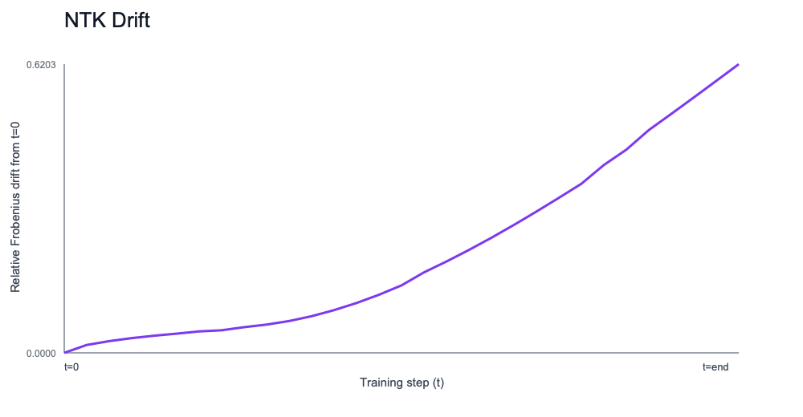
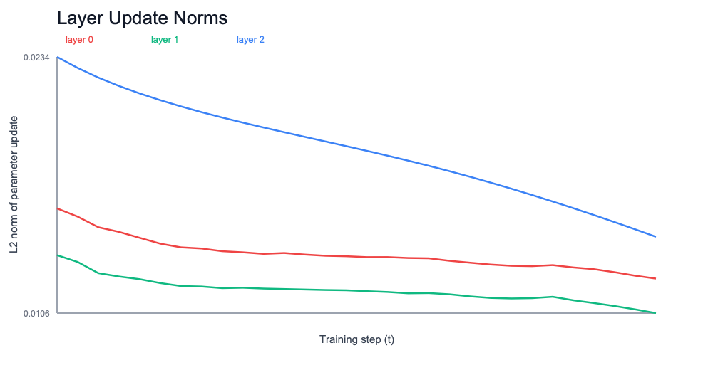

This update continues the TP-bridge pipeline from toy 1D purepy runs to a more architecture-like setting:

- model: **2-block residual MLP** (vector input, nonlinear target)
- optimizer: SGD
- outputs: same TP-bridge metrics schema

## New artifacts

- Trace generator: `experiments/src/run_tp_bridge_residual_mlp_trace.py`
- Raw trace: `experiments/results/tp_bridge/arch_trace_real.json`
- Metrics: `experiments/results/tp_bridge/arch_metrics_real.json`
- Rendered charts: `experiments/results/tp_bridge/arch_images/`
- Interpretation: `experiments/results/tp_bridge/arch_images/implications.md`

Docs image copies:
- `docs/research/images/tp_bridge/tp_bridge_arch_representation_drift.png`
- `docs/research/images/tp_bridge/tp_bridge_arch_ntk_drift.png`
- `docs/research/images/tp_bridge/tp_bridge_arch_layer_update_norms.png`

## Metrics snapshot (architecture-realistic run)

- representation_drift_final: **0.2745**
- ntk_drift_final: **0.6203**
- layer_update_norm_mean: **0.0147**
- transfer_regret: **-0.4817**

Interpretation (quick):
- Nontrivial representational movement remains present.
- NTK drift is high in this configuration (non-frozen regime).
- Transfer regret is negative in this run (small->large setting transfer did not hurt; it improved).

## Visuals

## Compatibility with explainer

This update preserves the existing explainer contract in:
`docs/research/tp_bridge_explainer_plain_english.md`

Same tracked metrics:
- representation drift
- NTK drift
- layer update norms
- transfer regret
