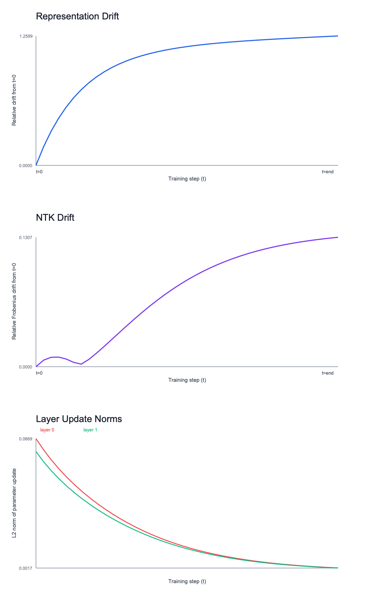

## What these experiments are trying to answer

In simple terms, we asked:

1. **As a model trains, does it really change its internal representation, or mostly stay linear/frozen?**
2. **Do settings that work on a small model still work on a larger model?**

That is the practical bridge between Tensor Programs scaling ideas and Epimechanics-style representational dynamics.

## The three charts (how to read them)

### 1) Representation Drift

- This tracks how far internal features moved from their starting point.
- **Higher** means stronger internal restructuring.
- In Epimechanics language: a proxy for how quickly the representation state changes.

### 2) NTK Drift

- This tracks how much the model’s local input-output response geometry changed during training.
- **Lower** means more kernel-like / frozen behavior.
- **Higher** means less frozen, more feature-learning-like behavior.

### 3) Layer Update Norms

- This tracks how much each layer’s parameters changed at each training step.
- It shows where learning effort is concentrated and whether updates decay smoothly.

## What the initial results say (plain English)

From the current toy + sweep runs:

- Small-width settings look more **feature-learning-like** (higher drift signals).
- As width increases, behavior moves toward a more **mixed** regime (lower drift).
- Hyperparameter transfer (small → larger) looked **good** in this toy benchmark (no clear transfer penalty).

So the early signal is **directionally positive**, but still preliminary.

## What this does *not* prove yet

This does **not** prove the full Epimechanics program.

It only shows that we now have a working instrumentation stack that can:
- classify training regime,
- measure representational movement,
- evaluate transfer behavior,
- and produce reproducible artifacts for interpretation.

## Why this matters for Epimechanics

Epimechanics needs empirical proxies before bigger claims.

This bridge gives us exactly that:
- representation motion proxies,
- regime diagnostics,
- transfer-efficiency diagnostics,
- visualization and interpretation pipeline.

That makes next-stage falsifiable experiments practical instead of purely conceptual.

## Where the artifacts live

- Dashboard image: `docs/research/images/tp_bridge/tp_bridge_dashboard.png`
- Individual charts: `docs/research/images/tp_bridge/*.png`
- Raw experiment outputs: `experiments/results/tp_bridge/`
- Metrics code: `experiments/src/tp_bridge_metrics.py`
- Real toy trace generator: `experiments/src/run_tp_bridge_toy_mlp_purepy.py`
- Sweep runner: `experiments/src/run_tp_bridge_width_sweep_purepy.py`
