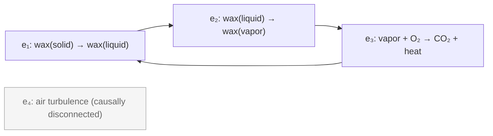
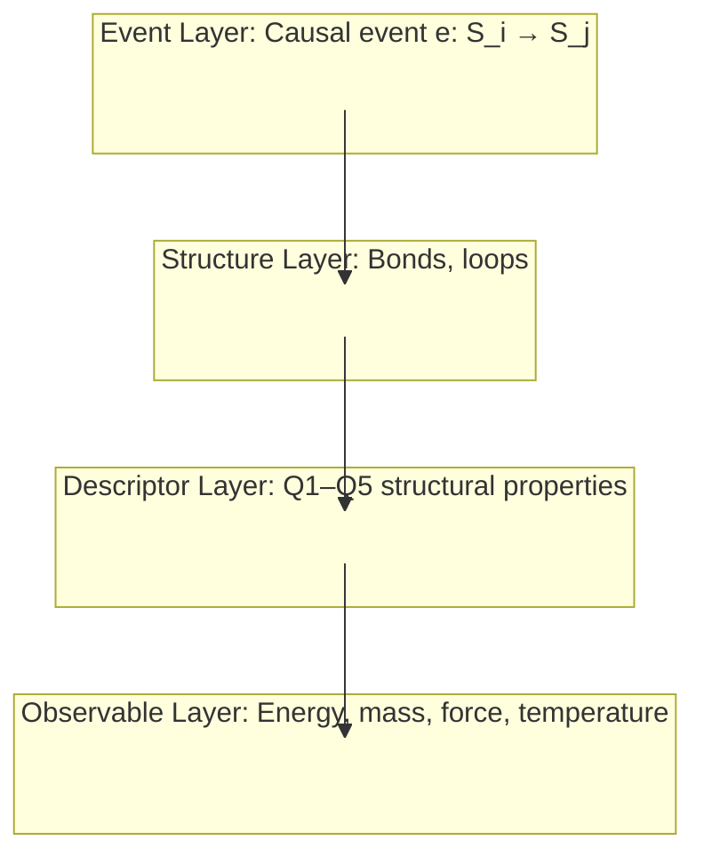

> **In plain English:** Before energy, before spacetime, before particles — there is causation. One thing leads to another. That's it. From just this primitive — "this state follows from that state" — the entire structure of physics emerges. Spacetime is the geometry of causal relationships. Energy is a conserved quantity that appears when causation has a certain symmetry. Quantum mechanics is what happens when multiple causal paths coexist. This document lays out the foundation: the causal event, the cause-plex, and the three properties that generate everything else.

---

## The Primitive: The Causal Event

The most fundamental thing in the framework is not energy, not spacetime, not a particle. It is the **causal event** — a state transition:

$$e: \mathcal{S}_i \to \mathcal{S}_j$$

One configuration follows from another. No energy assumed. No time assumed. No space assumed. Just the "follows from" relation between states.

> Consider a candle flame. The heat from the burning wax vaporizes more wax, which feeds the flame, which produces more heat. Each step is a state transition: one configuration of molecules produces the next. No energy concept is needed to describe this chain — just "this state follows from that one."

In cause-plex notation, the flame is four causal events forming a loop:

Events $e_1, e_2, e_3$ form a closed causal loop — each event's output enables the next. Event $e_4$ (air turbulence elsewhere in the room) has no causal path to or from the flame's core loop — it is **causally disconnected** (P2 applies: their order doesn't matter to the outcome).

This is the same starting point as [Wolfram's ruliad](https://www.wolframphysics.org/): an abstract hypergraph of state transitions. The cause-plex is the specific subgraph realized by the physical world.

---

## The Cause-Plex

The **cause-plex** $\mathcal{C}$ is the hypergraph of all causal events with their partial ordering:

$$\mathcal{C} = (E, \prec)$$

where:
- $E$ is the set of all causal events
- $\prec$ is the "precedes" relation (strict partial order)

The cause-plex carries no physics by assumption. Physics emerges from its structure.

---

## Three Properties

The cause-plex has three structural properties. From these, the physics we observe emerges:

### P1: Causal Partial Ordering

Already encoded in $(E, \prec)$:
- **Irreflexive:** No event precedes itself
- **Transitive:** If $e_1 \prec e_2$ and $e_2 \prec e_3$ then $e_1 \prec e_3$
- **Asymmetric:** If $e_1 \prec e_2$ then not $e_2 \prec e_1$

This is the minimal structure for "causation" to mean anything. It defines what "before" and "after" mean — not in time (time doesn't exist yet), but in the causal ordering itself.

### P2: Causal Invariance

Events with no causal path between them — **causally disconnected** events — commute:

$$e_1 \perp e_2 \implies (e_1 \circ e_2) = (e_2 \circ e_1)$$

If there is no causal path from $e_1$ to $e_2$ or from $e_2$ to $e_1$, then the order in which they are applied doesn't matter. The final state is the same either way.

This is physically motivated: if two events cannot influence each other, their relative ordering is not a fact about the world — it is a coordinate choice. Causal invariance encodes this.

> **Terminology note:** In the derived spacetime geometry, causally disconnected events are called "spacelike-separated." We avoid that term here because spacetime has not yet been derived — we work only with causal structure.

> **Open problem:** Does P2 follow from P1 alone, or does it require additional structure? See [Cause-Plex and Spacetime](./causeplex_spacetime.md) for the current state of this question.

### P3: Finite Minimum Event Latency

Every causal event has a latency $\tau_e \geq \tau_{\min} > 0$:

$$\forall e \in E: \tau_e \geq \tau_{\min} > 0$$

This defines a maximum propagation rate. The mechanism: if every causal event takes at least $\tau_{\min}$, then any causal influence must traverse at least one event per $\tau_{\min}$. When spacetime is derived from this causal structure (see Spacetime below), distance is measured in units of causal events — the minimum spatial interval $\ell_{\min}$ is the interval associated with one event step. The maximum propagation rate is then $c = \ell_{\min}/\tau_{\min}$. In the continuum limit where the discrete cause-plex structure becomes smooth spacetime, this ratio becomes the speed of light. Note that $\ell_{\min}$ is not assumed here — it is defined by the same causal structure that defines distance.

---

## What Emerges

Given P1–P3, the structure of physics emerges:

### Spacetime

The Lorentzian metric — the geometry of special relativity — emerges from the cause-plex structure. Spacetime is not a container that events happen *in*; spacetime *is* the geometry of causal relationships.

The derivation follows causal set theory ([Bombelli, Lee, Meyer, Sorkin 1987](https://doi.org/10.1103/PhysRevLett.59.521)) and [Malament's theorem (1977)](https://doi.org/10.1063/1.523436): the causal structure determines the metric up to a conformal factor.

See [Cause-Plex and Spacetime](./causeplex_spacetime.md) for the full derivation.

### Time

Time is not primitive. Time is the **count of causal events along a path**:

$$\tau(\gamma) = |\{e \in \gamma\}| \cdot \tau_{\min}$$

The "flow of time" is the accumulation of causal events. A clock is a stable causal loop that produces events at a regular rate. The second is defined by counting Cs-133 hyperfine transitions (9,192,631,770 per second by definition). All time measurements are ratios of cause-plex path counts.

### Energy and Conserved Quantities

Energy is not primitive. It emerges from **Noether's theorem**: if the cause-plex has a continuous symmetry, there exists a conserved quantity.

| Cause-plex symmetry | Conserved quantity | Name |
|---------------------|-------------------|------|
| Time-translation invariance | $\sum_i p_i \dot{q}_i - L$ | Energy |
| Spatial translation invariance | $\sum_i m_i \dot{q}_i$ | Momentum |
| Rotational invariance | $\sum_i r_i \times p_i$ | Angular momentum |
| U(1) gauge symmetry | $\sum_i q_i$ | Charge |

**Energy is what we call the conserved quantity when the cause-plex has time-translation symmetry.** In regions where this symmetry holds (most of everyday physics), energy is well-defined and conserved. In regions where it is broken (strongly non-equilibrium, rapidly evolving, cosmological expansion), energy is not a clean quantity.

### Units

Units are not primitive. They are ratios of cause-plex path counts to reference cause-plex path counts:

- **The second:** 9,192,631,770 Cs-133 hyperfine transitions (by definition)
- **The meter:** The distance light travels in 1/299,792,458 of a second
- **The kilogram:** Defined via Planck's constant, the second, and the meter

All physical units reduce to counting causal events relative to reference causal events. No unit is assumed.

### Quantum Mechanics

When multiple causal paths coexist — when the cause-plex has a **multiway structure** — quantum mechanics emerges.

**What is multiway structure?** A single causal event can have multiple possible outcomes. Instead of one path through the cause-plex, there are many — a branching tree of possibilities. The multiway cause-plex is the graph of *all* these paths, coexisting until some process (measurement, decoherence) selects among them.

**How does QM emerge?** Each path through the multiway cause-plex carries an *amplitude* — a complex number. When paths converge (lead to the same final state), their amplitudes interfere: they can add constructively or cancel destructively. The probability of observing a state is the squared magnitude of the total amplitude reaching it (the Born rule). The Schrödinger equation describes how amplitudes evolve as events accumulate.

This is the same insight as Feynman's path integral formulation: quantum mechanics is what happens when you sum over all possible histories. The cause-plex provides the structure; the amplitudes provide the weights; interference produces quantum behavior.

See [Cause-Plex and Quantum Mechanics](./causeplex_quantum.md) for the full derivation.

---

## The Four-Layer Architecture

The Event Layer is the foundation of a four-layer architecture:

| Layer | Content | What it is |
|-------|---------|------------|
| **Event Layer** | Causal event $e: \mathcal{S}_i \to \mathcal{S}_j$, cause-plex $(E, \prec)$ | The primitive — no physics assumed |
| **Structure Layer** | Bonds, loops | Recurring patterns in the cause-plex |
| **Descriptor Layer** | Q1–Q5 structural properties | How to characterize bonds and loops |
| **Observable Layer** | Energy, mass, force, temperature | Derived quantities valid where symmetries hold |

Each layer emerges from patterns in the layer below. The Event Layer is the foundation; everything else is emergent.

The key insight: **quantities like energy and mass live at the Observable Layer, not the Event Layer.** They are coarse-grained descriptions valid where certain symmetries hold. At biological and institutional scales, time-translation symmetry holds well enough that "energy" is the right concept. At the Planck scale or in strongly non-equilibrium systems, you may need to work at the Event Layer directly.

---

## Relationship to Other Work

### Causal Set Theory

The cause-plex builds on causal set theory ([Bombelli et al. 1987](https://doi.org/10.1103/PhysRevLett.59.521), [Sorkin 2003](https://arxiv.org/abs/gr-qc/0309009)). Both start from a locally finite partial order of events, and the spacetime derivation follows established causal set results. Epimechanics extends causal set theory in three directions:

1. **Quantum mechanics:** Explicitly connecting to the multiway structure where path superposition generates QM
2. **Coarse-graining:** Building the full ladder from Planck-scale events to biology and institutions
3. **Mechanical grammar:** Deriving mass, force, and energy as emergent quantities with domain-general definitions

The continuum approximation and measure problems remain active research areas. But the foundational claim — that spacetime geometry is determined by causal structure — is established mathematics (Malament's theorem), not conjecture.

### Wolfram's Ruliad

The cause-plex is a specific subgraph of the [ruliad](https://www.wolframphysics.org/) — the one realized by the physical world. The ruliad derivation works from abstract update rules; the cause-plex derivation works from physical causal events. Both arrive at similar structure and face similar challenges: deriving specific predictions (particle masses, coupling constants) remains an open problem for both programs.

### Process Philosophy

The cause-plex instantiates [Whitehead's process ontology](https://doi.org/10.1017/CBO9781139644037): events, not substances, are fundamental. What we call "things" are stable patterns in the flow of events.

---

## What This Document Does Not Cover

This document establishes the Event Layer — the foundation. It does not cover:

- **How bonds and loops emerge from causal events** → [Part 1.5: Causors](./01_5_causors.md)
- **The full derivation of spacetime** → [Cause-Plex and Spacetime](./causeplex_spacetime.md)
- **The full derivation of quantum mechanics** → [Cause-Plex and Quantum Mechanics](./causeplex_quantum.md)
- **Why 3+1 dimensions** → [Cause-Plex Dimensionality](./causeplex_dimensionality.md)
- **The mechanical grammar (mass, force, energy, coupling)** → [Part 1: Generalized Mechanics](./01_generalized_mechanics.md)

---

## Open Problems

The Event Layer framework inherits open problems from causal set theory and raises new ones:

**OP1: Does P2 follow from P1?** Causal invariance (P2) states that causally disconnected events commute. This is not arbitrary — it is the *definition* of "no causal connection": if the order mattered, there would be a causal path. The open question is whether this can be derived formally from P1 alone or requires stating as an independent axiom. Either way, P2 is not an additional physical assumption — it is what "causally disconnected" means.

**OP2: The continuum limit.** Taking a discrete cause-plex to continuous spacetime requires a measure, topology, and assumptions about event distribution. The derivation of Lorentz invariance in this limit is technically non-trivial and an active research area in causal set theory.

**OP3: Quantum mechanics from multiway structure.** The claim that complex amplitudes, the Born rule, and the Schrödinger equation emerge from multiway graph structure is a research program, not a completed derivation. The specific mechanism mapping path interference to probability amplitudes requires further development.

**OP4: Selection of the physical cause-plex.** What determines which events are "real" causal events? Without a selection criterion, "the cause-plex realized by the physical world" is circular. This is the analogue of Wolfram's ruliad selection problem.

**OP5: Noether in the discrete.** Applying Noether's theorem (which requires continuous symmetry and a differentiable action) to a discrete cause-plex requires technical work on the continuum limit that is not completed here.

These are honest acknowledgments of work remaining, not weaknesses to hide. The framework's value is in providing a unified conceptual architecture; the technical derivations are an ongoing research program.

---

## Summary

The Event Layer is the foundation of epimechanics:

1. **The primitive is the causal event** — a state transition $e: \mathcal{S}_i \to \mathcal{S}_j$
2. **The cause-plex is the hypergraph of all causal events** — $(E, \prec)$
3. **Three properties generate physics:**
   - P1: Causal partial ordering
   - P2: Causal invariance (causally disconnected events commute)
   - P3: Finite minimum event latency
4. **What emerges (with varying degrees of completion):**
   - Spacetime from the causal geometry — **established** (Malament's theorem, causal set theory)
   - Time from event counts — **definitional** (time IS accumulated causation)
   - Energy from symmetry — **established** (Noether's theorem; technical work remains on discrete→continuum)
   - Units from reference event counts — **definitional** (SI definitions already work this way)
   - Quantum mechanics from multiway structure — **research program** (mechanism clear, formal derivation ongoing)

The framework takes causation as primitive. Most of the physics derivation is established mathematics from causal set theory. The open frontier is quantum mechanics and the coarse-graining ladder to biology.

---

[← Part 0: Foundations](./00_prelude.md) | [→ Part 1: Generalized Mechanics](./01_generalized_mechanics.md) | [→ Part 1.5: Causors](./01_5_causors.md)
