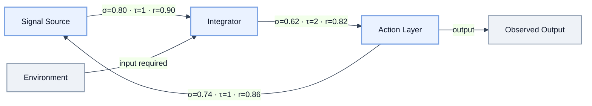
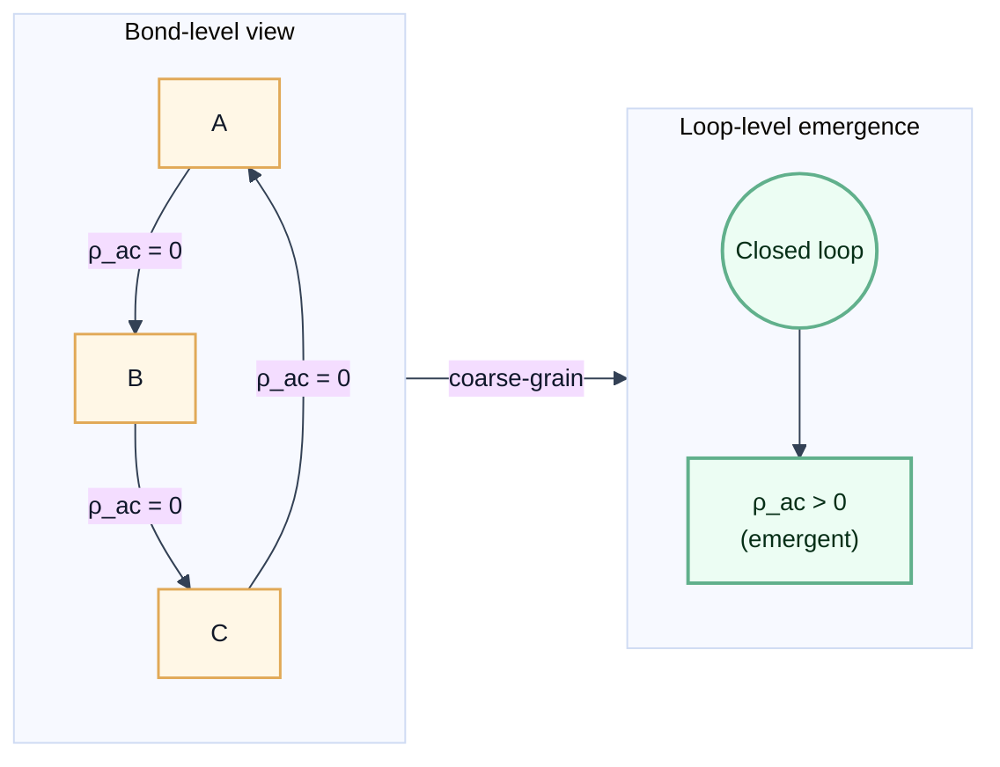
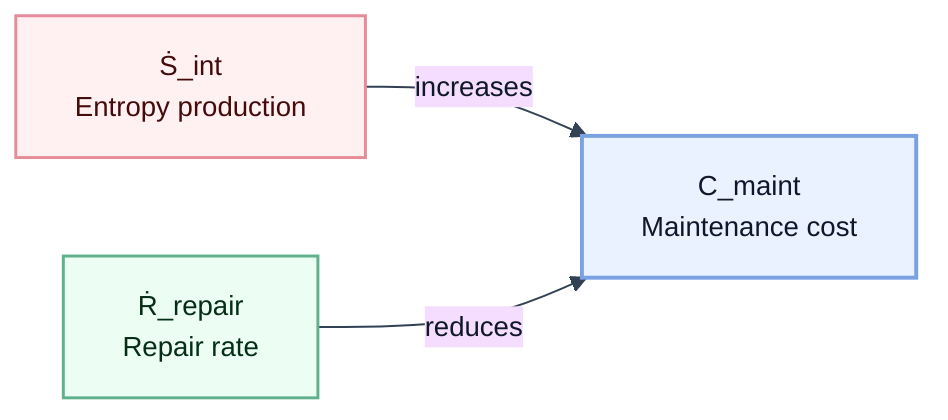

## Where We Are

[Part 1](./01_generalized_mechanics.md) defined the grammar of Epimechanics — how state $X$, force $F$, energy $W$, and coupling $T^i{}_j$ relate to each other. Two key quantities emerged:

**Generalized mass** $\mathcal{M} = \int \rho_{\text{causal}} \, d\mu$ — the total causal density of an entity. This determines resistance to state change: high $\mathcal{M}$ means more force is needed to alter the entity's trajectory. An institution with dense internal processes has high $\mathcal{M}$; a new startup has low $\mathcal{M}$.

**Auto-causal density** $\rho_{\text{ac}}$ — the fraction of causal activity that sustains the entity's own existence. A flame has high $\rho_{\text{ac}}$ (combustion maintains the heat that maintains combustion). A rock has near-zero $\rho_{\text{ac}}$ (nothing about the rock actively maintains itself).

Part 1 showed how these quantities *relate* — force equals mass times acceleration, energy is capacity for state change, coupling determines how strongly entities interact. But it left a question open: what are these quantities *made of*?

---

## The Periodic Table Problem

Physics had $F = ma$ for two centuries before understanding what mass is made of. The equation worked — you could predict trajectories, design bridges, launch projectiles — but mass was a black box. Then came atoms, then subatomic particles, then the Standard Model. Now we know: mass comes from the Higgs field coupling and from binding energy in composite particles.

Epimechanics is at the earlier stage. We have the grammar:

$$F = \mathcal{M}\ddot{X} + \dot{\mathcal{M}}\dot{X}$$

This works — you can describe institutional inertia, belief persistence, market momentum. But $\mathcal{M}$ is still a black box. What is it made of? What determines whether an entity has high or low $\mathcal{M}$? Why do some high-$\mathcal{M}$ entities require constant maintenance while others persist for millennia?

This is the periodic table problem. Chemistry needed a periodic table — a finite set of elements that combine to produce all substances. Epimechanics needs the same: a finite set of **causants** that combine to produce all the quantities the grammar uses.

---

## The Six Causants

<abbr title="Causant: a minimal causally operative constituent that composes higher-order structures and dynamics.">Causant</abbr> is the core term in this chapter (see [Glossary](./glossary.md)). The following six causants are proposed as domain-independent building blocks from which $\mathcal{M}$, $\rho_{\text{ac}}$, maintenance cost, robustness, and other derived quantities are composed.

### 1. Causal Bond ($b$)

A single directed causal connection between two state variables: a change in $X_i$ produces a change in $X_j$. This is the minimal unit of causal structure. In [Pearl's framework](https://doi.org/10.1017/CBO9780511803161), it corresponds to a single edge in a causal DAG.

**Examples across domains:**
- **Physical**: an intermolecular force (covalent, ionic, van der Waals)
- **Institutional**: a reporting line, a contractual obligation, a regular meeting
- **Cognitive**: a belief supporting another belief, a memory triggering an emotion

A causal bond has four properties:
- **Direction**: $i \to j$ (asymmetric in general)
- **Strength** $\sigma_b$: the energy required to sever the bond (see below)
- **Latency** $\tau_b$: the time delay between cause and effect
- **Reliability** $r_b \in [0,1]$: the probability that the connection fires when activated

### 2. Bond Strength ($\sigma_b$)

The energy required to sever a single causal bond. At the physical level, this is measured in Joules — analogous to bond dissociation energy in chemistry.

Bond strength is called out as its own causant because it is the primary contributor to generalized mass: $\mathcal{M} = \sum_{\text{bonds}} \sigma_b$. Mass is the sum of bond strengths.

**Examples:**
- **Strong bonds** (hard to break): a covalent bond between carbon atoms (~350 kJ/mol), a deeply ingrained habit, a legal contract
- **Weak bonds** (easy to break): a van der Waals interaction (~1 kJ/mol), a casual acquaintance, a verbal agreement

### 3. Loop Order ($\ell$)

The length of the shortest self-referential causal cycle passing through a given point. A loop of order 1 is direct self-causation ($X_i \to X_i$). A loop of order 2 is $X_i \to X_j \to X_i$. A loop of order $\ell$ passes through $\ell$ intermediate states before returning.

Loop order determines the *character* of auto-causal structure:
- $\ell = 1$: direct self-reinforcement (a thermostat, a habit loop)
- $\ell = 2$: mutual reinforcement (symbiosis, reciprocal trust)
- $\ell \gg 1$: long-range auto-causality (an institution whose budget funds the department that generates the revenue that justifies the budget — many intermediaries)

**Examples across domains:**
- **Physical**: crystal lattice periodicity, molecular ring structures
- **Institutional**: feedback cycles (daily standup = short loop; budget-revenue cycle = medium loop)
- **Cognitive**: rumination ($\ell$ short), identity-belief-behavior-social reinforcement ($\ell$ long)

Shorter loops respond faster to perturbation (the feedback signal returns sooner). Longer loops are slower but can be more robust — disrupting one link doesn't immediately break the cycle if alternative paths exist.

### 4. Stability Basin Depth ($\Delta V$)

The energy barrier between the entity's current configuration and the nearest dissolution pathway. Formally: the height of the lowest saddle point on the potential energy surface surrounding the entity's equilibrium position.

$$\Delta V = V_{\text{saddle}} - V_{\text{equilibrium}}$$

Deep basins mean the entity can absorb large perturbations without leaving its configuration. Shallow basins mean small perturbations can push it over the edge.

**Examples:**
- **Diamond**: $\Delta V$ is enormous (requires ~7 eV per bond to disrupt the lattice)
- **Well-built house**: $\Delta V$ is large (engineered to withstand storms, earthquakes within design spec)
- **Sandcastle**: $\Delta V$ is tiny (a wave, a footstep, gravity alone over hours)
- **A new startup's culture**: $\Delta V$ is shallow (one bad hire, one crisis can reshape it entirely)
- **A centuries-old institution**: $\Delta V$ is deep (survives wars, scandals, leadership changes)

### 5. Entropy Production Rate ($\dot{S}_{\text{int}}$)

The rate at which the entity's internal structure generates disorder that must be managed. Every causal bond produces some entropy — some fraction of causal activity degrades the structure rather than maintaining it.

$$\dot{S}_{\text{int}} = \sum_{\text{bonds}} \dot{s}_b$$

where $\dot{s}_b$ is the entropy production per bond per unit time. This depends on:
- The bond's operating conditions (a pipe in freezing weather produces more entropy than one in a climate-controlled building)
- The bond's age and degradation state
- Environmental coupling (how strongly external perturbations drive the bond away from equilibrium)

**Examples across domains:**
- **Physical**: thermal entropy production (second law)
- **Institutional**: process degradation, knowledge loss, alignment drift
- **Cognitive**: forgetting, confusion, belief drift

$\dot{S}_{\text{int}}$ is what makes entities mortal. Even the most robust structure produces *some* entropy. If this is not exported or repaired, it accumulates until the structure fails. [Prigogine](https://doi.org/10.1126/science.201.4358.777) showed that living systems persist by exporting entropy to their environment faster than they produce it internally. When export fails, the entity dissolves.

### 6. Repair Rate ($\dot{R}_{\text{repair}}$)

The rate at which the auto-causal structure restores broken or degraded bonds. This is the operational definition of "self-sustaining" — the entity does degrade, but it fixes itself faster than it breaks.

$$\dot{R}_{\text{repair}} = \text{bonds restored per unit time}$$

**Examples across domains:**
- **Physical**: zero for non-living matter; metabolic repair for living matter
- **Institutional**: process improvement, training, cultural reinforcement, institutional memory maintenance
- **Cognitive**: rehearsal, reinforcement, active recall, social validation

The net maintenance cost is:

$$C_{\text{maintenance}} = \dot{S}_{\text{int}} - \dot{R}_{\text{repair}}$$

**Maintenance regimes:**
- When $\dot{R}_{\text{repair}} > \dot{S}_{\text{int}}$: the entity is *self-maintaining*. No external maintenance needed. (A living organism in favorable conditions.)
- When $\dot{R}_{\text{repair}} \approx \dot{S}_{\text{int}}$: marginal. The entity persists but is fragile. (A machine that requires regular servicing.)
- When $\dot{R}_{\text{repair}} < \dot{S}_{\text{int}}$: the entity decays. External maintenance is required to persist. (A building, a road, a garden.)
- When $\dot{R}_{\text{repair}} = 0$: no self-repair. All maintenance is external. (A rock — but rocks have very low $\dot{S}_{\text{int}}$ too, so they persist.)

---

## Why This Matters: The House Problem

With the six causants defined, we can now resolve a puzzle that Part 1's grammar cannot handle.

**The house problem.** A well-built house has high $\mathcal{M}$ — dense structural connections (foundation, framing, plumbing, electrical, insulation, all tightly integrated). A poorly built house has lower $\mathcal{M}$ — fewer connections, cheaper materials, less integration. If $\mathcal{M}$ were the only relevant quantity, we'd expect the well-built house to require *more* maintenance (more stuff to maintain). But the opposite is true: the well-built house requires *less* maintenance.

**The causant resolution.** $\mathcal{M}$ and maintenance cost are different combinations of the same causants:

| Entity | $\mathcal{M}$ (bond sum) | $\Delta V$ (basin depth) | $\dot{S}_{\text{int}}$ | $\dot{R}_{\text{repair}}$ | $C_{\text{maint}}$ |
|---|---|---|---|---|---|
| Well-built house | High | Deep | Low | 0 | Low |
| Cheap house | Medium | Shallow | High | 0 | High |
| Diamond | Very high | Very deep | Near-zero | 0 | Near-zero |
| Sandcastle | Low | Very shallow | Medium | 0 | Very high |
| Living organism | Very high | Moderate | High | High | Low (while alive) |
| Startup | Low | Shallow | High | Moderate | Moderate |
| Ancient institution | High | Deep | Moderate | Moderate | Low |

**$\mathcal{M}$ is about total bond strength** — how much force is needed to change the entity's state.

**$C_{\text{maint}}$ is about net entropy accumulation** — how fast the entity degrades minus how fast it repairs itself.

These are independent. A system can be massive and cheap to maintain (diamond: high $\mathcal{M}$, deep $\Delta V$, near-zero $\dot{S}_{\text{int}}$). Or light and expensive to maintain (sandcastle: low $\mathcal{M}$, shallow $\Delta V$, positive $\dot{S}_{\text{int}}$, zero repair).

The well-built house has high $\mathcal{M}$ *and* deep $\Delta V$ *and* low $\dot{S}_{\text{int}}$. The cheap house has medium $\mathcal{M}$ but shallow $\Delta V$ and high $\dot{S}_{\text{int}}$. The grammar alone ($F = \mathcal{M}\ddot{X}$) couldn't distinguish these cases. The causant decomposition can.

---

## Auto-Causality: Emergent, Not Self-Contained

An important clarification about causal loops: **auto-causal does not mean self-contained.**

Consider the Krebs cycle (citric acid cycle). It is auto-causal: the cycle regenerates the oxaloacetate needed to accept the next acetyl-CoA input, sustaining its own continuation. But it is not self-contained — it requires continuous input of acetyl-CoA (from food) and outputs CO₂ and electrons (to the electron transport chain). Cut off the input, and the cycle stops.

**The distinction:**
- **Auto-causal** ($\rho_{\text{ac}} > 0$): the structure participates in its own continuation. The loop regenerates conditions for its next iteration.
- **Self-contained**: the structure requires no external input. Almost nothing is self-contained — even stars require gravity and fuel.

This applies universally:
- **Metabolic cycles**: auto-causal (regenerate intermediates) but require fuel input
- **Institutions**: auto-causal (the budget funds the department that generates the revenue that justifies the budget) but require external customers, employees, resources
- **Neural assemblies**: auto-causal (recurrent circuits maintain activation) but require sensory input and metabolic support
- **Social reciprocity**: auto-causal (A trusts B, B cooperates with C, C supports A) but requires the individuals to exist and interact

**Individual bonds have zero auto-causal density.** Consider an autocatalytic cycle: enzyme A catalyzes production of substrate B; B is consumed by enzyme C; C produces a cofactor required by A. No individual step sustains itself — A alone does nothing without C's cofactor, B alone is just a substrate, C alone lacks its input. Each bond has $\rho_{\text{ac}} = 0$. But the cycle A → B → C → A has $\rho_{\text{ac}} > 0$ — it collectively sustains its own continuation.

This is exactly [Kauffman's autocatalytic set](https://doi.org/10.1093/oso/9780195079517.001.0001): no single reaction catalyzes itself, but the set collectively catalyzes its own production.

**Implication:** $\rho_{\text{ac}}$ is NOT a bond-level property. It is a **loop-level emergent property** — the first level at which auto-causality appears. Bonds are the constituents; loops are the "molecules." You cannot measure $\rho_{\text{ac}}$ by examining individual bonds any more than you can measure wetness by examining individual water molecules.

This connects directly to [Hoel et al.'s causal emergence](https://doi.org/10.1073/pnas.1314922110): the loop-level description has more causal information than the bond-level description ($EI(\text{macro}) > EI(\text{micro})$). The loop IS the entity at its most fundamental level — the smallest unit of self-sustaining causal structure.

### Visual: Causant interaction graph

The loop A → B → C → A is auto-causal (it sustains its own continuation), but it requires input from the environment (D) and produces output (E). Auto-causal ≠ self-contained.

### Visual: Loop emergence from bonds

### Local auto-causality does not guarantee contribution to containing systems

A second clarification: **auto-causality operates at specific scales of time and space.** A loop that sustains itself locally may not contribute to — or may actively drain — a containing system at a larger scale.

A loop can sustain itself ($\rho_{\text{ac}} > 0$ at its own scale) while:
- Contributing nothing to the containing system's $\rho_{\text{ac}}$ (decoupled)
- Actively draining from the containing system (parasitic)
- Producing entropy without useful work (dissipative)

**Examples:**
- An idling engine: combustion sustains combustion locally, but $\mathcal{P}_{\text{useful}} = 0$ — no work done on the containing system
- A bureaucratic process that perpetuates itself but doesn't serve the organization's persistence
- A tumor: high local $\rho_{\text{ac}}$, but $\kappa_{\text{sys}} < 0$ — it drains the organism's resources

Define **systemic coupling** $\kappa_{\text{sys}}$ as the derivative of containing-system auto-causality with respect to sub-loop auto-causality:

$$\kappa_{\text{sys}} = \frac{\partial \rho_{\text{ac}}^{\text{containing}}}{\partial \rho_{\text{ac}}^{\text{loop}}}$$

When $\kappa_{\text{sys}} > 0$, the loop contributes to the containing system's persistence. When $\kappa_{\text{sys}} < 0$, it's parasitic — the loop persists at the expense of the whole. When $\kappa_{\text{sys}} = 0$, it's decoupled — self-sustaining but systemically inert.

**Note on "value":** This framework does not invoke normative value. It describes *structural relationships* between scales. "Contribution" means: does increasing the sub-loop's $\rho_{\text{ac}}$ increase the containing system's $\rho_{\text{ac}}$? Existence itself is the selection criterion — structures that persist, persist; those that don't, don't. This is structural, not normative (see [The Persistence Reversal](./persistence_reversal.md): "Existence is the filter that selects for persistence mechanisms — not as a value statement but as a structural fact").

**The temporal dimension: parasites can become organs.** Instantaneous $\kappa_{\text{sys}}(t)$ isn't the full picture. A loop with $\kappa_{\text{sys}}(t) < 0$ today but $d\kappa_{\text{sys}}/dt > 0$ may be integrating:
- R&D departments initially drain resources before producing value
- Mitochondria were originally parasitic bacteria; now they're essential for eukaryotic energy metabolism
- Some organs may have evolved from initially parasitic or neutral growths
- Venture capital logic: fund negative-$\kappa_{\text{sys}}$ loops with high expected future integration

The relevant quantity is expected future contribution: $\int_t^{\infty} \kappa_{\text{sys}}(t') \, dt'$. See [Part 2](./02_meta_entities.md) for full treatment of part-whole causal relationships across scales.

---

## Causal Power

With the six causants defined, we can now define **causal power** — the rate at which an entity does work on state trajectories.

$$\mathcal{P}_{E \to j} = \mathbf{F}_{E \to j} \cdot \mathbf{v}_{X_j}$$

where $\mathbf{F}_{E \to j}$ is the force entity $E$ exerts on entity $j$'s state, and $\mathbf{v}_{X_j} = dX_j/dt$ is $j$'s state velocity. This has units of energy per time — it is power in the literal mechanical sense, extended to abstract state spaces. (See [Part 3](./03_intelligence_consciousness_agency.md) for full treatment.)

**How causal power relates to the causants:** An entity's capacity for sustained causal power depends on its bond structure. High $\mathcal{M}$ (dense, strong bonds) provides a larger energy reservoir from which to do work. The coupling tensor $T^i{}_j$ determines how efficiently that reservoir translates into force on other entities' states. Causal power is not a seventh causant — it is a *derived quantity* that emerges from bond strengths, coupling structure, and state velocities.

### Connection to Chaisson's energy rate density

[Eric Chaisson (*Complexity*, 2011)](https://onlinelibrary.wiley.com/doi/abs/10.1002/cplx.20323) measured $\dot{\varepsilon}_m = \text{power} / \text{mass}$ (W/kg) across cosmic evolution — from galaxies to stars to planets to life to brains to civilization — and found it increases with complexity. In Epimechanics terms:

$$\dot{\varepsilon}_m = \frac{\mathcal{P}}{\mathcal{M}/c_D^2}$$

This is causal power normalized by mass-equivalent. Higher $\dot{\varepsilon}_m$ means more causal work per unit structure. Chaisson's empirical finding is a claim about *causal power density* increasing with complexity — more complex entities do more work on their environment per unit of their own causal mass.

---

## Building Higher Quantities from Causants

The six causants combine to produce the framework's higher-level concepts:

| Derived Quantity | Causant Composition | What It Means |
|---|---|---|
| **Causal power** $\mathcal{P}$ | $\mathbf{F} \cdot \mathbf{v}$ (force × velocity) | Rate of work on state trajectories; normalized by mass gives Chaisson's $\dot{\varepsilon}_m$ |
| **Causal action** $A_{\text{causal}}$ | $\int_0^{T_{\text{local}}} \mathcal{M}_{\text{ac}}(t) \, dt$ | Total self-sustaining structure over lifetime; units of J·s (same as physical action $S$) |
| **Generalized mass** $\mathcal{M}$ | $\sum_{\text{bonds}} \sigma_b$ | Total causal content — sum of bond strengths; determines resistance to state change |
| **Auto-causal density** $\rho_{\text{ac}}$ | **Emergent** from closed loops | Self-sustaining fraction of causal structure (loop-level, not bond-level) |
| **Maintenance cost** $C_{\text{maint}}$ | $\dot{S}_{\text{int}} - \dot{R}_{\text{repair}}$ | Net entropy accumulation rate — NOT proportional to $\mathcal{M}$ |
| **Robustness** | $\Delta V / \langle \text{perturbation} \rangle$ | Basin depth relative to typical environmental shocks |
| **Assembly index** (AI) | Minimum bond-formation steps from primitives | Construction complexity — a lower bound on $\mathcal{M}$ |
| **Durability** | $\Delta V \times \dot{R}_{\text{repair}} / \dot{S}_{\text{int}}$ | How long the entity persists without external intervention |
| **Fragility** | $(\partial \mathcal{M} / \partial \text{perturbation})$ near $\Delta V$ boundary | How sharply mass drops when basin boundary is approached |
| **Antifragility** | $\partial \Delta V / \partial \text{stress} > 0$ | Basin depth *increases* under perturbation (stronger from stress) |

**Note:** $\mathcal{M} = \sum \sigma_b$ is the isotropic (scalar) approximation. When bond strengths vary by direction, $\mathcal{M}$ becomes a tensor $\mathcal{M}_{ij}$ whose eigenvalues give directional resistance. See [Part 1, Section 2b](./01_generalized_mechanics.md).

### Causal Action: Why Persistence Matters

**Causal action** is the temporal integral of auto-causal mass:

$$A_{\text{causal}}(E) = \int_0^{T_{\text{local}}} \mathcal{M}_{\text{ac}}(E, t) \, dt$$

This has units of **J·s** — the same as physical action $S = \int L \, dt$ and Planck's constant ℏ. The dimensional match is not coincidental: the principle of least action ($\delta S = 0$) selects which *trajectories* are realized; causal action measures which *entities* persist.

**High instantaneous density is not enough.** An entity can have very high $\mathcal{M}_{\text{ac}}$ for a short time and then collapse — a flash fire, a viral meme, a speculative bubble, a population boom enabled by unsustainable technology. The product $\mathcal{M}_{\text{ac}} \times T_{\text{local}}$ is what matters for long-term causal presence.

| Entity | $\mathcal{M}_{\text{ac}}$ | $T_{\text{local}}$ | $A_{\text{causal}}$ |
|---|---|---|---|
| Flash fire | Very high | Seconds | Low |
| Viral meme | High | Days–weeks | Low–moderate |
| Speculative bubble | High | Months–years | Moderate |
| Stone wall | Low | Centuries | High |
| Ancient institution | Moderate | Millennia | Very high |

**The fitness×truth connection.** [Hoffman (*The Case Against Reality*, 2019)](https://wwnorton.com/books/9780393254693) showed that evolutionary selection favors fitness-tuned interfaces over truth-tracking ones — organisms perceive what's useful, not what's real. But fitness *alone* is temporally bounded: a strategy that exploits a resource without tracking the underlying causal structure will eventually hit reality's constraints.

Consider nitrogen fertilizers before the Haber process:
- **Fitness alone:** Mining guano and nitrates enabled a population boom (high $\mathcal{M}_{\text{ac}}$) — but the resource was finite. The strategy was decoupled from the causal reality of nitrogen availability. $T_{\text{local}}$ was bounded by resource exhaustion.
- **Fitness×truth:** The Haber-Bosch process (1909) coupled fitness to truth — atmospheric nitrogen is effectively unlimited. This extended $T_{\text{local}}$ dramatically, yielding higher $A_{\text{causal}}$.

**The general principle:** Strategies that achieve high $\mathcal{M}_{\text{ac}}$ by decoupling from causal reality have bounded $T_{\text{local}}$. Strategies that couple fitness to truth — that work *with* causal structure rather than against it — sustain $\mathcal{M}_{\text{ac}}$ longer. Selection over long timescales favors high $A_{\text{causal}}$, which means selection favors fitness×truth over fitness alone.

This resolves an apparent paradox in Hoffman's framework: if fitness beats truth, why does science work? Because science is a meta-strategy that couples fitness to truth — it selects for representations that track causal structure, which extends $T_{\text{local}}$ for the entities (individuals, institutions, civilizations) that adopt it. Over sufficiently long timescales, fitness×truth dominates. See [Part 4](./04_time_and_soul.md) for full treatment.

### Visual: Maintenance balance

---

## Measurement Across Domains

### Units at the physical level

A causal event is an energy exchange, measured in Joules. This fixes the dimensional chain:

| Quantity | Definition | Units |
|---|---|---|
| $\rho_{\text{causal}}$ | Energy density of causal events | J/m³ |
| $\mathcal{M} = \int \rho_{\text{causal}} \, d\mu$ | Total causal content | J |
| Mass-equivalent | $\mathcal{M} / c_D^2$ | kg |
| $\mathcal{P}$ | Causal power | W (J/s) |

### Functionalized energy

At biological levels, the relevant unit is not raw Joules but **functionalized energy** — energy in a form that can do causal work within the system's bond network.

ATP (adenosine triphosphate) is the paradigm case. A cell sitting in a glucose solution has access to energy, but that energy cannot do causal work until it is converted to ATP. ATP is energy *functionalized* — packaged in a form that the cell's causal machinery (enzymes, transporters, molecular motors) can use to drive state changes.

This is why biological energy rate density is measured in metabolic watts (ATP hydrolysis rate), not raw thermal energy. The Krebs cycle doesn't just process energy — it converts substrate energy into the functionalized form (ATP, NADH, FADH₂) that can propagate through the cell's causal bond network.

**The principle generalizes:** In any domain, the relevant energy measure is *functionalized* energy — energy in a form that can propagate through that domain's causal bonds. At the institutional level, this might be budget dollars (money functionalized for organizational use), authorized decisions (authority functionalized for action), or trained personnel (human capability functionalized for institutional work).

### Domain-specific measurement

For abstract state spaces, the measure $d\mu$ has domain-specific units (per-agent, per-belief, per-organizational-unit), and "energy" must be operationalized domain by domain. Bond strength $\sigma_b$ at the institutional level might be measured in:
- Dollars-to-sever (cost to break the relationship)
- Hours-of-disruption (time cost of bond failure)
- Bits-of-information-lost (knowledge destroyed when bond breaks)

All are legitimate energy-equivalents within their domain.

### The coupling tensor as conversion factor

The exchange rate between domain units and fundamental energy is not constant — it varies across state space, determined by the local coupling tensor $T^i{}_j$. A dollar converts to different amounts of directed state change depending on local context: prices, labor costs, institutional efficiency, crisis vs stability.

This parallels physics: the electromagnetic coupling constant $\alpha$ runs with energy scale (vacuum polarization changes its effective value at different energies). The "strength" of a dollar is a running coupling constant, not a fixed conversion factor.

The framework predicts: the effective energy of any domain-specific unit is $\sigma_{\text{effective}} = T^i{}_j(X) \cdot \sigma_{\text{domain}}$ — bond strength in domain $j$ mapped through the local coupling tensor to effective causal capacity in domain $i$.

### The measurement frontier

At the physical level, units are clean: Joules, meters, seconds. At biological levels, they are operationalizable (ATP hydrolysis, metabolic watts). At institutional and cognitive levels, the "energy" of a causal bond depends on context through the coupling tensor — it is measurable but not universal.

The framework provides the grammar ($\mathcal{M} = \sum T^i{}_j \cdot \sigma_b$); the domain provides the units and the coupling tensor must be empirically determined. Dimensional cleanliness degrades as abstraction increases, and this is honest: the difficulty is real, not hidden.

---

## Connection to Assembly Theory

[Assembly theory (Cronin & Walker, 2023)](https://doi.org/10.1038/s41586-023-06600-9) measures one causant: the minimum number of bond-formation operations to construct an object. The assembly index AI is a static, constructive measure — it counts how many steps to *build* the structure.

The causant framework extends assembly theory in two directions:

1. **From construction to maintenance.** AI tells you how hard the entity was to build. $C_{\text{maint}} = \dot{S}_{\text{int}} - \dot{R}_{\text{repair}}$ tells you how hard it is to *keep*. These differ: a complex molecule in a stable configuration (deep $\Delta V$) is hard to build and easy to keep. A complex molecule in an unstable configuration (shallow $\Delta V$) is hard to build and hard to keep.

2. **From counting to dynamics.** AI counts construction steps. The causant framework adds *dynamics*: how do bonds evolve over time? Which degrade? How fast? What repair mechanisms exist? This is the difference between a blueprint (AI) and a maintenance manual ($\dot{S}_{\text{int}}$, $\dot{R}_{\text{repair}}$, $\Delta V$).

**Prediction:** AI and durability should be correlated but not identical. High-AI entities tend to have deeper stability basins — but the correlation is imperfect. Fragile complexity exists (a poorly designed bridge). Durable simplicity exists (a stone wall).

For how composites can outlive their constituents, see [The Persistence Reversal](./persistence_reversal.md). For how these primitives trace across scales, see [Cross-Level Tracing](./cross_level_tracing.md).

---

## Connection to the Representational Efficiency Principle

The Representational Efficiency principle ([Part 5](./05_ontology_and_open_questions.md)) connects these primitives to optimal representation: the "right" description is the one whose state variables correspond to natural clusters of bonds — the mesoscale structures that have their own dynamics. This is exactly what coarse-graining does in physics: identify the collective degrees of freedom (phonons, quasiparticles) that capture the system's behavior more efficiently than tracking individual particles.

---

## Open Questions

### Q1: Are these the right causants?

The six quantities proposed here (bond, strength, loop order, basin depth, entropy production, repair rate) are candidates, not conclusions. The test: can they be measured independently in at least one domain, and do the derived quantities ($\mathcal{M}$, $C_{\text{maint}}$, robustness, etc.) computed from them match independent measurements of those derived quantities? This is the causant-level version of the equivalence principle test from [Part 1, Section 2b](./01_generalized_mechanics.md).

### Q2: Are the causants domain-independent?

The examples above suggest they are — "causal bond" maps naturally to chemical bonds, institutional connections, and cognitive associations. But the *measure* on each (what units, what grain) is domain-specific. Can we define a domain-independent formalism for these causants, the way physics defines "bond" abstractly through quantum mechanics regardless of which elements are bonding?

### Q3: How do causants compose into tensors?

The coupling tensor $T^i{}_j$ describes cross-domain propagation. In causant terms: a force applied in domain $j$ propagates through bonds that cross domain boundaries to produce a response in domain $i$. The off-diagonal elements of $T$ are determined by the number, strength, and loop structure of cross-domain bonds. Can the tensor structure be *derived* from the bond network, rather than measured as a separate quantity?

### Q4: What is the relationship between assembly index and stability?

Assembly theory predicts that high-AI objects require selection (they don't arise by chance). The causant framework adds that high-AI objects *may* have deep stability basins — but need not. Is there a formal relationship between construction complexity and thermodynamic stability? If so, it would connect assembly theory to the Representational Efficiency principle: complex structures that persist (high AI, deep basin) are the ones that correspond to efficient representations.

### Q5: Can we derive the Lagrangian from the causant structure?

The Lagrangian $L = \frac{1}{2}\mathcal{M}|\dot{X}|^2 - V(X)$ is currently a structural postulate. If $\mathcal{M}$ is composed of bonds with known strengths, and $V(X)$ is determined by the basin structure, can the Lagrangian be *derived* from the bond network? This would move the quadratic kinetic energy from postulate to consequence — the strongest possible grounding of the framework.

---

## Relationship to the Series

This document sits between the [series overview](./index.md) and [Part 1](./01_generalized_mechanics.md). It addresses the question that Part 1's grammar leaves open: what is the grammar *about*? The grammar describes how $\mathcal{M}$, $F$, $V$, $T^i{}_j$ relate to each other. This document asks what these quantities are *made of* — and proposes that the answer, like chemistry's periodic table, is a small set of causants that combine differently in different domains to produce the observed diversity of entities.

The grammar works regardless of whether the causant decomposition is correct — $F = \mathcal{M}\ddot{X}$ holds whether or not we know what $\mathcal{M}$ is made of, just as $F = ma$ held before understanding the substructure of mass. But the causant decomposition, if correct, would:

1. **Resolve the house problem** — explain why $\mathcal{M}$ and maintenance cost diverge
2. **Ground the equivalence principle** — provide a micro-level explanation for why different measurement approaches to $\mathcal{M}$ agree
3. **Enable the applications** — cost of ownership, robustness metrics, future cost of decisions all require distinguishing $\mathcal{M}$ from maintenance cost
4. **Connect to the Representational Efficiency principle** — explain *why* optimal representations have simple Lagrangian structure
5. **Potentially derive the Lagrangian** — moving the framework's strongest postulate from assumption to consequence

---

[→ Part 1: The Generalized Mechanics](./01_generalized_mechanics.md)
