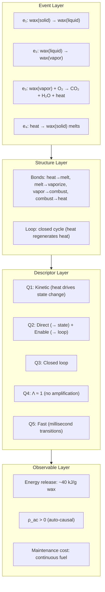
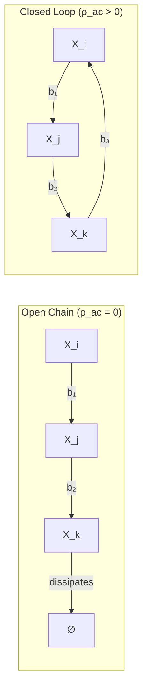

> **In plain English:** The periodic table tells you what atoms are made of. This document asks the same question one level more general: what are *entities* made of — not just atoms, but any persistent thing? The answer: **bonds** (recurring causal connections) and **loops** (closed cycles of bonds that sustain themselves). Five structural questions — energy mode, output target, topology, leverage, and timescale — characterize any bond or loop. From these, you can predict what kind of entity it is. A flame, a cell, an institution — all are specific configurations of bonds and loops. The labels come last; the structure comes first.

---

## The Periodic Table Problem

[Part 1](./01_generalized_mechanics.md) defined the grammar of Epimechanics — how state $X$, force $F$, energy $W$, and coupling $T^i{}_j$ relate. Two quantities emerged: **generalized mass** $\mathcal{M}$ (total causal content) and **auto-causal density** $\rho_{\text{ac}}$ (the self-sustaining fraction). The grammar works — you can model institutional inertia, belief persistence, metabolic dynamics. But $\mathcal{M}$ and $\rho_{\text{ac}}$ are still black boxes. What are they made of?

Chemistry had $F = ma$ for two centuries before understanding what mass is made of. Epimechanics needs the same thing: the elements — the finite set of structural primitives that combine to produce the diversity of entities.

This document provides those elements: **bonds** and **loops**. Together, we call them **causors** — the causal structure primitives characterized by their position in Q1–Q5 parameter space. The causor framework is the vocabulary for reading what kind of entity you're looking at from its structural coordinates.

---

## Where This Fits: The Four-Layer Architecture

Epimechanics has a four-layer architecture. This document covers the **Structure Layer** and **Descriptor Layer**:

```
┌─────────────────────────────────────────────────────────────┐
│  OBSERVABLE LAYER — Derived quantities                      │
│  Energy, mass, force, temperature                           │
│  (Valid where symmetries hold)                              │
│  → Part 1: Generalized Mechanics                            │
├─────────────────────────────────────────────────────────────┤
│  DESCRIPTOR LAYER — Structural questions (Q1–Q5)            │
│  Energy mode, output target, topology, leverage, timescale  │
│  → This document (Section 3)                                │
├─────────────────────────────────────────────────────────────┤
│  STRUCTURE LAYER — Structural primitives                    │
│  Bonds, Loops                                               │
│  → This document (Section 2)                                │
├─────────────────────────────────────────────────────────────┤
│  EVENT LAYER — The primitive                                │
│  Causal events, cause-plex                                  │
│  → Part 0b: The Event Layer                                 │
└─────────────────────────────────────────────────────────────┘
```

The **Event Layer** ([Part 0b](./00b_event_layer.md)) defines the primitive: causal events and the cause-plex. This document builds on that foundation, showing how bonds and loops emerge as patterns in the cause-plex, and how the Q1–Q5 descriptors characterize them.

---

## 0. Worked Example: A Candle Flame Through All Four Layers

Before the formal definitions, here is a single system — a candle flame — described at each layer. This is what the architecture looks like in practice:



| Layer | Flame Description |
|-------|-------------------|
| **Event Layer** | Four causal events: melting, vaporization, combustion, heat transfer. Each is a state transition $e: \mathcal{S}_i \to \mathcal{S}_j$ with no energy assumed — just "this configuration follows from that one." |
| **Structure Layer** | The four events form bonds (recurring causal patterns). The bonds compose into a **closed loop**: combustion produces heat, heat melts wax, melted wax vaporizes, vapor combusts. The loop regenerates its own conditions. |
| **Descriptor Layer** | Q1: Kinetic (energy drives motion, not storage). Q2: Direct (bonds target state variables) + Enable (heat bond maintains the loop). Q3: Closed. Q4: Λ ≈ 1. Q5: Fast relative to observation timescale. |
| **Observable Layer** | Energy release ~40 kJ/g. Auto-causal density $\rho_{\text{ac}} > 0$ (the loop sustains itself). Maintenance cost > 0 (requires continuous wax input). Temperature, luminosity, and combustion rate are all Observable Layer quantities derived from the underlying structure. |

The flame is a **dissipative auto-causal entity**: it sustains itself by continuously processing fuel through a closed causal loop. Remove the fuel (wax), and the loop breaks — the flame goes out. The Observable Layer quantities (energy, temperature) are derived; the Structure Layer topology (closed loop) is what makes it auto-causal.

> **Note:** This four-event decomposition makes heat transfer explicit. The three-event version in [Part 0b](./00b_event_layer.md) collapses the heat→melt step to illustrate causal disconnection (P2). Both decompositions are valid at different granularities.

---

## 1. The Foundation: Events and the Cause-Plex

> This section summarizes the Event Layer. For the full treatment, see [Part 0b: The Event Layer](./00b_event_layer.md).

The primitive is the **causal event** — a state transition:

$$e: \mathcal{S}_i \to \mathcal{S}_j$$

The **cause-plex** $\mathcal{C} = (E, \prec)$ is the hypergraph of all causal events with their partial ordering. From the cause-plex's structure, spacetime, energy, and quantum mechanics emerge. Energy is not primitive — it is the conserved quantity that appears when the cause-plex has time-translation symmetry (Noether's theorem).

At scales where time-translation symmetry holds — which includes most of biology, economics, and social systems — "energy" is the right description. The Structure Layer builds on this: bonds and loops are patterns in the cause-plex that, at Observable Layer, appear as energy exchanges.

---

## 2. Structure Layer: Bonds and Loops

### 2.1 The Bond Operator

A **bond** is a recurring pattern of causal events: a persistent causal connection between state variables, where changes in $X_i$ reliably produce changes in $X_j$.

$$b: X_i \rightrightarrows X_j$$

The double arrow indicates: reliable, repeated, not one-off.

At the Observable Layer (where energy is defined), bonds appear as energy exchanges. At the Event Layer, a bond is a cluster of causal events with a stable statistical structure — the same transition pattern fires reliably across different instances.

**Bond properties:**

| Property | Symbol | Meaning |
|----------|--------|---------|
| Direction | $i \to j$ | Asymmetric in general |
| Strength | $\sigma_b$ | Resistance to dissolution |
| Latency | $\tau_b$ | Time between input and output |
| Reliability | $r_b \in [0,1]$ | Probability the pattern fires when activated (see §10: candidate for Q6) |

Bond strength $\sigma_b$ has two equivalent descriptions:
- **Observable Layer:** The energy required to break the bond
- **Event Layer:** The count of alternative causal sequences required to dissolve the pattern

**Why these are equivalent:** Energy, at the Event Layer, *is* the count of causal events (see [Part 0b](./00b_event_layer.md): time is event count × τ_min, and energy is the Noether charge conjugate to time-translation). Breaking a bond means redirecting causal flow — forcing the system through alternative sequences rather than the established pattern. The energy required to break the bond equals the "causal work" of establishing those alternative paths. This is not a metaphor; it is the same quantity measured two ways.

### 2.2 The Loop Operator

A **loop** is a closed composition of bonds — a causal cycle where the output of the last bond feeds back to the input of the first:

$$\mathcal{L}: X_i \rightrightarrows X_j \rightrightarrows \cdots \rightrightarrows X_i$$

(Each $\rightrightarrows$ denotes a bond, not a single causal event.)



Loops are the **minimal structure for auto-causality**. Individual bonds cannot be auto-causal ($\rho_{\text{ac}} = 0$ for any single bond). The closed loop is the first level at which $\rho_{\text{ac}} > 0$ can appear — the first level at which the cause-plex regenerates conditions for its own continuation.

**Auto-causal does not mean self-contained.** The Krebs cycle regenerates a key intermediate molecule (oxaloacetate) while requiring continuous fuel input (acetyl-CoA) and exporting waste (CO₂, electrons). Cut the input, the loop stops. Auto-causality is about loop regeneration, not independence from environment.

---

## 3. Descriptor Layer: The Five Structural Questions

Every bond and loop forces five structural questions. These are continuous parameters, not binary categories. Together they characterize any causal structure.

### Q1: Energy Mode

*Where does received energy go?*

$$\text{mode}(b) \in [\text{kinetic},\ \text{potential}]$$

| Mode | Effect | Example |
|------|--------|---------|
| **Kinetic** | Increases state velocity $\dot{X}$ | Heat flow, kinetic impact |
| **Potential** | Stored in configuration | Chemical bond, compressed spring |

What we commonly call "structural bonds" are potential-mode bonds. Kinetic-mode bonds drive state change; potential-mode bonds resist it.

### Q2: Output Target

*What does the bond connect to?*

| Target | Role | Effect |
|--------|------|--------|
| State variable $X_j$ | Direct | State changes at output |
| Another bond $b'$ | Gating | Small event triggers large event |
| A loop $\mathcal{L}$ | Enable | Maintains a transducer's existence |

**Gating** is what "signal" describes at Observable Layer: a small bond cluster whose output triggers a much larger cluster from local reserves. Leverage ratio $\Lambda = \mathcal{P}_{\text{out}} / \mathcal{P}_{\text{in}} \gg 1$.

**Enable** is a bond whose output maintains a loop's existence — keeps a *transducer* alive. A transducer is an entity whose primary function is converting inputs of one type into outputs of another type (food → motion, light → signal, money → goods). At the Observable Layer: food → organism metabolism.

### Q3: Topology

*Open or closed?*

$$\text{topology} \in [\text{open chain},\ \text{closed loop}]$$

Open chains propagate and dissipate. Closed loops can regenerate. $\rho_{\text{ac}} > 0$ is a topological property of the cause-plex structure.

### Q4: Leverage Ratio

*How much amplification?*

$$\Lambda = \frac{\text{output event cluster size}}{\text{input event cluster size}}$$

**What bounds a cluster?** An event cluster is the set of causal events triggered by an input within a specified causal horizon — typically one loop period or one bond latency. The boundary is set by the timescale of interest: for a synapse, the cluster is all events between neurotransmitter release and postsynaptic potential; for a gene regulatory bond, the cluster is all events between transcription factor binding and protein production. The cluster is operationally defined by the bond's characteristic timescale $\tau_b$.

| Value | Type | Meaning |
|-------|------|---------|
| $\Lambda \approx 1$ | Symmetric | Output matches input |
| $\Lambda \gg 1$ | Gating | Small input, large output from reservoir |
| $\Lambda \ll 1$ | Lossy | Most input dissipates before output |

### Q5: Timescale

*How fast relative to the loop period?*

Every bond has latency $\tau_b$. In a loop, the ratio of bond latencies determines role:
- **Fast** ($\tau_b \ll T_{\text{loop}}$): Regulator — responds quickly to perturbations
- **Slow** ($\tau_b \sim T_{\text{loop}}$): Structural — sets the loop's characteristic timescale

Q5 is derived from Event Layer structure: it is the count of causal events per reference loop cycle, projected onto a reference clock.

---

## 4. From Structure to Entity Types

Stable configurations cluster at recognizable poles in the Q1–Q5 parameter space. These are the entity types we observe:

| Q1 | Q2 | Q3 | Q4 | Q5 | Entity Type | $\rho_{\text{ac}}$ | Example |
|----|----|----|----|----|----|----|-----|
| Kinetic | State | Open | ~1 | — | Dissipative process | 0 | Heat flow |
| Potential | State | Open | ~1 | — | Structural configuration | 0 | Crystal lattice |
| Kinetic | State | Closed | ~1 | Fast | Dissipative auto-causal | >0 | Flame |
| Both | Loop | Closed | ~1 | Mixed | Self-maintaining entity | >0 | Cell |
| Both | Bond+Loop | Closed | ≫1 | Fast reg. | Adaptive entity | >0 | Nervous system |
| Both | Loop-of-loops | Closed | ≫1 | Slow struct. | Meta-entity | >0 | Organism, institution |

Each row is a region in a continuous parameter space. Real entities are intermediate and have mixed subsystems.

> **Loops-of-loops example:** A cell has two core loops: (1) **metabolism** — the Krebs cycle and related pathways that regenerate ATP, and (2) **replication** — DNA copying, protein synthesis, and cell division that reproduce the metabolic machinery. Neither loop alone is an organism. The organism emerges when these loops are coupled: metabolism provides the energy and materials for replication; replication produces new copies of the metabolic machinery. This coupling forms a **loop-of-loops** — a higher-order structure where each component loop enables the other. Institutions have the same architecture: a company's operations loop (producing goods) and its HR loop (reproducing skilled workers) are coupled into a meta-entity that persists beyond any individual employee or product.

> **What Q1–Q5 tell you together:** These five descriptors let you read a bond or loop and predict what kind of entity it belongs to — without invoking labels like "organism" or "institution." A bond that stores energy (Q1: potential), gates a larger cluster (Q2: gating), sits in a closed loop (Q3: closed), has high leverage (Q4: Λ ≫ 1), and fires slowly relative to the loop (Q5: slow) is behaving like a metabolic regulation step. A bond that dissipates energy (Q1: kinetic), connects directly to state (Q2: direct), is open-ended (Q3: open), and is low-leverage (Q4: Λ ≈ 1) is behaving like heat flow. The labels are summaries of structural configurations. The structure comes first.

---

## 5. Self-Containment Is a Spectrum

Self-containment is not binary. It is tied to the ratio of bond dissolution energy to thermal fluctuation energy:

| Entity Class | $\sigma_b / k_BT$ | $C_{\text{maint}}$ | Stable? |
|--------------|-------------------|--------------------| --------|
| Protons | ~10³⁷ | ~0 | Yes (confinement) |
| Simple atoms | ~10⁵ | ~0 | Yes |
| Small molecules | ~10⁴ | ~0 | Yes |
| Complex molecules (proteins) | ~10²–10³ | Low | Degradable |
| Viral capsids | ~10¹–10² | ~0 | Yes (no active repair) |
| Organelles | Variable | Low | Requires host metabolism |
| Minimal cells (*Mycoplasma*) | Variable | Positive | Requires repair (~500 genes) |
| Cells | Variable | Positive | Requires repair |
| Meta-entities (institutions) | Variable | Positive | Requires renewal |

At the top, entities are unconditionally stable — no maintenance needed. At the bottom, maintenance and auto-causality are what prevent dissolution. The interesting regime for epimechanics is where $\sigma_b / k_BT$ is low enough that bonds degrade measurably, and loops are required to maintain structure.

---

## 6. Derived Quantities

At the Observable Layer, structural primitives aggregate into familiar quantities:

| Quantity | Proposed definition† | Meaning |
|----------|---------------------|---------|
| **Generalized mass** $\mathcal{M}$ | $\sum_{\text{bonds}} \sigma_b$ | Total causal content |
| **Auto-causal density** $\rho_{\text{ac}}$ | Loop closure fraction | Self-sustaining fraction |
| **Maintenance cost** $C_{\text{maint}}$ | $\dot{S}_{\text{int}} - \dot{R}_{\text{repair}}$ | Net entropy rate |
| **Robustness** | $\Delta V / \langle\text{perturbation}\rangle$ | Basin depth vs. typical shocks |
| **Causal power** $\mathcal{P}$ | $\mathbf{F} \cdot \mathbf{v}$ | Rate of work on trajectories |

These are the Observable Layer quantities that [Part 1](./01_generalized_mechanics.md) defines. This document grounds them: $\mathcal{M}$ is the sum of bond strengths; $\rho_{\text{ac}}$ emerges from loop topology.

> †**Why these aggregations?** $\mathcal{M} = \sum \sigma_b$ follows from the definition of generalized mass as total causal content: each bond contributes its strength (resistance to dissolution) to the entity's total inertia. This is not a metaphor — it is the same logic by which physical mass equals the sum of constituent particle masses. The domain-specific question is not *whether* this aggregation holds, but *how to measure* $\sigma_b$ in each domain (bond dissociation energy in chemistry, switching cost in economics, belief revision difficulty in cognition). The grammar is universal; the measurement is domain-specific.

> **Dimensional analysis:** In the mechanical grammar, $p = \mathcal{M}\dot{X}$, so $[\mathcal{M}] = [p]/[\dot{X}]$. For physical systems where $X$ has dimensions of length, this gives $[\mathcal{M}] = \text{mass}$. For abstract state spaces (beliefs, market positions), $X$ is dimensionless or has domain-specific units, and $\mathcal{M}$ inherits corresponding dimensions. The key constraint: $\sigma_b$ must have the same dimensions as $\mathcal{M}$ for the sum to be meaningful. In chemistry, $\sigma_b$ is bond dissociation energy (Joules); $\mathcal{M}$ then has dimensions of energy, and the Lagrangian $L = \frac{1}{2}\mathcal{M}|\dot{X}|^2 - V$ requires $\dot{X}$ to be dimensionless (a rate of change in a normalized state space). This is the standard physics case with a change of variables.

---

## 7. Causal Attack Surface

High $\rho_{\text{ac}}$ has a dual character. The same loops that sustain an entity become amplification engines if a keystone bond is perturbed. Define:

$$\rho_{\text{attack}}(\partial E) = \sum_{b \in \partial E} \kappa_b \cdot \rho_{\text{ac}}(\mathcal{L}_b)$$

where:
- $\partial E$ is the **entity boundary** — the set of bonds that connect the entity's internal loops to the external environment. Operationally: bonds whose inputs come from outside the entity or whose outputs go outside. For a cell, $\partial E$ includes membrane transport proteins; for an institution, $\partial E$ includes customer-facing processes and supply chain bonds.
- $\mathcal{L}_b$ is the loop containing bond $b$ (if $b$ participates in multiple loops, sum over all)
- $\kappa_b = \Delta\rho_{\text{ac}} / \Delta\sigma_b$ is the **keystone index** — how much the system's auto-causal density depends on this particular bond

A mutation in a tumor suppressor gene has extreme $\rho_{\text{attack}}$: high $\kappa_b$ (failure cascades) and maximum $\rho_{\text{ac}}$ in the replication loop (the entity's own division copies the error). The entity's auto-causal power becomes the propagation mechanism for its own dissolution.

---

## 8. Connections

### Assembly Theory

[Assembly theory](https://doi.org/10.1038/s41586-023-06600-9) (Cronin & Walker 2023) counts the minimum bond-formation operations to construct an object — the assembly index. The causor framework extends this:

1. **Typed bonds.** Assembly index counts undifferentiated operations; Q1–Q5 track bond structure
2. **Construction to maintenance.** Assembly index measures build complexity; $C_{\text{maint}}$ measures keep complexity
3. **Static to dynamic.** Assembly index is a snapshot; the cause-plex tracks evolution, degradation, repair

### Representational Efficiency

The right description level is where state variables correspond to natural clusters of bonds with stable dynamics. This is coarse-graining: identify mesoscale structures (phonons, metabolic cycles, institutional processes) that capture behavior more efficiently than tracking individual events. The cause-plex provides the substrate; the [Representational Efficiency principle](./05_ontology_and_open_questions.md) selects the right level.

---

## 9. Summary

| Concept | Definition |
|---------|------------|
| **Bond** | Recurring causal pattern connecting state variables |
| **Loop** | Closed composition of bonds; minimal auto-causal structure |
| **Q1: Energy mode** | Kinetic (drives change) vs. potential (resists change) |
| **Q2: Output target** | State, bond (gating), or loop (enable) |
| **Q3: Topology** | Open chain vs. closed loop |
| **Q4: Leverage** | Output/input ratio |
| **Q5: Timescale** | Fast (regulator) vs. slow (structural) |
| **Entity type** | Position in Q1–Q5 parameter space |

The periodic table of chemistry gives you elements. The causor framework gives you structural primitives. From bonds and loops characterized by Q1–Q5, you can derive what kind of entity you're looking at — without assuming labels.

---

## 10. Open Questions

**Q1: Are Q1–Q5 complete?** Can every distinction between causal structures be captured by position in the Q1–Q5 parameter space? Candidate additional dimensions: spatial locality, stochasticity (related to bond reliability $r_b$), thermodynamic reversibility.

**Q2: CI and stability.** High complexity may correlate with deep stability basins — but need not (fragile complexity). What is the formal relationship between construction complexity and thermodynamic stability?

**Q3: Derivation of the Lagrangian.** Part 1 postulates the Lagrangian $L = \frac{1}{2}\mathcal{M}|\dot{X}|^2 - V(X)$ on physical grounds. If $\mathcal{M}$ is composed of bonds and $V(X)$ is determined by basin structure, can the quadratic kinetic term be derived from cause-plex structure rather than assumed?

---

[← Part 0b: The Event Layer](./00b_event_layer.md) | [← Part 1: Generalized Mechanics](./01_generalized_mechanics.md) | [→ Part 1b: Uncertainty, Coordinates, and Relativity](./01b_uncertainty_coordinates_relativity.md) | [→ Part 2: Meta-Entities](./02_meta_entities.md)
