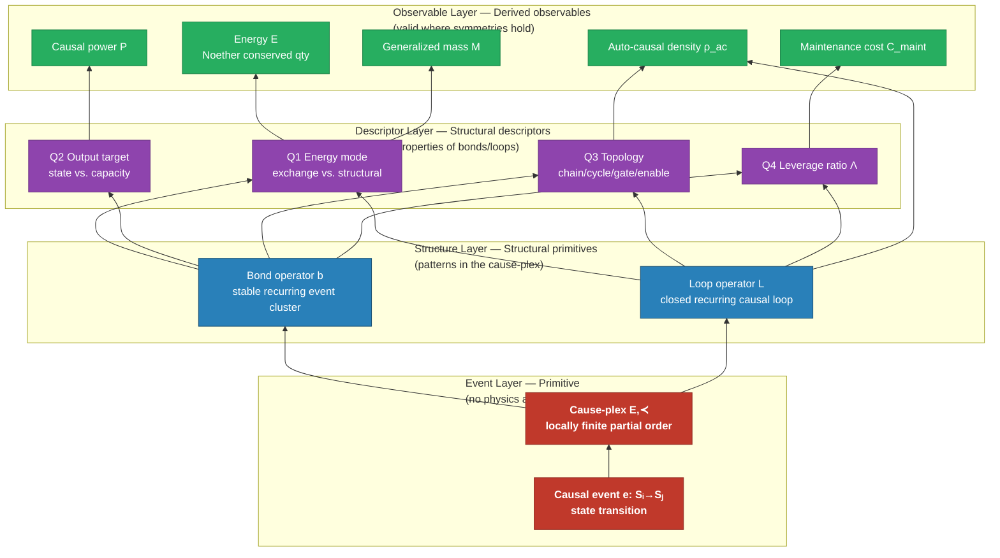

> **In plain English:** The periodic table tells you what atoms are made of. This paper asks the same question one level more fundamental: what are *entities* made of — not just atoms, but any persistent thing, from a cell to a corporation to a particle? The answer is causal loops: patterns of cause-and-effect that return to their starting state and sustain themselves. A flame, a cell, a bond, a galaxy — all are causal loops at different scales with different stability properties. Energy, mass, and force aren't primitive — they emerge from the symmetry structure of these loops. This is the "periodic table" of epimechanics: a taxonomy of what stable things are made of, derived from causal structure alone.

## Where We Are

[Part 1](./01_generalized_mechanics.md) defined the grammar of Epimechanics — how state $X$, force $F$, energy $W$, and coupling $T^i{}_j$ relate. Two quantities emerged: **generalized mass** $\mathcal{M}$ (total causal content) and **auto-causal density** $\rho_{\text{ac}}$ (the self-sustaining fraction). The grammar works — you can model institutional inertia, belief persistence, metabolic dynamics. But $\mathcal{M}$ and $\rho_{\text{ac}}$ are still black boxes. What are they made of?

This is the periodic table problem. Chemistry had $F = ma$ for two centuries before understanding what mass is made of. Epimechanics is at the same stage. We need the elements — the finite set of structural primitives that combine to produce the diversity of entities.

---

## Label Discipline

A standing warning that applies throughout this document:

**Qualitative labels are derived outputs, not inputs.** Terms like "robust," "fragile," "self-maintaining," "startup," or "institution" summarize structural configurations. They have no independent explanatory content. Using them in explanation position is circular.

The correct direction:
$$\text{structural configuration} \xrightarrow{\text{causor analysis}} \text{predicted properties} \xrightarrow{\text{summary}} \text{label}$$

When a label appears as an example, it is a pointer to a structural configuration — the reader should ask what specific bond structure and topology the label summarizes.

---

## The Foundational Problem: Energy Is Not Primitive

> **Coming from Part 1?** Part 1 used energy, mass, and force as well-defined quantities — as they are, at the scales where the framework is applied. This document goes one level deeper and asks: *where do those quantities come from?* The answer doesn't undermine Part 1's framework; it grounds it. Energy is still the right quantity to use at Observable Layer. This document explains why, and what sits beneath it.

Energy is not primitive. It falls out of **Noether's theorem**: if the cause-plex has time-translation symmetry in some region, there exists a conserved quantity — we call it energy. Energy has units (J = kg·m²/s²) that are themselves derived from reference causal events (atomic clock, reference mass, speed of light). In Wolfram's ruliad, energy, momentum, and charge all *emerge* from symmetries of the abstract hypergraph update structure. No physical quantity is assumed at the primitive level.

The same must be true here for the framework to be genuinely foundational. Starting with "energy exchange" as the primitive assumes conservation, units, and thermodynamics before deriving them. That is a coarse-graining — valid and useful at biological and institutional scales, but not the foundation.

---

## The True Primitive: The Causal Event

> **Concrete anchor before the formalism:** A candle flame. The heat from the burning wax vaporizes more wax, which feeds the flame, which produces more heat. Each step is a state transition: one configuration of molecules produces the next. No energy concept is needed to describe this chain — just "this state follows from that one." The cause-plex is nothing more than all such "follows from" relationships in the universe, assembled into a single structure. Every concept below — bonds, loops, auto-causal density, energy — emerges from patterns in that structure.

The primitive is the **causal event** (also: *state couplet*) $e$:

$$e: \mathcal{S}_i \to \mathcal{S}_j$$

A state transition — one configuration follows from another. No energy assumed. No units. Just the "follows from" relation between states.

The **cause-plex** $\mathcal{C}$ is the hypergraph of all causal events with their partial ordering:

$$\mathcal{C} = (E, \prec)$$

where $E$ is the set of causal events and $\prec$ is the "precedes" relation (strict partial order, no cycles at the event level).

This is the same structure as Wolfram's ruliad, restricted to the specific hypergraph realized by the physical world. The cause-plex carries no physics by assumption — physics emerges from its symmetry structure.

### Three Properties

The cause-plex has three structural properties that together generate the physics we observe:

**P1: Causal partial ordering.** Already encoded in $(E, \prec)$. No event precedes itself. If $e_1 \prec e_2$ and $e_2 \prec e_3$ then $e_1 \prec e_3$.

**P2: Causal invariance.** Spacelike-separated events — those with no causal path between them — commute. Applying $e_1$ then $e_2$ produces the same state as $e_2$ then $e_1$ when $e_1 \perp e_2$. (Open problem: does this follow from P1 alone, or require additional structure? See [Cause-Plex and Spacetime](./causeplex_spacetime.md).)

**P3: Finite minimum event latency.** Every causal event has a latency $\tau_e \geq \tau_{\min} > 0$. This defines a maximum propagation rate, which becomes $c$ in the continuum limit.

Given P1-P3, the Lorentzian metric and Lorentz invariance emerge in the continuum limit — spacetime is a description of cause-plex structure, not its container.

---

## Energy as Emergent Conserved Quantity

From the symmetries of the cause-plex:

| Cause-plex symmetry | Conserved quantity (Noether) | Name |
|---|---|---|
| Time-translation invariance | $\sum_i p_i \dot{q}_i - L$ | Energy |
| Spatial translation invariance | $\sum_i m_i \dot{q}_i$ | Momentum |
| Rotational invariance | $\sum_i r_i \times p_i$ | Angular momentum |
| U(1) gauge symmetry | $\sum_i q_i$ | Charge |

**Energy is what we call the conserved quantity when the cause-plex has time-translation symmetry.** In regions where this symmetry holds (most of everyday physics), energy is well-defined and conserved. In regions where it is broken (strongly non-equilibrium, rapidly evolving, or symmetry-breaking systems), energy is not a clean quantity — and the framework must work at the causal event level directly.

**Units emerge from reference events.** The second is defined by counting Cs-133 hyperfine transitions (9,192,631,770 per second by definition). The meter falls out from the second and $c$. The kilogram falls out from Planck's constant, the second, and the meter. All units are ratios of cause-plex path counts to reference cause-plex path counts. No unit is assumed.

---

## The Four-Layer Architecture

*Read bottom-up: each layer is built from the one below. Observable Layer quantities (energy, mass) are only valid where the appropriate symmetries hold.*

| Layer | Content | What it is |
|---|---|---|
| **Event Layer** | Causal event $e: \mathcal{S}_i \to \mathcal{S}_j$ | The primitive — no physics assumed |
| **Structure Layer** | Bond $b$, Loop $\mathcal{L}$ | Structural patterns in the cause-plex |
| **Descriptor Layer** | Descriptors: mode, target, topology, leverage, timescale | Properties of Structure Layer structures |
| **Observable Layer** | Derived quantities: $\mathcal{M}$, $\rho_{\text{ac}}$, $C_{\text{maint}}$, $\mathcal{P}$, energy | Observables computed from Structure + Descriptor layers in context |

The key insight: **energy lives at Observable Layer, not Event Layer**. It is a derived quantity valid where time-translation symmetry holds — a coarse-grained description of patterns in the underlying causal event structure. At biological and institutional scales, time-translation symmetry holds well enough that "energy exchange" is the right description of bonds. At the Planck scale or in strongly non-equilibrium systems, it may not be.

---

## Structure Layer: Structural Patterns in the Cause-Plex

### A1. The Bond Operator ($b$)

A **bond** is a recurring pattern of causal events: a persistent causal connection between state variables, where changes in $X_i$ reliably produce changes in $X_j$.

$$b: X_i \rightrightarrows X_j$$

(double arrow: reliable, repeated, not one-off)

At Observable Layer, where time-translation symmetry holds, bonds are described as energy exchanges. At Event Layer, a bond is a cluster of causal events with a stable statistical structure — the same transition pattern fires reliably across different instances. Bond strength $\sigma_b$ at Observable Layer is the energy (conserved quantity) associated with breaking this pattern; at Event Layer, it is the count of alternative causal event sequences required to dissolve the cluster.

A bond has four Descriptor Layer descriptors:
- **Direction** $i \to j$: asymmetric in general
- **Strength** $\sigma_b$: resistance to dissolution (energy at Observable Layer; event count at Event Layer)
- **Latency** $\tau_b$: time between input and output events
- **Reliability** $r_b \in [0,1]$: probability the pattern fires when activated

### A2. The Loop Operator ($\mathcal{L}$)

A **loop** is a closed composition of bonds — a causal cycle where the output of the last bond feeds back to the input of the first.

$$\mathcal{L}: X_i \to X_j \to \cdots \to X_i$$

Loops are the minimal structure for auto-causality: the first level at which $\rho_{\text{ac}} > 0$ can appear. Individual bonds cannot be auto-causal; loops can be.

---

## Descriptor Layer: Structural Questions

Every bond and loop composition necessarily forces five structural questions. These are continuous parameters, not binary categories.

### Q1: Energy Mode (where does received quantity go?)

In regions where energy is defined (time-translation symmetry holds):

$$\text{mode}(b) \in [\text{kinetic},\ \text{potential}]$$

- **Kinetic:** received energy increases state velocity ($\dot{X}$ increases)
- **Potential:** received energy is stored in configuration (increases $\Delta V$)

What we commonly call "structural bonds" are potential-mode bonds. Kinetic-mode bonds drive state change; potential-mode bonds resist it.

> [!sidenote]
> **Energy accessibility is relational.** Uranium stores energy in nuclear bonds. For a cell, no bond chain connects uranium to the cell's causal structure — the energy is inaccessible. For a nuclear plant, a full bond chain exists. The energy content of matter is the same; what differs is whether the cause-plex connecting it to the entity exists. "Potential potential energy" is the name for energy stored in matter that requires intermediate entities (transducer chains) to access.

### Q2: Output Target (what does the bond output connect to?)

| Target | Role | Effect |
|---|---|---|
| State variable $X_j$ directly | Direct | State changes at output |
| Another bond $b'$ | Gating | Small event cluster releases large event cluster |
| A loop $\mathcal{L}$ | Enable | Transducer entity continues to exist |

**Gating** is what "signal" describes at Observable Layer: a small bond cluster whose output triggers a much larger bond cluster from local reserves. Leverage ratio $\Lambda = \mathcal{P}_{\text{out}} / \mathcal{P}_{\text{in}} \gg 1$. At Event Layer: a small event cluster changes the state of another cluster's input, enabling events that wouldn't otherwise fire.

**Enable** is a bond whose output maintains a loop's existence — keeps the transducer entity alive so its exchange capacity persists. At Observable Layer this looks like food → organism metabolism. At Event Layer it is: event clusters that sustain the conditions required for another cluster to keep firing.

> [!sidenote]
> **"Information" is not primitive.** Information transfer is always implemented by a gating composition — a small event cluster directing a large one. Shannon entropy is a description of probability distributions over causal states. It is an Observable Layer observable: a summary of gating structure from an observer's perspective. Making it primitive creates circular definitions.

### Q3: Topology (open or closed?)

$$\text{topology} \in [\text{open chain},\ \text{closed loop}]$$

Open chains propagate and dissipate. Closed loops can regenerate — $\rho_{\text{ac}} > 0$ is a topological property of the cause-plex, not a property of individual bonds.

### Q4: Leverage Ratio

$$\Lambda = \frac{\text{output event cluster size}}{\text{input event cluster size}}$$

- $\Lambda \approx 1$: symmetric — output matches input
- $\Lambda \gg 1$: gating — small input, large output from reservoir
- $\Lambda \ll 1$: lossy — most input dissipates before output

### Q5: Timescale Structure

Every bond has latency $\tau_b$. In a loop, the ratio of bond latencies determines whether components are regulators (fast, $\tau_b$ small relative to loop period) or structural features (slow, $\tau_b$ comparable to loop period).

**Q5 is derived, not independent.** Timescale is the count of causal events per reference loop cycle — a ratio of cause-plex path counts. At Event Layer, there is no external time; there are only relative event counts. Q5 is the observer-relative projection of that count ratio onto a reference clock. The Q1-Q4 structure of the cause-plex determines which event clusters fire and how they depend on each other; Q5 describes how that structure is distributed relative to a reference oscillation.

See [Cause-Plex and Spacetime](./causeplex_spacetime.md) for the full treatment.

> **What Q1–Q5 tell you together:** These five descriptors let you read a bond or loop and predict what kind of entity it belongs to — without invoking labels like "organism" or "institution." A bond that stores energy (Q1: potential), gates a larger cluster (Q2: gating), sits in a closed loop (Q3: closed), has high leverage (Q4: Λ ≫ 1), and fires on a timescale comparable to the loop period (Q5: slow) is behaving like a metabolic regulation step. A bond that dissipates energy (Q1: kinetic), connects directly to state (Q2: direct), is open-ended (Q3: open), and is low-leverage (Q4: Λ ≈ 1) is behaving like heat flow. The labels come last; the structural description comes first.

---

## The Cause-Plex and the Composition Hierarchy

A **cause-plex** $\mathcal{C}_n$ of order $n$ is a subgraph of the causal hypergraph assembled from $n$ bond operations on a set of primitive states. The cause-plex index CI($\mathcal{C}$) is the minimum number of bond operations required to construct $\mathcal{C}$ from primitive states.

This extends assembly theory (Cronin & Walker, 2023): assembly theory counts undifferentiated bond-formation operations. The cause-plex tracks bond structure (Q1-Q4) and derives which entity types are possible from that structure.

### From Cause-Plex Structure to Entity Types

Stable cause-plex configurations cluster at recognizable poles. These are the entity types we observe:

| Q1 mode | Q2 target | Q3 topology | Q4 $\Lambda$ | Entity type | $\rho_{\text{ac}}$ | $C_{\text{maint}}$ |
|---|---|---|---|---|---|---|
| Kinetic | State | Open | ~1 | Dissipative process (heat flow) | 0 | 0 (while input continues) |
| Potential | State | Open | ~1 | Structural configuration (crystal lattice) | 0 | ~0 |
| Kinetic | State | Closed | ~1 | Dissipative auto-causal (flame) | >0 | Positive (requires fuel) |
| Both | Loop | Closed | ~1 | Self-maintaining entity (cell) | >0 | Low (repair > entropy) |
| Both | Bond+Loop | Closed | ≫1 | Adaptive entity (nervous system) | >0 | Low + adaptive |
| Both | Loop-of-loops | Closed | ≫1 | Meta-entity (organism, institution) | >0 | Positive |

Each row is a region in a continuous parameter space. Real entities are intermediate and have mixed subsystems across Q1-Q4.

### Self-Containment: The Correct Hierarchy

Self-containment is not binary. It is a spectrum tied to the ratio of bond dissolution energy to available thermal fluctuation energy ($\sigma_b / k_BT$):

| Entity class | $\sigma_b / k_BT$ | $C_{\text{maint}}$ | Operationally stable? | Notes |
|---|---|---|---|---|
| Electrons, photons | N/A (point-like in SM) | 0 | Yes | No sub-structure in Standard Model |
| Protons | QCD confinement ~938 MeV / $k_BT$ ≈ 10³⁷ at 300K | ~0 | Yes | Real sub-bonds (quarks + gluons); confinement makes dissolution effectively impossible at normal conditions |
| Simple atoms | ~13 eV / $k_BT$ ≈ 5×10⁵ | ~0 | Yes | Thermal ionization negligible |
| Small stable molecules | ~1–5 eV / $k_BT$ ≈ 10⁴–10⁵ | ~0 | Yes | Stable at room temperature |
| Complex molecules (proteins, DNA) | ~0.1–1 eV / $k_BT$ ≈ 10²–10³ | Low–moderate | No | Thermal fluctuations cause measurable degradation |
| Auto-causal composites (cell) | Variable; many low-$\sigma_b$ bonds | Positive | No | Repair loops required; $\dot{S}_{\text{int}}$ high |
| Meta-entities (institution, nation) | Variable; bonds between humans | Positive | No | Continuous renewal required |

The framework's interesting regime is where $\sigma_b / k_BT$ is low enough that bonds degrade measurably. At the top of the table, entities are unconditionally stable. At the bottom, maintenance and auto-causality are what keeps them from dissolving. The causor framework is an answer to *why some composites persist despite degradable bonds* — the stable extremes need no explanation.

---

## Observable Layer: Derived Quantities

In regions of the cause-plex where symmetry holds, Event Layer causal events aggregate into familiar physical quantities:

| Derived Quantity | Symmetry / Composition | Meaning |
|---|---|---|
| **Energy** $W$ | Time-translation symmetry (Noether) | Conserved quantity associated with causal event rate |
| **Momentum** $p$ | Spatial translation symmetry (Noether) | Conserved quantity associated with causal event direction |
| **Causal power** $\mathcal{P}$ | $\mathbf{F} \cdot \mathbf{v}$ (force × velocity) | Rate of work on state trajectories |
| **Generalized mass** $\mathcal{M}$ | $\sum_{\text{bonds}} \sigma_b = \int \rho_{\text{causal}} \, d\mu$ | Total causal content; resistance to state change. The sum form discretizes bonds; the integral form treats causal density as continuous. They are equivalent at different granularities. |
| **Auto-causal density** $\rho_{\text{ac}}$ | Emergent from closed loops | Self-sustaining fraction; loop-level, not bond-level |
| **Maintenance cost** $C_{\text{maint}}$ | $\dot{S}_{\text{int}} - \dot{R}_{\text{repair}}$ | Net entropy accumulation rate. Negative when repair outpaces degradation (entity thriving); positive when degradation outpaces repair (entity declining). Survival requires $C_{\text{maint}} \leq 0$. |
| **Robustness** | $\Delta V / \langle\text{perturbation}\rangle$ | Basin depth relative to typical shocks |
| **Causal action** $A_{\text{causal}}$ | $\int_0^T \mathcal{M}_{\text{ac}}(t)\,dt$ | Total self-sustaining structure over lifetime; units J·s |

**Energy accessibility hierarchy.** At Observable Layer, the concept of "potential potential energy" formalizes as cause-plex chain depth: how many transducer entities (enable-role bonds) separate a stored energy source from the entity that could use it. The same matter has different accessible energy depending on whether the transducer chain connecting it to the entity exists. This is relational, not built into matter itself.

---

## The House Problem (Resolved Without Circular Labels)

Consider two houses:

**House A:** Steel-reinforced concrete foundation, engineered timber with redundant load paths, weather-sealed envelope, durable plumbing and electrical systems. Structurally: many high-$\sigma_b$ bonds, redundant topology (no single bond is a keystone), low exposure of bonds to entropy-producing environment (sealed envelope limits thermal cycling and moisture ingress).

**House B:** Unreinforced masonry, single load paths, porous envelope, corrosion-prone materials. Structurally: lower-$\sigma_b$ bonds, single-path topology (several bonds are keystones), high bond exposure to degrading environment.

From the cause-plex structure, Q1-Q4 predict:

| Structural description | $\mathcal{M}$ | $\Delta V$ | $\dot{S}_{\text{int}}$ | $\dot{R}_{\text{repair}}$ | $C_{\text{maint}}$ | Label |
|---|---|---|---|---|---|---|
| High-$\sigma_b$, redundant, sealed | High | Deep | Low | 0 | Low | "Well-built" |
| Low-$\sigma_b$, single-path, porous | Medium | Shallow | High | 0 | High | "Cheap" |

The labels are summaries of the structural descriptions. "Well-built" explains nothing — the structural configuration (bond material + topology + redundancy) explains everything. The counter-intuitive result (more bonds, less maintenance) follows because $\Delta V$ depends on *redundancy* (no keystone bonds), not bond count, and $\dot{S}_{\text{int}}$ depends on bond *exposure*, not bond count.

---

## Auto-Causality: Emergent and Relational

Auto-causality is a loop-level property, not a bond-level property. No individual bond has $\rho_{\text{ac}} > 0$. The closed loop is the minimal unit of self-sustaining causal structure — the first level at which the cause-plex regenerates conditions for its own continuation.

Auto-causal does not mean self-contained. The Krebs cycle regenerates oxaloacetate (auto-causal) but requires acetyl-CoA input and exports CO₂ and electrons. Cut the input, the loop stops. Auto-causality is about loop regeneration, not independence from environment.

The correct framing: **auto-causal loops reduce the entity's dependence on external input for continuation** — but they do not eliminate it. The degree of dependence is measured by $\sigma_{\text{self}}$ (self-sufficiency, introduced in [Part 2.5](./02_5_entity_interaction.md)).

### Causal Attack Surface Density

High $\rho_{\text{ac}}$ has a dual character. The same loops that sustain the entity are amplification engines if a keystone bond is perturbed. Define:

$$\rho_{\text{attack}}(\partial E) = \sum_{b \in \partial E} \kappa_b \cdot \rho_{\text{ac}}(\mathcal{L}_b)$$

where $\kappa_b = \Delta\rho_{\text{ac}} / \Delta\sigma_b$ is the keystone index of bond $b$, and the sum is over accessible boundary bonds. A SNP in a replication gene has extreme $\rho_{\text{attack}}$: high $\kappa_b$ (tumor suppressor failure → cascade) and maximum $\rho_{\text{ac}}$ in the replication loop (the entity's own division copies the error). The entity's auto-causal power becomes the propagation mechanism for its own dissolution.

---

## Connections

### Assembly Theory

Assembly theory (Cronin & Walker, 2023) counts the minimum bond-formation operations to construct an object — the assembly index AI. The cause-plex extends this:

1. **Typed bonds.** AI counts undifferentiated bond operations. CI tracks Q1-Q4 bond structure. Same CI can produce completely different entity types depending on bond mode, target, and topology.
2. **From construction to maintenance.** AI measures build complexity; $C_{\text{maint}}$ measures keep complexity.
3. **From static to dynamic.** AI is a snapshot; the cause-plex tracks how bonds evolve, degrade, and repair.

**Selection criterion:** High-CI objects with $\rho_{\text{ac}} > 0$ require selection *and* sustained causal input — doubly improbable without a generative process. High-CI objects with $\rho_{\text{ac}} = 0$ require selection but not ongoing input (crystals, diamonds).

### Wolfram's Ruliad

The cause-plex is a specific subgraph of the ruliad — the one realized by the physical world. The ruliad derivation works from abstract update rules; the cause-plex derivation works from physical causal events. If causal invariance (P2) follows from the energy exchange primitive that emerges at Observable Layer, the cause-plex derivation is strictly more grounded than the ruliad approach. See [Cause-Plex and Spacetime](./causeplex_spacetime.md).

### Representational Efficiency

The right description level is the one where state variables correspond to natural clusters of bonds with their own stable dynamics. This is coarse-graining: identify the mesoscale structures (phonons, metabolic cycles, institutional processes) that capture behavior more efficiently than tracking individual causal events. The cause-plex provides the substrate; the Representational Efficiency principle selects the right level of description.

---

## Open Questions

### Q1: Does causal invariance (P2) follow from the primitive?

The Lorentzian metric and Lorentz invariance follow from P1-P3. P2 (spacelike-separated events commute) is physically motivated but not yet derived from the causal event primitive alone. This is the central open problem for the full foundational derivation.

### Q2: Does energy conservation follow from cause-plex time-translation symmetry?

Noether's theorem requires a Lagrangian formulation and continuous symmetry. Can this be derived from the discrete cause-plex structure, or does the Lagrangian need to be postulated at the continuum limit?

### Q3: Are Q1-Q4 structurally complete?

The test: can every distinction between bond compositions be captured by position in the Q1-Q4 parameter space? Candidate additional dimensions: spatial locality, stochasticity, thermodynamic reversibility.

### Q4: What is the relationship between CI and stability?

High-CI objects may have deep stability basins — but need not (fragile complexity). Is there a formal relationship between construction complexity and thermodynamic stability?

### Q5: Can the Lagrangian be derived from cause-plex structure?

$L = \frac{1}{2}\mathcal{M}|\dot{X}|^2 - V(X)$ is a structural postulate in Part 1. If $\mathcal{M}$ is composed of bonds and $V(X)$ is determined by basin structure, can the quadratic kinetic energy be derived from the cause-plex rather than postulated?

---

[← Part 1: Generalized Mechanics](./01_generalized_mechanics.md) | [→ Part 2: Meta-Entities](./02_meta_entities.md)
