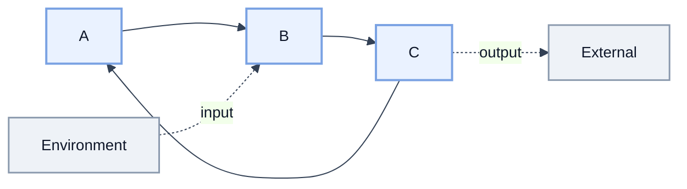
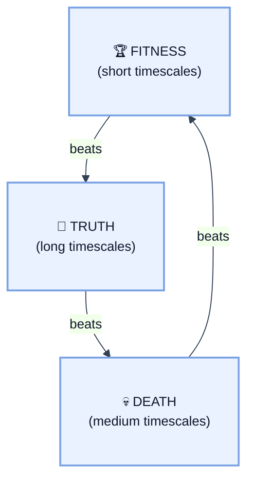
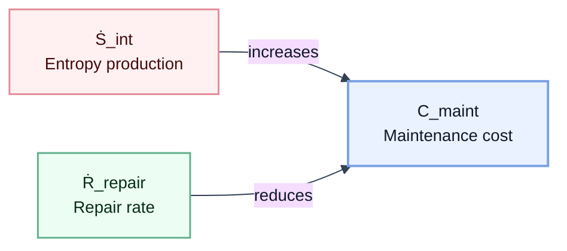

## Where We Are

[Part 1](./01_generalized_mechanics.md) defined the grammar of Epimechanics — how state $X$, force $F$, energy $W$, and coupling $T^i{}_j$ relate to each other. Two key quantities emerged:

**Generalized mass** $\mathcal{M} = \int \rho_{\text{causal}} \, d\mu$ — the total causal density of an entity. This determines resistance to state change: high $\mathcal{M}$ means more force is needed to alter the entity's trajectory. An institution with dense internal processes has high $\mathcal{M}$; a new startup has low $\mathcal{M}$.

**Auto-causal density** $\rho_{\text{ac}}$ — the fraction of causal activity that sustains the entity's own existence. A flame has high $\rho_{\text{ac}}$ (combustion maintains the heat that maintains combustion). A rock has near-zero $\rho_{\text{ac}}$ (nothing about the rock actively maintains itself).

Part 1 showed how these quantities *relate* — force equals mass times acceleration, energy is capacity for state change, coupling determines how strongly entities interact. But it left a question open: what are these quantities *made of*?

---

## The Periodic Table Problem

Physics had $F = ma$ for two centuries before understanding what mass is made of. The equation worked — you could predict trajectories, design bridges, launch projectiles — but mass was a black box. Then came atoms, then subatomic particles, then the Standard Model. Now we know: mass comes from the Higgs field coupling and from binding energy in composite particles.

Epimechanics is at the earlier stage. We have the grammar:

$$F = \mathcal{M}\ddot{X} + \dot{\mathcal{M}}\dot{X}$$

This works — you can describe institutional inertia, belief persistence, market momentum. But $\mathcal{M}$ is still a black box. What is it made of? What determines whether an entity has high or low $\mathcal{M}$? Why do some high-$\mathcal{M}$ entities require constant maintenance while others persist for millennia?

This is the periodic table problem. Chemistry needed a periodic table — a finite set of elements that combine to produce all substances. Epimechanics needs the same: a finite set of **causors** that combine to produce all the quantities the grammar uses.

---

## Causors vs Causal Descriptors

<abbr title="Causor: a higher-order causal mechanism/structure that produces state change (typically implemented by interacting bonds and loops).">Causor</abbr> is the core term in this chapter (see [Glossary](./glossary.md)).

Plainly stated: a **causor** is *that-which-causes* — the mechanism/structure by which a cause produces an effect. This follows the structural-causal distinction between conditions and mechanisms emphasized in modern causal modeling (especially [Pearl, 2009, 2nd ed.](https://doi.org/10.1017/CBO9780511803161)).

In this framework, causal description has three irreducible roles:

$$\text{Cause} \xrightarrow{\text{Causor}} \text{Effect}$$

- **Cause**: antecedent condition/input
- **Causor**: mechanism/operator that produces change
- **Effect**: resulting state/output

We use **causal operator** as the formal mathematical representation of a causor when writing explicit model equations.

**Important distinction:** not every quantity in the model is a causor. Variables such as bond strength, basin depth, entropy production, and repair rate are best treated as **causal descriptors/properties** of underlying causor structures (e.g., loops, operator motifs, and mechanism classes), rather than causors themselves.

## Three-Layer Architecture (Mechanisms, Descriptors, Observables)

To avoid category errors, Part 1.5 uses three layers:

- **Layer A — Causors (mechanisms/operators):** what actually produces state transitions.
- **Layer B — Descriptors (properties/parameters):** how causors are characterized.
- **Layer C — Observables/derived quantities:** what we measure from A+B in context.

| Symbol/Concept | Type |
|---|---|
| $b$, $\mathcal{L}$ | Causor operator (mechanism) |
| $\sigma_b$, $\ell$, $\Delta V$ | Descriptor / parameter |
| $\dot{S}_{\text{int}}$, $\dot{R}_{\text{repair}}$ | Process observables (rate-level descriptors) |
| $\mathcal{M}$, $\rho_{ac}$, $C_{\text{maint}}$ | Derived quantities |

### Layer A: Core causors (mechanism-level)

### A1. Causal Bond Operator ($b$)

A single directed causal connection between two state variables: a change in $X_i$ produces a change in $X_j$. This is a primitive causor in the framework. In [Pearl's framework](https://doi.org/10.1017/CBO9780511803161), it corresponds to a single edge in a causal DAG.

**Examples across domains:**
- **Physical**: an intermolecular force (covalent, ionic, van der Waals)
- **Institutional**: a reporting line, a contractual obligation, a regular meeting
- **Cognitive**: a belief supporting another belief, a memory triggering an emotion

A causal bond has four properties:
- **Direction**: $i \to j$ (asymmetric in general)
- **Strength** $\sigma_b$: the energy required to sever the bond (see below)
- **Latency** $\tau_b$: the time delay between cause and effect
- **Reliability** $r_b \in [0,1]$: the probability that the connection fires when activated

### A2. Loop Operator ($\mathcal{L}$)

A **loop operator** is a closed causal composition that regenerates conditions for its own continuation (directly or indirectly). This is the minimal mechanism-level unit for self-sustaining causation.

- Bond-level causation explains local propagation.
- Loop-level causation explains persistence, self-maintenance, and auto-causality.

### Layer B: Core causal descriptors (property-level)

### 1. Bond Strength ($\sigma_b$)

The energy required to sever a single causal bond. At the physical level, this is measured in Joules — analogous to bond dissociation energy in chemistry.

> [!sidenote]
> Bond strength is a **descriptor** of the bond causor, not a standalone mechanism. It is a major contributor to generalized mass: $\mathcal{M} = \sum_{\text{bonds}} \sigma_b$.

**Examples:**
- **Strong bonds** (hard to break): a covalent bond between carbon atoms (~350 kJ/mol), a deeply ingrained habit, a legal contract
- **Weak bonds** (easy to break): a van der Waals interaction (~1 kJ/mol), a casual acquaintance, a verbal agreement

### 2. Loop Order ($\ell$)

The length of the shortest self-referential causal cycle passing through a given point. A loop of order 1 is direct self-causation ($X_i \to X_i$). A loop of order 2 is $X_i \to X_j \to X_i$. A loop of order $\ell$ passes through $\ell$ intermediate states before returning.

> [!sidenote]
> Loop order is a **descriptor** of loop causors. Shorter loops respond faster to perturbation; longer loops can be more robust if alternative paths exist.

Loop order determines the *character* of auto-causal structure:
- $\ell = 1$: direct self-reinforcement (a thermostat, a habit loop)
- $\ell = 2$: mutual reinforcement (symbiosis, reciprocal trust)
- $\ell \gg 1$: long-range auto-causality (an institution whose budget funds the department that generates the revenue that justifies the budget — many intermediaries)

**Examples across domains:**
- **Physical**: crystal lattice periodicity, molecular ring structures
- **Institutional**: feedback cycles (daily standup = short loop; budget-revenue cycle = medium loop)
- **Cognitive**: rumination ($\ell$ short), identity-belief-behavior-social reinforcement ($\ell$ long)

Shorter loops respond faster to perturbation (the feedback signal returns sooner). Longer loops are slower but can be more robust — disrupting one link doesn't immediately break the cycle if alternative paths exist.

### 3. Stability Basin Depth ($\Delta V$)

The energy barrier between the entity's current configuration and the nearest dissolution pathway. Formally: the height of the lowest saddle point on the potential energy surface surrounding the entity's equilibrium position.

$$\Delta V = V_{\text{saddle}} - V_{\text{equilibrium}}$$

Deep basins mean the entity can absorb large perturbations without leaving its configuration. Shallow basins mean small perturbations can push it over the edge.

**Examples:**
- **Diamond**: $\Delta V$ is enormous (requires ~7 eV per bond to disrupt the lattice)
- **Well-built house**: $\Delta V$ is large (engineered to withstand storms, earthquakes within design spec)
- **Sandcastle**: $\Delta V$ is tiny (a wave, a footstep, gravity alone over hours)
- **A new startup's culture**: $\Delta V$ is shallow (one bad hire, one crisis can reshape it entirely)
- **A centuries-old institution**: $\Delta V$ is deep (survives wars, scandals, leadership changes)

### 4. Entropy Production Rate ($\dot{S}_{\text{int}}$)

The rate at which the entity's internal structure generates disorder that must be managed. Every causal bond produces some entropy — some fraction of causal activity degrades the structure rather than maintaining it.

$$\dot{S}_{\text{int}} = \sum_{\text{bonds}} \dot{s}_b$$

where $\dot{s}_b$ is the entropy production per bond per unit time. This depends on:
- The bond's operating conditions (a pipe in freezing weather produces more entropy than one in a climate-controlled building)
- The bond's age and degradation state
- Environmental coupling (how strongly external perturbations drive the bond away from equilibrium)

**Examples across domains:**
- **Physical**: thermal entropy production (second law)
- **Institutional**: process degradation, knowledge loss, alignment drift
- **Cognitive**: forgetting, confusion, belief drift

> [!sidenote]
> $\dot{S}_{\text{int}}$ is what makes entities mortal. [Prigogine](https://doi.org/10.1126/science.201.4358.777) showed living systems persist by exporting entropy faster than they produce it internally. When export fails, the entity dissolves.

### 5. Repair Rate ($\dot{R}_{\text{repair}}$)

The rate at which the auto-causal structure restores broken or degraded bonds. This is the operational definition of "self-sustaining" — the entity does degrade, but it fixes itself faster than it breaks.

$$\dot{R}_{\text{repair}} = \text{bonds restored per unit time}$$

**Examples across domains:**
- **Physical**: zero for non-living matter; metabolic repair for living matter
- **Institutional**: process improvement, training, cultural reinforcement, institutional memory maintenance
- **Cognitive**: rehearsal, reinforcement, active recall, social validation

The net maintenance cost is:

$$C_{\text{maintenance}} = \dot{S}_{\text{int}} - \dot{R}_{\text{repair}}$$

**Maintenance regimes:**
- When $\dot{R}_{\text{repair}} > \dot{S}_{\text{int}}$: the entity is *self-maintaining*. No external maintenance needed. (A living organism in favorable conditions.)
- When $\dot{R}_{\text{repair}} \approx \dot{S}_{\text{int}}$: marginal. The entity persists but is fragile. (A machine that requires regular servicing.)
- When $\dot{R}_{\text{repair}} < \dot{S}_{\text{int}}$: the entity decays. External maintenance is required to persist. (A building, a road, a garden.)
- When $\dot{R}_{\text{repair}} = 0$: no self-repair. All maintenance is external. (A rock — but rocks have very low $\dot{S}_{\text{int}}$ too, so they persist.)

---

## Causal Density, Labeling, and Predictability

Part 1.5 now distinguishes two different questions:

1. **How much causal structure is active?** (causal density)
2. **How cleanly can we distinguish causal regimes?** (labeling/separability quality)

A useful operational framing is:

$$\rho_C(\Omega) = \frac{|\Pi_{\text{eff}}|}{\mu(\Omega)}$$

Related terminology on **causal density** appears in prior complexity/consciousness literature (e.g., [Seth, Barrett, & Barnett, 2011](https://doi.org/10.1098/rsta.2011.0079)); here we adapt it for domain-general Epimechanics operator analysis.

where $\Pi_{\text{eff}}$ is the set of effective causal pathways in region $\Omega$ and $\mu(\Omega)$ is the region measure at the chosen scale.

And a companion concept:

- **Labeling/separability quality (LSQ):** how cleanly observed states map to distinct causal operator classes.

Working hypothesis for experiments:

- Prediction error decreases as LSQ improves.
- Prediction error increases as unresolved causal density rises.

This explains why two systems with similar apparent complexity can have very different predictability: one may have cleaner causal labeling and lower pathway aliasing.

## Canonical references (prominent)

- **Pearl, J. (2009). _Causality_ (2nd ed.)** — structural-causal framework; explicit separation of conditions, mechanisms, and effects. DOI: https://doi.org/10.1017/CBO9780511803161
- **Seth, A. K., Barrett, A. B., & Barnett, L. (2011).** Causal density and integrated information as measures of conscious level. DOI: https://doi.org/10.1098/rsta.2011.0079

## Why This Matters: The House Problem

With core causors (bond + loop mechanisms) and their descriptors defined, we can now resolve a puzzle that Part 1's grammar cannot handle.

**The house problem.** A well-built house has high $\mathcal{M}$ — dense structural connections (foundation, framing, plumbing, electrical, insulation, all tightly integrated). A poorly built house has lower $\mathcal{M}$ — fewer connections, cheaper materials, less integration. If $\mathcal{M}$ were the only relevant quantity, we'd expect the well-built house to require *more* maintenance (more stuff to maintain). But the opposite is true: the well-built house requires *less* maintenance.

**The causor resolution.** $\mathcal{M}$ and maintenance cost are different combinations of the same causors:

| Entity | $\mathcal{M}$ (bond sum) | $\Delta V$ (basin depth) | $\dot{S}_{\text{int}}$ | $\dot{R}_{\text{repair}}$ | $C_{\text{maint}}$ |
|---|---|---|---|---|---|
| Well-built house | High | Deep | Low | 0 | Low |
| Cheap house | Medium | Shallow | High | 0 | High |
| Diamond | Very high | Very deep | Near-zero | 0 | Near-zero |
| Sandcastle | Low | Very shallow | Medium | 0 | Very high |
| Living organism | Very high | Moderate | High | High | Low (while alive) |
| Startup | Low | Shallow | High | Moderate | Moderate |
| Ancient institution | High | Deep | Moderate | Moderate | Low |

**$\mathcal{M}$ is about total bond strength** — how much force is needed to change the entity's state.

**$C_{\text{maint}}$ is about net entropy accumulation** — how fast the entity degrades minus how fast it repairs itself.

These are independent. A system can be massive and cheap to maintain (diamond: high $\mathcal{M}$, deep $\Delta V$, near-zero $\dot{S}_{\text{int}}$). Or light and expensive to maintain (sandcastle: low $\mathcal{M}$, shallow $\Delta V$, positive $\dot{S}_{\text{int}}$, zero repair).

The well-built house has high $\mathcal{M}$ *and* deep $\Delta V$ *and* low $\dot{S}_{\text{int}}$. The cheap house has medium $\mathcal{M}$ but shallow $\Delta V$ and high $\dot{S}_{\text{int}}$. The grammar alone ($F = \mathcal{M}\ddot{X}$) couldn't distinguish these cases. The causor decomposition can.

---

## Auto-Causality: Emergent, Not Self-Contained

An important clarification about causal loops: **auto-causal does not mean self-contained.**

Consider the Krebs cycle (citric acid cycle). It is auto-causal: the cycle regenerates the oxaloacetate needed to accept the next acetyl-CoA input, sustaining its own continuation. But it is not self-contained — it requires continuous input of acetyl-CoA (from food) and outputs CO₂ and electrons (to the electron transport chain). Cut off the input, and the cycle stops.

**The distinction:**
- **Auto-causal** ($\rho_{\text{ac}} > 0$): the structure participates in its own continuation. The loop regenerates conditions for its next iteration.
- **Self-contained**: the structure requires no external input. Almost nothing is self-contained — even stars require gravity and fuel.

This applies universally:
- **Metabolic cycles**: auto-causal (regenerate intermediates) but require fuel input
- **Institutions**: auto-causal (the budget funds the department that generates the revenue that justifies the budget) but require external customers, employees, resources
- **Neural assemblies**: auto-causal (recurrent circuits maintain activation) but require sensory input and metabolic support
- **Social reciprocity**: auto-causal (A trusts B, B cooperates with C, C supports A) but requires the individuals to exist and interact

**Individual bonds have zero auto-causal density.** Consider an autocatalytic cycle: enzyme A catalyzes production of substrate B; B is consumed by enzyme C; C produces a cofactor required by A. No individual step sustains itself — A alone does nothing without C's cofactor, B alone is just a substrate, C alone lacks its input. Each bond has $\rho_{\text{ac}} = 0$. But the cycle A → B → C → A has $\rho_{\text{ac}} > 0$ — it collectively sustains its own continuation.

This is exactly [Kauffman's autocatalytic set](https://doi.org/10.1093/oso/9780195079517.001.0001): no single reaction catalyzes itself, but the set collectively catalyzes its own production.

**Implication:** $\rho_{\text{ac}}$ is NOT a bond-level property. It is a **loop-level emergent property** — the first level at which auto-causality appears. Bonds are the constituents; loops are the "molecules." You cannot measure $\rho_{\text{ac}}$ by examining individual bonds any more than you can measure wetness by examining individual water molecules.

This connects directly to [Hoel et al.'s causal emergence](https://doi.org/10.1073/pnas.1314922110): the loop-level description has more causal information than the bond-level description ($EI(\text{macro}) > EI(\text{micro})$). The loop IS the entity at its most fundamental level — the smallest unit of self-sustaining causal structure.

### Visual: Auto-causal loop with external coupling

The loop A → B → C → A is **auto-causal** (it regenerates conditions for its continuation), but it requires input from the environment and produces output. Auto-causal ≠ self-contained.

> [!sidenote]
> Each bond in the loop has its own descriptors (strength σ, latency τ, reliability r), but the diagram omits these for clarity. The key point is the loop structure, not the bond parameters.

### Local auto-causality does not guarantee contribution to containing systems

A second clarification: **auto-causality operates at specific scales of time and space.** A loop that sustains itself locally may not contribute to — or may actively drain — a containing system at a larger scale.

> [!sidenote]
> **Systemic coupling** $\kappa_{\text{sys}} = \partial \rho_{\text{ac}}^{\text{containing}} / \partial \rho_{\text{ac}}^{\text{loop}}$ measures whether a sub-loop contributes to ($\kappa_{\text{sys}} > 0$), drains from ($\kappa_{\text{sys}} < 0$), or is decoupled from ($\kappa_{\text{sys}} = 0$) its containing system. See [Part 2](./02_meta_entities.md) for full treatment.

A loop can sustain itself ($\rho_{\text{ac}} > 0$ at its own scale) while:
- Contributing nothing to the containing system's $\rho_{\text{ac}}$ (decoupled)
- Actively draining from the containing system (parasitic)
- Producing entropy without useful work (dissipative)

**Examples:**
- An idling engine: combustion sustains combustion locally, but no work done on the containing system
- A bureaucratic process that perpetuates itself but doesn't serve the organization's persistence
- A tumor: high local $\rho_{\text{ac}}$, but drains the organism's resources

> [!sidenote]
> **Parasites can become organs.** Mitochondria were originally parasitic bacteria; R&D departments initially drain resources before producing value. The relevant quantity is expected future contribution, not instantaneous $\kappa_{\text{sys}}$. See [Part 2, Section 2.5](./02_meta_entities.md) for the full temporal analysis.

---

## Derived Quantities

Core causor mechanisms (bonds, loops) together with their descriptors produce the framework's higher-level concepts.

### Causal Power

**Causal power** $\mathcal{P}$ is the rate at which an entity does work on state trajectories:

$$\mathcal{P}_{E \to j} = \mathbf{F}_{E \to j} \cdot \mathbf{v}_{X_j}$$

where $\mathbf{F}_{E \to j}$ is the force entity $E$ exerts on entity $j$'s state, and $\mathbf{v}_{X_j} = dX_j/dt$ is $j$'s state velocity. Units: energy per time (Watts). This is power in the literal mechanical sense, extended to abstract state spaces.

> [!sidenote]
> Causal power is not a seventh causor — it is a *derived quantity* that emerges from bond strengths, coupling structure, and state velocities. See [Part 3](./03_intelligence_consciousness_agency.md) for full treatment.

**Connection to Chaisson's energy rate density.** [Eric Chaisson (*Complexity*, 2011)](https://onlinelibrary.wiley.com/doi/abs/10.1002/cplx.20323) measured $\dot{\varepsilon}_m = \text{power} / \text{mass}$ (W/kg) across cosmic evolution — from galaxies to stars to planets to life to brains to civilization — and found it increases with complexity:

$$\dot{\varepsilon}_m = \frac{\mathcal{P}}{\mathcal{M}/c_D^2}$$

Higher $\dot{\varepsilon}_m$ means more causal work per unit structure. Chaisson's empirical finding is a claim about *causal power density* increasing with complexity.

### The Derived Quantities Table

| Derived Quantity | Composed From (mechanisms/descriptors) | What It Means |
|---|---|---|
| **Causal power** $\mathcal{P}$ | $\mathbf{F} \cdot \mathbf{v}$ (force × velocity) | Rate of work on state trajectories; normalized by mass gives Chaisson's $\dot{\varepsilon}_m$ |
| **Causal action** $A_{\text{causal}}$ | $\int_0^{T_{\text{local}}} \mathcal{M}_{\text{ac}}(t) \, dt$ | Total self-sustaining structure over lifetime; units of J·s (same as physical action $S$) |
| **Generalized mass** $\mathcal{M}$ | $\sum_{\text{bonds}} \sigma_b$ | Total causal content — sum of bond strengths; determines resistance to state change |
| **Auto-causal density** $\rho_{\text{ac}}$ | **Emergent** from closed loops | Self-sustaining fraction of causal structure (loop-level, not bond-level) |
| **Maintenance cost** $C_{\text{maint}}$ | $\dot{S}_{\text{int}} - \dot{R}_{\text{repair}}$ | Net entropy accumulation rate — NOT proportional to $\mathcal{M}$ |
| **Robustness** | $\Delta V / \langle \text{perturbation} \rangle$ | Basin depth relative to typical environmental shocks |
| **Assembly index** (AI) | Minimum bond-formation steps from primitives | Construction complexity — a lower bound on $\mathcal{M}$ |
| **Durability** | $\Delta V \times \dot{R}_{\text{repair}} / \dot{S}_{\text{int}}$ | How long the entity persists without external intervention |
| **Fragility** | $(\partial \mathcal{M} / \partial \text{perturbation})$ near $\Delta V$ boundary | How sharply mass drops when basin boundary is approached |
| **Antifragility** | $\partial \Delta V / \partial \text{stress} > 0$ | Basin depth *increases* under perturbation (stronger from stress) |

**Note:** $\mathcal{M} = \sum \sigma_b$ is the isotropic (scalar) approximation. When bond strengths vary by direction, $\mathcal{M}$ becomes a tensor $\mathcal{M}_{ij}$ whose eigenvalues give directional resistance. See [Part 1, Section 2b](./01_generalized_mechanics.md).

### Causal Action: Why Persistence Matters

**Causal action** is the temporal integral of auto-causal mass:

$$A_{\text{causal}}(E) = \int_0^{T_{\text{local}}} \mathcal{M}_{\text{ac}}(E, t) \, dt$$

Units: **J·s** — the same as physical action $S = \int L \, dt$ and Planck's constant ℏ. The dimensional match is structural: the principle of least action ($\delta S = 0$) selects which *trajectories* are realized; causal action measures which *entities* persist.

**High instantaneous density is not enough.** An entity can have very high $\mathcal{M}_{\text{ac}}$ for a short time and then collapse — a flash fire, a viral meme, a speculative bubble. The product $\mathcal{M}_{\text{ac}} \times T_{\text{local}}$ is what matters for long-term causal presence.

| Entity | $\mathcal{M}_{\text{ac}}$ | $T_{\text{local}}$ | $A_{\text{causal}}$ |
|---|---|---|---|
| Flash fire | Very high | Seconds | Low |
| Viral meme | High | Days–weeks | Low–moderate |
| Stone wall | Low | Centuries | High |
| Ancient institution | Moderate | Millennia | Very high |

> [!sidenote]
> See [Part 4](./04_time_and_soul.md) for full treatment of causal action, including the fitness×truth principle and the Haber process example.

### The Conquering Triad: Fitness, Death, and Truth

Selection dynamics follow a rock-paper-scissors pattern across timescales:

**Fitness beats Truth** (short timescales). [Hoffman (*The Case Against Reality*, 2019)](https://wwnorton.com/books/9780393254693) proved this formally: in evolutionary competition, organisms that perceive fitness-relevant features outcompete those that perceive accurately. The organism that sees "tiger → run" beats the one carefully modeling tiger biomechanics. Truth-tracking is computationally expensive; fitness-tracking is efficient. On the timescale of individual selection events, fitness wins.

**Death beats Fitness** (medium timescales). Every fitness-maximizing strategy eventually encounters constraints it didn't model — resources deplete, environments shift, black swans arrive. The fitness-optimized entity that ignored these contingencies dies. Mining guano for nitrogen fertilizer was fitness-optimal until the guano ran out. The 2008 financial models were fitness-optimal until the housing market they ignored collapsed. Death is the filter that removes strategies decoupled from causal reality.

**Truth beats Death** (long timescales). Strategies that track causal structure — that couple fitness to truth — survive what kills fitness-only strategies. The Haber-Bosch process coupled nitrogen availability to atmospheric reality; populations that adopted it survived the constraints that would have killed guano-dependent agriculture. Science, engineering, and accurate maps are truth-tracking meta-strategies that extend $T_{\text{local}}$ by anticipating the deaths that fitness-only strategies cannot see.

**The cycle completes:** Truth-tracking is expensive, so fitness-only strategies outcompete in the short term — until Death removes them, leaving Truth-trackers to persist. Over sufficiently long timescales, selection favors high $A_{\text{causal}}$, which requires fitness×truth.

> [!sidenote]
> This triad is a *framing*, not a theorem. It organizes observations about selection dynamics across scales. The timescale boundaries are fuzzy and domain-dependent.

### Visual: Maintenance balance

---

## Measurement Across Domains

### Units at the physical level

A causal event is an energy exchange, measured in Joules. This fixes the dimensional chain:

| Quantity | Definition | Units |
|---|---|---|
| $\rho_{\text{causal}}$ | Energy density of causal events | J/m³ |
| $\mathcal{M} = \int \rho_{\text{causal}} \, d\mu$ | Total causal content | J |
| Mass-equivalent | $\mathcal{M} / c_D^2$ | kg |
| $\mathcal{P}$ | Causal power | W (J/s) |

### Functionalized energy

At biological levels, the relevant unit is not raw Joules but **functionalized energy** — energy in a form that can do causal work within the system's bond network.

**ATP** is the paradigm case. A cell sitting in glucose has access to energy, but that energy cannot do causal work until converted to ATP. ATP is energy *functionalized* — packaged in a form the cell's causal machinery can use.

> [!sidenote]
> This is why biological energy rate density is measured in metabolic watts (ATP hydrolysis rate), not raw thermal energy. The Krebs cycle converts substrate energy into functionalized form (ATP, NADH, FADH₂).

**The principle generalizes:** In any domain, the relevant energy measure is *functionalized* energy — energy that can propagate through that domain's causal bonds:
- **Biological:** ATP, NADH
- **Institutional:** budget dollars, authorized decisions, trained personnel
- **Cognitive:** attention, working memory capacity

### Entities as Unit-Carriers: Tensor Coupling Chains

The ATP example reveals something more general: **entities are typed dimensional units**, and the coupling tensor $T^i{}_j$ is a unit-conversion operator between them. This is **dimensional analysis** — the same technique every physicist (and anyone tracking units in daily life) uses to verify and trace causal chains. Write the units at every step, cancel what cancels, and what remains tells you what the chain actually computes. The extension here is that the "units" are not just meters and seconds — they are *entities* like ATP, Krebs turns, or dollars.

**Entities as typed units.** Let $\mathcal{E} = \{e_1, e_2, \ldots\}$ be a set of entity types — ATP, NADH, a Krebs cycle turn, a glucose molecule, a photon, a dollar, an authorized decision. Each carries a dimensional signature:

$$[e_i] = \prod_k U_k^{n_{ik}}$$

where $U_k$ are base units (J, s, mol, bit, ...). For example:

| Entity | Dimensional signature | Approximate value |
|---|---|---|
| ATP (hydrolysis) | J · mol⁻¹ | ~30.5 kJ/mol |
| NADH (oxidation) | J · mol⁻¹ | ~158 kJ/mol |
| Krebs turn | mol · s⁻¹ (cycle rate) | context-dependent |
| Photon (visible) | J | ~3.1 eV (~0.5 × 10⁻¹⁸ J) |

**Coupling as a unit-conversion tensor.** The coupling between entity layers $i$ and $j$ is the conversion ratio, mediated by a transducer:

$$T^i{}_j = \frac{\partial e_i}{\partial e_j}\bigg|_{\text{transducer}}$$

This is **transducer-dependent** — the same entity pair can have different coupling ratios depending on what converts them. For the Krebs→ATP step:

$$T^{\text{ATP}}_{\text{Krebs}} = \eta \cdot T^{\text{ATP,max}}_{\text{Krebs}} \approx \eta \cdot 10 \text{ ATP/turn}$$

where $\eta \in (0,1]$ is the coupling efficiency of the mitochondrion (affected by membrane potential, proton leak, uncoupling proteins). The transducer sets $\eta$; the entity types set the units.

**The full coupling chain is a tensor contraction:**

$$\mathcal{P}_{\text{effective}} = \underbrace{T^{\text{J}}_{\text{ATP}}}_{30.5 \text{ kJ/mol}} \cdot \underbrace{T^{\text{ATP}}_{\text{Krebs}}}_{10 \text{ ATP/turn}} \cdot \underbrace{T^{\text{Krebs}}_{\text{glucose}}}_{1 \text{ turn/acetyl-CoA}} \cdot \dot{n}_{\text{glucose}}$$

Each arrow in the chain is a coupling tensor element; the product gives causal power in Watts. Unit consistency is guaranteed by tracking dimensional signatures at every step.

**Block-diagonal structure for hierarchical systems.** When subsystems use non-overlapping entity vocabularies, their coupling blocks are zero — the full tensor factorizes:

$$T = \begin{pmatrix} T_{\text{glycolysis}} & T_{\text{gly→Krebs}} & 0 \\ 0 & T_{\text{Krebs}} & T_{\text{Krebs→ETC}} \\ 0 & 0 & T_{\text{ETC→ATP}} \end{pmatrix}$$

The diagonal blocks describe internal conversions; off-diagonal blocks are transducer couplings between layers. A zero off-diagonal block means causal decoupling — energy cannot propagate between those layers without an explicit transducer. To analyze one subsystem in isolation, restrict to its diagonal block and solve within that subspace.

**Higher-order couplings.** A second-order coupling describes how a coupling coefficient itself depends on entity state — i.e., regulation:

$$T^{\text{ATP}}_{\text{Krebs}} = f(\eta), \quad \eta = g\!\left(\frac{[\text{ADP}]}{[\text{ATP}]},\, \Delta\psi_m\right)$$

Here the ATP/ADP ratio and mitochondrial membrane potential $\Delta\psi_m$ modulate the coupling efficiency — the system encodes its own conversion factors as state-dependent tensors. This is what adaptive and regulatory systems do: they write higher-order terms into the coupling tensor to adjust energy routing in response to context.

> [!sidenote]
> **Entity types as basis vectors.** Treating entities as unit-carriers is equivalent to choosing a basis for the causal state space where each basis direction corresponds to a distinct entity type. The coupling tensor then maps between these basis directions — exactly as a change-of-basis matrix operates in linear algebra, but with physical units attached.

> [!example]
> **Worked examples:** Full coupling chains for muscle contraction (signal → torque), cellular energy (glucose → work), and kinesin transport are collected in [Coupling Chain Examples](./coupling_chains.md).

### Domain-specific operationalization

Bond strength $\sigma_b$ at the institutional level might be measured in:
- Dollars-to-sever (cost to break the relationship)
- Hours-of-disruption (time cost of bond failure)
- Bits-of-information-lost (knowledge destroyed when bond breaks)

All are legitimate energy-equivalents within their domain. The framework provides the grammar; the domain provides the units.

> [!sidenote]
> **The coupling tensor as conversion factor.** The exchange rate between domain units varies across state space, determined by the local coupling tensor $T^i{}_j$. A dollar converts to different amounts of state change depending on context — like how the electromagnetic coupling constant $\alpha$ runs with energy scale. See [Part 1, Section 5](./01_generalized_mechanics.md).

### The measurement frontier

At the physical level, units are clean: Joules, meters, seconds. At biological levels, they are operationalizable (ATP hydrolysis, metabolic watts). At institutional and cognitive levels, the "energy" of a causal bond depends on context — measurable but not universal.

> [!caveat]
> Dimensional cleanliness degrades as abstraction increases. This is honest: the difficulty is real, not hidden. The coupling tensor must be empirically determined for each domain.

---

## Connections to Other Frameworks

### Assembly Theory

[Assembly theory (Cronin & Walker, 2023)](https://doi.org/10.1038/s41586-023-06600-9) measures one quantity: the minimum number of bond-formation operations to construct an object. The assembly index AI is static and constructive — it counts steps to *build*.

The causor framework extends assembly theory:
1. **From construction to maintenance.** AI tells you how hard to build; $C_{\text{maint}}$ tells you how hard to *keep*.
2. **From counting to dynamics.** AI counts steps; causors add how bonds evolve, degrade, and repair over time.

**Prediction:** AI and durability should be correlated but not identical. Fragile complexity exists (poorly designed bridge). Durable simplicity exists (stone wall).

> [!sidenote]
> For how composites can outlive their constituents, see [The Persistence Reversal](./persistence_reversal.md). For cross-scale tracing, see [Cross-Level Tracing](./cross_level_tracing.md).

### Representational Efficiency Principle

The Representational Efficiency principle ([Part 5](./05_ontology_and_open_questions.md)) connects causors to optimal representation: the "right" description is one whose state variables correspond to natural clusters of bonds — mesoscale structures with their own dynamics.

> [!sidenote]
> This is exactly what coarse-graining does in physics: identify collective degrees of freedom (phonons, quasiparticles) that capture behavior more efficiently than tracking individual particles.

---

## Open Questions

### Q1: Are these the right mechanism-level causors and descriptors?

Current proposal: mechanism-level causors are **bond** and **loop** operators; quantities like strength, loop order, basin depth, entropy production, and repair are descriptors/observables. This split is still a hypothesis. The test: can these be measured independently in at least one domain, and do the derived quantities ($\mathcal{M}$, $C_{\text{maint}}$, robustness, etc.) computed from them match independent measurements? This is the causor-level version of the equivalence principle test from [Part 1, Section 2b](./01_generalized_mechanics.md).

### Q2: Are the mechanism-level causors domain-independent?

The examples above suggest they are — "causal bond" and "causal loop" map naturally to physical, institutional, and cognitive settings. But the *measure* on their descriptors (what units, what grain) is domain-specific. Can we define a domain-independent formalism for bond/loop causors while allowing descriptor calibration to vary by domain?

### Q3: How do mechanism-level causors and descriptors compose into tensors?

The coupling tensor $T^i{}_j$ describes cross-domain propagation. In causor terms: a force applied in domain $j$ propagates through bond/loop mechanisms that cross domain boundaries to produce a response in domain $i$. Descriptor fields (strength, latency, reliability, loop structure) weight this propagation. Can the tensor structure be *derived* from mechanism topology + descriptor fields, rather than measured as a separate quantity?

### Q4: What is the relationship between assembly index and stability?

Assembly theory predicts that high-AI objects require selection (they don't arise by chance). The causor framework adds that high-AI objects *may* have deep stability basins — but need not. Is there a formal relationship between construction complexity and thermodynamic stability? If so, it would connect assembly theory to the Representational Efficiency principle: complex structures that persist (high AI, deep basin) are the ones that correspond to efficient representations.

### Q5: Can we derive the Lagrangian from the causor structure?

The Lagrangian $L = \frac{1}{2}\mathcal{M}|\dot{X}|^2 - V(X)$ is currently a structural postulate. If $\mathcal{M}$ is composed of bonds with known strengths, and $V(X)$ is determined by the basin structure, can the Lagrangian be *derived* from the bond network? This would move the quadratic kinetic energy from postulate to consequence — the strongest possible grounding of the framework.

---

## Relationship to the Series

This document sits between the [series overview](./index.md) and [Part 1](./01_generalized_mechanics.md). It addresses the question that Part 1's grammar leaves open: what is the grammar *about*? The grammar describes how $\mathcal{M}$, $F$, $V$, $T^i{}_j$ relate to each other. This document asks what these quantities are *made of* — and proposes that the answer, like chemistry's periodic table, is a small set of causors that combine differently in different domains to produce the observed diversity of entities.

The grammar works regardless of whether the causor decomposition is correct — $F = \mathcal{M}\ddot{X}$ holds whether or not we know what $\mathcal{M}$ is made of, just as $F = ma$ held before understanding the substructure of mass. But the causor decomposition, if correct, would:

1. **Resolve the house problem** — explain why $\mathcal{M}$ and maintenance cost diverge
2. **Ground the equivalence principle** — provide a micro-level explanation for why different measurement approaches to $\mathcal{M}$ agree
3. **Enable the applications** — cost of ownership, robustness metrics, future cost of decisions all require distinguishing $\mathcal{M}$ from maintenance cost
4. **Connect to the Representational Efficiency principle** — explain *why* optimal representations have simple Lagrangian structure
5. **Potentially derive the Lagrangian** — moving the framework's strongest postulate from assumption to consequence

---

[→ Part 1: The Generalized Mechanics](./01_generalized_mechanics.md)
