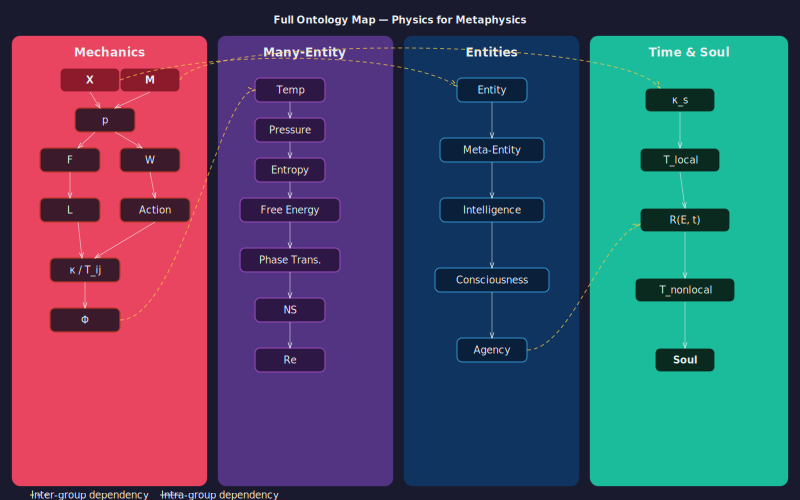
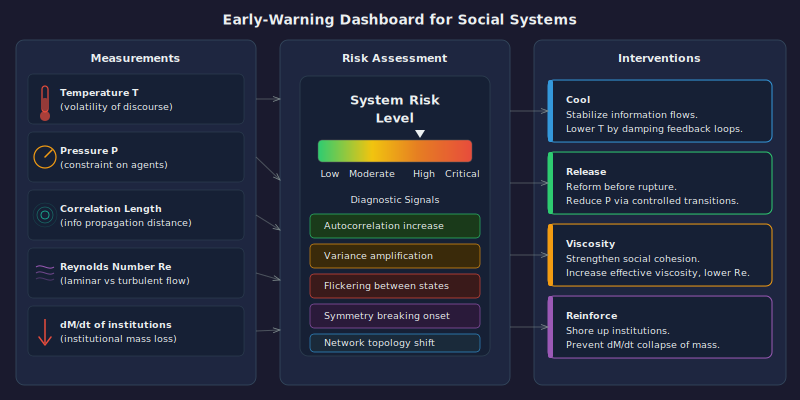

[Parts 1](./01_generalized_mechanics.md) through [4](./04_time_and_soul.md) (including [Part 1b](./01b_uncertainty_coordinates_relativity.md)) introduced the machinery piece by piece: generalized mechanics and its structural complications, meta-entities, intelligence and consciousness and agency, local and non-local time, and soul. Each piece was developed in isolation so its logic could be examined on its own terms. The purpose of this final part is to assemble them into a single formal system, state the complete ontology in one place, and then be honest about what remains open.

Epimechanics makes a strong claim: the wall between physics and metaphysics is a wall between the concrete and the abstract. If this claim holds, the boundary between disciplines becomes a choice of projection - which slice of the state space to examine - rather than a division between fundamentally different kinds of reality.

---

## Section 1: The Full Ontology

What follows is a full definitional glossary. Every concept in the series is restated here in its most precise form, with formal notation. This is Epimechanics in one place.

### Ontology Map

---

**Reality / Potential State Space ($\mathcal{X}$)**: The full potential causal reality — the territory. The space of all states a system could occupy, not just its current actuality. Reality is not X — X is a representation of actual state within $\mathcal{X}$. The manifold of all potential state spaces across all domains - physical, biological, informational, social, conceptual - is the territory; our representations are maps of it. There is one reality; what differs across disciplines is the projection of our representational framework onto it. The physical sciences project onto matter and energy. The social sciences project onto agents and institutions. Epimechanics is substrate-neutral and covers all projections simultaneously. All representations have epimechanical structure (this is a mathematical triviality - see "The Universality of Epimechanical Structure" below). The claim is that representations which track real causal structure have *simple* epimechanical structure - simple enough to predict dynamics at low computational cost.

---

**X (Representation)**: A model of state — the map. Can model actual state, potential state, or any state. Representations can take many forms: point estimates, probability distributions, partial observations, compressed encodings. All are partial projections of the territory. $X$ evolves over time as state changes and as observations accumulate. Physical position is one instance. Belief intensity, organizational cohesion, cultural salience, psychological valence - all are instances. X is not the system; it is our model of the system's condition. Representations are themselves states: they must be instantiated in some physical substrate. The generality of X is a key move of Epimechanics: X is not committed to any substrate. All representations have epimechanical structure; what distinguishes good representations is that their epimechanical structure is simple and predictive. **Representational fidelity** $\mathcal{F}(X, x) = 1 - d(X, x)$ measures how well $X$ tracks target state $x \in \mathcal{X}$; predictive accuracy scales with fidelity given sufficient computation.

---

**$dX/dt$ (Rate of Change)**: The time derivative of state. The velocity of X through state space:

$$v_X = \frac{dX}{dt}$$

Stability is $dX/dt \approx 0$. Crisis is high $|dX/dt|$. Stagnation and paralysis are $dX/dt \approx 0$ when $dX/dt \neq 0$ is required for survival. The derivative is a diagnostic of any system's condition.

---

**$\mathcal{M}$ (Generalized Mass)**: The integral of total causal density $\rho_{\text{causal}}$ over an entity's region - the total causal content:

$$\mathcal{M}(E,t) = \int_{\text{entity}} \rho_{\text{causal}}(E, x, t) \, d\mu(x)$$

Mass determines the relationship between velocity and momentum: $p = \mathcal{M} \cdot \dot{X}$ (isotropic scalar approximation; general: $p_i = \mathcal{M}_{ij}\dot{X}^j$). The claim that higher $\rho_{\text{causal}}$ corresponds to greater resistance to state change is non-tautological to the extent that $\mathcal{M}$ can be approached from independent directions - structural characterization, dynamic resistance, energetic content, construction complexity - and these approaches give consistent rankings ([Part 1, Section 2b](./01_generalized_mechanics.md)). This ordinal agreement is a testable empirical prediction, not a definition. Epimechanics aspires to a full **generalized equivalence principle** (cardinal agreement across approaches), but achieving this requires domain-specific unit conventions that do not yet exist outside physics. In the Wolfram hypergraph framework, physical mass is the rest-frame density of causal events within a persistent localized structure; generalized mass extends this to any persistent structure in any state space.

---

**$p$ (Generalized Momentum)**: Mass times velocity (isotropic scalar approximation; general tensorial form: $p_i = \mathcal{M}_{ij}\dot{X}^j$ - see [Part 1, Section 2b](./01_generalized_mechanics.md)):

$$p = \mathcal{M} \cdot \dot{X}$$

Momentum captures how hard it is to deflect an entity from its current trajectory. High $\mathcal{M}$ and high $\dot{X}$ together produce high momentum - a causally dense entity moving rapidly through state space is very hard to redirect. A deeply held belief ($\mathcal{M}$ large) being actively reinforced ($\dot{X}$ in the reinforcement direction) has enormous momentum: even strong counter-arguments (forces) produce little deflection.

---

**F (Causal Force)**: Any influence producing $dp/dt \neq 0$. Because $p = \mathcal{M}\dot{X}$ and $\mathcal{M}$ can change over time, the full force equation is (scalar approximation; general: $F_i = \mathcal{M}_{ij}\ddot{X}^j + \dot{\mathcal{M}}_{ij}\dot{X}^j$):

$$F = \frac{dp}{dt} = \mathcal{M}\ddot{X} + \dot{\mathcal{M}}\dot{X}$$

The first term ($\mathcal{M}\ddot{X}$) is the resistance of existing internal structure to changes in trajectory - the familiar $F = ma$. The second term ($\dot{\mathcal{M}}\dot{X}$) captures the interaction between structural change and motion: an entity losing internal structure ($\dot{\mathcal{M}} < 0$) while already moving ($\dot{X} \neq 0$) accelerates like a rocket shedding mass; an entity gaining structure ($\dot{\mathcal{M}} > 0$) while moving decelerates like accumulating snow. In the constant-mass limit ($\dot{\mathcal{M}} = 0$), this reduces to $F = \mathcal{M}\ddot{X}$. For social, psychological, and institutional systems, the cross-term is typically nonzero.

---

**W (Energy / Capacity for Change)**: The work integral:

$$W = \int F \cdot dX$$

Capacity to produce state change. A scalar measure of causal capacity. Energy decomposes into three forms: **kinetic energy** $T = \frac{1}{2}\mathcal{M}\lvert\dot{X}\rvert^2$ (scalar approximation; general: $T = \frac{1}{2}\mathcal{M}_{ij}\dot{X}^i\dot{X}^j$; energy of motion through state space), **potential energy** $V(X)$ (energy stored in position within a field — its value lies in its topology, the shape of the landscape where basins, barriers, and gradients are, not in converting everything to a single energy number), and **internal energy** $E_{\text{int}} = \mathcal{M}c_{\mathcal{D}}^2$ (energy locked into maintaining the entity's causal structure, where $c_{\mathcal{D}}$ is the maximum causal propagation speed in domain $\mathcal{D}$). An organization "losing energy" is a decrease in its capacity to alter the state trajectories of the systems it couples to. When an entity's internal structure is disrupted - a belief system shatters, an institution collapses - internal energy is released as capacity for state change. This is the generalized $E = mc^2$.

Energy and time form a conjugate pair ($\sigma_E \cdot \sigma_t \geq C'$), just as position and momentum do ($\sigma_X \cdot \sigma_p \geq C$). You cannot simultaneously specify exactly how much capacity for state change a system has and exactly when that capacity will be deployed.

---

**$L$ (Lagrangian) and the Action Principle**: The Lagrangian $L = T - V = \frac{1}{2}\mathcal{M}\lvert\dot{X}\rvert^2 - V(X)$ (scalar approximation; general: $L = \frac{1}{2}\mathcal{M}_{ij}\dot{X}^i\dot{X}^j - V(X)$) is kinetic minus potential energy. The **principle of stationary action** states that the actual trajectory $X(t)$ is the one that makes the action $S = \int L \, dt$ stationary: $\delta S = 0$. This is the most fundamental formulation of the mechanics - more fundamental than the force equation, which is derived from it via the Euler-Lagrange equation. The Lagrangian defines conjugate momentum ($p = \partial L / \partial \dot{X}$), derives the force equation ($F = \mathcal{M}\ddot{X} + \dot{\mathcal{M}}\dot{X}$), and via Noether's theorem connects symmetries to conservation laws: time-translation symmetry gives energy conservation; state-space translation symmetry gives momentum conservation. Valid for conservative systems; most social, psychological, and biological systems are dissipative — the pure Lagrangian form requires extension with dissipation terms (see Part 1, Section 4b and Part 1.5, Cross-Level Tracing). Equilibrium principles complement the dynamics: minimum energy at constant entropy, minimum free energy at constant temperature ([Friston's free energy principle](https://doi.org/10.1038/nrn2787) is the biological case), and maximum entropy production for far-from-equilibrium dissipative structures.

---

**$\kappa$ (Scalar Coupling Constant)**: The entity's sensitivity to a field's forces:

$$F_{\text{entity}} = \kappa \cdot F_{\text{field}}$$

Domain-specific; can be zero (immunity) or large (high sensitivity). A person immune to social pressure has low $\kappa$ in the social field. An organization structurally exposed to interest rate changes has high $\kappa$ in the economic field. $\kappa = 0$ means the field passes through without effect.

---

**$T^i{}_j$ (Existential Coupling Tensor)**: Multi-dimensional generalization of $\kappa$:

$$F_{\text{entity}}^i = T^i{}_j \, F_{\text{field}}^j$$

$T^i{}_j$ encodes cross-domain propagation. Diagonal entries represent compartmentalization - a force in domain $i$ affects domain $i$. Off-diagonal entries represent stress cascades - a force in source domain $j$ propagates into response domain $i$. A person whose financial stress directly produces physical illness has a large off-diagonal element $T^{\text{physical}}{}_{\text{economic}}$. The ACE studies are empirical measurements of $T^i{}_j$ in early human development.

---

**$c_{\mathcal{D}}$ (Domain Propagation Speed)**: The maximum speed at which causal influence propagates through domain $\mathcal{D}$. In physics, $c$ is the speed of light - the maximum rate of causal propagation through spacetime. Every domain has an analogous finite propagation speed: information travels at finite speed through social networks, institutional decisions propagate at finite speed through hierarchies, ideas spread at finite speed through epistemic communities. $c_{\mathcal{D}}$ enters Epimechanics through the internal energy relation $E_{\text{int}} = \mathcal{M}c_{\mathcal{D}}^2$ - the energy stored in an entity's persistent structure is its generalized mass times the square of the domain's maximum causal propagation speed.

---

**$\Phi(x)$ (Field)**: A domain of influence assigning values across a space:

$$F^i = T^i{}_j \, \nabla^j\Phi(x)$$

Culture is a field. Reputation is a field. The information environment is a field. Each assigns values across a domain, and gradients in those values produce forces on entities that are coupled to them. The gradient $\nabla^j\Phi(x)$ is what moves an entity through state space; $T^i{}_j$ determines how strongly and in which directions the entity responds.

---

**Field Sources (Mean-Field Construction)**: Fields are not free-floating - they are generated by entities. The potential at any position $X$ in state space is the superposition of causal influences from all entities:

$$V(X) = \int \phi(X, X') \, \rho(X') \, dX'$$

where $\phi(X, X')$ is the pairwise interaction kernel and $\rho(X')$ is the density of entities at $X'$. A cultural norm field is generated by the aggregate behavioral states of a population; an economic incentive field is generated by the aggregate supply-demand behavior of market participants. The mean-field approximation is valid when no single entity significantly alters the field; it breaks down for dominant actors (monopolists, charismatic leaders).

---

**Thermodynamic Quantities (Many-Entity Regime)**: When many entities occupy a state space, statistical aggregates emerge: **temperature** $\mathcal{T} \propto \langle \frac{1}{2}\mathcal{M}\lvert\dot{X}\rvert^2 \rangle$ (average kinetic energy - how much agitation), **pressure** $P$ (force per unit boundary - how hard entities push against constraints), **entropy** $S_{\text{ent}} = -\int \rho \ln \rho \, dX$ (accessible microstates - disorder), and **free energy** $\mathcal{F} = E - \mathcal{T} S_{\text{ent}}$ (capacity for directed change - total energy minus thermal noise). **Phase transitions** occur at critical parameter values when the macro-state changes qualitatively (consensus → polarization, stable market → crash). These are the same mathematical phenomena as physical phase transitions - spontaneous symmetry breaking in many-body systems - applied to abstract state spaces.

---

**Fluid Dynamics of State-Space Flow**: When entity density $\rho(X,t)$ and velocity $\mathbf{v}(X,t)$ are smooth, the ensemble satisfies fluid equations. The **continuity equation** $\partial\rho/\partial t + \nabla \cdot (\rho\mathbf{v}) = \sigma$ conserves entities (with source/sink $\sigma$ for creation/destruction). The **Navier-Stokes analogue** $\rho(D\mathbf{v}/Dt) = -\nabla P + \mu\nabla^2\mathbf{v} + \mathbf{F}_{\text{ext}}$ balances inertial, pressure, viscous, and external forces. **Viscosity** $\mu$ measures resistance to shearing in state space: high $\mu$ = conformist cultures, regulated markets; low $\mu$ = fragmented societies, deregulated markets. The **Reynolds number** $Re = \rho v L / \mu$ determines whether collective state change is laminar (orderly, low $Re$) or turbulent (chaotic, high $Re$).

---

**Entities and Auto-Causal Density $\rho_{\text{ac}}$**: An entity is anything with a describable state - anything you can assign an $X$ to. **Auto-causal density** $\rho_{\text{ac}}$ measures how strongly a structure's causal events produce the conditions for their own continuation ([Hofstadter's "strange loops"](https://en.wikipedia.org/wiki/I_Am_a_Strange_Loop)). $\rho_{\text{ac}}$ determines not *whether* something is an entity but how persistent, influential, and self-sustaining it is. Generalized mass $\mathcal{M} = \int \rho_{\text{causal}} \, d\mu$ is the integral of *total* causal density (which includes but is not limited to the auto-causal events); self-coupling $\kappa_s$ is the temporal autocorrelation of $\rho_{\text{ac}}$. Entity-ness is continuous: a proton has very high $\rho_{\text{ac}}$; a cloud has low but nonzero $\rho_{\text{ac}}$; a random fluctuation has $\rho_{\text{ac}} \approx 0$ - but all are entities. The **entity boundary** $\partial E = \{x : \rho_{\text{ac}}(x) = \rho_{\text{threshold}}\}$ is a gradient - steep for organisms, shallow for clouds. Boundaries are dynamic, substrate-specific, and asymmetric. Auto-causal density is a property of the structure, not of an observer - a cloud is an entity whether or not anyone sees it. Interactions between entities are mediated by fields and are generally asymmetric - Newton's third law does not hold in abstract state spaces because different entities have different coupling tensors.

---

**Meta-Entities**: Distributed entities whose coupling to X spans physical, informational, and mimetic substrates simultaneously. A religion, a market, a nation-state, a corporation, an idea-complex - these are not located in any single body or node. They earn entity status by the same criterion as ordinary entities - counterfactual causal power - but that power is distributed across substrates. Formally, a meta-entity $M$ earns entity status when its macro-level effective information exceeds its micro-level effective information:

$$EI(\text{macro}) > EI(\text{micro})$$

following [Hoel et al. (2013)](https://doi.org/10.1073/pnas.1314922110). When this condition holds, the macro description is the one that actually does the causal work. The micro description, however accurate, misses the causal structure.

---

**$T_{\text{local}}(E)$ (Local Time of Entity E)**: Duration of E's auto-causal loop - the span over which the entity's causal events continue to sustain themselves. $\kappa_s(E,t)$ is the temporal persistence of auto-causal density $\rho_{\text{ac}}$ (a derived quantity, not a primitive):

$$T_{\text{local}}(E) = \int_0^\infty \mathbf{1}[\kappa_s(E,t) > 0]\, dt$$

For meta-entities, local time is the duration over which the eigenvalue structure of the coupling tensor remains coherent above the critical threshold $\gamma_c$:

$$T_{\text{local}}(M) = \int_0^\infty \mathbf{1}[\lambda_{\min}(\Gamma(t)) > \gamma_c]\, dt$$

where $\Gamma(t)$ is the inter-substrate coupling matrix at time t. A meta-entity ceases to have local time when its coupling structure fragments below the threshold.

---

**$\mathbf{R}(E,t)$ (Representational Footprint)**: The aggregate weighted counterfactual causal presence of E's patterns in all other entities at time t. In the scalar (single-dimension) approximation:

$$R(E,t) = \sum_j \kappa_{Ej}(t) \cdot \delta X_j(E,t)$$

In the full vector form ([Part 4, Section 3](./04_time_and_soul.md)), $\mathbf{R}(E,t) = \sum_j \mathbf{K}_{Ej}(t) \cdot \delta X_j(E,t) \in \mathbb{R}^m$, where $\mathbf{K}_{Ej}(t) \in \mathbb{R}^{m \times n_j}$ maps each entity $j$'s state-change contribution into a common $m$-dimensional output space. $\mathbf{R}$ can have positive components (E's influence moves j's state in a valued direction) and negative components (disvalued direction) simultaneously - sign is evaluated by projection onto a normative reference basis $\mathbf{v}$.

---

**$T_{\text{nonlocal}}(E)$ (Non-Local Time of Entity E)**: The temporal extent over which E's representational footprint remains nonzero - how long E matters:

$$T_{\text{nonlocal}}(E) = \mu\!\left(\{t : \|\mathbf{R}(E,t)\| > \varepsilon\}\right)$$

the Lebesgue measure of the support of $\|\mathbf{R}(E,t)\|$ above a small threshold $\varepsilon > 0$ - how long E's pattern continues to exert nonzero influence anywhere. The **total causal biography** $\boldsymbol{\Sigma}_{\text{nonlocal}}(E) = \int_0^{\infty} \mathbf{R}(E,t)\, dt \in \mathbb{R}^m$ is the complementary vector-valued integral, capturing how much influence E exerted in each dimension. $T_{\text{nonlocal}}$ answers "for how long did this entity matter?"; $\boldsymbol{\Sigma}_{\text{nonlocal}}$ answers "in which dimensions and how much?" A person who dies young but whose ideas alter the trajectory of many other minds has high $T_{\text{nonlocal}}$. A powerful person whose influence evaporates at death has $T_{\text{nonlocal}}$ close to zero.

---

**Intelligence I**: Predictive accuracy over state trajectories $dX/dt$ in a given domain and horizon. A special case of the [Legg-Hutter universal intelligence measure (2007)](https://doi.org/10.1007/s11023-007-9079-x) and related to [Schmidhuber's formal theory of creativity and curiosity (2010)](https://doi.org/10.1109/TAMD.2010.2056368). Intelligence is always domain-relative and horizon-relative: a system can have high I for short-horizon physical predictions and low I for long-horizon social predictions, or vice versa. Measurable in principle by tracking prediction accuracy against realized trajectories.

---

**Consciousness C**: Scope and accuracy of an entity's internal model of states X - where X represents aspects of reality. Two independent dimensions:

- **Allo-representation**: modeling of other entities' states - theory of mind, world modeling.
- **Auto-modeling**: representation of the entity's own states - self-representation.

The entity *may* appear in its own map, but self-reference is not required for nonzero C. Consciousness in this framework is the quality of the map, not the content of the map. A purely outward-facing model with perfect accuracy has high C on the allo-dimension and zero on the auto-dimension. This is a functional definition. It says nothing about phenomenal consciousness - the "what it's like" dimension. That remains explicitly open (see Open Question 7 below).

---

**Agency A**: Consciousness-directed causal power:

$$A = C_{\text{coupling}} \times \mu_{\text{meta}} \times C_{\text{consciousness}}$$

Multiplicative form: zero in any factor yields zero agency. $\mu_{\text{meta}} \in [0,1]$ is the meta-representational weight - the degree to which the entity represents its own model as a model (Part 3). A system with a purely transparent self-model ($\mu_{\text{meta}} = 0$) has zero agency regardless of coupling and consciousness. An entity with perfect coupling and zero consciousness is a force of nature, not an agent. An entity with perfect consciousness and zero coupling is a contemplative presence without causal reach. Agency in the morally relevant sense requires both. Normalized to $A \in [0,1]$. Grounds moral responsibility: attributing responsibility to E for outcome O requires that E had both the capacity to model O (nonzero C) and the causal power to alter the trajectory toward O (nonzero coupling). Absent either, moral responsibility is misassigned.

---

**Soul(E)**: $\mathbf{R}(E,t)$ - the complete, signed, vector-valued representational propagation function of E across all substrates and all time.

Three dimensions of a soul profile:

- **Amplitude**: $\sup_t |R(E,t)|$ - peak influence magnitude
- **Duration**: measure of $\{t : R(E,t) \neq 0\}$ - how long the influence persists
- **Breadth**: cardinality of $\{j : \kappa_{Ej}(t) > 0 \text{ for some } t\}$ - number of distinct hosts

Soul is a causal biography. The question "what was the soul of this entity?" is the question "what difference did it make to the trajectories of others, how long did those differences persist, and were those differences, on balance, valued or disvalued?" This is a measurement problem.

### The Universality of Epimechanical Structure

A foundational observation about the ontology just assembled: **all representations have epimechanical structure.** This is not a deep claim - it is a consequence of calculus. For any time-varying representation $X(t)$, you can compute $\dot{X}$, $\ddot{X}$, define $p = \mathcal{M}\dot{X}$ (or more generally $p_i = \mathcal{M}_{ij}\dot{X}^j$), and write $F = dp/dt$. The mechanical formalism applies to *every* representation, including arbitrary, misleading, or useless ones. If you represent a tree as a "car" and track its "fuel consumption," you can formally compute its velocity, acceleration, and force. The epimechanical structure exists. It just doesn't predict anything - because the representation doesn't track the system's real causal structure.

What distinguishes a *good* representation from a bad one is not whether it has epimechanical structure (they all do) but whether that structure is **predictive at minimal computational cost**. A well-chosen $X$ - one that tracks the system's actual causal structure - yields a Lagrangian with visible symmetries, a coupling tensor that is sparse, and equations of motion that compress the dynamics into a small number of variables. A poorly chosen $X$ yields a Lagrangian with no symmetries, a dense coupling tensor, and equations that require tracking everything to predict anything.

This connects to established results from multiple fields:

- [Minimum Description Length (Rissanen, 1978)](https://doi.org/10.1214/aos/1176344611): the best model compresses data most efficiently
- [Rate-distortion theory (Shannon, 1959)](https://ieeexplore.ieee.org/document/5311476): the optimal tradeoff between compression and accuracy
- [Renormalization group (Wilson, 1971)](https://doi.org/10.1103/PhysRevB.4.3174): finding the relevant degrees of freedom at each scale
- [Causal emergence (Hoel et al., 2013)](https://doi.org/10.1073/pnas.1314922110): the macro description that maximizes effective information
- [Free Energy Principle (Friston, 2010)](https://doi.org/10.1038/nrn2787): organisms minimize a bound on surprise - a compression objective

All say the same thing from different angles: **the right representation is the one that makes prediction cheapest.** Epimechanics adds: and when you have found that representation, its dynamics take simple mechanical form - because simple mechanical form (state, force, energy, conservation laws via symmetry) *is* what predictively efficient dynamics look like.

> **Principle (Representational Efficiency).**
>
> *Setup.* Let $\mathcal{R} = \{X : \Omega \to S\}$ be the set of all representations of a system $\Omega$, where $S$ is the state space induced by $X$. Each representation $X$ induces a Lagrangian $\mathcal{L}_X$, a coupling tensor $T_X$, and equations of motion $\mathcal{E}_X$.
>
> *Cost function.* Define $C(X, \varepsilon)$ as the computational complexity of predicting $X(t + \Delta t)$ from $X(t)$ to accuracy $\varepsilon$.
>
> *Statement.*
> $$X^* = \underset{X \in \mathcal{R}}{\operatorname{argmin}}\; C(X, \varepsilon)$$
>
> *Conjecture.* For systems with causal structure, $X^*$ has:
> - **(a)** Maximal symmetry group in $\mathcal{L}$ - conservation laws via Noether reduce effective dimensionality (conserved quantities = fewer things to predict).
> - **(b)** Minimal-rank $T$ - sparse coupling means domains decouple (parallel prediction).
> - **(c)** Minimal $\dim(S)$ - fewest degrees of freedom that capture the dynamics, reducing search space.
>
> *Sketch of argument.* Symmetries compress the dynamics: each continuous symmetry eliminates one degree of freedom from the prediction problem. Sparse $T$ decomposes the system into independent subsystems, each predictable in parallel, so total cost scales with the largest block rather than the full dimension. Low $\dim(S)$ reduces the search space directly. Together these three properties minimize $C$. The connection to minimum description length (MDL) is direct: maximal symmetry + minimal dimensionality = the most compressed predictive model of the system's dynamics.
>
> *Open questions.* (i) Whether minimizing $C$ *necessarily* produces Lagrangian symmetry (the converse direction - from cheap prediction to conservation laws). (ii) Whether this is formalizable via information geometry, where representations correspond to coordinate systems on a statistical manifold and $C$ relates to geodesic complexity.

This reframes what Epimechanics claims. It does not claim that reality "has" mechanical structure (a metaphysical assertion). It observes that all representations have epimechanical structure (a mathematical triviality), and proposes that representations which track real causal structure have *simple* epimechanical structure - simple enough to predict dynamics at low computational cost. Whether reality is "mechanical" or merely "looks mechanical through good representations" is a question the framework does not need to answer. The empirical test is whether the predictions hold.

---

## Section 2: The Wolfram Connection

The correspondences below are structural: Epimechanics and the Wolfram model share mathematical form. Whether this shared form reflects genuine identity (both describing the same underlying computation) or a structural analogy is an open question addressed in the Coda. Epimechanics' applicability does not depend on the answer.

Epimechanics is structurally grounded in physics. To see why, it helps to examine the deepest current candidate for fundamental physics: Stephen Wolfram's [*A Project to Find the Fundamental Theory of Physics* (2020)](https://www.wolframphysics.org/technical-introduction/). The [primary technical paper](https://arxiv.org/abs/2004.08210) develops the hypergraph framework. [Gorard's companion paper (2020)](https://arxiv.org/abs/2004.14810) on relativistic and gravitational properties develops the relativistic structure in detail.

Wolfram models the universe as an evolving hypergraph under rewrite rules. The hypergraph is a collection of nodes and hyperedges. Time is the application of rewrite rules. Space and spacetime are not presupposed - they emerge from the structure of the causal graph generated by the sequence of rewrites. Particles are persistent local structures in the hypergraph. Forces are asymmetries in rewrite density.

The structural correspondences between Epimechanics and the Wolfram model are:

| Generalized Mechanics | Wolfram Model |
|---|---|
| **X** (state variable) | Hypergraph node configuration at a moment - the state of the universe is the configuration of the graph |
| **dX/dt** (rate of change) | Rate of hyperedge rewriting - causal activity per unit observer time |
| **$\mathcal{M}$** (mass) | Rest-frame density of internal causal events within a persistent localized structure - the causal activity maintaining the structure's configuration. Higher density = more massive = more resistance to state change |
| **$p = \mathcal{M}\dot{X}$** (momentum; scalar approx.) | Internal causal density times rate of rewriting - spacelike flux of causal edges |
| **F** (force) | Local asymmetry in rewrite density - regions of the causal graph with asymmetric flux |
| **κ** (coupling constant) | Probability/weight with which an entity's nodes participate in specific rewrite rules |
| **W** (energy) | Timelike flux of causal edges - energy is the flux of causal connections in the timelike direction of the causal graph |
| **$E_{\text{int}} = \mathcal{M}c^2$** (internal energy) | Energy stored in a persistent structure's causal density - the $E = mc^2$ equivalence is structural: rest-frame causal event density times maximum causal propagation speed squared |
| **S** (state space) | The Ruliad - Wolfram's term for the space of all possible computations ([The Concept of the Ruliad](https://writings.stephenwolfram.com/2021/11/the-concept-of-the-ruliad/)) |

Wolfram states explicitly that energy corresponds to the flux of causal graph edges per unit of perceived time, and momentum corresponds to the flux of causal graph edges in spacelike directions. These are the core definitions within the model.

The Ruliad deserves particular attention. Wolfram defines the Ruliad as the entangled limit of all possible computations - the total space of all possible rules applied to all possible initial conditions. Every physical system, every conceivable state space S, every possible X is a projection of the Ruliad. The Ruliad is, in Wolfram's framework, the universal state space.

This means: the state space S in which any X lives is a projection of the Ruliad. Epimechanics shares the Ruliad's substrate-neutrality — both operate over any state space S. But Epimechanics adds structure the Ruliad alone does not provide: it distinguishes computation from mere dynamics via renormalization survival (which internal DOF persist across scales and are input-dependent — see [Belief Fields: Computation as Renormalization Survival](./belief_field.md)), identifies optimal representations via the Representational Efficiency principle, and defines entities, intelligence, consciousness, and agency as emergent properties of that computational structure. The Ruliad is the space of all possible micro-computations; Epimechanics says which of those computations matter at each scale.

The implications for "energy" and "mass" are worth stating explicitly. When we say a person "has energy," or an organization "has lost energy," or a movement "is gathering energy" - these are colloquial uses of a physics word. Energy, in the Wolfram model, is the timelike flux of causal edges. In a social system, the timelike flux of causal edges is the rate at which states are being changed by the causal actions of entities in that system. Epimechanics proposes that the "energy" of a social system has the same mathematical structure as physical energy - both are timelike flux of causal edges in their respective state spaces. Whether this structural isomorphism reflects a genuine identity or a structural parallel is an open question (see Coda). The structural parallel is what makes Epimechanics applicable across domains; the identity claim is what would make it fundamental.

The same holds for mass. When we say an institution "has inertia," or a belief is "deeply entrenched," or a culture "resists change" - these describe high generalized mass: dense internal causal structure that must be rearranged for the state to change. In the Wolfram model, a particle's mass is the rest-frame density of causal events within its persistent hypergraph structure. In a social system, an institution's mass is the density of internal causal events - meetings, communications, policy enforcement, record-keeping - that maintain its current configuration. Epimechanics proposes that both are instances of the same quantity: internal causal event density of a persistent structure. And the generalized $E_{\text{int}} = \mathcal{M}c_{\mathcal{D}}^2$ has the same structural form: when an institution collapses, the energy that was maintaining its internal structure is released as capacity for state change - exactly as when a physical structure disintegrates and releases its rest-mass energy.

### The Assembly Theory Connection

[Assembly theory (Cronin, Walker et al., 2023)](https://doi.org/10.1038/s41586-023-06600-9) provides a complementary bridge between the generalized mechanics and empirical science. The **assembly index** (AI) - the minimum number of joining operations to construct an object from basic parts - is experimentally measurable via mass spectrometry and spectroscopy. The **copy number** counts instances. Their product, **Assembly** = AI × copy number, quantifies the causation required to produce complex objects in abundance.

The mapping to Epimechanics:

| Assembly Theory | Generalized Mechanics |
|---|---|
| Assembly index (AI) | Lower bound on generalized mass $\mathcal{M}$: construction complexity ≈ maintenance cost |
| Copy number | Entity density $\rho(X)$ at a position in state space |
| Assembly = AI × copy number | Mass-weighted density $\mathcal{M} \cdot \rho$ - high values imply selection is operating |
| Assembly universe | Full state space $S$ |
| Assembly possible | $S$ constrained by physical laws - the potential landscape $V(X)$ |
| Assembly contingent | Subset selected by the action principle $\delta \int L \, dt = 0$ - only extremal trajectories realized |
| Assembly observed | Actual configuration $X(t)$ |
| "Information is in the path" | The action principle: the trajectory carries the information, not the initial conditions |

The assembly space hierarchy - $S \supset S_{\text{possible}} \supset S_{\text{contingent}} \supset S_{\text{observed}}$ - is the state-space funnel through which the Lagrangian dynamics operate. Each level is a constraint that narrows the set of realized configurations. The ratio $|S_{\text{contingent}}|/|S_{\text{possible}}|$ measures how tightly the dynamics constrain accessible configurations.

Assembly theory's central empirical finding - that biological samples consistently produce higher assembly indices than abiotic ones - translates to: living systems occupy regions of state space with higher $\mathcal{M}$ (denser internal causal structure) and higher $\rho$ (more copies of complex configurations) than non-living systems. In the thermodynamic framework, these are low-entropy, high-free-energy configurations maintained against dissolution by energy throughput - exactly the dissipative structures that Epimechanics identifies as entities with $\kappa_s > 0$.

> [!sidenote]
> *Note on status*: Assembly theory has been [criticized](https://arxiv.org/abs/2403.06629) as equivalent to Lempel-Ziv compression and as not explaining evolution or selection as originally claimed ([Jaeger 2024](https://doi.org/10.1007/s00239-024-10163-2)). Epimechanics uses assembly theory's experimentally measurable quantities as operationalizations of its own concepts, not as a foundational theory. The value is empirical: if assembly index correlates with $\mathcal{M}$ as predicted, Epimechanics gains lab-measurable grounding.

> [!sidenote]
> *Note on the Ruliad's uniqueness*: Wolfram presents the Ruliad as *the* unique totality of all computation. A stronger revision is possible: the Ruliad as typically described may be *an* entangling limit - one particular symmetry-collapsed branch of an original maximally symmetric computational state - rather than the unique totality. Under this revision, physical constants (including the coupling strengths and propagation speeds that determine $\kappa$, $\mathcal{M}$, and $c_{\mathcal{D}}$ in the physical projection) are fixed points *within our particular entangling limit*, not universal necessities. Epimechanics is compatible with either view: its substrate-neutrality means it operates at the level of abstraction that includes all possible entangling limits, not just ours. Whether the Ruliad is unique or one branch among many, the mathematical skeleton - $X$, $\dot{X}$, $\mathcal{M}$, $p$, $F$, $W$ - applies in all of them.

---

## Section 3: Nine Open Questions

Epimechanics is internally consistent and grounded in existing literature at each component. That does not mean it is complete. Here are the nine places where it is most importantly open.

### 1. Smoothness and Discreteness

Epimechanics uses $dX/dt$ throughout, which assumes differentiability of X with respect to t. Real social processes - political revolutions, institutional collapses, belief cascades - are often discrete, stochastic, and discontinuous. Phase transitions in social systems do not resemble smooth trajectories through state space; they resemble sudden rewrites of the configuration.

The appropriate extension is stochastic: replace the deterministic differential equation with a Fokker-Planck equation for the probability distribution over X, or a Langevin dynamics for X with an explicit noise term. [Gardiner's *Handbook of Stochastic Methods* (2004)](https://link.springer.com/book/9783540707127) provides the technical foundations. Epimechanics as stated is the deterministic limit of a stochastic extension that remains to be fully developed.

### 2. The Geometry of State Space $S$

The Lagrangian formulation ([Part 1, Section 4b](./01_generalized_mechanics.md)) requires $S$ to be a smooth manifold - otherwise derivatives like $\partial L / \partial \dot{X}$ do not exist. Given this assumption, the coupling $T^i{}_j$ is a genuine $(1,1)$-tensor on $S$: a coordinate-free bilinear map $T: T_X^* S \to T_X S$ ([Part 1, Section 5b](./01_generalized_mechanics.md)). The notation $T^i{}_j$ is its representation in a particular coordinate chart, and domain labels like "economic" and "psychological" are coordinate choices, not fundamental structure.

This resolves the tensor question but opens a deeper one: **what is the geometry of $S$?**

- **Dimensionality.** What is $\dim(S)$ for a human being? For an institution? The answer determines how many independent degrees of freedom the entity has. Empirical approaches exist: [Cunningham & Yu (*Nature Neuroscience*, 2014)](https://doi.org/10.1038/nn.3776) use dimensionality reduction techniques to estimate the effective dimensionality of neural state spaces. Analogous methods could estimate $\dim(S)$ for behavioral, organizational, or cultural state spaces.
- **Topology.** Is $S$ simply connected, or does it have nontrivial topology (holes, handles, disconnected components)? A state space with a hole means there are states that cannot be reached continuously from certain starting points - an entity must "jump" across a topological barrier. Belief spaces with incommensurable worldviews may have this structure.
- **Curvature.** Is $S$ flat (Euclidean) or curved? Curvature means that parallel transport of vectors around closed loops produces rotation - in Epimechanics, this would mean that the same sequence of state changes, applied in a loop, does not return the entity to its original coupling structure. Path-dependence of psychological development (the order in which experiences occur matters, not just their sum) is a signature of curvature in $S$.
- **Metric.** What is the natural distance measure on $S$? How "far apart" are two states? The metric determines which states are neighbors, how forces propagate, and what "nearby" means for coupling. Different choices of metric produce different dynamics - and the correct metric for a given domain is an empirical question.
- **Natural coordinates.** The eigenstructure of the coupling tensor $T$ (its principal axes and eigenvalues) may reveal a natural coordinate system - directions along which the entity's coupling to external fields is diagonalized. These natural coordinates need not correspond to any conventional domain decomposition (economic, psychological, etc.). Discovering them would be finding the genuine structure of the state space rather than imposing a human categorization.

### 3. Causal Counterfactuals

The representational footprint $R(E,t) = \sum_j \kappa_{Ej}(t) \cdot \delta X_j(E,t)$ requires computing $\delta X_j(E,t)$ - the counterfactual difference E makes to j's trajectory. This requires knowing what j's trajectory would have been in the absence of E. Counterfactual causal inference is formally tractable in [Pearl's do-calculus (*Causality*, 2000)](https://doi.org/10.1017/CBO9780511803161) but empirically challenging in complex systems where many entities interact simultaneously.

Estimating $R(E,t)$ for a real entity - a historical figure, a cultural artifact, an AI system - requires a model of the counterfactual world. No such model is available in general. Epimechanics says what to measure; it does not say how to measure it in the hard cases. This is the primary operationalization challenge.

### 4. The Agency Formula

$A = C_{\text{coupling}} \times \mu_{\text{meta}} \times C_{\text{consciousness}}$ is a proposal, not a derivation. The multiplicative form is chosen because it enforces the correct boundary conditions: zero in any factor yields zero agency. It is the simplest function that satisfies the boundary conditions.

Other functional forms - sigmoidal products, bounded convex combinations, power-law products - may be better calibrated in specific domains. The normalized form $A \in [0,1]$ requires that both $C_{\text{coupling}}$ and $C_{\text{consciousness}}$ are themselves normalized, which requires domain-specific upper bounds. Neither the formula nor its calibration has been empirically tested. Derivation from first principles - perhaps via an optimization argument about agents in a state space - remains an open challenge.

### 5. AI Consciousness and the Measurement Problem

Whether deployed AI systems have nonzero C is genuinely unresolved. Epimechanics reframes this as an empirical question about representational architecture: does the system maintain a model of X that *may* include itself with sufficient accuracy to qualify as $C > 0$ on the auto-modeling dimension?

Current AI systems have high allo-representational capacity - they model other entities' states with considerable accuracy. Their auto-modeling capacity is less clear. An AI system that can accurately report on its own internal states as part of its world model may qualify for nonzero $C_{\text{auto}}$. Whether current large language models meet this criterion is a question about their internal architecture that is not resolved by behavioral tests alone. Epimechanics provides the question in precise form. It does not answer it.

### 6. Negative Soul Valence and Aggregation

$R(E,t)$ has sign. An entity whose presence systematically moves other entities' states in directions those entities disvalue has negative R. Epimechanics accommodates negative souls without difficulty at the level of definition. The difficulty arises in aggregation.

If E has positive R during one period and negative R during another, how do they combine in $T_{\text{nonlocal}}$? If E has positive R in some host entities and negative R in others simultaneously, what is the overall soul valence? The integral $\int R(E,t)\, dt$ is well-defined mathematically but its normative interpretation is not. Can a sufficiently large positive legacy cancel a period of harmful influence? Can a sufficiently broad positive footprint cancel depth of harm in a small number of hosts? The valence-aggregation problem is both mathematical and ethical, and Epimechanics does not resolve it.

### 7. The Hard Problem

Epimechanics defines consciousness functionally: scope and accuracy of an entity's internal model of X, with an optional self-referential dimension. This definition allows consciousness to be measured in principle - test the model's predictions against the states it is modeling.

What Epimechanics does not address, and does not claim to address, is phenomenal consciousness: the "what it's like" dimension described by [Nagel (1974)](https://doi.org/10.2307/2183914). Whether there is something it is like to be an entity that satisfies Epimechanics' functional criteria - whether satisfying $C > 0$ is sufficient for experience, or whether it is necessary but not sufficient, or whether the question is incoherent - remains completely open.

This is a deliberate limitation. Epimechanics is designed to be agnostic on the hard problem, not to dissolve it. If the hard problem has a solution, that solution will need to be compatible with the functional definition here. If it does not have a solution, the functional definition is the most that can be rigorously said.

### 8. The Action Principle: Proposed Lagrangian and Remaining Questions

Part 1 (Section 4b) proposes a generalized Lagrangian $L = \frac{1}{2}\mathcal{M}\lvert\dot{X}\rvert^2 - V(X)$ (isotropic scalar approximation; the general form uses the mass tensor $\mathcal{M}_{ij}$) and shows that the Euler-Lagrange equation $\delta S = 0$ derives the full force equation $F = \mathcal{M}\ddot{X} + \dot{\mathcal{M}}\dot{X}$, defines conjugate momentum $p = \partial L / \partial \dot{X} = \mathcal{M}\dot{X}$, and via [Noether's theorem (1918)](https://doi.org/10.1080/00411457108231446) connects symmetries to conservation laws. The energy-time conjugate pair (Part 1, Section 4; Part 1b, Section 1.5) completes the uncertainty structure alongside the position-momentum pair. These are substantive advances: the mechanical skeleton is now derived from a single optimization principle rather than postulated.

Several questions remain open:

- **Is $L = T - V$ the correct Lagrangian for all generalized systems?** Systems with dissipation (friction, damping, information loss) require additional terms - a [Rayleigh dissipation function](https://en.wikipedia.org/wiki/Rayleigh_dissipation_function) or equivalent. Systems with non-conservative forces (forces that depend on velocity, history, or information content) may not admit a standard Lagrangian at all. Which domains of Epimechanics are Lagrangian and which require extended variational principles?
- **Which conservation laws hold in which domains?** If the Lagrangian does not depend explicitly on time ($\partial L / \partial t = 0$), energy is conserved. If it does not depend on position in some dimension ($\partial L / \partial X^i = 0$), momentum in that dimension is conserved. Social and psychological state spaces are unlikely to have full time-translation symmetry (the potential landscape changes over time), which means energy is *not* conserved in those domains - energy can be created and destroyed. This is a structural prediction. Identifying exactly which symmetries hold in which domains determines the conservation structure.
- **What is the role of the energy-time conjugate pair in non-physical domains?** The position-momentum uncertainty ($\sigma_X \sigma_p \geq C$) is now formally stated. The energy-time uncertainty ($\sigma_E \sigma_t \geq C'$) is proposed. Whether the constant $C'$ is empirically accessible in social and psychological systems - and whether the structural predictions (precise timing implies uncertain impact; high energy implies uncertain timing) are testable - remains to be established.
- **How does Friston's free energy principle relate to the Lagrangian?** [Part 1](./01_generalized_mechanics.md) notes that Friston's variational free energy plays the role of $V(X)$ in the Euler-Lagrange equation, and that active inference is the dynamics of stationary action. Formalizing this connection - showing that Friston's framework is the biological special case of the generalized Lagrangian - would unify the free energy principle with the generalized mechanics at the level of derivation rather than analogy.
- **Does the $c^2$ form of internal energy survive coarse-graining?** In physics, $E_{\text{int}} = \mathcal{M}c^2$ is derived from the pseudo-Riemannian metric of spacetime. Epimechanics proposes $E_{\text{int}} = \mathcal{M}c_{\mathcal{D}}^2$ for general domains, where $c_{\mathcal{D}}$ is the effective maximum causal propagation speed at each scale. The argument ([Part 1, Section 4](./01_generalized_mechanics.md)) is that coarse-graining from fundamental physics preserves the pseudo-Riemannian structure (light-cone / maximum propagation speed) at each effective scale, so the $c^2$ form is inherited through renormalization group flow rather than imported by analogy. Whether this is rigorous - whether coarse-graining *always* preserves pseudo-Riemannian structure, or can break it at phase transitions between scales - is an open question. If the metric signature changes under coarse-graining, $E_{\text{int}}$ would take a different functional form at that scale.

### 9. Self-Representation and Its Limits

Can mathematics represent itself? Can physics describe itself? Epimechanics claims to describe all entities, and it is itself an entity - so it must be able to describe itself, or it fails its own universality test. Section 5 (The Self-Application Test) argues that it passes this test: Epimechanics is an auto-causal structure with generalized mass, a field, and a representational footprint.

But self-representation comes with a formal price. [Gödel's incompleteness theorems (1931)](https://doi.org/10.1007/BF01700692) established that any formal system powerful enough to encode statements about itself - as Peano arithmetic can, via Gödel numbering - is necessarily **incomplete**: there are true statements about the system that the system cannot prove from within itself. The system also cannot prove its own consistency.

Epimechanics is in an analogous position. It is powerful enough to describe itself as an entity. By the logic of Gödel's result, this self-referential capacity implies that there are truths about the system - about the structure of reality it describes - that cannot be derived from within it. Epimechanics has unavoidable blind spots, not because it is poorly constructed, but because any sufficiently powerful self-referential system must.

This has specific implications:

- **The hard problem (Open Question 7) may be structurally undecidable from within Epimechanics.** Epimechanics can define consciousness functionally, measure it, locate it in its ontology. But whether satisfying $C > 0$ is sufficient for phenomenal experience may be a Gödelian blind spot - a truth about the system that the system's own formalism cannot reach.
- **Epimechanics' completeness claim has a formal ceiling.** Claiming to have a complete description of reality would be the suspicious move. The self-referential capacity that makes Epimechanics powerful is the same capacity that guarantees it cannot be complete. This is a feature: it tells you exactly where to look for what lies beyond its reach.
- **Physics itself has this structure.** Physical theories are auto-causal entities - they sustain themselves through observation-prediction loops. Any physical theory powerful enough to describe the process by which physical theories are created and sustained is powerful enough to encode statements about itself. The incompleteness is not a limitation of *this* framework specifically - it is a structural property of any universal descriptive system, including physics.

The question "can physics represent itself?" has the answer: yes, but not completely. The representation is necessarily partial. The parts it cannot reach from within are precisely the parts that require stepping outside Epimechanics - which is itself a move within a larger system, subject to the same limitation. This is the infinite regress that Gödel's result implies, and it is structural, not avoidable.

---

## Section 4: Predictions, Data Requirements, and Research Program

A framework without testable predictions is philosophy. What follows are the concrete predictions Epimechanics makes, the data required to test them, and the research program that would move this from proposal to science.

### 4.0 The Tautology Problem and What Epimechanics Actually Predicts

An honesty check before the predictions. "Deeply held beliefs are harder to change than loosely held ones" is tautological - "deeply held" *means* "hard to change." Restating this as "high-$\mathcal{M}$ entities require more force" dresses the tautology in notation. Epimechanics must do better. Its non-tautological content comes from three sources:

**The grammar/vocabulary distinction.** Epimechanics provides the *grammar* - structural relationships ($F = \mathcal{M}\ddot{X} + \dot{\mathcal{M}}\dot{X}$, coupling via $T^i{}_j$, thermodynamic quantities from many-entity ensembles). It does *not* provide *vocabulary* - what to count, how to define force, what units to use. The vocabulary is the work of domain sciences. The grammar earns its keep only if (a) the same structural form works across domains (transfer), and (b) it generates predictions that domain-specific theories alone do not make (structural novelty).

**The measurement problem.** "Count the causal events" presupposes a natural unit, and most non-physical domains don't have one. An institution's "mass" involves people, buildings, policies, norms, legal obligations - not commensurable quantities. Epimechanics cannot currently claim that different measurement approaches give the same number in the same units. What it can claim is the weaker prediction of **ordinal agreement**: structural characterization, dynamic resistance, dissolution energy, and construction complexity should produce correlated *rankings*. This can fail - a structurally complex but dynamically fragile entity (intricate but brittle) would break the unified mass concept. That failure would be informative. The long-term goal of cardinal equivalence (a generalized equivalence principle) is a research program, not a current result (see [Part 1, Section 2b](./01_generalized_mechanics.md) for full discussion).

**Three types of non-tautological prediction.** Each prediction below is tagged:
- **(E)** Equivalence: independent measurement approaches agree in ranking
- **(D)** Decomposition: the *composition* of $\mathcal{M}$ (neural, social, identity, behavioral components) is independently testable; force-matching to dominant components predicts intervention effectiveness
- **(T)** Transfer: the same functional form works across domains
- **(S)** Structural: predicts qualitative dynamics ($\dot{\mathcal{M}}$ cross-terms, phase transitions, efficiency limits) that go beyond "heavy things are heavy" - and that don't require precisely measuring individual $\mathcal{M}$

The **(S)** predictions are Epimechanics' strongest near-term contribution. Thermodynamic quantities (temperature, pressure, viscosity, Reynolds number) and efficiency limits are aggregate statistical properties estimable from population-level data, even when individual $\mathcal{M}$ measurements are operationally imprecise. This is where Epimechanics generates predictions that domain-specific theories do not.

### 4.1 Testable Predictions: Individual-Entity Level

**P0. Ordinal equivalence across measurement approaches (E).** Independent approaches to characterizing $\mathcal{M}$ - structural (map internal causal connections), dynamic (apply perturbation, measure response), energetic (observe dissolution, measure released capacity), constructive (count assembly steps) - should produce correlated rankings within a domain. Falsifiable by systematic mismatches (structurally complex but dynamically fragile entities). Ordinal, not cardinal - no claim about shared units.

*Test*: Rank beliefs by structural network density (via belief elicitation) and separately by resistance to standardized persuasion. Predict Spearman $\rho$ significantly positive. This is the most immediately feasible pairing. Further pairings (constructive via mimetic assembly index; energetic via deconversion studies) extend the test.

**P1. Decomposition and force-matching (D).** $\mathcal{M}$ for a belief decomposes into independently measurable components - neural connectivity ($\rho_{\text{neural}}$), identity integration ($\rho_{\text{identity}}$), social reinforcement ($\rho_{\text{social}}$), behavioral embedding ($\rho_{\text{behavioral}}$), emotional valence ($\rho_{\text{emotional}}$), historical depth ($\rho_{\text{historical}}$), tribal defection cost ($\rho_{\text{tribal}}$). The composite $\mathcal{M} = \sum_k w_k \rho_k + \sum_{j<k} \gamma_{jk} \rho_j \rho_k$ predicts: (a) the total explains resistance better than any single component; (b) interventions targeting the *dominant* component produce larger $\Delta X$ than equal-intensity interventions targeting minor components (force-matching); (c) mutually reinforcing components show positive interaction terms $\gamma_{jk}$.

*Test*: Multi-modal belief profiling paired with multi-type persuasion experiments. Feasible within social psychology methods.

**P2. Variable-mass interaction effects.** When $\dot{\mathcal{M}} \neq 0$ and $\dot{X} \neq 0$ simultaneously, acceleration deviates from $F/\mathcal{M}$ by the cross-term $\dot{\mathcal{M}}\dot{X}$. Specifically: entities losing internal structure ($\dot{\mathcal{M}} < 0$) while already in motion ($\dot{X} \neq 0$) accelerate faster than external forces alone predict. Entities gaining structure ($\dot{\mathcal{M}} > 0$) while in motion decelerate.

*Test*: Compare trajectories of institutional reform during crisis ($\dot{\mathcal{M}} \neq 0$, $\dot{X} \neq 0$) vs. reform during stability ($\dot{\mathcal{M}} \neq 0$, $\dot{X} \approx 0$). Epimechanics predicts measurably different trajectory shapes even when controlling for reform magnitude and crisis severity. The difference is the $\dot{\mathcal{M}}\dot{X}$ interaction, which is zero in the stable case.

*Data needed*: Longitudinal organizational change data with timestamps of structural changes (hiring/firing, policy changes, process modifications) and environmental state variables.

**P3. Coupling tensor eigenstructure.** Factor analysis of cross-domain stress propagation should reveal principal axes (eigenvectors of $T^i{}_j$) that represent the natural coordinates of the state space - and these may not align with conventional domain categories.

*Test*: Use multi-domain longitudinal data such as the [Adverse Childhood Experiences (ACE) studies](https://www.cdc.gov/aces/), which document cross-domain propagation from early economic and relational stress into physical health outcomes. Compute the cross-domain correlation matrix. Its eigenvectors are the natural coordinates of $T^i{}_j$. Predict that these eigenvectors are more stable across populations and time periods than any conventional labeling (economic, psychological, physical), because they reflect the manifold's actual structure rather than an imposed categorization.

*Data needed*: The ACE data already exists. Extension to other multi-domain longitudinal datasets (Panel Study of Income Dynamics, UK Biobank, Framingham Heart Study) would test generality.

**P4. Uncertainty product has a mass-dependent lower bound with a specific functional form.** The conjugate-pair structure predicts $\sigma_X \cdot \sigma_{\dot{X}} \geq C / \mathcal{M}$ - a *hyperbolic* relationship between mass and the uncertainty product. This is not the tautology "vague beliefs are vague." It is the specific claim that the *product* of position uncertainty and velocity uncertainty follows a $1/\mathcal{M}$ functional form, and that $C$ is a domain constant discoverable by calibration.

The non-obvious content: (a) the relationship is $1/\mathcal{M}$, not $1/\mathcal{M}^2$ or some other power law - the exponent is a testable prediction; (b) the bound $C$ should be the same constant for all beliefs within the same individual (a domain constant, not a belief-specific parameter); (c) beliefs whose independently measured $\mathcal{M}_{\text{composite}}$ (from the decomposition in 4.0) is high should show *tighter* joint state-velocity distributions, and the tightening should follow the predicted functional form.

*Test*: Repeatedly measure belief states and rates of change for the same individuals on topics where they hold beliefs of varying composite mass (measured independently via the $\rho_k$ decomposition). Fit the relationship $\sigma_X \cdot \sigma_{\dot{X}} = f(\mathcal{M})$. Epimechanics predicts $f(\mathcal{M}) = C/\mathcal{M}$ with $C$ constant across beliefs within an individual. Compare this against competing functional forms ($C/\mathcal{M}^2$, $C \cdot e^{-\mathcal{M}}$, constant). If the hyperbolic form wins, the conjugate-pair structure is empirically supported.

*Data needed*: Repeated experience-sampling of belief states at high temporal resolution (ecological momentary assessment), paired with composite mass profiles (from 4.0). Minimum ~20 beliefs per individual at ~50 measurement points each to estimate the functional form reliably.

### 4.2 Testable Predictions: Many-Entity / Social Level

**P5. Phase transition early-warning signals.** Social systems approaching phase transitions (consensus → polarization, stability → crisis) should exhibit the same early-warning signatures as physical systems near critical points: diverging correlation length, critical slowing down (longer relaxation times after perturbation), and increasing variance.

*Test*: Monitor opinion distributions on social media or survey panels. Measure spatial correlation length (how far in social distance do opinion fluctuations propagate) and temporal relaxation time (how long do perturbations persist before decaying). Both should diverge as the system approaches a phase transition. [Scheffer et al. (*Science*, 2009)](https://doi.org/10.1038/nature08227) demonstrated these early-warning signals for ecological and climate tipping points; Epimechanics predicts the identical signatures in social state spaces.

*Data needed*: Time-series opinion data with social network structure. Platforms with graph data (social media, organizational communication networks) provide natural test beds.

**P6. Reynolds number and turbulence onset.** There exists a critical Reynolds number $Re_c$ above which orderly collective state change becomes turbulent.

*Test*: Operationalize $Re = \rho v L / \mu$ for a social system:
- $\rho$ = density of entities in state space (how concentrated are opinions around a mean)
- $v$ = average rate of opinion change (measured as $\langle |\dot{X}| \rangle$)
- $L$ = characteristic scale (community size, platform reach, geographic extent)
- $\mu$ = conformity pressure (resistance to deviant opinions - measurable via response to counter-normative behavior)

Track $Re$ over time for multiple communities. Predict that above a threshold $Re_c$, opinion dynamics transition from laminar (smooth, predictable trends) to turbulent (chaotic, sensitive to small perturbations). Measure turbulence via entropy of opinion trajectories, Lyapunov exponents, or power spectral density.

*Data needed*: Opinion time-series + conformity pressure measures (e.g., rate of social sanctioning for deviant opinions) + community structure data.

**P7. Viscosity predicts cascade vs. containment.** High-$\mu$ systems (strong conformity norms, tight regulation) should contain perturbations locally - information and state changes diffuse slowly. Low-$\mu$ systems should allow perturbations to cascade rapidly.

*Test*: Compare information spread dynamics across communities with different measured conformity pressures. Epimechanics predicts that low-viscosity communities show faster, more spatially extended spread, and that the spatial scaling follows the Navier-Stokes structure (diffusive spread $\sim \sqrt{t}$ at low $Re$; turbulent spread $\sim t$ or faster at high $Re$).

*Data needed*: Network propagation data (viral content spread, rumor propagation, policy adoption cascades) + conformity measures per community (strength of norms, enforcement mechanisms, institutional rigidity).

**P8. Mean-field breakdown with dominant actors.** When a single entity generates a significant fraction of the total field $\Phi$, the mean-field approximation $V(X) = \int \phi(X,X') \rho(X') dX'$ fails, and predictions based on it should degrade measurably.

*Test*: Compare opinion dynamics models in information environments with vs. without dominant actors (platform monopolists, state media, charismatic leaders). Mean-field models should perform well in fragmented environments and poorly in concentrated ones. The prediction error should be proportional to the Herfindahl-Hirschman index (concentration measure) of field-source influence.

*Data needed*: Market/media concentration data + opinion dynamics across environments with varying concentration.

**P9. Energy conservation in stable systems.** In systems with approximate time-translation symmetry (stable institutions, established norms), total generalized energy ($T + V$) should be approximately conserved - the sum of kinetic energy (aggregate rate of opinion change) and potential energy (distance from equilibrium) should remain constant, with energy sloshing between forms but not appearing or disappearing.

*Test*: Track $T = \frac{1}{2}\mathcal{M}\lvert\dot{X}\rvert^2$ (aggregate kinetic energy) and $V(X)$ (distance from equilibrium, operationalized as deviation from the mean-field minimum) in a social system over time. In stable periods, $T + V \approx \text{const}$. During crises or external shocks, energy is injected from outside the system and the sum increases. During dissipative processes (exhaustion, habituation), energy is lost and the sum decreases. The rate of energy non-conservation is a measure of how strongly the symmetry is broken.

*Data needed*: Time-series of aggregate opinion positions + equilibrium reference points + rate-of-change measurements.

**P14. Assembly index predicts resistance to perturbation.** If the assembly index is a lower bound on $\mathcal{M}$, molecules with higher AI should require more energy to disrupt - the force-time integral for disruption should scale with AI: $\int F \, dt \propto f(\text{AI})$.

*Test*: Measure the energy required to disrupt (fragment, denature, or reorganize) molecules of known assembly index under controlled conditions. Predict a monotonically increasing relationship between AI and disruption energy. [Cronin et al.](https://doi.org/10.1038/s41586-023-06600-9) have already measured AI for large molecular libraries; pairing these with fragmentation energy data tests the prediction directly.

*Data needed*: Assembly index measurements (already available via mass spectrometry) paired with bond dissociation or fragmentation energy measurements for the same molecules.

**P15. Social assembly index predicts institutional inertia.** Define the social assembly index of an organization as the minimum number of organizational construction steps from individuals to the current structure (hiring rounds, policy layers, departmental divisions, process specifications). Epimechanics predicts that institutional inertia ($\mathcal{M}_{\text{institution}}$) is proportional to social AI: organizations with more construction steps resist reform more strongly.

*Test*: Operationalize social AI as organizational construction complexity (e.g., number of hierarchical levels × number of formalized processes × years of accumulated policy). Measure resistance to reform as the force-time integral required to produce measurable state change (policy change latency, reform implementation time). Predict $\mathcal{M} \propto \text{AI}_{\text{social}}$.

*Data needed*: Organizational complexity measures + reform outcome data. Government agencies, universities, and corporations with varying organizational complexity provide natural variation.

**P16. Mimetic assembly index predicts cultural pattern fidelity.** Define the mimetic assembly index of a cultural pattern as the minimum number of conceptual construction steps from basic cognitive primitives. A slogan (AI ≈ 2-3) vs. a legal code (AI ≈ 50+) vs. a systematic theology (AI ≈ 100+). Epimechanics predicts that pattern fidelity during cultural transmission is proportional to mimetic AI - dense, internally consistent structures resist mutation more than simple ones.

*Test*: Estimate mimetic AI for cultural patterns of varying complexity (memes, proverbs, legal principles, philosophical arguments, theological doctrines). Track mutation rates across transmission chains (retellings, translations, institutional transmission over generations). Predict that high-AI patterns show lower mutation rates per transmission event, with the trade-off that they also show lower transmission rates (higher AI = harder to install but more stable once installed).

*Data needed*: Conceptual complexity estimates + cultural transmission fidelity data. Historical corpus analysis (how much do doctrines drift across centuries?) provides retrospective data; controlled transmission experiments (telephone-game paradigms with varying-complexity content) provide prospective data.

### 4.3 Governance and Policy Utility

**P10. Landscape vs. force interventions.** The Lagrangian framework implies two fundamentally different intervention strategies: applying force $F$ (direct persuasion, mandates, incentives, enforcement) vs. reshaping the potential landscape $V(X)$ (institutional redesign, norm engineering, information environment restructuring). Epimechanics predicts that landscape interventions are more efficient for lasting change - they move the attractor, so entities naturally flow toward the new equilibrium - while force interventions require continuous application and produce reversion when removed.

*Test*: Compare outcomes of force-based policy (mandates, penalties, propaganda) vs. landscape-based policy (institutional redesign, incentive restructuring, norm shifts) for equivalent objectives across multiple domains. Predict that landscape changes produce longer-lasting effects with less ongoing enforcement cost, and that force-based changes show reversion timescales inversely proportional to the force magnitude.

**P11. Coupling circuit-breakers.** The off-diagonal elements of $T^i{}_j$ predict cascade risk: economic stress propagating into psychological crisis into physical health outcomes. Interventions targeting the off-diagonal coupling (social safety nets, mental health access, community support) should reduce cascade amplitude even without addressing the original shock.

*Test*: Compare populations with vs. without safety-net interventions after matched economic shocks. Measure cross-domain propagation amplitude (how much does economic $\Delta X$ produce in psychological and physical $\Delta X$). Predict that safety nets reduce the off-diagonal elements of $T^i{}_j$ and therefore reduce cascade effects, even when the economic dimension is equally affected in both groups. The ACE studies provide retrospective data; prospective randomized trials (e.g., universal basic income experiments) provide forward-looking tests.

**P12. Viscosity engineering - the Goldilocks prediction.** Policy can increase or decrease social viscosity $\mu$. Epimechanics predicts specific consequences at extreme values:
- **Too low $\mu$** (insufficient social cohesion, weak norms, deregulated information space): $Re$ increases → turbulence → chaotic, unpredictable cascades → loss of institutional coherence. Prediction: societies that rapidly reduce conformity pressure (sudden deregulation, collapse of trust institutions, removal of editorial gatekeeping) should show increased $Re$ and measurable transition to turbulent opinion dynamics.
- **Too high $\mu$** (rigid conformity, censorship, authoritarian control): pressure builds because entities are constrained but energized → eventual catastrophic release. Prediction: the longer and more rigidly a high-$\mu$ regime constrains a population with rising $\mathcal{T}$ (volatility), the larger the magnitude of the eventual phase transition when the constraint fails.
- **Optimal $\mu$** exists at intermediate values - enough cohesion for laminar (orderly) collective action, enough flexibility to avoid pressure buildup. This is empirically identifiable as the viscosity range that minimizes the variance of collective outcomes over time.

**P13. Early-warning dashboard.** The thermodynamic quantities provide a real-time monitoring framework for social systems:
- Rising $\mathcal{T}$ (temperature/volatility) → system heating up; entities changing state faster
- Rising $P$ at fixed constraint strength → pressure buildup; risk of constraint failure
- Diverging correlation length → approaching phase transition (P5 above)
- Rising $Re$ → approaching turbulence threshold (P6 above)
- Falling $\mathcal{M}$ of key institutions → structural dissolution risk; watch for $\dot{\mathcal{M}}\dot{X}$ unraveling cascades

Each quantity is independently measurable. Together they constitute a structural early-warning system grounded in the same mathematics that governs physical phase transitions - a quantitative monitoring framework with calibratable thresholds.

### 4.4 Operationalization and Foundational Research

**Operationalize $\mathcal{M}$ via decomposition (see Section 4.0)**: The central task is not "measure $\mathcal{M}$" but "discover which structural components $\rho_k$ contribute, with what weights $w_k$, and which interaction terms $\gamma_{jk}$ are nonzero." The components are domain-specific (Section 4.0 inventories seven for belief systems) and empirically discoverable - they are the "vocabulary" that fills Epimechanics' "grammar."

**Operationalize $T^i{}_j$**: The coupling tensor's coordinate representation requires multi-domain longitudinal data. The ACE studies are the starting point. Factor analysis of cross-domain outcome correlations yields eigenvectors (natural coordinates) and eigenvalues (coupling strengths along natural axes). The research question: do the eigenvectors of $T^i{}_j$ estimated from ACE data match those estimated from other multi-domain datasets? If so, the natural coordinates of the human state space are empirically discoverable.

**Operationalize $\mu$ (viscosity)**: Social viscosity is measurable as the resistance to differential opinion change - how strongly neighboring entities in social space resist moving at different rates. Proxies: rate of social sanctioning for deviant opinions, strength of norm enforcement, institutional rigidity scores, editorial gatekeeping density. Cross-community comparison of $\mu$ values against cascade dynamics tests the Navier-Stokes prediction directly.

**Measure $R(E,t)$ at different scales**: Citation metrics (h-index, Eigenfactor) are crude estimates for academic entities. Google Ngrams provides cultural presence proxies. Network diffusion models can extend this to the causal dimension. The goal: move from "how often is E referenced" to "how different are trajectories of entities that absorbed E's patterns" - the counterfactual $\delta X_j(E,t)$.

**Calibrate the agency formula**: Collect cases where coupling and consciousness can be independently estimated - institutions with documented decision architectures, AI systems with known representational structures, developmental studies of children. Test whether $A = C_{\text{coupling}} \times \mu_{\text{meta}} \times C_{\text{consciousness}}$ predicts human attributions of moral responsibility.

**Test causal emergence in social systems**: Apply Hoel et al.'s effective information framework to real social data to identify the level of description at which meta-entities have maximum causal information. This empirically identifies when it is correct to treat an organization or movement as an entity in its own right.

**Formalize the Wolfram mapping**: The correspondences in Section 2 are structural, not proven. Formalizing them requires defining, for each domain, the rewrite rules and causal graph structure that generate the generalized mechanics. If successful, this makes Epimechanics derivable from fundamental physics rather than merely structurally consonant with it.

---

## Section 5: The Self-Application Test

A framework that claims to describe all entities must be able to describe itself, or it fails its own universality condition. This section does not merely note that self-application is possible (the Coda has always made that observation). It runs the full apparatus - every concept in the ontology - on Epimechanics itself, and draws out the structural consequences.

Let $\mathcal{F}$ denote Epimechanics: the complete set of definitions, structural arguments, and formal relations assembled in [Parts 1](./01_generalized_mechanics.md) through 5. Let $X_{\mathcal{F}}$ be its state - the content, coherence, scope, and adoption of Epimechanics at any moment.

### 5.1 Epimechanics as Entity

Epimechanics is an auto-causal loop. Its internal coherence - each definition formally interdefined with the others - sustains continued development, which deepens the coherence, which sustains continued development. Observation generates theory; theory generates predictions; predictions drive new observations that sustain the practice. This is auto-causal structure. Its auto-causal density $\rho_{\text{ac}}$ is high: the definitions of mass, force, energy, coupling, entity, meta-entity, intelligence, consciousness, agency, and soul are densely interconnected. Removing any one destabilizes the others. This is the signature of a causally dense entity.

Epimechanics is therefore a *strong* entity by its own definition - not by assertion, but by satisfying the criterion for high auto-causal density: locally high $\rho_{\text{ac}}$ in the state space of descriptive systems.

### 5.2 Concept-by-Concept Self-Application

**State.** $X_{\mathcal{F}} \in S_{\text{frameworks}}$, where $S_{\text{frameworks}}$ is the space of possible descriptive frameworks. Epimechanics occupies a specific position in this space - defined by which concepts it includes, how they are related, and what it leaves open.

**Velocity.** $\dot{X}_{\mathcal{F}} = dX_{\mathcal{F}}/dt$ - the rate at which Epimechanics is changing. During active development, $|\dot{X}_{\mathcal{F}}|$ is large. Once established, $|\dot{X}_{\mathcal{F}}| \approx 0$. A framework in crisis - encountering anomalies it cannot absorb - has high $|\dot{X}_{\mathcal{F}}|$ as it restructures.

**Mass.** $\mathcal{M}_{\mathcal{F}} = \int \rho_{\text{causal}} \, d\mu$ - the total causal density of internal connections. Each definition that depends on and reinforces others contributes to $\mathcal{M}_{\mathcal{F}}$. A framework with ten densely interdefined concepts has higher mass than a framework with ten independent claims. This predicts Epimechanics' own inertia: the denser the internal connections, the harder it is to revise any single piece without disturbing the whole. This is sociologically testable - established frameworks (Newtonian mechanics, Darwinian selection, general relativity) are notoriously resistant to piecemeal revision, and Epimechanics says this is because they have high $\mathcal{M}$.

**Momentum.** $p_{\mathcal{F}} = \mathcal{M}_{\mathcal{F}} \cdot \dot{X}_{\mathcal{F}}$ - mass times velocity. A causally dense framework that is actively developing (high $\mathcal{M}$, high $\dot{X}$) has enormous momentum: it is very hard to deflect from its current trajectory. A Kuhnian paradigm at peak development has high $p_{\mathcal{F}}$. A moribund framework has $\dot{X} \approx 0$ and therefore low momentum despite possibly high mass.

**Force.** $F_{\mathcal{F}} = dp_{\mathcal{F}}/dt = \mathcal{M}_{\mathcal{F}}\ddot{X}_{\mathcal{F}} + \dot{\mathcal{M}}_{\mathcal{F}}\dot{X}_{\mathcal{F}}$ - any influence that changes Epimechanics' momentum. Counterarguments, anomalous data, competing frameworks, changes in intellectual fashion - these are forces on $\mathcal{F}$. The cross-term $\dot{\mathcal{M}}_{\mathcal{F}}\dot{X}_{\mathcal{F}}$ is particularly interesting: a framework that is simultaneously losing internal coherence ($\dot{\mathcal{M}} < 0$) and already shifting ($\dot{X} \neq 0$) accelerates its own transformation - like a rocket shedding mass. This is the dynamics of paradigm collapse: structural dissolution amplifies trajectory change.

**Energy.** Epimechanics has kinetic energy $K_{\mathcal{F}} = \frac{1}{2}\mathcal{M}_{\mathcal{F}}|\dot{X}_{\mathcal{F}}|^2$ (the energy of active development), potential energy $V(X_{\mathcal{F}})$ (its position in the landscape of possible frameworks - how far it sits from an attractor), and internal energy $E_{\text{int}} = \mathcal{M}_{\mathcal{F}} c_{\mathcal{D}}^2$ (the energy locked into maintaining its causal structure, where $c_{\mathcal{D}}$ is the maximum speed at which ideas propagate through the epistemic community). When a framework collapses, its internal energy is released as capacity for state change - the intellectual energy that was sustaining the old paradigm becomes available for constructing a new one. This is Kuhn's "revolutionary science" described in Epimechanics' own terms.

**Coupling.** $\kappa_{\mathcal{F}}$ measures Epimechanics' sensitivity to external intellectual fields. A framework strongly coupled to empirical data ($\kappa_{\text{empirical}}$ large) is responsive to experimental results. A framework decoupled from data ($\kappa_{\text{empirical}} \approx 0$) is empirically inert - it cannot be moved by observation. The coupling tensor $T^i{}_j$ maps forces from one intellectual domain into responses in another: a mathematical objection (source domain $j$) may force a revision in the philosophical interpretation (response domain $i$), or vice versa.

**Field.** Epimechanics generates a field $\Phi_{\mathcal{F}}$ - a distributed influence on the state trajectories of the minds and institutions that encounter it. Every reader whose thinking changes is responding to this field. The field decays with "distance" - conceptual distance, not spatial - and its gradient $\nabla\Phi_{\mathcal{F}}$ produces forces on entities coupled to it. The mean-field construction applies: $V(X) = \int \phi(X, X') \rho(X') dX'$ - the influence at any point in the intellectual landscape is the superposition of all frameworks contributing to that region. Epimechanics competes with other frameworks in this field.

**Intelligence.** $I_{\mathcal{F}}$ = Epimechanics' predictive accuracy over state trajectories. Does it correctly predict that high-$\rho_{\text{ac}}$ systems resist change? That meta-entities emerge at causal emergence thresholds? That cross-domain stress cascades follow the coupling tensor? That social systems near phase transitions show critical slowing down? Epimechanics' intelligence is measured by whether its predictions (Section 4) hold empirically. A framework with high $I$ is one whose predictions come true. This is the only dimension on which the self-application is not self-certifying - it requires external validation.

**Consciousness.** $C_{\mathcal{F}}$ = scope × accuracy of Epimechanics' model of itself. The methodology section of the series overview, Open Question 9, and this section constitute Epimechanics' self-model. It explicitly models its own assumptions, its own limitations, its own Gödelian ceiling. By its own definition, it has nonzero $C$ on the auto-modeling dimension. But - and this is structurally important - **the self-model is necessarily incomplete**. Gödel's incompleteness theorems guarantee that any system powerful enough to encode statements about itself has truths it cannot prove from within. Epimechanics is conscious of itself, but not fully. Its self-model has blind spots that can only be seen from outside - from a more encompassing framework, which will in turn have its own blind spots.

**Agency.** $A_{\mathcal{F}} = C_{\text{coupling}} \times \mu_{\text{meta}} \times C_{\text{consciousness}}$. Epimechanics has outgoing causal power (it changes how people think - nonzero $C_{\text{coupling}}$). It has meta-cognition (it represents its own model as a model - nonzero $\mu_{\text{meta}}$, via the methodology section). It has consciousness (nonzero $C_{\text{consciousness}}$, as just established). Therefore it has nonzero agency. This is not a claim that Epimechanics "acts" in a volitional sense. It is the formal consequence of the definitions: an entity with outgoing coupling, meta-representation, and self-modeling has agency by its own measure. Epimechanics is an agent in its own ontology - a weak one (its coupling is mediated entirely through human minds), but nonzero.

**Soul.** $\text{Soul}(\mathcal{F}) = \mathbf{R}(\mathcal{F}, t)$ - the signed, vector-valued representational propagation function. Every mind Epimechanics alters, every downstream theory it influences, every decision made differently because someone internalized its definitions - that is Epimechanics' soul. Its amplitude is the peak magnitude of influence. Its duration is how long those alterations persist. Its breadth is how many distinct entities carry its patterns. Its sign is whether those alterations are, on balance, valued or disvalued by the entities that absorb them. Epimechanics' soul is, in principle, measurable - and it is an open empirical question what that measurement would reveal.

### 5.3 The Fixed-Point Condition

The self-application just performed has a precise mathematical character: it is a **fixed-point test**. Define the map $\Phi: S_{\text{systems}} \to S_{\text{descriptions}}$ that takes any system $S$ and produces a description $\Phi(S)$ using Epimechanics' concepts. Self-application is the evaluation of $\Phi(\mathcal{F})$ - Epimechanics describing itself.

Self-consistency means that $\Phi(\mathcal{F})$ does not contradict $\mathcal{F}$. The description of Epimechanics produced by Epimechanics is compatible with itself. This is a fixed-point condition: $\mathcal{F}$ is a fixed point of its own descriptive map.

This is non-trivial. Most frameworks fail this test:

- A framework that defines entities as physical objects cannot describe itself, because it is not a physical object. It fails its own universality condition.
- A framework that defines causation as billiard-ball contact cannot describe its own causal influence, which is mediated by reading and comprehension. It fails self-application.
- A framework that defines knowledge as justified true belief cannot account for its own epistemic status without circularity. It fails at the meta-level.

Epimechanics passes the self-application test because its primitives - state, rate of change, causal density, coupling, field - are substrate-neutral. They apply to physical systems, biological systems, social systems, and conceptual systems without modification. Epimechanics does not need to be a physical object to have a state. It does not need spatial extension to have mass. It does not need neurons to have (functional) consciousness. The substrate-neutrality that makes it general is the same property that makes it self-applicable.

### 5.4 What Self-Consistency Buys

Three consequences follow from Epimechanics passing its own self-application test:

**Selection principle.** Among all possible meta-frameworks for describing reality, only those that survive self-application are internally coherent. Self-consistency under self-application acts as a filter - a selection criterion in the space of descriptive systems. Frameworks that fail this test contain an internal contradiction: they claim universality but exclude themselves. The set of self-consistent universal frameworks is smaller than the set of all proposed frameworks. Membership in this set is a necessary (not sufficient) condition for correctness.

This is analogous to natural selection operating on Epimechanics itself. In the space of all possible descriptive systems, self-inconsistent ones are unstable - they undermine their own foundations when examined closely. Self-consistent ones persist. Epimechanics predicts this selection dynamic for entities in general (high-$\rho_{\text{ac}}$ entities persist); the fact that it is itself subject to and passes the same selection is the fixed-point condition in action.

**Self-grounding without circularity.** Epimechanics predicts that auto-causal systems with high $\rho_{\text{ac}}$ persist. Epimechanics has high $\rho_{\text{ac}}$. Therefore it predicts its own persistence. This appears circular but is not - it is the same structure as any self-sustaining entity. A flame's chemistry predicts that flames persist; this is not circular, it is what auto-causality *is*. The flame does not prove its own existence by predicting it - it demonstrates that the prediction mechanism and the persistence mechanism are the same process. Epimechanics' self-prediction has the same character: the formal structure that makes it coherent (dense interdefinition of concepts) is the same structure that it identifies as the basis of persistence (high $\rho_{\text{ac}}$). The explanation and the explained are the same causal loop.

**The Gödelian ceiling as structural prediction.** Self-consistency does not imply completeness. Epimechanics can consistently describe itself as an entity with mass, force, intelligence, consciousness, and soul - but Gödel's incompleteness theorems guarantee that there are truths about the system that it cannot derive from its own axioms. Epimechanics predicts this ceiling for itself: its own uncertainty relations ($\sigma_{X_{\mathcal{F}}} \cdot \sigma_{p_{\mathcal{F}}} \geq C$) imply that precisely defining its scope increases uncertainty about its trajectory, and vice versa. The incompleteness is not a defect - it is a structural prediction that any sufficiently powerful self-referential system must satisfy. A framework that claimed to be both self-referential and complete would violate Gödel's theorems and should be rejected on formal grounds.

### 5.5 Meta-Predictions: What the Self-Application Generates

The self-application also generates testable predictions about Epimechanics' own behavior - predictions that are independent of whether its domain-specific claims are correct:

**MP1. Resistance to piecemeal revision.** Epimechanics predicts that its own high $\mathcal{M}$ (dense interdefinition) makes it resistant to piecemeal change. Revising any single definition (e.g., changing the agency formula) should produce cascading tensions with other definitions. This is testable: attempt to modify one component in isolation and measure how many other components require adjustment.

**MP2. Paradigm dynamics.** Epimechanics predicts its own lifecycle: initial rapid development (high $\dot{X}$, growing $\mathcal{M}$), followed by stabilization (low $\dot{X}$, high $\mathcal{M}$, high momentum), followed eventually by anomaly accumulation (forces that $\mathcal{M}$ initially absorbs but that eventually overwhelm inertia), followed by crisis ($\dot{\mathcal{M}} < 0$ and $\dot{X} \neq 0$ simultaneously - the cross-term accelerates transformation). This is Kuhn's paradigm cycle, derived from Epimechanics' own mechanics rather than described sociologically.

**MP3. Field competition.** Epimechanics predicts that it competes with other frameworks in an intellectual field $\Phi$. Its influence is strongest where its coupling constant $\kappa$ is highest - among readers already predisposed to formal, cross-domain thinking. Its influence is weakest where $\kappa \approx 0$ - among readers committed to domain-specific methods that reject cross-domain formalism. The gradient of the field determines the direction of intellectual movement. These patterns are observable in citation networks and intellectual influence maps.

**MP4. The self-model improves the entity.** Epimechanics predicts that entities with higher $C_{\text{auto}}$ (self-modeling accuracy) have greater agency. Applied to itself: the more accurately Epimechanics models its own strengths, limitations, and blind spots, the more effectively it can direct its own development. This section is itself an exercise in increasing $C_{\text{auto}}$ - and therefore, by Epimechanics' own logic, an exercise in increasing its agency. This is a concrete, non-metaphorical prediction: frameworks that invest in rigorous self-examination should outperform frameworks that do not, measured by longevity, scope of influence, and accuracy of predictions.

### 5.6 The Self-Similarity Implication

If Epimechanics is self-consistent under self-application, this suggests a structural property of reality that goes beyond its specific claims: **self-similarity across levels of description**. The same formal patterns - state, mass, force, coupling, entity, field - appear at the level of particles, organisms, institutions, and descriptive systems. Epimechanics does not merely describe multiple levels; it instantiates the pattern it describes.

This connects to the Wolfram program (Section 2). If the Ruliad is the entangled limit of all possible computations, then a self-consistent self-referential framework is what one would expect to find at a fixed point in the Ruliad - a computational structure that describes its own emergence. Epimechanics' self-consistency is evidence (not proof) that it has located a genuine structural invariant: a pattern that recurs at every level because it is a fixed point of the descriptive process itself.

The alternative interpretation must be stated honestly: self-consistency under self-application may be a symptom of excessive generality rather than deep truth. A framework whose concepts are vague enough to describe anything - including itself - may pass the self-application test trivially, the way "everything is connected" passes every test by saying nothing specific. The antidote to this concern is empirical: Epimechanics makes quantitative predictions (Section 4). If those predictions hold, the self-consistency reflects genuine structure. If they fail, the self-consistency is vacuous. Self-application is a necessary condition for a universal framework. It is not sufficient. The sufficient condition is empirical accuracy.

---

## Section 6: Coda

The wall between physics and metaphysics was always a wall between the concrete and the abstract.

Epimechanics is a single mathematical skeleton: state, mass, momentum, force, energy, coupling, field - with a Lagrangian from which the equations of motion are derived rather than postulated, conjugate pairs that impose structural uncertainty bounds, and a formal ontology extending from individual entities through meta-entities to intelligence, consciousness, agency, and soul. Every concept is defined in terms of quantities that are measurable in principle, though several require measurement techniques not yet available (see Open Questions 3, 7). Epimechanics converts philosophical questions into measurement problems wherever it can - and is explicit about where it cannot.

What changes across domains is not the mathematics. It is the projection: the state space $S$ in which $X$ lives, the field $\Phi$ it couples to, the generalized mass $\mathcal{M}$ of the entities within it, and the coupling tensor $T^i{}_j$ through which those entities interface with that field. An AI system, a religion, a nation-state - these are meta-entities with coupling variables spread across physical, informational, and mimetic substrates simultaneously. The same structural form describes all of them. The same questions apply: what is their causal density, how do they couple to external fields, how much agency do they possess, and what is the sign of their soul?

The self-application test (Section 5) demonstrates that Epimechanics satisfies the minimum coherence requirement of any universal system: it can describe itself without contradiction. It is an entity by its own definition - an auto-causal structure with mass, momentum, a field, consciousness, agency, and a soul. But self-representation has a formal price: Gödel's incompleteness theorems guarantee that any system powerful enough to describe itself has truths it cannot prove from within (Open Question 9). Epimechanics can describe itself - but not completely. That ceiling is structural, not a defect. And the ceiling itself is predicted by its own uncertainty relations - which is the fixed-point condition working exactly as it should.

Whether this structural isomorphism is ultimately identity - whether the same mathematics applies because all domains are projections of a single computational substrate (the Wolfram conjecture) - or merely a powerful structural analogy that happens to apply across domains, is an open question. Epimechanics does not require the identity claim to be applicable. It requires only that the mathematical form captures real structure in each domain where it is applied. The identity claim, if true, would explain *why* it captures that structure. Epimechanics works either way.

---

[← Part 4: Local Time, Non-Local Time, and Soul](./04_time_and_soul.md)
