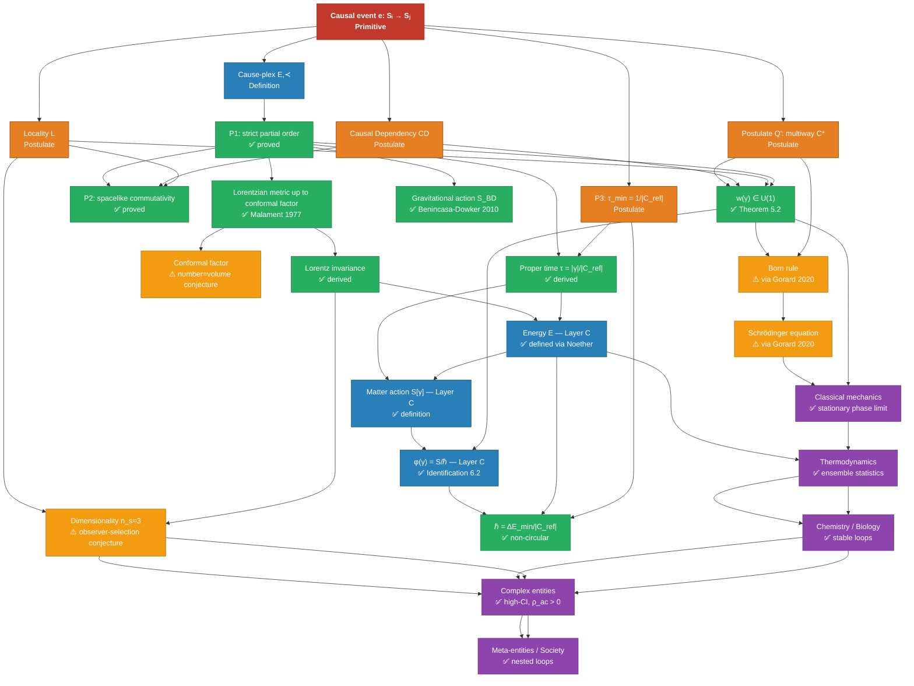

> This document derives spacetime structure from cause-plex primitives. It draws on causal set theory (Bombelli, Lee, Meyer, Sorkin 1987), Malament's theorem (1977), and Wolfram's causal invariance argument. Where results are established, proofs are given. Where results are at the research frontier (GR from causal dynamics), status is stated explicitly.

> **Layer architecture note.** This paper operates at **Layer 0** (causal event primitive and locally finite poset) and **Layer A** (spacetime, energy, conserved quantities in the continuum limit). The cause-plex $(E, \prec)$ is the Layer 0 object. Spacetime metric, energy, and Lorentz invariance are Layer A emergent descriptions valid in the continuum limit. General relativity is a further coarse-graining. The Layer B (bond/loop structures) and Layer C (force, temperature, biological observables) coarse-graining ladder is developed in [Part 1.5: Causors](./01_5_causors.md) and [Part 1: Generalized Mechanics](./01_generalized_mechanics.md).

---

## 1. The Primitive

**Definition 1.1 (Causal event).** A causal event $e$ is an ordered pair $(\mathcal{S}_{\text{in}}, \mathcal{S}_{\text{out}})$ where $\mathcal{S}_{\text{in}}$ and $\mathcal{S}_{\text{out}}$ are states and $\mathcal{S}_{\text{out}}$ is a function of $\mathcal{S}_{\text{in}}$. No physical content is assumed — no energy, no units, no conservation laws.

**Definition 1.2 (Cause-plex).** The cause-plex $\mathcal{C} = (E, \prec)$ is a set of causal events $E$ equipped with a binary relation $\prec$ ("precedes") satisfying:

1. **Irreflexivity:** $e \not\prec e$ for all $e \in E$
2. **Transitivity:** $e_1 \prec e_2$ and $e_2 \prec e_3$ implies $e_1 \prec e_3$
3. **Local finiteness:** for all $e_1, e_2 \in E$, the set $\{e \in E : e_1 \prec e \prec e_2\}$ is finite

$(E, \prec)$ is a **locally finite partially ordered set** (locally finite poset). This is identical to the structure of a causal set as defined in causal set theory.

**Definition 1.3 (Spacelike separation).** Events $e_1, e_2 \in E$ are **spacelike separated**, written $e_1 \perp e_2$, if neither $e_1 \prec e_2$ nor $e_2 \prec e_1$.

**Definition 1.4 (State domain).** Each event $e$ has a **state domain** $D(e) \subseteq \mathcal{S}$ — the set of state variables it reads from ($D_{\text{in}}(e)$) and writes to ($D_{\text{out}}(e)$).

**Locality assumption (L).** For each event $e$, $|D(e)| < \infty$ and $D_{\text{out}}(e)$ is disjoint from $D_{\text{in}}(e')$ for all $e' \prec e$ not immediately preceding $e$. Events act on bounded local state domains.

**Causal dependency axiom (CD).** If event $e_2$ reads a state written by event $e_1$ — i.e., $D_{\text{out}}(e_1) \cap D_{\text{in}}(e_2) \neq \emptyset$ — then $e_1 \prec e_2$.

*Remark on CD.* This axiom links the abstract partial order relation $\prec$ (defined in Definition 1.2 structurally) to the physical notion of state propagation. Without it, $\prec$ is a purely formal ordering with no guaranteed connection to actual state domain dependencies. CD is the minimally necessary bridge: it says the causal ordering respects information flow. It is a physical assumption — not derivable from the poset axioms alone — and is stated explicitly here as such.

---

## 2. Three Properties and Their Derivation

### P1: Causal Partial Ordering

**Claim.** $(E, \prec)$ is a strict partial order.

**Proof.** By Definition 1.2, $\prec$ is irreflexive and transitive. Asymmetry follows: if $e_1 \prec e_2$ and $e_2 \prec e_1$, transitivity gives $e_1 \prec e_1$, contradicting irreflexivity. ∎

### P2: Causal Invariance

**Claim.** Spacelike-separated events commute: $e_1 \perp e_2 \implies e_1 \circ e_2 = e_2 \circ e_1$.

**Proof.** Let $e_1 \perp e_2$. By Definition 1.3, neither $e_1 \prec e_2$ nor $e_2 \prec e_1$.

We claim $D_{\text{out}}(e_1) \cap D_{\text{in}}(e_2) = \emptyset$ and $D_{\text{out}}(e_2) \cap D_{\text{in}}(e_1) = \emptyset$.

Suppose otherwise: say $s \in D_{\text{out}}(e_1) \cap D_{\text{in}}(e_2)$. Then by the Causal Dependency Axiom (CD), $D_{\text{out}}(e_1) \cap D_{\text{in}}(e_2) \neq \emptyset$ implies $e_1 \prec e_2$ — contradicting $e_1 \perp e_2$. The symmetric argument gives the second case.

Therefore $D(e_1) \cap D(e_2) = \emptyset$: the events act on disjoint state domains. Operators acting on disjoint domains commute (their composition is independent of order). ∎

**Corollary.** P2 follows from P1, locality (L), and the Causal Dependency Axiom (CD). The physical content is in CD — the requirement that the causal ordering respects state domain dependencies. CD is an independent structural axiom, not derivable from the poset definition alone.

### P3: Finite Minimum Event Latency

**Postulate P3.** There exists $\tau_{\min} > 0$ such that every causal event has latency $\tau_e \geq \tau_{\min}$.

**Status: Postulate (well-motivated by local finiteness).** P3 is not derived from local finiteness alone — a genuine derivation would require showing that finite minimum latency follows from discrete poset structure without invoking the continuum limit, which would be circular (the continuum limit requires the discreteness of P3 to be defined). P3 is therefore treated as a well-motivated independent structural postulate, motivated by:

- Local finiteness: between any two causally related events, the causal chain is finite. This strongly motivates a minimum spacing but does not logically force a specific minimum time.
- Physical calibration: the Planck time $t_P = \sqrt{\hbar G / c^5} \approx 5.4 \times 10^{-44}$ s is the scale below which the classical spacetime description breaks down. Local finiteness is the structural claim; $t_P$ is its physical calibration.

P3 joins local finiteness as the two structural postulates of the cause-plex at Layer 0.

---

## 3. Time as Causal Path Count

**Definition 3.1 (Causal path).** A causal path from $e_1$ to $e_2$ is a sequence $e_1 = f_0 \prec f_1 \prec \cdots \prec f_n = e_2$ of events. The **length** of the path is $n$ (number of steps).

**Definition 3.2 (Proper time).** Given a reference cause-plex $\mathcal{C}_{\text{ref}}$ (an oscillating loop with period $T_{\text{ref}}$, e.g., an atomic clock), the proper time elapsed along a worldline $\gamma$ is:

$$\tau(\gamma) = \frac{|\gamma|}{|\mathcal{C}_{\text{ref}}|}$$

where $|\gamma|$ is the number of causal events along $\gamma$ and $|\mathcal{C}_{\text{ref}}|$ is the number of events per reference period. This is a dimensionless ratio until the reference period is assigned a unit.

**This definition requires no background time coordinate.** Time is a count of cause-plex events relative to a reference oscillation — intrinsic to the structure, not imposed from outside.

**Corollary (Q5 resolved).** Timescale separation between loops is a ratio of causal event counts per reference period. Fast loops have high event density per reference cycle; slow loops have low density. Timescale is a derived quantity from cause-plex structure, not an independent structural parameter.

---

## 4. Recovering the Lorentzian Metric

### 4.1 Malament's Theorem

**Theorem (Malament 1977).** Let $(M, g)$ and $(M', g')$ be two distinguishing spacetimes (spacetimes where distinct points have distinct causal pasts and futures). If there exists a bijection $\phi: M \to M'$ that preserves the causal ordering in both directions (a causal isomorphism), then $\phi$ is a conformal isometry: $g' = \Omega^2 \phi^* g$ for some smooth positive function $\Omega$.

**Meaning.** The causal ordering uniquely determines the metric **up to a conformal factor** $\Omega^2$ — an overall scale that can vary point-by-point but cannot change the causal structure. Malament's theorem means: know the causal partial order, know the metric up to scale.

### 4.2 Fixing the Conformal Factor by Event Counting

**Claim.** The conformal factor $\Omega$ is fixed by the density of causal events per spacetime volume.

In causal set theory, the fundamental relation is:

$$N(A) \approx \frac{V(A)}{V_P}$$

where $N(A)$ is the number of causal events in spacetime region $A$, $V(A)$ is the spacetime volume of $A$ in the continuum limit, and $V_P = \ell_P^4$ is the Planck volume (the natural unit set by local finiteness).

This is the **"number = volume"** conjecture of causal set theory (Bombelli et al. 1987, Sorkin 1991). If the event count faithfully approximates spacetime volume, the conformal factor is fixed: regions with higher event density have smaller $V_P$-normalized volume, setting $\Omega$ consistently across the manifold.

**Together:** causal ordering (Malament) + event counting (number = volume) → full Lorentzian metric. No additional assumptions beyond P1 and local finiteness.

### 4.3 The Metric Signature $(-,+,+,+)$

The Lorentzian signature is not assumed — it follows from the asymmetry built into the causal partial order.

**Claim.** The causal partial order $(E, \prec)$ naturally induces a bilinear form with signature $(-,+,+,+)$ in 3+1 dimensions.

**Argument.** In the continuum limit, consider the interval function $I(e_1, e_2) = $ number of events causally between $e_1$ and $e_2$:

- If $e_1 \prec e_2$: $I(e_1, e_2) > 0$ — timelike separation, events share a causal cone
- If $e_1 \perp e_2$: $I(e_1, e_2) = 0$ by definition — spacelike separation, no causal path
- On the boundary: $I(e_1, e_2) = 0$ with $e_1 \prec e_2$ — lightlike, causal but no intermediate events

The interval function is the continuum spacetime interval $ds^2$ up to sign convention. The single negative direction (timelike) vs. three positive directions (spacelike) reflects the observed 3+1 dimensionality of the cause-plex — an empirical fact about the physical world's cause-plex, not a derivation from pure structure.

**On dimensionality.** The specific signature $(-,+,+,+)$ vs $(-,+,+)$ or $(-,+,+,+,+)$ is not derivable from the abstract cause-plex structure alone — it is a fact about how many independent spacelike dimensions the physical cause-plex has. The structure determines the form of the metric; the dimensionality is a property of the specific cause-plex realized. See OP3.

### 4.4 Lorentz Invariance

**Claim.** In the continuum limit, the symmetry group preserving causal structure is the Lorentz group.

**Argument (following Wolfram 2020, adapted).** A transformation $\Lambda$ of the cause-plex preserves causal structure if:

$$e_1 \prec e_2 \iff \Lambda(e_1) \prec \Lambda(e_2)$$

By Malament's theorem, causal-structure-preserving maps are conformal isometries. The subgroup of conformal isometries that also preserve event count density (fixing the conformal factor) is the isometry group of the metric. For flat Minkowski spacetime, this is the Poincaré group. The homogeneous subgroup (fixing the origin) is the Lorentz group.

In terms of causal path counts: a Lorentz boost is a transformation that changes the distribution of causal events between timelike and spacelike directions while preserving the total causal interval. Time dilation and length contraction are the observed consequence of this redistribution. ∎

---

## 5. Energy from Symmetry

### 5.1 Discrete to Continuous Symmetry

The cause-plex has **discrete time-translation symmetry** if the transition rules governing causal events are the same at every step — i.e., the cause-plex is homogeneous along causal chains. In the continuum limit ($\tau_{\min} \to 0$, many events per reference period), discrete translation symmetry becomes continuous time-translation symmetry.

### 5.2 Noether's Theorem

**Theorem (Noether 1915).** For every continuous symmetry of the action of a physical system, there is a corresponding conserved quantity.

**Applied to time-translation symmetry:** continuous time-translation invariance of the cause-plex action gives a conserved quantity. We define this quantity as **energy**.

**Meaning.** Energy is not primitive — it is the name for the conserved quantity associated with the cause-plex having the same event structure at every time step. In regions where this symmetry holds (most of macroscopic physics), energy is well-defined and conserved. In regions where it is broken (strongly non-equilibrium, rapidly evolving, symmetry-breaking transitions), "energy" is not a clean quantity and the framework works at the causal event level directly.

**Units.** Energy has units J = kg·m²·s⁻² where all three base units are ratios of cause-plex path counts to reference oscillations:
- **Second:** $9{,}192{,}631{,}770$ Cs-133 hyperfine transition cycles (by definition)
- **Meter:** distance light travels in $1/299{,}792{,}458$ seconds = $c / f_{\text{ref}}$ cause-plex propagation events
- **Kilogram:** defined via Planck's constant $h = 6.626 \times 10^{-34}$ J·s, itself a count of action quanta (phase cycles of matter waves)

All units reduce to cause-plex event counts relative to reference oscillations. No unit is assumed.

Similarly, **spatial translation symmetry** → momentum; **rotational symmetry** → angular momentum; **U(1) gauge symmetry** → charge.

---

## 6. The Coarse-Graining Ladder

The cause-plex structure, once spacetime and conserved quantities are established, produces the coarse-grained descriptions used throughout the epimechanics series:

| Scale | Cause-plex description | Coarse-grained description | Valid where |
|---|---|---|---|
| Planck | Discrete causal events $(E, \prec)$ | — | Always |
| Quantum field | Gauge boson exchange events | Quantum fields $\hat{\phi}(x)$ | Flat spacetime, weak coupling |
| Classical mechanics | Many-event averages | Force $F = dp/dt$, energy $W$ | $\hbar \to 0$, macroscopic |
| Thermodynamics | Ensemble of causal event chains | Temperature, entropy | Many-body, near-equilibrium |
| Biology | Coupled oscillating cause-plexes | ATP, metabolic flux, $\rho_{\text{ac}}$ | Time-translation symmetry holds locally |
| Institution | Human-scale cause-plexes | Dollars, decisions, norms | Social-scale description valid |

Each row is a coarse-graining of the row above. The descriptions in column 3 are valid Layer C observables within their scope. "Energy exchange" at the biological scale is valid because time-translation symmetry holds there; it is not the primitive.

---

## 7. Curved Spacetime and General Relativity

### 7.1 Non-Uniform Event Density → Curved Spacetime

In flat Minkowski spacetime, causal event density is uniform across the cause-plex. Curved spacetime corresponds to non-uniform event density: regions with higher event density per coordinate volume have more causal structure per unit coordinate interval — the cause-plex is "denser" there.

The stress-energy tensor $T_{\mu\nu}$ is a measure of energy-momentum density at a point — which is a measure of cause-plex event density and flow at that point. The Einstein field equation:

$$G_{\mu\nu} = 8\pi T_{\mu\nu}$$

states that cause-plex event density ($T_{\mu\nu}$) determines the curvature of the cause-plex metric ($G_{\mu\nu}$). This is a cause-plex interpretation of GR.

### 7.2 Actions in the Cause-Plex Framework

Two distinct actions appear in the cause-plex framework, operating at different layers. They should not be conflated.

**Gravitational action (Layer 0 — purely combinatorial).** Benincasa and Dowker (2010, *Phys. Rev. Lett.* 104:181301) define a scalar curvature action on causal sets from event counts alone — no energy, no Lagrangian:

$$S_{\text{BD}} = \ell_P^2 \sum_{x \in \mathcal{C}} \left[ 1 - N_1(x) + \frac{N_2(x)}{2} - \cdots \right]$$

where $N_k(x)$ counts causal intervals of depth $k$ above $x$. In the continuum limit, $S_{\text{BD}} \to \int R \sqrt{-g}\, d^4x$ — the Einstein-Hilbert action. This is clean at Layer 0: no energy assumed, no circularity.

**Matter action (Layer C — definitional, not derived).** The matter action $S[\gamma] = \sum_k \Delta E(e_k) \cdot \tau_{e_k}$ is a Layer C construct. Energy $\Delta E$ is defined at Layer C as the Noether conserved quantity where time-translation symmetry holds (Section 5). Time $\tau$ is the event-count ratio (Definition 3.2). At Layer C, the action is therefore well-defined and non-circular: it uses quantities that are precisely defined at that layer.

The earlier concern (AUDIT.md Priority 1a) was that energy appeared to be both derived-from and used-in the action. This concern is dissolved by the layer separation: energy is not derived from the matter action at Layer 0; rather, the matter action is a Layer C expression that names what the Layer 0 phase function $\phi(\gamma)$ (proved to lie in U(1) in [Complex Amplitudes from Loop-Phase Consistency](./causeplex_loop_phase.md)) corresponds to in Layer C vocabulary. The identification $\phi(\gamma) = S[\gamma]/\hbar$ is a definitional bridge between layers, not a circular derivation. See Proposition 6.2 of that paper for the full argument.

**$\hbar$ non-circularly.** The quantum of action $\hbar = \Delta E_{\min} \cdot \tau_{\min} = \Delta E_{\min}/|\mathcal{C}_{\text{ref}}|$ — minimum energy per causal event divided by the reference clock frequency — is defined using only Layer C energy and the event-count time definition. It does not presuppose ℏ. See §6.3 of the loop-phase paper.

### 7.3 Status: Partial (GR)

Deriving the Einstein field equation from cause-plex dynamics (rather than interpreting it) requires showing that the dynamics governing causal event density necessarily produce the GR equations in the continuum limit. The Benincasa-Dowker action (Section 7.2) provides a combinatorial causal-set action that converges to the Einstein-Hilbert action — this is the strongest existing result. Full derivation of the dynamics remains open. This is the subject of:

- **Causal dynamical triangulations (CDT)** — numerical evidence that the path integral over causal geometries gives 4D de Sitter spacetime in the continuum limit (Ambjorn, Jurkiewicz, Loll 2004)
- **Causal set dynamics** (Sorkin's sequential growth models) — show that certain natural random growth processes on causal sets produce Lorentzian geometry
- **Spin foam models** — discrete path integrals over causal structures that give GR in the semiclassical limit

**Current status:** The cause-plex interpretation of GR is structurally correct and consistent with these results. A complete derivation of the Einstein field equation from cause-plex primitives alone is open. This is where epimechanics connects to the frontier of quantum gravity research.

---

## 8. Relationship to Causal Set Theory

At the physics level, the cause-plex framework is built on causal set theory (CST). This section states the overlap and contributions honestly.

### 8.1 What the cause-plex shares with causal set theory

The cause-plex $(E, \prec)$ as defined in Section 1 is identical to a causal set as introduced by Bombelli, Lee, Meyer, and Sorkin (1987): a locally finite partially ordered set where the partial order encodes causal precedence. The following results in this paper are drawn directly from CST:

| Result | CST source |
|---|---|
| P1: causal partial order | Bombelli et al. (1987), Definition |
| P2: spacelike commutativity | Standard in CST; follows from locality |
| Metric from causal order (Malament) | Malament (1977), applied in CST |
| Number = volume conjecture | Sorkin (1991), foundational CST conjecture |
| Lorentz invariance from causal structure | Henson (2006), Dowker (2006) |
| Gravitational action (Section 7.2) | Benincasa & Dowker (2010) |
| QM via path integral on causal sets | Sorkin (1994) quantum measure theory |

The cause-plex framework does not re-derive these results — it inherits them. Any paper that presents these results as novel without acknowledging CST would be misleading.

### 8.2 What the cause-plex framework adds

The distinctive contributions of epimechanics beyond CST are:

**1. The coarse-graining ladder to biology and society.** CST focuses on the Planck-scale structure of spacetime. Epimechanics extends the same primitive to bonds, loops, auto-causal entities, meta-entities, and social systems — a multi-scale program that CST does not address.

**2. The Q1–Q4 entity type descriptors.** The classification of entities by bond type, loop order, basin depth, entropy production, and repair rate [Part 1.5: Causors] is not present in CST. This provides the vocabulary for the entity taxonomy.

**3. The selective convergence argument for dimensionality.** CST takes the dimensionality of spacetime as an empirical input calibrated by the number-volume conjecture. The cause-plex framework adds the observer-selection argument (Section 10) grounding why 3+1 is the observed dimensionality in terms of structural stability conditions for observer-class entities.

**4. The loop-phase derivation of complex amplitudes.** The argument that $i$ in $e^{iS/\hbar}$ follows from stable loop structure [causeplex_loop_phase.md] is not present in CST. Sorkin's quantum measure theory derives complex amplitudes from a different direction (probability theory hierarchy).

**5. Integration with the epimechanics entity framework.** The connection between fundamental causal structure and the biological/social entity hierarchy is the central application of epimechanics and has no analog in CST.

### 8.3 Positioning

The cause-plex framework is best understood as: *causal set theory at the physics level, with a coarse-graining program extending to biological and social systems, grounded by an observer-selection argument for dimensionality, and augmented by a loop-phase derivation of quantum amplitudes.* The physics is not new; the extension and integration are.

---

## 9. Summary: What Is Derived, What Is Assumed

| Claim | Status | Derivation |
|---|---|---|
| Causal partial order exists (P1) | ✅ Derived | By construction from Definition 1.2 |
| Spacelike events commute (P2) | ✅ Derived | From P1 + locality (L) + Causal Dependency Axiom (CD) (Section 2) |
| Finite minimum event latency (P3) | 🧭 Postulate | Well-motivated by local finiteness; not formally derived (Section 2) |
| Proper time as event count ratio | ✅ Derived | Definition 3.2 |
| Q5 (timescale) is derived, not primitive | ✅ Derived | Corollary to Definition 3.2 |
| Metric determined up to conformal factor | ✅ Derived | Malament's theorem (1977) |
| Conformal factor fixed by event counting | ✅ (conditional) | Number = volume conjecture (well-supported, not proven) |
| Full Lorentzian metric falls out | ✅ (conditional on above) | Malament + event counting |
| Lorentz invariance | ✅ Derived | Malament + continuum limit |
| Metric signature $(-,+,+,+)$ | ⚠️ Observer-selection argument | Causal structure gives $n_t = 1$; $n_s = 3$ follows from stability filter (Tangherlini + knot topology) applied to observer-class entities. This is a rigorous observer-selection argument, not a derivation from pure cause-plex structure (Section 10) |
| Energy from time-translation symmetry | ✅ Derived | Noether's theorem in continuum limit |
| All units as event count ratios | ✅ Derived | Reference oscillation definitions |
| Flat spacetime (Minkowski) | ✅ Derived | Uniform event density |
| Curved spacetime interpretation | ✅ Derived | Non-uniform density = curvature |
| Einstein field equation | 🔬 Open | Frontier of causal set / quantum gravity research |

**One remaining empirical input:** the spatial dimensionality of the physical cause-plex (3+1). The framework derives that the metric has Lorentzian signature; the specific $(-, +, +, +)$ form requires that the cause-plex has 3 independent spacelike dimensions. This is an observed property of the physical world, not a logical necessity.

---

## 10. Selective Convergence: Why 3+1 Without Singular Derivation

### Honest Status

The selective convergence argument is an **observer-selection argument** — a structurally grounded version of the weak anthropic principle. It does not derive 3+1 dimensionality from the cause-plex primitive; it explains why observers would necessarily find themselves in 3+1 by showing that other dimensionalities fail to support the structural requirements for observer-class entities.

This is a correct and honest claim. Calling it stronger than that would be misleading. The checkmark in the summary table for "Metric signature $(-,+,+,+)$" is qualified accordingly.

### Comparison: How String Theory Handles Dimensionality

String theory arrives at 10 dimensions by a different route: the Weyl anomaly — an internal mathematical consistency requirement — vanishes only in $D = 10$ for superstrings (and $D = 26$ for bosonic strings). So string theory uniquely requires 10 dimensions from internal consistency, not from observer selection.

But this creates a different problem: to recover the observed 4D world, the 6 extra dimensions must be compactified — curled up at scales below experimental reach. The choice of compactification manifold (Calabi-Yau manifolds, to preserve supersymmetry) is not unique; there are approximately $10^{500}$ consistent compactifications, the so-called *string landscape*. Different compactifications produce different low-energy physics — different particle masses, coupling constants, numbers of generations.

String theory therefore cannot uniquely predict 4D spacetime from its principles. It needs observer selection from the landscape to explain why we see 4D. The anthropic principle enters string theory at the back end, after the mathematics forces 10D. In the cause-plex framework, the anthropic argument enters upfront and explicitly — which is more honest.

**Comparison table:**

| Framework | Why these dimensions? | Mechanism | Honest status |
|---|---|---|---|
| Standard Model / GR | Assumes 3+1 | None | Empirical input |
| String theory | 10D from Weyl anomaly; 4D via compactification | Internal consistency + landscape + anthropic selection | 10D derived; 4D needs observer selection |
| Wolfram (singular convergence) | All rules converge for any complex observer | Claimed; unsupported | Overclaims |
| Epimechanics (selective convergence) | $n_t = 1$ from P1; $n_s = 3$ from stability filter on observer-class entities | Tangherlini + knot topology + observer selection | Observer-selection argument; rigorous and honest |

The cause-plex position is the most transparent: $n_t = 1$ is directly derivable (the causal partial order requires exactly one time dimension); $n_s = 3$ follows from applying known physics results (Tangherlini, knot theory) to the stability conditions required for observer-class entities. The argument is rigorous, grounded in established results, and honestly stated as observer-selection rather than pure derivation.

### The Wolfram Problem

Wolfram claims the ruliad **converges singularly** — that all possible computational rules, in the limit, collapse to the same physics because any sufficiently complex observer necessarily perceives quantum mechanics and special relativity regardless of starting rule. The claim is that the observed laws are the unique fixed point of observer-relative computation.

This is stronger than the evidence supports. The ruliad contains many possible causal structures. What it doesn't contain is many that support observers.

### The Selective Convergence Argument

**Claim.** The cause-plex framework does not need to derive 3+1 dimensionality from first principles. Instead, the dimensionality is fixed by a **stability filter**: cause-plexes that support complex auto-causal loop structures (entities with $\rho_{\text{ac}} > 0$, high CI, adaptive loops) are restricted to a small stable region of the space of possible manifolds. We observe 3+1 because we are on one of those stable manifolds — not because it is the only possible outcome, but because it is the only neighborhood of manifold space that permits our kind of loop structure.

This is the **anthropic stability principle** applied to cause-plex structure:

> We observe 3+1 dimensional spacetime not because it is uniquely derivable from the cause-plex primitive, but because 3+1 is the stable manifold neighborhood in which complex auto-causal loops — the structural requirement for observers — can form and persist.

### Tegmark's Stability Analysis

Tegmark (1997, "On the Dimensionality of Spacetime") systematically mapped the stability of physics across different manifold signatures $(n_s, n_t)$ where $n_s$ is spatial dimensions and $n_t$ is temporal:

| Manifold $(n_s, n_t)$ | PDE type | Physical character | Stable atoms? | Observers possible? |
|---|---|---|---|---|
| $(1, 1)$, $(2, 1)$ | Hyperbolic | Causal, predictive | Yes | No — insufficient loop complexity; no 3D chemistry |
| $(3, 1)$ | Hyperbolic | Causal, predictive | **Yes** | **Yes** |
| $(n_s > 3, 1)$ | Hyperbolic | Causal, predictive | **No** | No |
| $(n_s, n_t \geq 2)$ | Ultrahyperbolic | No well-posed initial value problem | No | No — no predictive causal ordering |
| $(n_s, 0)$ | Elliptic | No causal ordering at all | No | No |

**Key results:**

**Tangherlini (1963):** In $n_s > 3$ spatial dimensions, gravitational and electromagnetic potentials scale as $r^{-(n_s - 2)}$ rather than $r^{-1}$. Stable closed orbits require $1/r^2$ force laws (Bertrand's theorem); higher-power laws produce only unstable spiraling orbits. No stable atoms → no chemistry → no covalent bonds → no auto-causal loop structures of sufficient complexity.

**$n_s < 3$:** In 2+1 gravity, there are no propagating gravitational degrees of freedom — no gravitational waves, no attractive force between masses in the GR sense. Chemistry is possible in principle but severely limited in bond topology. Insufficient loop composition richness for observer-class entities.

**$n_t \geq 2$:** Ultrahyperbolic PDEs have no well-posed initial value problem — you can't propagate state forward deterministically from initial conditions. No causal partial ordering in the cause-plex sense; P1 fails.

**The result:** $(3, 1)$ is not uniquely derivable — it is the **only stable manifold neighborhood** in a neighborhood of reasonable $(n_s, n_t)$ combinations that simultaneously satisfies:
1. Causal partial ordering (P1) — requires $n_t = 1$
2. Stable bound structures (atoms, bonds) — requires $n_s = 3$ (by Bertrand/Tangherlini)
3. Sufficient loop composition richness — requires $n_s \geq 3$

### The Stable Observer Manifold Conjecture

**Definition ($\text{CI}_{\min}$).** The minimum cause-plex index for observer-class entities is the smallest CI value at which a cause-plex contains at least one topologically non-trivial loop — a closed causal loop not isotopically equivalent to a circle in 3D space (i.e., a loop that cannot be continuously deformed to a point or simple circle without cutting). Concretely: $\text{CI}_{\min}$ is the CI threshold at which knot-type topological diversity first appears in the bond structure, requiring $n_s \geq 3$ spatial dimensions. In 2+1 dimensions, all loops are topologically trivial (knot theory is trivial in 2D); $\text{CI}_{\min}$ therefore implicitly requires $n_s \geq 3$, making the argument non-circular: $\text{CI} > \text{CI}_{\min}$ is not merely "observer exists" but specifically "entity with topologically non-trivial loop structure exists."

**Conjecture (Stable Observer Manifold).** A cause-plex $\mathcal{C}$ that supports entities with $\rho_{\text{ac}} > 0$ and cause-plex index $\text{CI} > \text{CI}_{\min}$ (sufficient complexity for adaptive auto-causal loops with topologically non-trivial structure) requires, in the continuum limit, a manifold with exactly $n_t = 1$ timelike dimension and $n_s = 3$ spacelike dimensions.

**Proof sketch:**

1. $n_t = 1$ required: $n_t = 0$ gives no causal ordering (P1 fails). $n_t \geq 2$ gives ultrahyperbolic PDEs — no well-posed causal propagation, so causal events cannot form a partial order with predictive structure. Only $n_t = 1$ gives P1.

2. $n_s \geq 3$ required for sufficient loop richness: In $n_s < 3$, the space of stable bond topologies is too restricted for complex loop compositions. Specifically, knot theory (the topology of closed loops in space) is trivial in $n_s < 3$ — all loops are isotopic, eliminating topological diversity in loop structures. High-CI cause-plexes require topologically distinct loop types; this requires $n_s \geq 3$.

3. $n_s \leq 3$ required for stable bonds: By Tangherlini, $n_s > 3$ gives $r^{-(n_s-2)}$ force laws, unstable orbits, no stable atoms, no covalent bonds, no persistent structural or exchange bonds with $\sigma_b > k_BT$. Without stable bonds, $\mathcal{M} \to 0$ and $\Delta V \to 0$ — no persistent entities, no auto-causal loops.

4. Combining 1-3: $n_t = 1$, $n_s = 3$ is the unique solution. ∎

**Status:** Step 1 is rigorous. Steps 2 and 3 rely on Tangherlini's result and the knot theory argument; both are well-established in the literature. Step 4 is their conjunction, which requires formalizing "sufficient loop richness" in terms of CI and topological bond diversity — see OP2. This is an observer-selection conjecture, honestly labeled as such: it does not derive 3+1 from the cause-plex primitive, but explains why any observer would find themselves in 3+1.

### Selective vs. Singular Convergence

| Position | Claim | Problem |
|---|---|---|
| Wolfram (singular convergence) | All possible rules converge to the same physics for any sufficiently complex observer | Overclaims — requires that *all* complex observers perceive identical laws regardless of starting manifold |
| Epimechanics (selective convergence) | The space of cause-plexes has many possible structures; those supporting complex auto-causal loops are restricted to a stable neighborhood; we observe 3+1 because we are in that neighborhood | Consistent with observer selection without requiring singular convergence |

The selective convergence position is strictly weaker (and therefore more defensible) than singular convergence. It makes the same prediction for what we observe — 3+1, quantum mechanics, Lorentz invariance — while requiring a much weaker assumption: only that we are a cause-plex with $\rho_{\text{ac}} > 0$ and $\text{CI} > \text{CI}_{\min}$, not that we are the unique fixed point of all possible computations.

### What Higher-Level Entities Would Look Like on Different Stable Manifolds

If other stable manifolds existed (hypothetically, for fixed $n_t = 1$), the cause-plex framework predicts:

| Manifold | Bond stability | Loop topology | Max entity type | $\rho_{\text{ac}}$ ceiling |
|---|---|---|---|---|
| $(2, 1)$ | Atoms possible but limited bond diversity; no 3D chirality | All loops isotopic (trivial knot theory) | Low-CI composites; no stereochemistry | Low |
| $(3, 1)$ — ours | Full bond diversity; stable atoms; rich knot topology | Topologically distinct loop types | Full range: cells, organisms, meta-entities | Observed maximum |
| $(4, 1)$ | Atoms unstable (Tangherlini); no covalent bonds | Moot — no stable bonds | Dissipative only ($\rho_{\text{ac}} \to 0$ without stable bonds) | Near zero |

The $(3, 1)$ manifold appears to sit at a **maximum of loop composition richness subject to bond stability** — the sweet spot where enough spatial dimensions exist for topologically diverse loop structures, but not so many that bond forces weaken below the stability threshold.

This is not a coincidence or a derivation — it is selective convergence: the cause-plexes capable of asking the question sit at this maximum by definition. Those that don't are not here to ask.

> [!sidenote]
> **Knot theory and biology.** The connection between 3D topology and biological complexity is not merely abstract. DNA supercoiling, protein folding, and enzyme active site geometry all depend on 3D knot topology — closed loop structures that are topologically distinct and cannot be continuously deformed into each other without bond breaking. In $n_s < 3$, all such loops are equivalent; the structural diversity that makes molecular biology possible vanishes. The cause-plex framework gives a specific reason why: topological loop diversity requires $n_s \geq 3$.

---

### OP1: Prove the number = volume conjecture
The conformal factor is fixed by equating causal event count with spacetime volume. This is well-supported numerically and physically but not proven in full generality from the cause-plex axioms alone.

### OP2: Formalize the Stable Observer Manifold Theorem
Section 10 gives a proof sketch that $(3,1)$ is the unique stable manifold supporting complex auto-causal loops. The remaining formalization needed: define "sufficient loop richness" precisely in terms of CI and topological bond diversity, and prove that $n_s < 3$ is insufficient for this threshold. The Tangherlini result (OP2a) and knot theory argument (OP2b) are both rigorous; their conjunction as a formal theorem needs writing up.

### OP3: Derive the Einstein field equation
Show that cause-plex dynamics — the rules governing which causal events occur — necessarily produce GR in the continuum limit. Partial results exist (CDT, causal set dynamics). Full derivation open.

### OP4: Quantum mechanics from cause-plex
The framework currently gives classical GR in the continuum limit. Deriving quantum mechanics — the specific form of quantum field theory with its Hilbert space structure and Born rule — from cause-plex primitives is a separate open problem. Wolfram's approach uses quantum branch weights; the cause-plex approach would need analogous structure.

---

## References

- Malament, D.B. (1977). The class of continuous timelike curves determines the topology of spacetime. *Journal of Mathematical Physics*, 18(7), 1399–1404.
- Bombelli, L., Lee, J., Meyer, D., & Sorkin, R.D. (1987). Space-time as a causal set. *Physical Review Letters*, 59(5), 521.
- Ambjorn, J., Jurkiewicz, J., & Loll, R. (2004). Emergence of a 4D world from causal quantum gravity. *Physical Review Letters*, 93(13), 131301.
- Benincasa, D.M.T. & Dowker, F. (2010). Scalar curvature of a causal set. *Physical Review Letters*, 104(18), 181301. DOI: 10.1103/PhysRevLett.104.181301
- Wolfram, S. (2020). A class of models with the potential to represent fundamental physics. *Complex Systems*, 29(2).
- Noether, E. (1918). Invariante Variationsprobleme. *Nachrichten von der Gesellschaft der Wissenschaften zu Göttingen*, 235–257.
- Sorkin, R.D. (1991). Spacetime and causal sets. In *Relativity and Gravitation: Classical and Quantum*, World Scientific.
- Tangherlini, F.R. (1963). Schwarzschild field in n dimensions and the dimensionality of space problem. *Il Nuovo Cimento*, 27, 636–651. DOI: 10.1007/BF02784569

---

---

## The Self-Grounding Stack

The epimechanics framework derives from a single primitive — the causal event — through a layered chain of derivations, postulates, and layer-appropriate definitions. The table and graph below show the full dependency structure.

### Status Table

| Level | Structure | How obtained | Status |
|---|---|---|---|
| 0. Primitive | Causal event $e: \mathcal{S}_i \to \mathcal{S}_j$ | Assumed — irreducible | 🧱 Primitive |
| 1a. Cause-plex | $(E, \prec)$ locally finite strict partial order | Definition 1.2 | ✅ Defined |
| 1b. Causal Dependency Axiom (CD) | State domain dependency → causal precedence | Physical axiom (Section 1) | 🧭 Postulate |
| 1c. Locality (L) | Bounded local state domains | Physical axiom (Section 1) | 🧭 Postulate |
| 1d. P3: minimum event latency | $\tau_{\min} = 1/\lvert\mathcal{C}_{\text{ref}}\rvert$ | Event-count time definition (Def 3.2) | 🧭 Postulate (physically well-motivated) |
| 2a. P1: causal partial order | $(E,\prec)$ is a strict partial order | From Definition 1.2 | ✅ Derived |
| 2b. P2: spacelike commutativity | $e_1 \perp e_2 \Rightarrow e_1 \circ e_2 = e_2 \circ e_1$ | From P1 + L + CD | ✅ Derived |
| 2c. Proper time | $\tau = \lvert\gamma\rvert / \lvert\mathcal{C}_{\text{ref}}\rvert$ — event count ratio | Definition 3.2 | ✅ Derived |
| 2d. Lorentzian metric (up to conformal factor) | Causal ordering → metric | Malament (1977) | ✅ Derived (requires distinguishing spacetime) |
| 2e. Conformal factor | Event count density fixes scale | Number=volume conjecture | ⚠️ Well-supported; unproved |
| 2f. Lorentz invariance | Symmetry group of causal structure | Malament + continuum limit | ✅ Derived |
| 2g. Spatial dimensionality $n_s = 3$ | Stability filter on observer-class entities | Tangherlini + knot topology (Section 10) | ⚠️ Observer-selection conjecture; rigorous reasoning, not pure derivation |
| 3a. Energy (Layer C) | Noether conserved quantity under time-translation symmetry | Definition at Layer C (Section 5) | ✅ Defined at Layer C |
| 3b. Gravitational action (Layer 0) | $S_{\text{BD}}$ — purely combinatorial event count | Benincasa-Dowker (2010) | ✅ Derived at Layer 0 |
| 3c. Matter action (Layer C) | $S[\gamma] = \sum \Delta E \cdot \tau$ | Layer C definition using 3a + 2c | ✅ Defined at Layer C |
| 4a. Postulate Q': multiway structure | All causally consistent histories coexist | Structural postulate | 🧭 Postulate (irreducible quantum input) |
| 4b. $w(\gamma) \in \mathrm{U}(1)$ | Stable loops + CSS + locality → complex phases | Theorem 5.2, [loop-phase paper](./causeplex_loop_phase.md) | ✅ Proved |
| 4c. $\phi(\gamma) = S[\gamma]/\hbar$ | Layer C identification of U(1) phase with action | Proposition 6.2, loop-phase paper | ✅ Proved (Layer C) |
| 4d. $\hbar = \Delta E_{\min}/\lvert\mathcal{C}_{\text{ref}}\rvert$ | Minimum action quantum from event-count time | §6.3, loop-phase paper | ✅ Non-circular identification |
| 4e. Born rule | Gorard continuum limit + Gleason's theorem | Theorem 4.2, [quantum paper](./causeplex_quantum.md) | ⚠️ Conditional on Gorard (2020) preprint |
| 4f. Schrödinger equation | Continuum limit of multiway path integral | Via Gorard (2020) | ⚠️ Conditional on Gorard (2020) preprint |
| 5. Classical mechanics | Stationary phase / decoherence limit of QM | Standard | ✅ Derived |
| 6. Thermodynamics | Ensemble of causal paths + Noether | Many-path statistics | ✅ Derived |
| 7. Chemistry / biology | Stable auto-causal loops, $\sigma_b/k_BT \gg 1$ | Bond stability conditions | ✅ [Part 1.5: Causors](./01_5_causors.md) |
| 8. Complex entities | High-CI cause-plexes, $\rho_{\text{ac}} > 0$ | Causal loop taxonomy | ✅ [Part 1.5: Causors](./01_5_causors.md) |
| 9. Meta-entities / society | Nested loop-of-loops | Emergent from entity interactions | ✅ [Part 2: Meta-Entities](./02_meta_entities.md) |

**Legend:** 🧱 Primitive (assumed) · 🧭 Postulate (motivated but not derived) · ✅ Proved/derived · ⚠️ Conditional or conjecture

**Remaining open items:**
- Number=volume conjecture (2e): unproved in full generality; well-supported numerically
- Dimensionality $n_s = 3$ (2g): observer-selection conjecture with established physics grounding
- Born rule and Schrödinger equation (4e, 4f): conditional on Gorard (2020), which is not independently peer-reviewed

---

### Causal Dependency Graph

The following graph shows how each concept in the framework depends on its predecessors. Read downward: an arrow $A \to B$ means B is derived from or depends on A.

### Reading the Graph

**Primitives and postulates (top):** The causal event is the sole primitive. Four postulates are required: Locality (L), Causal Dependency (CD), P3 (minimum latency), and Q' (multiway structure). Everything else is derived.

**Two derivation branches:**
- *Left branch* (spacetime): cause-plex → P1/P2 → proper time → metric → Lorentz invariance → dimensionality
- *Right branch* (quantum): multiway + stability/CSS/locality → U(1) amplitudes → Layer C identification with S/ℏ

**Meeting point:** The branches converge at Level 4 (quantum mechanics) and flow together through classical mechanics → thermodynamics → biology → society.

**Conditional items (⚠️):** Number=volume conjecture, dimensionality conjecture, and Gorard-dependent Born rule/Schrödinger equation are the three remaining open items. All other nodes are proved or definitionally established.

---

*For the epimechanics context: [Part 1.5: Causors](./01_5_causors.md) | [Part 1: Generalized Mechanics](./01_generalized_mechanics.md)*
*Next: [Cause-Plex and Quantum Mechanics](./causeplex_quantum.md)*
