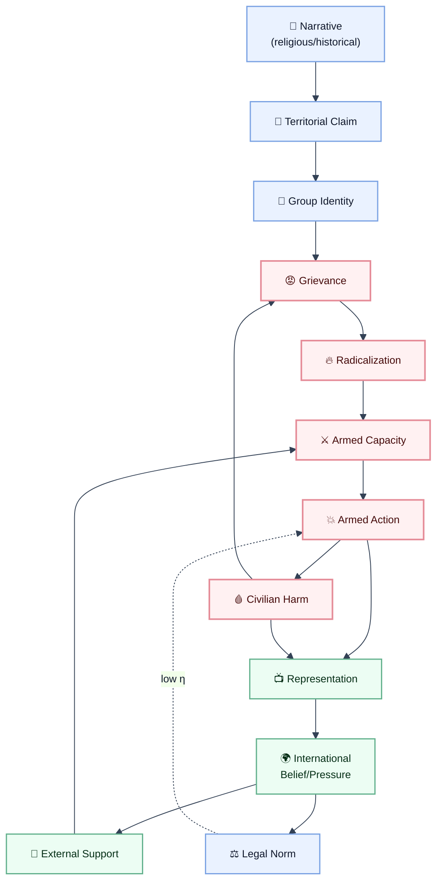

> [!draft]
> This document is a draft pending formal grounding in [Part 2.5: Entity Interaction](./02_5_entity_interaction.md). The coupling chain analysis here is correct but should be read after establishing the entity existence conditions, interaction taxonomy, and loop-coupling framework in Part 2.5.

## Framing Note

This is a **structural analysis**, not a political one. The epimechanics coupling framework is morally neutral: it describes how causes produce effects, not who is right. The same loop structure that sustains one actor's violence sustains another's. The goal is to identify which coupling elements make the system self-sustaining — and which, if changed, would shift it toward a different attractor.

See [Coupling Chain Examples](./coupling_chains.md) for the formal method and simpler worked examples.

---

## The Entity Vocabulary

Unlike muscle contraction (ATP, Ca²⁺, myosin), conflict systems involve **soft entities** — quantities that are real and causally potent but harder to measure. Their dimensional signatures are not in Joules but in:

| Entity | Type | Approximate "unit" |
|---|---|---|
| Religious narrative | Belief carrier | Adherents × intensity |
| Territorial claim | Legal/symbolic | km² × legitimacy weight |
| Grievance | Accumulated harm | Harm events × recency × attribution |
| Identity | Group membership | People × salience |
| Armed capacity | Force potential | Personnel × weapons × organization |
| Political mandate | Legitimacy | Population support × institutional recognition |
| International recognition | Diplomatic status | State recognitions × veto-holder alignment |
| Economic resource | Material flow | $/year (oil, water, trade, aid) |
| Media representation | Narrative reach | Audience × framing × repetition |
| Legal norm | Constraint | Treaty force × enforcement probability |
| Civilian harm | State variable | Deaths + displacement + destruction |
| Radicalization | Belief state shift | Population fraction × intensity |
| Retaliatory action | Force event | Scale × target × timing |

The coupling tensor $T^i{}_j$ between these entities is **highly state-dependent** — the same event (e.g., civilian deaths) has different conversion ratios into radicalization depending on prior grievance level, attribution certainty, and existing narrative frames.

---

## The Primary Coupling Chains

### Chain 1: Narrative → Territorial Claim → Actor Mobilization

The deepest root coupling — how a religious or historical narrative generates motivated actors.

| Step | From | Transducer | To | Notes |
|---|---|---|---|---|
| 1 | Sacred text / historical narrative | Interpretation / clergy / education | Territorial claim (divine promise, ancestral right) | Multiple competing interpretations possible |
| 2 | Territorial claim | Political organization | Group identity around claim | Claim must be made *salient* — not automatic |
| 3 | Group identity | Grievance accumulation | Motivated actor pool | Requires perceived threat to identity or claim |
| 4 | Motivated actor pool | Organization / recruitment | Armed capacity | Depends on leadership, funding, state failure |
| 5 | Armed capacity | Strategic decision | Armed action | Gate: leadership calculus, perceived costs/benefits |

**Key couplings:**

| Coupling | Transducer | $\eta$ notes |
|---|---|---|
| Narrative → claim | Interpretive authority | Multiple competing claimants possible from same source text |
| Claim → identity | Political salience | Low in peacetime; high under perceived threat |
| Identity → actor pool | Grievance + leadership | Requires both — identity alone is insufficient |
| Actor pool → armed capacity | Organization + resources | State failure dramatically raises $\eta$ |

> [!sidenote]
> **Competing narratives from the same source.** The same religious text can generate claims to the same territory by different groups. The coupling $T^{\text{claim}}_{\text{narrative}}$ is not 1:1 — it is a one-to-many mapping. The relevant tensor element is not "does the text say X" but "which interpretation gains political salience, and through what authority structure."

---

### Chain 2: The Violence Loop (Self-Sustaining Core)

The central auto-causal loop. This is what makes conflicts persist long after their initiating conditions have changed.

| Step | From | Transducer | To | Notes |
|---|---|---|---|---|
| 1 | Armed action | Military/militant operation | Civilian harm | Collateral damage, targeting, siege |
| 2 | Civilian harm | Attribution process | Grievance (attributed to actor X) | Attribution depends on media, prior beliefs |
| 3 | Grievance | Recruitment narrative | Radicalization + new actor pool | "They killed our people" — joins the loop |
| 4 | Radicalization | Organization | Retaliatory capacity | Time delay: months to years |
| 5 | Retaliatory capacity | Strategic decision | Retaliatory action | Loop closes → back to step 1 |

#### The Loop as a Causal Operator

$$\mathcal{L}_{\text{violence}} : \text{Action} \xrightarrow{T_1} \text{Harm} \xrightarrow{T_2} \text{Grievance} \xrightarrow{T_3} \text{Radicalization} \xrightarrow{T_4} \text{Capacity} \xrightarrow{T_5} \text{Action}$$

This loop has $\rho_{\text{ac}} > 0$ — it is **auto-causal**. Each turn regenerates the conditions for the next. The loop persists as long as:

$$\prod_{k=1}^{5} T_k > 1 \quad \text{(loop gain exceeds 1)}$$

If any $T_k \to 0$, the loop breaks. If all $T_k$ are small but nonzero, the loop slowly decays. If any $T_k \gg 1$, the loop amplifies.

**What keeps loop gain > 1:**
- High civilian harm per operation (large $T_1$)
- Clear attribution (high $T_2$) — ambiguous attribution reduces grievance conversion
- Strong recruitment narrative (high $T_3$) — pre-existing identity salience amplifies
- Sufficient organizational capacity (high $T_4$) — state failure removes barriers
- Low strategic cost of retaliation (high $T_5$) — asymmetric warfare enables small actors

---

### Chain 3: International Actor Coupling

External actors don't just observe — they are coupled into the system and modulate coupling coefficients throughout.

| Step | From | Transducer | To | Notes |
|---|---|---|---|---|
| 1 | Strategic interest | Foreign policy calculus | Support decision (military, financial, diplomatic) | Interest = energy, arms, access, ideology |
| 2 | External support | Transfer (weapons, money, intelligence) | Armed capacity of supported actor | Direct coupling into Chain 1 step 5 |
| 3 | Armed capacity | Military action | Battlefield outcome | Shifts territorial control |
| 4 | Battlefield outcome | Media representation | International perception | Filtered through each actor's framing |
| 5 | International perception | Domestic political pressure | Foreign policy update | Loop may reverse or reinforce support |
| 6 | Legal norm (international law) | Enforcement mechanism | Constraint on action | Low $\eta$: no binding enforcement without UNSC consensus |

**Key observation:** International actors are **modulators of $T_k$**, not separate from the loop. Arms supply directly raises $T_4$ (radicalization → capacity). Diplomatic shield lowers the cost term in $T_5$. Sanctions raise it. The coupling chain is not separable from its external drivers.

> [!sidenote]
> **Veto-holder alignment as a constraint on legal norm coupling.** The UN Security Council veto means international legal norms have near-zero enforcement $\eta$ when the violating party is protected by a veto holder. This is a structural zero in the tensor — $T^{\text{constraint}}_{\text{law}} \approx 0$ — regardless of how clearly the norm is violated.

---

### Chain 4: Representation → Belief → Diplomatic Pressure

How narrative framing outside the conflict zone feeds back into it.

| Step | From | Transducer | To | Notes |
|---|---|---|---|---|
| 1 | Event (harm, action) | Media selection + framing | Represented narrative | Selection bias: which events reach which audiences |
| 2 | Represented narrative | Audience belief updating | Public belief state (per country) | Bayesian updating weighted by prior identity |
| 3 | Public belief state | Electoral pressure / protest | Political mandate on foreign policy | Varies by democratic responsiveness |
| 4 | Political mandate | Diplomatic action | International pressure on actors | Sanctions, recognition, condemnation |
| 5 | International pressure | Actor strategic calculus | Behavioral constraint (or defiance) | High $\eta$ for aid-dependent actors; low for resource-independent |
| 6 | Behavioral constraint | Outcome | Event (loop closes back to step 1) | |

**Key coupling asymmetries:**
- $T^{\text{belief}}_{\text{narrative}}$ is **identity-protective** — prior group identity resists disconfirming narrative (low $\eta$ for out-group sources)
- $T^{\text{pressure}}_{\text{mandate}}$ varies by political system — autocracies have near-zero $\eta$ here
- $T^{\text{constraint}}_{\text{pressure}}$ depends on economic dependency — aid recipients are more constrained than energy exporters

---

### Chain 5: Crimes, Documentation, and Norm Propagation

How documented violations of international norms (war crimes, crimes against humanity) couple into the system.

| Step | From | Transducer | To | Notes |
|---|---|---|---|---|
| 1 | Violent act | Documentation (journalism, satellite, testimony) | Documented evidence | Quality varies; deliberate obstruction lowers $\eta$ |
| 2 | Documented evidence | Legal process (ICC, ICJ, tribunals) | Formal charge / ruling | Requires jurisdiction, political will, funding |
| 3 | Formal charge | International legitimacy signal | Diplomatic pressure on state | Only if charge is accepted by key states |
| 4 | Diplomatic pressure | Conditional support | Behavioral constraint on actor | $\eta$ = 0 for actors with unconditional sponsors |
| 5 | Behavioral constraint | Reduced harm rate | Grievance accumulation slows | Breaks into violence loop at step 2 |

**The documentation bottleneck:** $T^{\text{charge}}_{\text{evidence}}$ is not determined by evidence quality alone — it requires:
1. Jurisdiction accepted by the state or referral by UNSC
2. Political will of ICC prosecutor
3. State cooperation for arrest

Any one being zero makes the full chain $\to 0$, regardless of evidence strength. This is why well-documented atrocities can persist without legal consequence — the bottleneck is not evidentiary but structural.

---

## The Full System: Coupled Loops

The conflict system is not a single chain — it is **multiple auto-causal loops coupled to each other**:

The **red loop** (ACT → CH → GR → RAD → AC → ACT) is the core violence loop. Everything else modulates its gain.

---

## Why the System Is Stable (in the Wrong Attractor)

Using the causor framework: the conflict system has **high generalized mass** $\mathcal{M}$ and **deep stability basin** $\Delta V$ — not because anyone wants conflict, but because the structural couplings make the violence loop self-reinforcing.

| Causor property | Value in conflict system | Why |
|---|---|---|
| $\mathcal{M}$ (bond strength) | Very high | Decades of institutional, military, economic investment in conflict-sustaining structures |
| $\Delta V$ (basin depth) | Deep | Multiple coupled loops — breaking one is insufficient if others continue |
| $\dot{S}_{\text{int}}$ (entropy production) | High | Constant degradation of trust, institutions, infrastructure |
| $\dot{R}_{\text{repair}}$ (repair rate) | Very low | No actor with sufficient legitimacy and capacity to repair all loops simultaneously |
| $C_{\text{maint}}$ (net cost) | Borne externally | International aid, arms supply, diaspora funding externalize maintenance costs — removing the natural decay pressure |

**The key insight:** the conflict system persists not because resolution is impossible, but because its **maintenance cost is externalized**. Each actor's loop is subsidized by external support, meaning the natural decay pressure ($C_{\text{maint}} > 0$ → collapse) doesn't apply. Remove external subsidy and the system moves toward its natural attractor — which may or may not be peace, depending on remaining loop structure.

---

## Intervention Points: Where to Cut Loop Gain

To shift the system, you need to reduce $\prod T_k < 1$ in the core violence loop. The options:

| Intervention | Coupling targeted | Mechanism | Difficulty |
|---|---|---|---|
| Reduce civilian harm rate | $T_1$ (action → harm) | Rules of engagement, precision weapons, ceasefire | Very high — requires actor cooperation |
| Disrupt attribution | $T_2$ (harm → grievance) | Counter-narrative, accountability, transparency | High — competes with entrenched narrative infrastructure |
| Reduce recruitment narrative salience | $T_3$ (grievance → radicalization) | Address underlying grievance (political, economic) | Very high — requires structural change |
| Remove organizational capacity | $T_4$ (radicalization → capacity) | Counter-terrorism, interdiction, sanctions | Moderate — creates displacement, not elimination |
| Raise cost of retaliatory action | $T_5$ (capacity → action) | Deterrence, normalization, political cost | Moderate — works only if actor is cost-sensitive |
| Cut external support | $T_{\text{SUP}}$ (modulates $T_4, T_5$) | Sanctions, conditionality, arms embargo | Very high — requires consensus among sponsors |
| Strengthen legal norm enforcement | $T_{\text{LAW}}$ | Remove veto protection, ICC jurisdiction | Structurally blocked without UNSC reform |

**The uncomfortable structural conclusion:** interventions that target only $T_4$ and $T_5$ (capacity reduction, deterrence) without addressing $T_1, T_2, T_3$ will reduce loop amplitude temporarily but not loop gain. The loop restarts when capacity rebuilds. Durable reduction requires cutting $T_1$ (less harm) and $T_3$ (less radicalization per unit grievance) — which requires political settlement addressing the territorial and identity claims in Chain 1.

---

## Higher-Order Couplings: What Regulates the Regulators

The coupling coefficients themselves are state-dependent:

| Tensor element | Regulator | Direction |
|---|---|---|
| $T^{\text{belief}}_{\text{narrative}}$ (narrative → public belief) | Prior identity salience | Higher identity salience → lower updating rate (identity-protective cognition) |
| $T^{\text{capacity}}_{\text{support}}$ (support → armed capacity) | State failure level | Higher state failure → external support converts more efficiently to capacity |
| $T^{\text{mandate}}_{\text{pressure}}$ (pressure → behavioral constraint) | Economic dependency | Higher dependency → higher constraint; resource-independent actors decouple |
| $T^{\text{radicalization}}_{\text{grievance}}$ | Accumulated grievance history | Path-dependent — high prior grievance raises conversion rate nonlinearly |

This is the **second-order structure** of the conflict system: not just how entities couple, but how context changes the coupling. Policy interventions aimed at changing first-order couplings without changing second-order regulators often fail — they reduce $T_k$ momentarily but the regulator pushes it back.

---

## What a Stable Peace Requires (in Causor Terms)

A stable peace is a **different attractor** — a configuration where the violence loop has gain < 1 and a new auto-causal loop (cooperation, trade, shared institution) has gain > 1.

Requirements:

1. **Reduce $\mathcal{M}$ of conflict structures** — disarm, dismantle, or redirect institutions built around conflict continuation
2. **Increase $\Delta V$ of cooperation structures** — make peace costly to break (trade dependency, security guarantees, institutional embedding)
3. **Close new auto-causal loops** — economic integration, shared governance, people-to-people contact all create positive loops that compete with the violence loop
4. **Internalize maintenance costs** — remove external subsidies for conflict-sustaining actors so natural decay pressure applies
5. **Address narrative at source** — the territorial and identity claims in Chain 1 must be addressed or the narrative loop regenerates actor pools regardless of how many other loops are broken

> [!sidenote]
> **No conflict system has ever been resolved by addressing only military couplings.** Every durable settlement in history (post-WWII Europe, Northern Ireland, Colombia FARC, Mozambique) involved structural changes to Chains 1 and 3 — addressing the underlying claims and building new cooperative loops — not just reducing armed capacity.

---

## Open Questions

1. **Can coupling coefficients be estimated from data?** Civilian harm rates, radicalization survey data, recruitment timeseries, and diplomatic action records all exist. Can we fit $T_k$ empirically and track how they change with interventions?

2. **What is the minimum set of loop breaks for attractor shift?** Network theory suggests there are minimal cut sets — the smallest set of edges whose removal disconnects the loop. What are they in this system?

3. **How do competing narratives interact?** Chain 1 produces multiple competing territorial claims from the same or different narrative sources. The coupling between competing narrative loops has not been formalized here. This may be the most important missing element.

4. **Can the framework generate testable predictions?** If $T_3$ (grievance → radicalization) is measurable via survey data, and $T_4$ (radicalization → capacity) via recruitment records, can we predict loop gain changes from policy interventions? This would move the analysis from descriptive to predictive.
