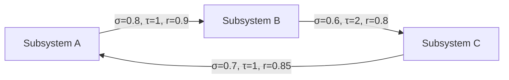
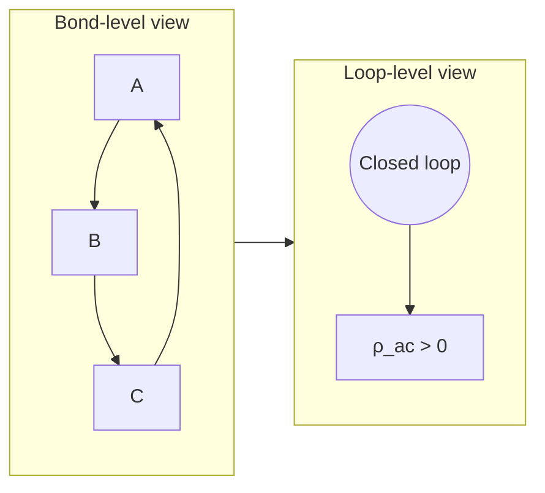
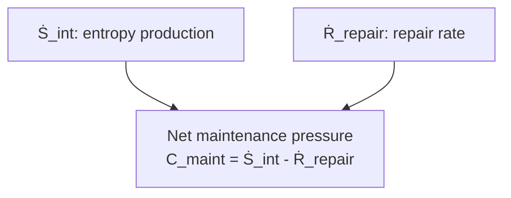

## Purpose

Use one simple diagram language across theory, research notes, and reports.

**Default:** Mermaid in markdown.  
**Escalate to image/SVG only when Mermaid cannot express the needed geometry.**

---

## Core Notation

### Nodes
- Rectangles = state-bearing entities/subsystems
- Rounded nodes = aggregates/meta-entities

### Edges (Causants)
- Directed edge `A --> B` = causant relation
- Edge label format: `σ, τ, r`
  - `σ` = strength
  - `τ` = latency
  - `r` = reliability

### Loop semantics
- A closed directed cycle indicates potential auto-causality.
- Loop-order can be annotated in node text or edge labels.

### Maintenance semantics
- `Ṡ_int` = internal entropy production
- `Ṙ_repair` = repair rate
- `C_maint = Ṡ_int - Ṙ_repair`

---

## Template 1 — Causant Interaction Graph

---

## Template 2 — Loop Emergence (Bond vs Loop Level)

---

## Template 3 — Maintenance Balance

---

## Authoring Rules

1. Keep diagrams small (5–12 nodes).
2. One conceptual claim per diagram.
3. Use consistent symbols (`σ, τ, r, ρ_ac, Ṡ_int, Ṙ_repair`).
4. If a page has >3 diagrams, include a mini legend block once.
5. Prefer multiple simple diagrams over one dense diagram.
