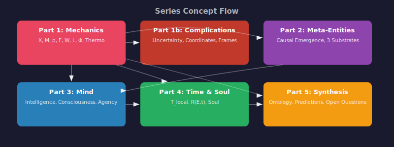

## What Epimechanics Is About

**Epiphysics** is the project. **Epimechanics** is the theory within it. This section develops the theory — the mathematical grammar. For how it's tested empirically, see [Applications](../applications/index.md). For [Research](../research/index.md) and [Experiments](../experiments/index.md), see those sections.

A person "has energy." An institution "has inertia." A society "reaches a tipping point." A belief "resists change." These sound like metaphors borrowed from physics. [Lakoff and Johnson (*Metaphors We Live By*, 1980)](https://press.uchicago.edu/ucp/books/book/chicago/M/bo3637992.html) showed that such metaphors are not decorative but structurally load-bearing - we think *through* them. The standard account holds that they are figurative: useful for communication, not literally true.

Epimechanics proposes something stronger: that the mathematical structure of physics - state, rate of change, mass, force, energy, coupling, field - can be formally extended to cover non-physical domains, not by loose analogy but by leaving the state variable $X$ abstract. **Epimechanics** (Greek ἐπί, 'upon' + mechanics) is the theoretical framework developed here — the mechanics that sits upon domain-specific mechanics. This is a *structural claim*, not a metaphysical identity claim. Epimechanics does not assert that beliefs *are* physical objects or that institutions *are* made of matter. It proposes that the formal relationships between state, momentum, force, and energy - the grammar of how quantities change under influences - apply more broadly than the physical substrate in which they were discovered. At the fundamental level, this grammar is Lagrangian mechanics. At coarse-grained levels, the effective dynamics inherit the potential landscape and coupling structure but acquire dissipation and noise — a structural descendant of the Lagrangian, not an identical copy (see Part 0.5, Cross-Level Tracing). Whether this structural isomorphism reflects a deep identity (as [Tegmark's mathematical universe hypothesis (2014)](https://doi.org/10.7551/mitpress/10021.001.0001) or [Wolfram's Ruliad (2020)](https://writings.stephenwolfram.com/2021/11/the-concept-of-the-ruliad/) would suggest) or a useful formal analogy that captures real but limited structure is an open question Epimechanics addresses explicitly ([Part 5, Section 6](./05_ontology_and_open_questions.md)).

This approach has antecedents. [Whitehead (*Process and Reality*, 1929)](https://doi.org/10.1017/CBO9781139644037) proposed a process ontology in which events, not substances, are fundamental - Epimechanics formalizes a version of this idea — entities defined by their causal structure, not by substance. [Bunge (*Treatise on Basic Philosophy*, 1974-1989)](https://doi.org/10.1007/978-94-010-9924-0) attempted to unify science under a single formal ontology. [Ladyman and Ross (*Every Thing Must Go*, 2007)](https://global.oup.com/academic/product/every-thing-must-go-9780199573097) argued for ontic structural realism - the view that structure, not objects, is fundamental. Epimechanics shares the structuralist intuition but takes a different route: rather than arguing for structural realism as a metaphysical thesis, it constructs a specific mathematical skeleton and asks whether it generates testable predictions across domains. Epimechanics is a *proposal* - to be judged by its empirical consequences, not by its philosophical pedigree.

Epimechanics faces a known objection at the outset. Any sufficiently abstract mathematical framework can be "applied" to anything - as [Putnam's model-theoretic argument (1980)](https://doi.org/10.2307/2273415) and related triviality results show, formal structures can always be mapped onto arbitrary domains. If Epimechanics' equations are abstract enough to describe beliefs, markets, and particles, this may be because they are too abstract to say anything specific about any of them. The antidote to this triviality objection is empirical: Epimechanics must generate predictions that domain-specific theories alone do not make, and those predictions must be testable. [Part 5, Section 4](./05_ontology_and_open_questions.md) develops these predictions. If they hold, Epimechanics has empirical content. If they fail, the structural isomorphism is vacuous.

### Things cause other things

The foundation is **causality**: events produce other events. A match strikes and a flame ignites. A neuron fires and a muscle contracts. An argument is heard and a belief shifts. A price drops and a panic spreads. Every concept in Epimechanics - state, force, energy, entity, consciousness, soul - is defined in terms of causal relationships. If you accept that causes produce effects and that systems can be described by states that evolve over time, Epimechanics' definitions become natural - though each step involves commitments that are stated explicitly as they arise.

This is a substantive commitment. [Neo-Humeans](https://plato.stanford.edu/entries/causation-regularity/) - from the regularity theorists through [Lewis's counterfactual account (1973)](https://doi.org/10.2307/2025310) to the Best System Account ([Loewer, 2012](https://doi.org/10.1093/acprof:oso/9780199890576.003.0006)) - deny that causation is a mind-independent productive relation; for them, causal claims are grounded in patterns of events or counterfactual dependence, not in an underlying "causal power." [Russell (1913)](https://doi.org/10.1093/aristotelian/13.1.1) argued that the word "cause" is a relic - that the functional equations of physics relate variables without picking out asymmetric cause-effect pairs. [Norton (2003)](https://doi.org/10.1086/392894) pressed a distinct but related point about determinism via his dome scenario.

Epimechanics takes **effective causation** as its working primitive, following the interventionist tradition: [Woodward (*Making Things Happen*, 2003)](https://doi.org/10.1093/0195155270.001.0001) and [Pearl (*Causality*, 2000)](https://doi.org/10.1017/CBO9780511803161) define causes operationally in terms of what happens when you intervene. Epimechanics inherits this: at scales from molecular biology upward, interventions reliably produce effects, and this regularity is what Epimechanics' "force" and "coupling" formalize. Whether effective causation is metaphysically fundamental or emerges from deeper structure (or from the Best System, or from something else entirely) is a question Epimechanics inherits but does not need to resolve. The interventionist account has its own difficulties - notably the circularity of defining interventions in causal terms - but these are challenges for the philosophical foundations, not for Epimechanics' operational use. The formal framework is compatible with any account of causation that grants effective, scale-dependent causal regularities as a working assumption.

### Anything you can describe can be represented

$X$ is a *representation* - a formal description of some aspect of a system, the way a map describes territory. The territory exists independently; $X$ is our model of it. For any system you wish to analyze - the position of a ball, the temperature of a room, the price of a stock, the intensity of a belief, the mood of a crowd, the GDP of a nation - you can represent its current condition as a state $X$. $X$ lives in some space of possible values - a **state space** $S$ - and it changes over time at some rate $\dot{X} = dX/dt$.

**If you can label something, you have already assigned it a representation.** The act of naming - "trust," "morale," "market sentiment" - commits you to the existence of something being represented, however poorly. The label is arbitrary (you could call your car a shoe), but the act of labeling is not: it places the thing somewhere in a space of possible values. A "wrong" label is a coordinate error - it projects the thing into a state space where the dynamics don't apply - but even a wrong label acknowledges that there is something to represent. Not all representations are the same kind of thing: some track *measurable* properties (observer-independent), some are *assigned* (observer-relative but causally real), and some are *invariant* (agreed upon in all reference frames). [Part 1](./01_generalized_mechanics.md) develops these distinctions; [Part 1b](./01b_uncertainty_coordinates_relativity.md) develops how representations transform between coordinate systems.

$X$ does not have to be accurate, or complete, or unique. It can be the average humidity over Kansas, the color distribution of pixels on a screen, the third eigenvalue of some matrix, or a rough sketch of the internal state of a mind that no instrument can access. [Hoffman's Interface Theory (*The Case Against Reality*, 2019)](https://wwnorton.com/books/9780393254693) makes the sharpest version of this point: our perceptions are fitness-tuned interfaces, not accurate depictions - the desktop icon does not resemble the magnetic patterns on the disk. $X$ has the same status. Some representations track real causal structure well enough to predict dynamics; others are arbitrary or misleading. Epimechanics' claim is that when $X$ is chosen to track real structure, the mechanical relationships derived from it (force, energy, coupling) predict how that structure evolves. Every $X$ defines an entity - anything with causal presence. Some entities persist for billions of years; others vanish in seconds. The mathematics applies to all of them - what differs is how strongly they sustain themselves, which the next sections formalize.

This is a methodological commitment, not a metaphysical one. We do not claim that reality is "made of" states. We claim that for any system, you can construct a representation $X$ such that the system's behavior may be described by a trajectory through state space $S$. [Quantum indefiniteness](https://plato.stanford.edu/entries/qt-issues/), [relational ontology](https://plato.stanford.edu/entries/structural-realism/), and [vagueness](https://plato.stanford.edu/entries/vagueness/) all challenge the idea that everything has a unique, definite state. Epimechanics accommodates these: $X$ can be a probability distribution rather than a point, representations can be defined relative to an observer, and the precision of $X$ is chosen to match the application. Epimechanics requires that representations exist - not that they be unique, not that they be accurate, not that they be metaphysically fundamental, and not that any particular coordinate choice be privileged over another. Like coordinates in physics, some choices of $X$ reveal more structure than others - but the underlying reality exists regardless of how well or poorly we represent it.

### Some things sustain themselves

Most causal chains run in one direction and stop. A ball rolls downhill and comes to rest. A sound echoes and fades. But some causal chains loop back on themselves: the output of the process feeds back to maintain the process. An initial spark of high temperature ignites fuel to create a flame that sustains the continued combustion of the fuel. An organism's metabolism maintains the cells that perform metabolism. An institution's processes, for self advertisement and functional stability, maintain the institution that runs the processes. A habit reinforces the neural pathways that produce the habit.

We call this **auto-causal** structure - causal events that produce the conditions for their own continuation. This concept has precedents: [Maturana and Varela (*Autopoiesis and Cognition*, 1980)](https://doi.org/10.1007/978-94-009-8947-4) formalized it as *autopoiesis* - the self-producing organization of living systems. [Kauffman (*The Origins of Order*, 1993)](https://doi.org/10.1093/oso/9780195079517.001.0001) showed that autocatalytic sets - networks of reactions that collectively catalyze their own production - emerge spontaneously at sufficient complexity. [Moreno and Mossio (*Biological Autonomy*, 2015)](https://doi.org/10.1007/978-94-017-9837-2) developed the concept of organizational closure in philosophy of biology. [Hofstadter (*I Am a Strange Loop*, 2007)](https://en.wikipedia.org/wiki/I_Am_a_Strange_Loop) explored self-referential loops specifically in the context of consciousness and formal systems - a narrower but related phenomenon. Epimechanics builds on this tradition by representing auto-causal density as a continuous quantity $\rho_{\text{ac}}$ and tracing its consequences across domains through the full mechanical apparatus. The representation is itself a coordinate choice — $\rho_{\text{ac}}$ is an $X$ assigned to an entity's self-sustaining structure, subject to the same representational commitments as any other state variable. Whether continuity is the right topology, and what measure $d\mu$ is appropriate, are empirical questions resolved domain by domain.

### Entities and auto-causal density

An **entity**, in Epimechanics, is anything with causal presence — equivalently, anything representable ($\rho_{\text{causal}} > 0$). The average humidity over Kansas is an entity. A fleeting thought is an entity. A nonsense idea that exists for two seconds before being forgotten is an entity. A proton is an entity. The word is deliberately broad.

What distinguishes *self-sustaining* entities from transient ones is **auto-causal density** $\rho_{\text{ac}}$ — a representation of how densely self-sustaining causal loops are packed within a structure. A flame actively maintains the conditions for its own continuation. A person does this even more densely - trillions of self-sustaining biochemical loops, layered with psychological and social feedback. The average humidity over Kansas does not sustain itself at all - it is a passive summary of other processes, with $\rho_{\text{ac}} \approx 0$.

Entity-ness is not binary but continuous: a proton scores high (extremely tight, long-lived loop), a person scores high along different dimensions (many layered loops, shorter-lived), a cloud low but nonzero, a random fluctuation near zero. All are entities; they differ in how strongly they sustain themselves.

A cloud *is* an entity - a weak one. It has a state, it has (low) mass, it influences other systems (blocking sunlight, producing rain). The question is not "is it an entity?" but "how strongly does it sustain itself?" A meme sustains itself for hours or years through retransmission. An institution sustains itself for decades through processes that maintain the institution. An organism sustains itself through metabolic loops layered with immune and neural feedback. These differ not in kind but in the density and persistence of their auto-causal structure - and that difference is what makes some things more life-like, more influential, and more durable than others ([Part 1c](./01c_thermodynamic_emergence_of_life.md) develops this connection formally).

### The "metaphors" as structural claims

With these foundations - causality, state, auto-causal structure, entities - the familiar metaphors become candidates for formal definitions. Epimechanics *proposes* (not presupposes) that: a deeply held conviction has high **generalized mass** $\mathcal{M}$ - dense internal causal connections that resist change. A persuasive argument is a **force** $F$ - an influence that alters momentum. A reputation is a **field** - a distributed influence generated by an entity that acts on others. A traumatic event that propagates from the economic domain into the psychological and then the physical is a **tensor coupling** with off-diagonal elements. The mathematical *form* does not change when the substrate changes. What changes is the state space, the empirical constants, and the potential landscape $V(X)$ - which must be determined domain by domain and which carry the entire empirical content.

An important asymmetry must be acknowledged. For a particle in a gravitational field, the constants are known to many decimal places and the equations generate precise, testable trajectories. For a belief in a cultural field, no such constants exist, and the equations are currently a structural skeleton awaiting empirical calibration. Epimechanics proposes that the *form* of the equations carries over; it does not claim that the empirical precision of physics carries over. Epimechanics' value in non-physical domains depends on whether its structural predictions ([Part 5, Section 4](./05_ontology_and_open_questions.md)) hold - not on whether it achieves the quantitative precision of physics.

The argument unfolds through a single mathematical skeleton. Each element is either a *definition* (D), a *structural postulate* (P) requiring empirical validation in each domain, or a *consequence* (C) derived from the preceding elements:

- **$X \in S$** (D): any state variable in any state space $S$
- **$\dot{X} = dX/dt$** (D): the rate at which $X$ changes
- **$\mathcal{M} = \int \rho_{\text{causal}} \, d\mu$** (D): generalized mass - the total causal density; requires specifying a measure $d\mu$ on the entity's region ([Part 1, Section 2b](./01_generalized_mechanics.md) discusses the measurement problem this raises)
- **$p = \mathcal{M} \cdot \dot{X}$** (P): generalized momentum - the **isotropic (scalar mass) approximation**. The general form is $p_i = \mathcal{M}_{ij}\dot{X}^j$, where $\mathcal{M}_{ij}$ is a mass tensor encoding direction-dependent resistance to change. The scalar form assumes equal resistance in all state-space directions ($\mathcal{M}_{ij} = \mathcal{M} \cdot \delta_{ij}$). Requires at least an affine structure on the state space; valid for Riemannian state spaces, may fail for more exotic topologies. See [Part 1, Section 2b](./01_generalized_mechanics.md) for the tensorial generalization and its relationship to the coupling tensor $T^i{}_j$
- **$F = dp/dt = \mathcal{M}\ddot{X} + \dot{\mathcal{M}}\dot{X}$** (C): force - follows from the product rule applied to $p$ (scalar approximation; general: $F_i = \mathcal{M}_{ij}\ddot{X}^j + \dot{\mathcal{M}}_{ij}\dot{X}^j$); the cross-term $\dot{\mathcal{M}}\dot{X}$ requires careful treatment of system boundaries (what mass is gained/lost vs. reorganized)
- **$L = \frac{1}{2}\mathcal{M}\lvert\dot{X}\rvert^2 - V(X)$** (P): the proposed Lagrangian (scalar approximation; general: $L = \frac{1}{2}\mathcal{M}_{ij}\dot{X}^i\dot{X}^j - V(X)$) - this specific quadratic form is the *strongest structural postulate* in Epimechanics; it requires an inner product $|\dot{X}|^2$ on the tangent space of $S$ (a metric choice that carries empirical content), and it may not hold for dissipative systems (most social/psychological systems); the action principle $\delta \int L \, dt = 0$ derives the equations of motion; conservation laws follow via Noether's theorem from symmetries of $L$
- **$W = \int F \cdot dX$** (D): energy, the capacity to produce state change
- **$\sigma_X \sigma_p \geq C$; $\sigma_E \sigma_t \geq C'$** (P): conjugate-pair uncertainty bounds - in quantum mechanics these follow from non-commutativity of operators ($[x,p] = i\hbar$); Epimechanics proposes analogous bounds with domain-specific constants $C$, $C'$, but the algebraic structure (what plays the role of non-commutativity in abstract domains) remains an open question ([Part 1b](./01b_uncertainty_coordinates_relativity.md))
- **$\kappa$, $T^i{}_j$** (D/P): coupling constant and coupling tensor - the tensor structure assumes that cross-domain interactions are at least locally linear, which is a strong postulate
- **$V(X) = \int \phi(X, X') \rho(X') dX'$** (P): mean-field construction - valid when no single entity dominates the field; breaks down for concentrated influence
- **$\mathcal{T}$, $P$, $S_{\text{ent}}$, $\mathcal{F}$** (C): thermodynamic quantities emerge from many-entity ensembles; temperature $\mathcal{T} \propto \langle K \rangle$ is the *equipartition* definition, valid at equilibrium - most interesting social systems are far from equilibrium, requiring non-equilibrium extensions
- **Navier-Stokes analogue** (C/P): when entity density and velocity are smooth, fluid equations apply - but the constitutive relations (viscosity, transport coefficients) must be derived or measured domain by domain, not imported from physics

The framework goes further. It extends Epimechanics to cover entities - what makes something an entity - and meta-entities - what makes a distributed aggregate (a religion, a market, a corporation, a cultural movement) earn entity status in its own right. It provides formal definitions of intelligence, consciousness, and agency. It introduces a rigorous account of how long an entity matters - not just during its physical existence (local time) but across all time and all the minds and institutions it alters (non-local time). And it gives a formal definition of soul: a signed, multi-dimensional causal biography that is, in principle, measurable.

The final part assembles the full formal ontology and states nine open questions that mark the edges of what Epimechanics currently resolves.

---

## Series Navigation

| Part | Title | Core Claim |
|------|-------|-----------|
| [Part 0: Foundations](./00_prelude.md) | What Epimechanics is and isn't | Causation and entity are co-primitive; computation and representation are co-primitive; state bridges them; information is predictive content; X is a representation; entities are anything with causal presence (equivalently, anything representable) |
| [Part 0.5: Structural Primitives](./00_atomic_structure.md) | What are entities made of? | Six candidate atoms (bond, strength, loop order, basin depth, entropy production, repair rate); auto-causality is emergent at the loop level |
| [Part 1: Generalized Mechanics](./01_generalized_mechanics.md) | X as universal state variable | Standard physics is the primary instantiation; Epimechanics abstracts the formal structure to cover other domains |
| [Part 1b: Uncertainty, Coordinates, and Relativity](./01b_uncertainty_coordinates_relativity.md) | The limits and extensions of the clean framework | Measuring X changes X; different entities may have non-isomorphic state spaces; forces are reference-frame-relative |
| [Part 2: Meta-Entities](./02_meta_entities.md) | When aggregates become entities | A religion, nation, or market earns entity status when its macro-level description has more causal information than its micro-level description |
| [Part 3: Intelligence, Consciousness, Agency](./03_intelligence_consciousness_agency.md) | What entities know and do | Intelligence = predictive accuracy; consciousness = self-inclusive modeling scope; agency = outgoing coupling × meta-cognition × consciousness |
| [Part 4: Local Time, Non-Local Time, and Soul](./04_time_and_soul.md) | How long entities matter | Soul = R(E,t), the complete signed representational propagation function - formally defined |
| [Part 5: Full Ontology and Open Questions](./05_ontology_and_open_questions.md) | The assembled Epimechanics | Complete formal ontology; Wolfram connection; nine open questions and research program |

### Concept Flow Across Parts

### Applications

Domain-specific documents testing whether Epimechanics' grammar generates real predictions. See the [Applications index](../applications/index.md).

| Application | Domain | Status |
|---|---|---|
| [Efficiency Limits for Organizations](../applications/efficiency_limits.md) | Organizational science | Draft |
| [Decision and Trajectory](../applications/decision_and_trajectory.md) | Decision theory | Draft |

### Theory Notes

Standalone documents extending specific topics from the main series.

| Document | Extends | Topic |
|---|---|---|
| [Effective Mass](./effective_mass.md) | Part 0.5 | How the medium shapes an entity's resistance to state change; bare vs. effective mass |
| [The Persistence Reversal](./persistence_reversal.md) | Part 0.5, Part 1c | When composites outlive their constituents; passive vs. active stability |
| [Cross-Level Tracing](./cross_level_tracing.md) | Part 0.5, Part 1, Part 5 | What survives coarse-graining across scales; positioning against Simon, Rosen, sloppy models |

---

## Key Equations at a Glance

Each equation is tagged: **D** = definition, **P** = structural postulate (requires empirical validation per domain), **C** = consequence derived from preceding elements. Equations marked P are Epimechanics' load-bearing assumptions - where it is most likely to fail in non-physical domains.

| Equation | Type | Description |
|---|---|---|
| $X \in S$ | D | $X$ is any state variable in any state space $S$ |
| $\dot{X} = dX/dt$ | D | Rate of change of $X$ through state space |
| $\mathcal{M} = \int \rho_{\text{causal}} \, d\mu$ | D | Generalized mass: total causal density over entity's region (requires specifying measure $d\mu$) |
| $p = \mathcal{M} \cdot \dot{X}$ | P | Generalized momentum: **isotropic special case**; general form $p_i = \mathcal{M}_{ij}\dot{X}^j$ with mass tensor $\mathcal{M}_{ij}$ (requires affine/Riemannian state space) |
| $F = \mathcal{M}\ddot{X} + \dot{\mathcal{M}}\dot{X}$ | C | Force: scalar approx.; general $F_i = \mathcal{M}_{ij}\ddot{X}^j + \dot{\mathcal{M}}_{ij}\dot{X}^j$; cross-term requires specifying system boundary |
| $K = \frac{1}{2}\mathcal{M}\lvert\dot{X}\rvert^2$ | P | Kinetic energy: scalar approx.; general $T = \frac{1}{2}\mathcal{M}_{ij}\dot{X}^i\dot{X}^j$; requires metric on tangent space of $S$ |
| $E_{\text{int}} = f(\mathcal{M}, c_{\mathcal{D}})$ | P | Internal energy: energy stored in entity's causal structure; $= \mathcal{M}c_{\mathcal{D}}^2$ requires Lorentz-like symmetry, not just pseudo-Riemannian structure |
| $L = K - V$ | P | Lagrangian (**strongest postulate**): scalar approx.; general $L = \frac{1}{2}\mathcal{M}_{ij}\dot{X}^i\dot{X}^j - V(X)$; valid for conservative systems; most social/psychological systems are dissipative and may require extended variational principles |
| $\sigma_X \sigma_p \geq C$; $\sigma_E \sigma_t \geq C'$ | P | Conjugate-pair uncertainty: in QM follows from $[x,p]=i\hbar$; the algebraic structure (what plays the role of non-commutativity) in abstract domains is an open question |
| $W = \int F \cdot dX$ | D | Work: capacity to produce state change |
| $\kappa$; $T^i{}_j$ | D/P | Coupling constant and tensor: tensor structure assumes locally linear cross-domain interactions |
| $V(X) = \int \phi(X,X') \rho(X') dX'$ | P | Mean-field: valid when no single entity dominates; breaks for concentrated influence |
| $\mathcal{T} \propto \langle K \rangle$ | P | Temperature: equipartition definition; requires near-equilibrium; most interesting systems are far from equilibrium |
| $\mathcal{F} = E - \mathcal{T} S_{\text{ent}}$ | C | Free energy: capacity for directed change; requires well-defined entropy |
| $\partial\rho/\partial t + \nabla \cdot (\rho\mathbf{v}) = \sigma$ | C | Continuity: conservation of entities in state space (with source/sink $\sigma$) |
| $Re = \rho v L / \mu$ | P | Reynolds number: requires domain-specific viscosity $\mu$, which must be measured not imported |
| $EI(\text{macro}) > EI(\text{micro})$ | D | Condition for meta-entity status ([Hoel et al., 2013](https://doi.org/10.1073/pnas.1314922110)) |
| $T_{\text{local}}(E) = \int_0^{\infty} \mathbf{1}[\kappa_s(E,t) > 0]\, dt$ | D | Local time: duration of causal coherence (diverges for permanently persistent entities; may need normalization) |
| $R(E,t) = \sum_j \kappa_{Ej}(t) \cdot \delta X_j(E,t)$ | D | Representational footprint: requires counterfactual $\delta X_j$ ([Pearl, 2000](https://doi.org/10.1017/CBO9780511803161)) |
| $T_{\text{nonlocal}}(E) = \int_0^{\infty} R(E,t)\, dt$ | D | Non-local time: total influence-time across all substrates |
| $I(E, \mathcal{D}, h)$ | D | Intelligence: predictive accuracy over $dX/dt$ in domain $\mathcal{D}$ at horizon $h$ (functional, not a closed-form equation) |
| $C(E) = f(\text{scope}, \text{accuracy of internal model})$ | D | Consciousness: functional definition; says nothing about phenomenal consciousness ([Nagel, 1974](https://doi.org/10.2307/2183914); [Chalmers, 1995](https://doi.org/10.1093/acprof:oso/9780195311105.003.0001)) |
| $\mathcal{P}_{E \to j} = \mathbf{F}_{E \to j} \cdot \mathbf{v}_{X_j}$ | C | Outgoing causal power: rate at which E does work on j's state |
| $A = C_{\text{coupling}} \times \mu_{\text{meta}} \times C_{\text{consciousness}}$ | P | Agency: multiplicative; zero in any factor yields zero; normalization requires domain-specific bounds |
| $\text{Soul}(E) \equiv \mathbf{R}(E,t)$ | D | Soul: a renaming of the representational propagation function - a causal biography, not a separate quantity |

---

## A Note on Methodology

Epimechanics is a framework proposal, not a completed theory. It is a set of formal definitions and structural postulates about how concepts should be related to one another if they are to be coherent and measurable. Epimechanics provides *grammar* - structural relationships between state, mass, force, energy, coupling, and field. Domain sciences (physics, psychology, organizational science, economics) must supply the *vocabulary* - specific operationalizations, units, and empirical constants. Epimechanics earns its keep only if its grammar generates predictions that domain-specific theories alone do not make ([Part 5, Section 4](./05_ontology_and_open_questions.md)).

Each component draws on existing research:

- Dynamical systems theory provides the mechanical skeleton ($X$, $\dot{X}$, $p$, $F$, $W$)
- [Maturana and Varela (1980)](https://doi.org/10.1007/978-94-009-8947-4) and [Kauffman (1993)](https://doi.org/10.1093/oso/9780195079517.001.0001) ground the auto-causal / self-sustaining structure concept
- [Hoel et al.'s causal emergence framework (2013)](https://doi.org/10.1073/pnas.1314922110) grounds the meta-entity definition
- [Legg and Hutter's universal intelligence measure (2007)](https://doi.org/10.1007/s11023-007-9079-x) grounds the intelligence definition
- [Woodward (*Making Things Happen*, 2003)](https://doi.org/10.1093/0195155270.001.0001) and [Pearl (*Causality*, 2000)](https://doi.org/10.1017/CBO9780511803161) provide the interventionist causal foundations
- [Wolfram's hypergraph physics (2020)](https://arxiv.org/abs/2004.08210) provides a structural parallel - though Wolfram's program has not produced experimentally tested predictions and its status in mainstream physics remains that of an ambitious but unvalidated research program
- [Nagel's "What Is It Like to Be a Bat?" (1974)](https://doi.org/10.2307/2183914) and [Chalmers's formulation of the hard problem (1995)](https://doi.org/10.1093/acprof:oso/9780195311105.003.0001) mark the boundary of what the functional consciousness definition can and cannot claim - Epimechanics defines consciousness functionally; whether functional sufficiency entails phenomenal consciousness is explicitly left open ([Part 5, Open Question 7](./05_ontology_and_open_questions.md))
- [Kim's exclusion argument (1998)](https://doi.org/10.7551/mitpress/4629.001.0001) raises the challenge of how higher-level causal properties (generalized mass of a belief) relate to lower-level physical properties (neural states) - Epimechanics does not resolve the exclusion problem but states where it bears on the ontology ([Part 3](./03_intelligence_consciousness_agency.md), [Part 5](./05_ontology_and_open_questions.md))

The *unification itself* - the proposal that these components fit together into a single mathematical framework - Epimechanics - is the novel contribution, not a consequence of existing research. Prior attempts at cross-domain formal unification include [Whitehead (*Process and Reality*, 1929)](https://doi.org/10.1017/CBO9781139644037) and [Bunge (*Treatise on Basic Philosophy*, 1974-1989)](https://doi.org/10.1007/978-94-010-9924-0). Epimechanics differs from these in its specific mathematical machinery (Lagrangian mechanics, coupling tensors, thermodynamic quantities) and in its emphasis on testable predictions, but it shares their ambition and should be judged against the same standard: does the unification generate insight that the individual components do not?

Every claim that goes beyond established results is explicitly marked as a proposal. Every structural postulate is labeled as such. Every open question is explicitly marked as open. The goal is precision about what is known, what is proposed, and what remains to be resolved - not the appearance of completeness.

One final observation: if Epimechanics is correct, it describes itself. The framework that defines entities as self-sustaining causal structures is itself a self-sustaining causal structure - its internal coherence maintains the conditions for its own development. Whether this self-application is a meaningful consistency check or a symptom of excessive generality (the triviality objection again) is tested by Epimechanics' empirical predictions: if the predictions hold, self-consistency reflects genuine structure; if they fail, the self-consistency is vacuous. [Part 5, Section 5](./05_ontology_and_open_questions.md) develops the self-application test in detail. There is a formal ceiling: any sufficiently powerful self-referential formal system has truths it cannot prove from within ([Gödel, 1931](https://doi.org/10.1007/BF01700692)). Whether this result applies to Epimechanics as stated - which is not yet a formal axiomatic system in the required sense - is itself an open question ([Part 5, Open Question 9](./05_ontology_and_open_questions.md)). The analogy to Gödel incompleteness is suggestive, not proven; formalizing it would require axiomatizing Epimechanics, which has not been done.

Epimechanics proposes that the wall between physics and other domains is a wall between the concrete and the abstract — and that the mathematical structure crosses it.
