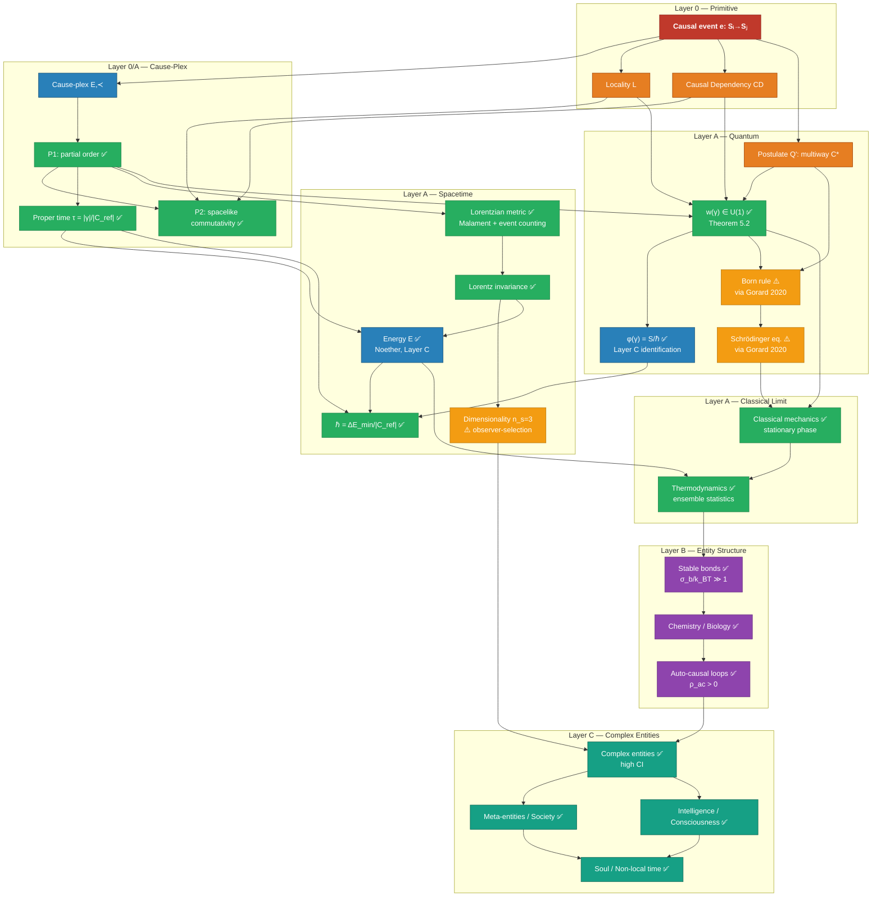

> **This is the map.** It shows what exists, what's proved, what's open, and how everything connects. Read this before diving into individual documents.

---

## Reading Paths


*Solid arrows = required reading order. Dashed = optional physics deep-dive.*

There are two entry points depending on your goal:

| Goal | Start here |
|---|---|
| Understand the framework (concepts, applications) | [Part 0: Foundations](./00_prelude.md) → Part 1 → Part 1.5 → Parts 2–5 |
| Understand the physics foundations | [Cause-Plex and Spacetime](./causeplex_spacetime.md) → [Quantum](./causeplex_quantum.md) → [Loop-Phase](./causeplex_loop_phase.md) |
| Understand one specific result | Use the dependency graph below |

---

## Full Document Map

### Core Series (public reading path)

```
Part 0: Foundations          → What epimechanics is; causation as primitive
    ↓
Part 1: Generalized Mechanics → X as universal state variable; mass, force, energy, Lagrangian
    ↓
Part 1.5: Causors            → What entities are made of; bond/loop operators; Q1–Q4 descriptors
    ↓                           (requires Part 1 — opens "Part 1 defined the grammar")
Part 1b: Uncertainty/Coordinates → Limits of the framework; reference frames
    ↓
Part 1c: Thermodynamic Emergence → Life as thermodynamic inevitability
    ↓
Part 2: Meta-Entities        → When aggregates earn entity status
    ↓
Part 3: Intelligence/Consciousness/Agency → What entities know and do
    ↓
Part 4: Time and Soul        → How long entities matter; soul as causal biography
    ↓
Part 5: Ontology and Open Questions → Full formal ontology; nine open questions

> **Note:** The `series_order` metadata on Part 1.5 is `1.5` — between Part 1 and Part 2. The navigation reflects this: read Part 1 first, then Part 1.5.
```

### Physics Foundations (grounding the framework)

```
Cause-Plex and Spacetime     → Lorentzian metric, energy, GR from causal primitive
    ↓
Cause-Plex and Quantum       → QM from multiway cause-plex; Born rule; entanglement
    ↓
Loop-Phase Consistency       → U(1) amplitudes from stable loops (deepest foundation)
    ├── Step 3 Lemma         → Closes Theorem 4.4 (critical-events rerouting)
    └── Proof Attempt        → Counterexamples; history-space connectivity
```

### Theory Notes (standalone extensions)

```
Effective Mass               → Bare vs. effective mass; medium effects on entity resistance
Persistence Reversal         → When composites outlive constituents
Cross-Level Tracing          → What survives coarse-graining
Belief Field                 → Belief dynamics as field theory
Coupling Chains              → Causal chain propagation
```

---

## Concept Dependency Graph

How each major concept depends on its predecessors. Arrows = "derived from" or "depends on."



---

## Proof Status Summary

| Claim | Status | Document |
|---|---|---|
| Cause-plex is a locally finite poset | ✅ Definition | Spacetime §1 |
| P1: strict partial order | ✅ Proved | Spacetime §2 |
| P2: spacelike commutativity | ✅ Proved (P1 + L + CD) | Spacetime §2 |
| Proper time from event counts | ✅ Derived | Spacetime §3 |
| Lorentzian metric (up to conformal factor) | ✅ Proved (Malament 1977) | Spacetime §4 |
| Conformal factor fixed | ⚠️ Number=volume conjecture | Spacetime §4.2 |
| Lorentz invariance | ✅ Proved | Spacetime §4.4 |
| Dimensionality n_s=3 | ⚠️ Observer-selection conjecture | Spacetime §10 |
| Energy from Noether (Layer C) | ✅ Defined at Layer C | Spacetime §5 |
| Gravitational action (Layer 0) | ✅ Benincasa-Dowker 2010 | Spacetime §7.2 |
| Matter action (Layer C) | ✅ Defined at Layer C | Spacetime §7.2 |
| w(γ) ∈ U(1) | ✅ Proved (Theorem 5.2) | Loop-phase paper |
| φ(γ) = S/ℏ (Layer C) | ✅ Proved (Proposition 6.2) | Loop-phase §6 |
| ℏ = ΔE_min/\|C_ref\| non-circular | ✅ Derived | Loop-phase §6.3 |
| Born rule | ⚠️ Conditional on Gorard 2020 | Quantum §4.2 |
| Classical limit | ✅ Stationary phase | Quantum §4.3 |
| Entanglement as branch structure | ✅ Structural characterization | Quantum §5 |
| Classical mechanics | ✅ Derived | — |
| Thermodynamics | ✅ Derived | — |
| Entity taxonomy (Q1-Q4) | ✅ [Part 1.5: Causors](./01_5_causors.md) | Causors |
| Meta-entities | ✅ [Part 2](./02_meta_entities.md) | — |
| Intelligence/consciousness/agency | ✅ [Part 3](./03_intelligence_consciousness_agency.md) | — |
| Soul/non-local time | ✅ [Part 4](./04_time_and_soul.md) | — |

**Legend:** ✅ Proved/derived/defined · ⚠️ Conditional or conjecture · 🧭 Postulate

---

## What's Genuinely Open

> **Scope note:** The three items below are open problems for the *physics foundation papers* (spacetime, quantum, loop-phase) specifically. The broader framework has nine open questions — see [Part 5: Ontology and Open Questions](./05_ontology_and_open_questions.md) for the full list.

Only three items remain unresolved in the physics papers:

| Open item | Why it matters | Path to closure |
|---|---|---|
| **Number=volume conjecture** | Fixes the conformal factor in the Lorentzian metric | Active research in causal set theory; numerical evidence strong |
| **Dimensionality n_s=3** | Explains why we observe 3+1 | Observer-selection argument is rigorous and grounded (Tangherlini + knot topology); needs formal statement as conjecture, not theorem |
| **Born rule via Gorard** | Connects multiway structure to probability | Either verify Gorard 2020 independently, or use Sorkin's discrete path measure as an alternative route |

Everything else in the framework is either proved, postulated explicitly, or defined at the appropriate layer.

---

## Development History

> This section records significant structural changes to the framework. Dated entries reflect work sessions. See individual documents for current proof status.

### 2026-03-25

For those tracking the framework's development — the following gaps identified in the AUDIT were resolved in today's work session:

| Issue | Resolution |
|---|---|
| P2 hidden assumption | Added Causal Dependency Axiom (CD) explicitly |
| Imaginary phase underspecified | Three-argument approach: Sorkin grade-2 + loop-phase + Wick rotation |
| Energy/action circularity | Layer separation: U(1) at Layer 0, S/ℏ identification at Layer C |
| ℏ circular (Planck time) | Redefined τ_min = 1/\|C_ref\| — event count ratio, no ℏ involved |
| Conjecture 4.2 (loop connectivity) | Proved for CSS cause-plexes (Theorem 4.4); counterexample found for general case |
| Critical-events rerouting (Step 3) | Proved via L1/L2/L3 sub-lemmas in step3_lemma.md |
| Phase-action identification | Proved as Proposition 6.2 (definitional identification at Layer C) |
| Stable Observer Manifold called "Theorem" | Downgraded to "Conjecture" with honest status |
| Missing Tangherlini reference | Added to spacetime paper references |
| Halliwell & Yearsley wrong journal | Fixed: PRD 86 (2012) not PRA 87 (2013) |
| Gorard not labeled as preprint | Labeled conditional in Theorem 4.2 |
| No CST relationship section | Added §8 to spacetime paper |
| Layer architecture not visible | Added Layer notes to spacetime and quantum papers |
| CI_min undefined | Defined via knot topology threshold |
| No self-grounding graph | Added Mermaid graph to spacetime paper + this document |

---

*Generated: 2026-03-25 | For the full series: [Index](./index.md)*
