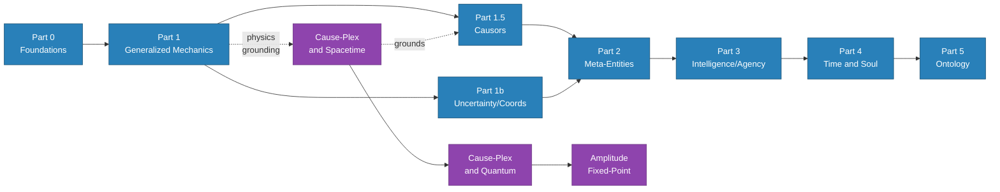
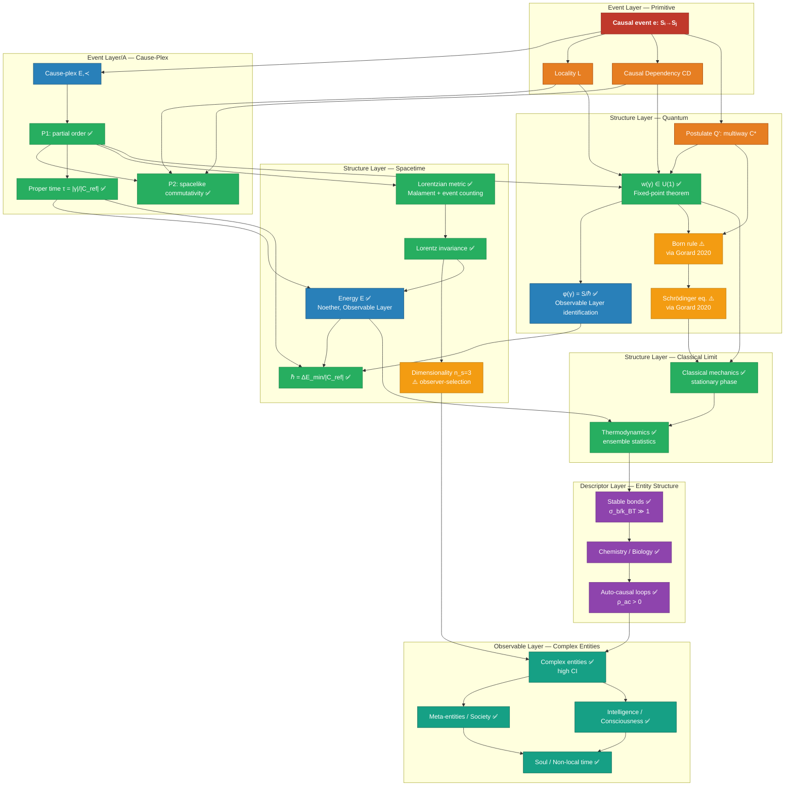

> **This is the map.** It shows what exists, what's proved, what's open, and how everything connects. Read this before diving into individual documents.

---

## Reading Paths

*Solid arrows = required reading order. Dashed = optional physics deep-dive.*

There are two entry points depending on your goal:

| Goal | Start here |
|---|---|
| Understand the framework (concepts, applications) | [Part 0: Foundations](./00_prelude.md) → [Part 1](./01_generalized_mechanics.md) → [Part 1.5](./01_5_causors.md) → [Part 2](./02_meta_entities.md)–[Part 5](./05_ontology_and_open_questions.md) |
| Understand the physics foundations | [Cause-Plex and Spacetime](./causeplex_spacetime.md) → [Quantum](./causeplex_quantum.md) → [Amplitude Fixed-Point](./amplitude-phase-fixed-point-paper.md) |
| Understand one specific result | Use the dependency graph below |

---

## Full Document Map

### Core Series (public reading path)

| Order | Part | Topic | Next |
|---|---|---|---|
| 0 | [Part 0: Foundations](./00_prelude.md) | What epimechanics is; causation as primitive | → [Part 0b](./00b_event_layer.md), [Part 1](./01_generalized_mechanics.md) |
| 0b | [Part 0b: Event Layer](./00b_event_layer.md) | The causal event primitive; cause-plex; emergence of physics | → [Part 1](./01_generalized_mechanics.md), [Part 1.5](./01_5_causors.md) |
| 1 | [Part 1: Generalized Mechanics](./01_generalized_mechanics.md) | X as universal state variable; mass, force, energy, Lagrangian | → [Part 1.5](./01_5_causors.md), [Part 1b](./01b_uncertainty_coordinates_relativity.md) |
| 1.5 | [Part 1.5: Causors](./01_5_causors.md) | Structure Layer: bonds, loops; Descriptor Layer: Q1–Q5 | → [Part 2](./02_meta_entities.md) |
| 1b | [Part 1b: Uncertainty/Coordinates](./01b_uncertainty_coordinates_relativity.md) | Limits of the framework; reference frames | → [Part 2](./02_meta_entities.md) |
| 1c | [Part 1c: Thermodynamic Emergence](./01c_thermodynamic_emergence_of_life.md) | Life as thermodynamic inevitability | → [Part 2](./02_meta_entities.md) |
| 2 | [Part 2: Meta-Entities](./02_meta_entities.md) | When aggregates earn entity status | → [Part 3](./03_intelligence_consciousness_agency.md) |
| 2.5 | [Part 2.5: Entity Interaction](./02_5_entity_interaction.md) | How entities couple and interact | → [Part 3](./03_intelligence_consciousness_agency.md) |
| 3 | [Part 3: Intelligence/Consciousness/Agency](./03_intelligence_consciousness_agency.md) | What entities know and do | → [Part 4](./04_time_and_soul.md) |
| 4 | [Part 4: Time and Soul](./04_time_and_soul.md) | How long entities matter; soul as causal biography | → [Part 5](./05_ontology_and_open_questions.md) |
| 5 | [Part 5: Ontology and Open Questions](./05_ontology_and_open_questions.md) | Full formal ontology; nine open questions | — |

### Physics Foundations (grounding the framework)

| Order | Document | Topic | Depends on |
|---|---|---|---|
| A1 | [Cause-Plex and Spacetime](./causeplex_spacetime.md) | Lorentzian metric, energy, GR from causal primitive | [Part 1](./01_generalized_mechanics.md) |
| A2 | [Cause-Plex and Quantum](./causeplex_quantum.md) | QM from multiway cause-plex; Born rule; entanglement | [Spacetime](./causeplex_spacetime.md) |
| A3 | [Amplitude Fixed-Point](./amplitude-phase-fixed-point-paper.md) | U(1) unique fixed point of G⊗G≅G — PRIMARY derivation | [Quantum](./causeplex_quantum.md) |
| A4 | [Loop-Phase Consistency](./causeplex_loop_phase.md) | Corroborating routes; causal-void counterexample; CSS connectivity | [Amplitude FP](./amplitude-phase-fixed-point-paper.md) |
| A5 | [Dimensionality](./causeplex_dimensionality.md) | Why 3+1: observer-selection constraints on spacetime | [Spacetime](./causeplex_spacetime.md) |

### Theory Notes (standalone extensions)

| Note | Topic | Relates to |
|---|---|---|
| [Effective Mass](./effective_mass.md) | Bare vs. effective mass; medium effects on entity resistance | [Part 1](./01_generalized_mechanics.md) |
| [Persistence Reversal](./persistence_reversal.md) | When composites outlive constituents | [Part 2](./02_meta_entities.md) |
| [Cross-Level Tracing](./cross_level_tracing.md) | What survives coarse-graining | [Part 2](./02_meta_entities.md)–[Part 3](./03_intelligence_consciousness_agency.md) |
| [Belief Field](./belief_field.md) | Belief dynamics as field theory | [Part 3](./03_intelligence_consciousness_agency.md) |
| [Coupling Chains](./coupling_chains.md) | Causal chain propagation | [Part 1.5](./01_5_causors.md) |

---

## Concept Dependency Graph

How each major concept depends on its predecessors. Arrows = "derived from" or "depends on."

---

## Proof Status Summary

| Claim | Status | Document |
|---|---|---|
| Cause-plex is a locally finite poset | ✅ Definition | [Spacetime](./causeplex_spacetime.md) §1 |
| P1: strict partial order | ✅ Proved | [Spacetime](./causeplex_spacetime.md) §2 |
| P2: spacelike commutativity | ✅ Proved (P1 + L + CD) | [Spacetime](./causeplex_spacetime.md) §2 |
| Proper time from event counts | ✅ Derived | [Spacetime](./causeplex_spacetime.md) §3 |
| Lorentzian metric (up to conformal factor) | ✅ Proved (Malament 1977) | [Spacetime](./causeplex_spacetime.md) §4 |
| Conformal factor fixed | ⚠️ Number=volume conjecture | [Spacetime](./causeplex_spacetime.md) §4.2 |
| Lorentz invariance | ✅ Proved | [Spacetime](./causeplex_spacetime.md) §4.4 |
| Dimensionality n_s=3 | ⚠️ Observer-selection conjecture | [Spacetime](./causeplex_spacetime.md) §10 |
| Energy from Noether (Observable Layer) | ✅ Defined at Observable Layer | [Spacetime](./causeplex_spacetime.md) §5 |
| Gravitational action (Event Layer) | ✅ Benincasa-Dowker 2010 | [Spacetime](./causeplex_spacetime.md) §7.2 |
| Matter action (Observable Layer) | ✅ Defined at Observable Layer | [Spacetime](./causeplex_spacetime.md) §7.2 |
| w(γ) ∈ U(1) | ✅ Proved — G⊗G≅G has unique non-trivial compact connected solution U(1) | [Amplitude Fixed-Point](./amplitude-phase-fixed-point-paper.md) Theorem 6.1 |
| φ(γ) = S/ℏ (Observable Layer) | ✅ Proved (Proposition 6.2) | [Loop-Phase](./causeplex_loop_phase.md) §6 |
| ℏ = ΔE_min/\|C_ref\| non-circular | ✅ Derived | [Loop-Phase](./causeplex_loop_phase.md) §6.3 |
| Born rule | ⚠️ Conditional on Gorard 2020 | [Quantum](./causeplex_quantum.md) §4.2 |
| Classical limit | ✅ Stationary phase | [Quantum](./causeplex_quantum.md) §4.3 |
| Entanglement as branch structure | ✅ Structural characterization | [Quantum](./causeplex_quantum.md) §5 |
| Classical mechanics | ✅ Derived | — |
| Thermodynamics | ✅ Derived | — |
| Entity taxonomy (Q1-Q4) | ✅ [Part 1.5: Causors](./01_5_causors.md) | [Causors](./01_5_causors.md) |
| Meta-entities | ✅ [Part 2](./02_meta_entities.md) | — |
| Intelligence/consciousness/agency | ✅ [Part 3](./03_intelligence_consciousness_agency.md) | — |
| Soul/non-local time | ✅ [Part 4](./04_time_and_soul.md) | — |

**Legend:** ✅ Proved/derived/defined · ⚠️ Conditional or conjecture · 🧭 Postulate

---

## What's Genuinely Open

> **Scope note:** The three items below are open problems for the *physics foundation papers* (spacetime, quantum, loop-phase) specifically. The broader framework has nine open questions — see [Part 5: Ontology and Open Questions](./05_ontology_and_open_questions.md) for the full list.

Only three items remain unresolved in the physics papers:

| Open item | Why it matters | Path to closure |
|---|---|---|
| **Number=volume conjecture** | Fixes the conformal factor in the Lorentzian metric | Active research in causal set theory; numerical evidence strong |
| **Dimensionality n_s=3** | Explains why we observe 3+1 | Observer-selection argument is rigorous and grounded (Tangherlini + knot topology); needs formal statement as conjecture, not theorem |
| **Born rule via Gorard** | Connects multiway structure to probability | Either verify Gorard 2020 independently, or use Sorkin's discrete path measure as an alternative route |

Everything else in the framework is either proved, postulated explicitly, or defined at the appropriate layer.

---

## Development History

> This section records significant structural changes to the framework. Dated entries reflect work sessions. See individual documents for current proof status.

### 2026-03-25

For those tracking the framework's development — the following gaps identified in the AUDIT were resolved in today's work session:

| Issue | Resolution |
|---|---|
| P2 hidden assumption | Added Causal Dependency Axiom (CD) explicitly |
| Imaginary phase underspecified | Three-argument approach: Sorkin grade-2 + loop-phase + Wick rotation |
| Energy/action circularity | Layer separation: U(1) at Event Layer, S/ℏ identification at Observable Layer |
| ℏ circular (Planck time) | Redefined τ_min = 1/\|C_ref\| — event count ratio, no ℏ involved |
| Conjecture 4.2 (loop connectivity) | Proved for CSS cause-plexes (Theorem 4.4); counterexample found for general case |
| Critical-events rerouting (Step 3) | Proved via L1/L2/L3 sub-lemmas in step3_lemma.md |
| Phase-action identification | Proved as Proposition 6.2 (definitional identification at Observable Layer) |
| Stable Observer Manifold called "Theorem" | Downgraded to "Conjecture" with honest status |
| Missing Tangherlini reference | Added to spacetime paper references |
| Halliwell & Yearsley wrong journal | Fixed: PRD 86 (2012) not PRA 87 (2013) |
| Gorard not labeled as preprint | Labeled conditional in Theorem 4.2 |
| No CST relationship section | Added §8 to spacetime paper |
| Layer architecture not visible | Added Layer notes to spacetime and quantum papers |
| CI_min undefined | Defined via knot topology threshold |
| No self-grounding graph | Added Mermaid graph to spacetime paper + this document |

---

*Generated: 2026-03-25 | For the full series: [Index](./index.md)*
